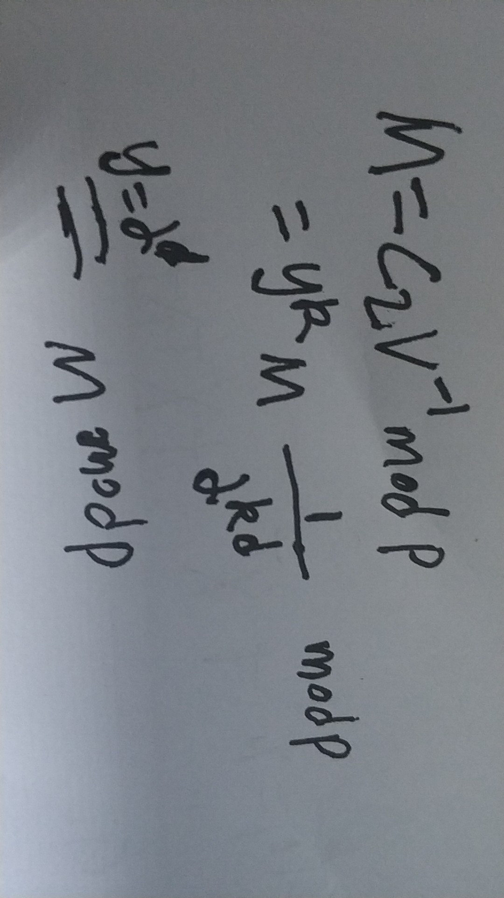
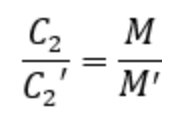

<!--ts-->
   * [1. 前言](#1-前言)
   * [2. ELGamal加解密算法](#2-elgamal加解密算法)
   * [3.  ELGamal算法细节](#3--elgamal算法细节)
   * [4. ELGamal密码的安全性](#4-elgamal密码的安全性)
   * [5.  基于ELGamal的java源码的实现](#5--基于elgamal的java源码的实现)

<!-- Added by: anapodoton, at: 2020年 7月 4日 星期六 19时59分11秒 CST -->

<!--te-->

# 1. 前言

ELGamal密码是除了RSA之外最有代表性的公开密钥密码之一，它的安全性建立在**离散对数问题的困难性之上**，是一种公认安全的公钥密码。

我们再来回顾下离散对数问题：

设p为素数，若存在一个正整数α，使得α、α2、...、αp-1关于模p互不同余，则称α为模p的一个原根。于是有如下运算：α的幂乘运算：y=αx(mod p)，1≤x≤p-1，α的对数运算：x=logαy，1≤y≤p-1

只要p足够大，求解离散对数问题时相当复杂的。离散对数问题具有较好的单向性。

# 2. ELGamal加解密算法

1.随机地选择一个大素数p，且要求p-1有大素数因子，将p公开。

2.选择一个模p的原根α，并将α公开。

3.随机地选择一个整数d（1＜d＜p-1）作为私钥，并对d保密。

4.计算公钥y=α^d(mod p)，并将y公开。

**加密**

　　1.随机地选取一个整数k（1＜k＜p-1）。

　　2.计算U=y^k(mod p)、C1=α^k(mod p)、C2=UM(mod p)。

　　3.取(C1,C2)作为密文。

**解密**

　　1.计算V=C1^d(mod p)。

　　2.计算M=C2V^-1(mod p)。

**正确性证明**



# 3.  ELGamal算法细节

实现ELGamal算法，需要实现以下几个部分：

　　1.对大数的素数判定；(RSA算法学习过)

　　2.判断原根；

　　3.模指运算；(RSA算法学习过)

　　4.模逆运算。(RSA算法学习过)

**判断原根**

已知a和m互素，如果d是满足a^d=1(mod m)的最小正整数，则称d为a模m的阶，记为d=σm(a)。由于a和m互素，根据欧拉定理可知a^φ(m)=1(mod m)，由此可以得到σm(a) | φ(m)。

若a是m的原根，则σm(a)=φ(m)。

根据上述两点，推出逆否命题：如果∃d | φ(m)且d≠φ(m)，使得a^d=1(mod m)，则a不是模m的原根。所以判断a是否为模m的原根，最快的方法就是判断φ(m)的每一个因子d是否使得a^d=1(mod m)。如果满足ad=1(mod m)的d=φ(m)，则a是模m的原根。

eg:判断2是不是模11的原根，φ(11)=10。10的因子有1、2、5、10，所以：

2(mod 11)=2

2^2(mod 11)=4

2^5(mod 11)=10

2^10(mod 11)=1

因此，2是模11的原根。

# 4. ELGamal密码的安全性

由于ELGamal密码的安全性建立在GF(p)上离散对数的困难性之上，而目前尚无求解GF(p)上离散对数的有效算法，所以在p足够大时ELGamal密码是安全的。理想情况下p为强素数，p-1=2q，q为大素数。

　　为了安全加密所使用的k必须是一次性的。如果长期使用同一个k加密的话，就可能被攻击者获取，从而根据V=U=y^k(mod p)，M=C2V^-1(mod p)而得到明文。另外，使用同一个k加密不同的明文M和M'，则由于



如果攻击者知道M，则很容易求出M'。此外，k选取时还要保证U=y^k(mod p)≠1。

# 5.  基于ELGamal的java源码的实现

ELGamal源码：

```
import java.math.BigInteger;
import java.util.Random;

public class ELGamal {
  public BigInteger p, alpha, y;
  private BigInteger d;

  public ELGamal() {
    do {
      //1. 随机地选择一个大素数p，且要求p-1有大素数因子，将p公开。
      p = BigInteger.probablePrime(100, new Random());
    } while (p.subtract(BigInteger.ONE).divide(new BigInteger("2")).isProbablePrime(100));
    do {
      //2.选择一个模p的原根α，并将α公开。
      alpha = new BigInteger(100, new Random());
    } while (! isOrigin(alpha, p));
    do {
      //3.随机地选择一个整数d（1＜d＜p-1）作为私钥，并对d保密。
      d = new BigInteger(100, new Random());
    } while (d.compareTo(BigInteger.ONE) != 1 || d.compareTo(p.subtract(BigInteger.ONE)) != -1);
    //4.计算公钥y=α^d(mod p)，并将y公开。
    y = alpha.modPow(d, p);
  }

  public ELGamal(BigInteger p, BigInteger alpha, BigInteger d) {
    this.p = p;
    this.alpha = alpha;
    this.d = d;
    y = alpha.modPow(d, p);
  }

  /**
   * 加密
   * 随机地选取一个整数k（1＜k＜p-1）
   * 计算U=yk(mod p)、C1=αk(mod p)、C2=UM(mod p)
   * 取(C1,C2)作为密文
   * @param M
   * @return
   */
  BigInteger[] encrypt(BigInteger M) {
    BigInteger[] C = new BigInteger[2];
    BigInteger k, U;
    do {
      do {
        k = new BigInteger(100, new Random());
      } while (k.compareTo(BigInteger.ONE) != 1 || k.compareTo(p.subtract(BigInteger.ONE)) != -1);
      U = y.modPow(k, p);
    } while (U.intValue() != 1);
    C[0] = alpha.modPow(k, p);
    C[1] = U.multiply(M).mod(p);
    return C;
  }

  /**
   * 加密
   * @param M
   * @param k
   * @return
   */
  BigInteger[] encrypt(BigInteger M, BigInteger k) {
    BigInteger[] C = new BigInteger[2];
    BigInteger U = y.modPow(k, p);
    C[0] = alpha.modPow(k, p);
    C[1] = U.multiply(M).mod(p);
    return C;
  }

  /**
   * 解密
   * 计算V=C1^d(mod p);
   * 计算M=C2V^-1(mod p)
   * @param C
   * @return
   */
  BigInteger decrypt(BigInteger[] C) {
    BigInteger V = C[0].modPow(d, p);
    BigInteger M = C[1].multiply(V.modPow(new BigInteger("-1"), p)).mod(p);
    return M;
  }

  /**
   * 判断a是否为模m的原根，其中m为素数
   * @param a
   * @param m
   * @return
   */
  static boolean isOrigin(BigInteger a, BigInteger m) {
    if (a.gcd(m).intValue() != 1) return false;
    BigInteger i = new BigInteger("2");
    while (i.compareTo(m.subtract(BigInteger.ONE)) == -1) {
      if (m.mod(i).intValue() == 0) {
        if (a.modPow(i, m).intValue() == 1)
          return false;
        while (m.mod(i).intValue() == 0)
          m = m.divide(i);
      }
      i = i.add(BigInteger.ONE);
    }
    return true;
  }
  public BigInteger getD() {
    return d;
  }
}
```

测试代码：

```
import java.math.BigInteger;

public class TestELGamal {
	public static void main(String[] args) {
		BigInteger p = new BigInteger("2579");
		BigInteger alpha = new BigInteger("2");
		BigInteger d = new BigInteger("765");
		ELGamal elgamal = new ELGamal(p, alpha, d);
		System.out.println("p=" + elgamal.p);
		System.out.println("α=" + elgamal.alpha);
		System.out.println("d=" + elgamal.getD());
		System.out.println("y=" + elgamal.y);
		BigInteger M = new BigInteger("1299");
		BigInteger k = new BigInteger("853");
		BigInteger[] C = elgamal.encrypt(M, k);
		System.out.println("明文：M=" + M);
		System.out.println("k=" + k);
		System.out.println("密文：(C1, C2)=(" + C[0] + ", " + C[1] + ")");
		BigInteger decryptM=elgamal.decrypt(C);
		System.out.println("解密：decryptM=" + decryptM);
	}
}
```

测试结果：


更多代码请参考：https://github.com/Anapodoton/Encryption/tree/master/ELGamal

