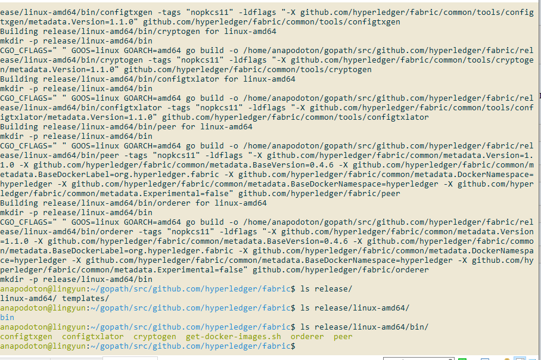
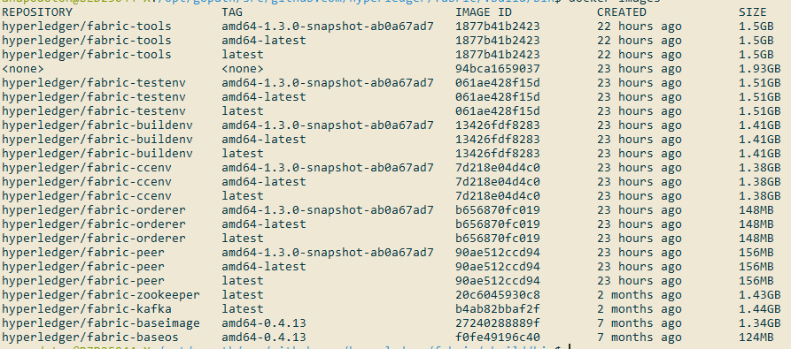

<!--ts-->
   * [前言](#前言)
   * [1. 环境变量](#1-环境变量)
   * [2 第三方包的下载](#2-第三方包的下载)
   * [3. Fabric的编译](#3-fabric的编译)
      * [3.1 Fabric代码的下载：](#31-fabric代码的下载)
      * [3.2 编译二进制文件](#32-编译二进制文件)
         * [3.2.1 编译相关包](#321-编译相关包)
         * [3.2.2 编译基础镜像](#322-编译基础镜像)
         * [3.2.3 docker镜像的生成](#323-docker镜像的生成)

<!-- Added by: anapodoton, at: Tue Feb 25 18:16:16 CST 2020 -->

<!--te-->


# 前言

之前一直在使用fabric编译好的镜像，这次想自己去手动编译下fabric的源码，去生成peer,orderer这些二进制文件以及cryptogen这些工具和docker镜像。

如果网络没有问题的话，在fabric目录下，使用makefile,直接make all即可。

但是做的时候，才知道由于国内网络的原因，很多库都不能使用，造成编译失败。在网络上也没找到很好的贴子，官方的文档，也没有详细的描述，可能是因为简单吧，网络好的时候，直接就可以成功的。

现把我踩坑的记录整理如下：

# 1. 环境变量

本文是基于ubutu 18.04,Fabric v1.3.0。

环境变量的设置，不用详细的描述，需要下载curl，git，node.js,docker,docker-compose等工具，不会的童鞋可以自己百度。

我想说下go环境的变量的配置，其实百度上的教程挺多的，但是都是抄来抄去的，按照这样做并不好，我先来贴出来我的，再来进行详细的解释（**来源于官网**）。

`export GOPATH=/opt/gopath`
`export PATH=$PATH:/opt/go/bin`

第二行设置的是go的安装目录，我的目录是/opt/go,我们需要把go的bin目录设置倒环境变量PATH中。在第一行我设置的是GOPATH，GOPATH是go的工作目录。在go1.8之后，如果不设置这个值的话，**默认目录是~/go**。还需要注意的一点是go的**工作目录不能和安装目录**不能一样。(插一句题外话，工作目录用来存放Go的源码，Go的可运行文件以及相应的编译之后的包文件，即src,bin,pkg。)

注意：GOPATH不需要设置到PATH中，设置好GO的安装目录后，会自动寻找GOPATH。

[GOPATH官方](https://github.com/golang/go/wiki/SettingGOPATH)

# 2 第三方包的下载

此外，Fabric使用Go开发，使用到了一些第三方工具，我们需要提前下载好。

```shell
mkdir –p $GOPATH/src/golang.org/x
cd $GOPATH/src/golang.org/x
git clone https://github.com/golang/tools.git
```

即使下载好上面的tools工具，还是不够，我们还是需要下载第三方的go管理工具，gopm

    go get -u github.com/gpmgo/gopm
接下来，我们就可以使用gopm工具安装需要使用到的go包。

建议：在下载下面这些包的时候，我们首先可以使用go get来下载安装，这样是比较方便的。gopm则需要两步，首先是gopm get ...,然后是go install...。

是这样的，举个例子：

   `gopm get -g -d golang.org/x/tools/cmd/goimports`

   `go install golang.org/x/tools/cmd/goimports`

接下来，我们需要安装所需要的工具，注意，如果某个包下载失败，可以使用gopm的方法。

```
go get github.com/kardianos/govendor
go get github.com/golang/lint/golint
go get golang.org/x/tools/cmd/goimports
go get github.com/onsi/ginkgo/ginkgo
go get github.com/axw/gocov/...
go get github.com/client9/misspell/cmd/misspell
go get github.com/AlekSi/gocov-xml
go get github.com/golang/protobuf/protoc-gen-go
```

让人十分恶心的是github.com/golang/lint/golint这个包，使用go get和gopm get都无法下载。

我们可以先在GitHub上下载源代码，然后在执行go install进行安装。

此外，我们还需要下载libltdl-dev这个库：

```shell
sudo apt-get install libltdl-dev 
```

# 3. Fabric的编译

## 3.1 Fabric代码的下载：

```
mkdir -p ~/gopath/src/github.com/hyperledger 
cd ~/gopath/src/github.com/hyperledger 
git clone https://github.com/hyperledger/fabric.git
cd fabric
git checkout v1.3.0
```

## 3.2 编译二进制文件

### 3.2.1 编译相关包

我们使用下面的命令，make release来生成相关的包。



我们生成了cryptogen,configtxlator,cryptogen,orderer和peer等相关二进制文件。我们把这些拷贝到$gopath/bin下，方便全局使用。

### 3.2.2 编译基础镜像

接下来我们需要构建fabric-ccenv和fabric-javaenv镜像，这两个镜像的构建也是十分恶心的。

需要首先下载fabric-baseimage镜像，一般这个镜像是没任何问题的，问题的关键在于chaintool，这个很容易就挂掉了。挂掉的时候，我们可以手动去下载。


不过，这个地方给了我们网址，我们可以手动去下载。

https://nexus.hyperledger.org/content/repositories/releases/org/hyperledger/fabric/hyperledger-fabric/chaintool-1.0.1/hyperledger-fabric-chaintool-1.0.1.jar

下载后放到.build/bin下即可。注意选择适合自己的版本。

接着我们使用make peer命令即可下载进行构建，会先自动下载fabric-ccenv和fabric-javaenv。

此外，我们还需要把protoc-gen-go放到.build/docker/gotools/bin/下面。

```
cp /opt/gopath/bin/protoc-gen-go .build/docker/gotools/bin/
```

### 3.2.3 docker镜像的生成

如果前面没有失败的话，会生成各种二进制文件，我们需要把这些二进制文件打包到docker镜像中。

为了方便，我们可以直接使用命令make docker即可构建所需的docker镜像，我们也可以使用

make orderer-docker,make peer-docker,make tools-docker来分别进行构建。

我们来看下，最后成功构建的镜像：



如果，我们遇到错误，可以根据错误来自行查找分析，一般是由于网络的原因，缺少某个文件，我们手动下载即可，


