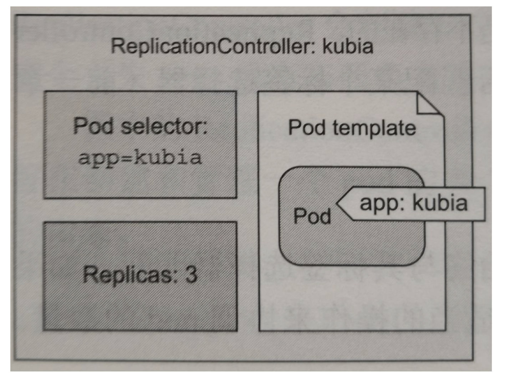

<!--ts-->
   * [前言](#前言)
   * [1 官方文档](#1-官方文档)
      * [1.1 Overview](#11-overview)
         * [1.1.1 什么是k8s?](#111-什么是k8s)
            * [回顾](#回顾)
            * [k8s的优点](#k8s的优点)
            * [k8s的局限](#k8s的局限)
         * [1.1.2 k8s组件](#112-k8s组件)
            * [master组件](#master组件)
            * [节点组件](#节点组件)
            * [Addons 插件](#addons-插件)
         * [1.1.3 k8s 对象](#113-k8s-对象)
            * [理解k8s对象](#理解k8s对象)
            * [k8s对象管理](#k8s对象管理)
            * [推荐的label](#推荐的label)
      * [1.2 k8s 安装教程](#12-k8s-安装教程)
         * [1.2.1 学习环境：](#121-学习环境)
            * [1.2.1.1 Minikube Features](#1211-minikube-features)
            * [1.2.1.2 安装](#1212-安装)
            * [1.2.1.3 快速开始](#1213-快速开始)
         * [1.2.2 生产环境](#122-生产环境)
         * [1.2.3 常用命令学习](#123-常用命令学习)
      * [1.2.4 python-SDK](#124-python-sdk)
      * [1.3 Workloads](#13-workloads)
         * [1.3.1 Pods](#131-pods)
            * [1.3.1.1 Pod Overview](#1311-pod-overview)
               * [1.3.1.1.1 Pods的理解](#13111-pods的理解)
               * [1.3.1.1.2 Pods管理多个容器](#13112-pods管理多个容器)
               * [1.3.1.1.3 pod模板](#13113-pod模板)
   * [后记](#后记)

<!-- Added by: anapodoton, at: 2020年 7月 4日 星期六 20时09分31秒 CST -->

<!--te-->

# 前言

Kubernetes，也即k8s,是 Google 开源的容器集群管理系统，是 Google 多年大规模容器管理技术 Borg 的开源版本，也是 CNCF 最重要的项目之一，主要功能包括: 

- 基于容器的应用部署、维护和滚动升级; 
- 负载均衡和服务发现; 
- 跨机器和跨地区的集群调度; 
- 自动伸缩; 
- 无状态服务和有状态服务; 
- 广泛的 Volume 支持;
-  插件机制保证扩展性。 

# 1 官方文档

我们最需要看的就是官方文档。

## 1.1 Overview

Kubernetes 是一个跨主机集群的 [开源的容器调度平台，它可以自动化应用容器的部署、扩展和操作](http://www.slideshare.net/BrianGrant11/wso2con-us-2015-kubernetes-a-platform-for-automating-deployment-scaling-and-operations) , 提供以容器为中心的基础架构。

### 1.1.1 什么是k8s?

#### 回顾


- 传统的部署：应用运行在物理机上，对资源的使用没有边界，不同的应用的解决方案只能是使用不同的物理机，但是价格是十分的昂贵的。
- 虚拟化部署：为了解决上面的问题，我们引入了虚拟机，一台物理机上可以运行多个虚拟机。虚拟机为应用提供了隔离技术。
- 容器化部署：和虚拟机是相似的，但是可以提供很方便的隔离环境，在底层架构就解耦了。容器主要提供了下面的优势：
  - 敏捷创建，敏捷部署
  - 持续开发，集成，部署
  - 开发运营分离
  - 可监控应用程序的运行状况
  - 开发，测试，生产环境一致性
  - 操作系统和云服务的可移植性
  - 更加关注应用本身
  - 低耦合，分布式，弹性和微服务
  - 资源隔离
  - 资源利用

#### k8s的优点

k8s为我们提供了在分布式系统中运行容器的方案，它负责应用程序的扩展和故障转移，提供部署模式等。k8s为我们提供了下面的优势：

- 服务发现和负载均衡，通过域名和IP地址来实现的。
- 存储编排（**Storage orchestration**）：可以把本地和云挂载在一块。
- 自动部署和回滚：
- **Automatic bin packing**：k8s可以让集群按照我们分配的CPU和内存来运行
- 自我修复
- 安全配置管理

#### k8s的局限

Kubernetes不是一个传统的，包罗万象的PaaS（平台即服务）系统。由于Kubernetes在容器级别而不是硬件级别运行，因此它提供了PaaS产品共有的一些普遍适用的功能，例如部署，扩展，负载平衡，日志记录和监视。但并且这些默认解决方案是可选的和可插入的。Kubernetes提供了构建开发人员平台的基础，但是在重要的地方保留了用户的选择和灵活性。

- 不限制支持的应用程序类型。Kubernetes旨在支持极其多种多样的工作负载，包括无状态，有状态和数据处理工作负载。如果应用程序可以在容器中运行，那么它应该可以在Kubernetes上很好地运行。
- 不部署源代码，不支持构建应用。
- 不提供应用程序级服务，例如中间件（例如，消息总线），数据处理框架（例如，Spark），数据库（例如，MySQL），高速缓存或群集存储系统（例如，Ceph）作为内置服务。这样的组件可以在Kubernetes上运行，和/或可以由Kubernetes上运行的应用程序通过可移植机制（例如Open Service Broker）进行访问。
- 不提供日志记录，监视或警报解决方案。
- 不提供配置系统
- 不提供也不采用任何全面的机器配置，维护，管理或自我修复系统。

### 1.1.2 k8s组件

集群是机器（节点）的集合，一个集群至少一个work node,一个master node。work node管理应用程序组件的pod。master 管理work node和pod。多个master用来提供高可用服务。


#### master组件

master提供了集群的控制服务，他们将会检测和回应集群的事件，例如当部署的replicas字段不符合要求的时候，将会启动一个新的pod。集群中的任何机器都可以作为master。

**kube-apiserver**

用来提供API服务，可以进行水平扩展，运行多个实例，提供了资源操作的唯一入口，并提供认证、授权、访问控制、API 注册和发现等机制。

**etcd**

[etcd](https://kubernetes.io/docs/admin/etcd) 用于 Kubernetes 的后端存储。所有集群数据都存储在此处，始终为您的 Kubernetes 集群的 etcd 数据提供备份计划。

**kube-scheduler**

监控新创建的pod，有没有节点分配，并且选择一个节点来运行。负责资源的调度，按照预定的调度策略将 Pod 调度到相应的机器上；

**kube-controller-manager**

从逻辑上讲，每个控制器是一个单独的进程，但是为了降低复杂性，它们都被编译为单个二进制文件并在单个进程中运行。负责维护集群的状态，比如故障检测、自动扩展、滚动更新等；

- Node Controller:负责节点发生故障时的通知和响应；
- Replication Controller：负责为系统中的每个复制控制器对象维护正确数量的Pod。
- Endpoints Controller:Populates终端对象，joins Services & Pods
- Service Account & Token Controllers: 为新的namespaces创建默认的账户和API tokens。

**cloud-controller-manager**

#### 节点组件

运行在每个节点上，维护运行的pod，提供k8s运行时的环境。

**kubelet**

负责维护容器的生命周期，同时也负责 Volume（CVI）和网络（CNI）的管理。是代理，,它监测已分配给其节点的 Pod(通过 apiserver 或通过本地配置文件)，提供如下功能:

- 挂载 Pod 所需要的数据卷(Volume)。
- 下载 Pod 的 secrets。
- 通过 Docker 运行(或通过 rkt)运行 Pod 的容器。
- 周期性的对容器生命周期进行探测。
- 如果需要，通过创建 *镜像 Pod（Mirror Pod）* 将 Pod 的状态报告回系统的其余部分。
- 将节点的状态报告回系统的其余部分。

**kube-proxy**

[kube-proxy](https://kubernetes.io/docs/admin/kube-proxy)通过维护主机上的网络规则并执行连接转发，实现了Kubernetes服务抽象。负责为 Service 提供 cluster 内部的服务发现和负载均衡。

**container runtime**

k8s支持 [Docker](http://www.docker.com/), [containerd](https://containerd.io/), [cri-o](https://cri-o.io/), [rktlet](https://github.com/kubernetes-incubator/rktlet)。

#### Addons 插件

**DNS**：DNS是必须的。

WebUI，资源监控，集群级别的日志。


### 1.1.3 k8s 对象

我们可以使用yaml文件来表示k8s对象。

#### 理解k8s对象

**Object Spec and Status**

每个Kubernetes对象都包含两个嵌套的对象字段，它们控制着对象的配置：*spec*和status。您必须提供的规范描述了对象的所需状态-您希望对象具有的特征。状态描述了对象的实际状态，并由Kubernetes系统提供和更新。在任何给定时间，Kubernetes控制平面都会主动管理对象的实际状态以匹配您提供的所需状态。

Spec是必须提供的，描述了对象的期望状态，Status是实际的状态，由k8s进行更新。

**k8s对象的描述**

```yaml
application/deployment.yaml 

apiVersion: apps/v1 # for versions before 1.9.0 use apps/v1beta2
kind: Deployment
metadata:
  name: nginx-deployment
spec:
  selector:
    matchLabels:
      app: nginx
  replicas: 2 # tells deployment to run 2 pods matching the template
  template:
    metadata:
      labels:
        app: nginx
    spec:
      containers:
      - name: nginx
        image: nginx:1.7.9
        ports:
        - containerPort: 80
```

我们可以使用`kubectl apply -f https://k8s.io/examples/application/deployment.yaml --record`来创建一个对象。

上面这个文件中，哪些字段是必须的：

- apiVersion：创建对象的k8s API版本；
- kind：创建对象的类型；
- metadata:和其他对象进行区分
- spec：对象的期望状态

#### k8s对象管理

对比了三种方式的优缺点：

| Management technique             | Operates on          | Recommended environment | Supported writers | Learning curve |
| :------------------------------- | :------------------- | :---------------------- | :---------------- | :------------- |
| Imperative commands              | Live objects         | Development projects    | 1+                | Lowest         |
| Imperative object configuration  | Individual files     | Production projects     | 1                 | Moderate       |
| Declarative object configuration | Directories of files | Production projects     | 1+                | Highest        |

**Imperative commands**  

example：kubectl run nginx --image nginx

Trade-offs

Advantages compared to object configuration:

- Commands are simple, easy to learn and easy to remember.
- Commands require only a single step to make changes to the cluster.

Disadvantages compared to object configuration:

- Commands do not integrate with change review processes.
- Commands do not provide an audit trail associated with changes.
- Commands do not provide a source of records except for what is live.
- Commands do not provide a template for creating new objects.

**Imperative object configuration**

```sh
kubectl create -f nginx.yaml
```

Trade-offs

Advantages compared to imperative commands:

- Object configuration can be stored in a source control system such as Git.
- Object configuration can integrate with processes such as reviewing changes before push and audit trails.
- Object configuration provides a template for creating new objects.

Disadvantages compared to imperative commands:

- Object configuration requires basic understanding of the object schema.
- Object configuration requires the additional step of writing a YAML file.

Advantages compared to declarative object configuration:

- Imperative object configuration behavior is simpler and easier to understand.
- As of Kubernetes version 1.5, imperative object configuration is more mature.

Disadvantages compared to declarative object configuration:

- Imperative object configuration works best on files, not directories.
- Updates to live objects must be reflected in configuration files, or they will be lost during the next replacement.

**Declarative object configuration**

```sh
kubectl diff -f configs/
```

Trade-offs

Advantages compared to imperative object configuration:

- Changes made directly to live objects are retained, even if they are not merged back into the configuration files.
- Declarative object configuration has better support for operating on directories and automatically detecting operation types (create, patch, delete) per-object.

Disadvantages compared to imperative object configuration:

- Declarative object configuration is harder to debug and understand results when they are unexpected.
- Partial updates using diffs create complex merge and patch operations.

#### 推荐的label

| Key                            | Description                                                  | Example            | Type   |
| :----------------------------- | :----------------------------------------------------------- | :----------------- | :----- |
| `app.kubernetes.io/name`       | The name of the application                                  | `mysql`            | string |
| `app.kubernetes.io/instance`   | A unique name identifying the instance of an application     | `wordpress-abcxzy` | string |
| `app.kubernetes.io/version`    | The current version of the application (e.g., a semantic version, revision hash, etc.) | `5.7.21`           | string |
| `app.kubernetes.io/component`  | The component within the architecture                        | `database`         | string |
| `app.kubernetes.io/part-of`    | The name of a higher level application this one is part of   | `wordpress`        | string |
| `app.kubernetes.io/managed-by` | The tool being used to manage the operation of an application | `helm`             | string |

举个例子：

```
apiVersion: apps/v1
kind: StatefulSet
metadata:
  labels:
    app.kubernetes.io/name: mysql
    app.kubernetes.io/instance: wordpress-abcxzy
    app.kubernetes.io/version: "5.7.21"
    app.kubernetes.io/component: database
    app.kubernetes.io/part-of: wordpress
    app.kubernetes.io/managed-by: helm
```


## 1.2 k8s 安装教程

我们将尝试在不同的环境来进行安装。

### 1.2.1 学习环境：

| Community                                                    | Ecosystem                                                    |
| :----------------------------------------------------------- | :----------------------------------------------------------- |
| [Minikube](https://kubernetes.io/docs/setup/learning-environment/minikube/) | [CDK on LXD](https://www.ubuntu.com/kubernetes/docs/install-local) |
| [kind (Kubernetes IN Docker)](https://github.com/kubernetes-sigs/kind) | [Docker Desktop](https://www.docker.com/products/docker-desktop) |
|                                                              | [Minishift](https://docs.okd.io/latest/minishift/)           |
|                                                              | [MicroK8s](https://microk8s.io/)                             |
|                                                              | [IBM Cloud Private-CE (Community Edition)](https://github.com/IBM/deploy-ibm-cloud-private) |
|                                                              | [IBM Cloud Private-CE (Community Edition) on Linux Containers](https://github.com/HSBawa/icp-ce-on-linux-containers) |
|                                                              | [k3s](https://k3s.io/)                                       |
|                                                              | [Ubuntu on LXD](https://kubernetes.io/docs/getting-started-guides/ubuntu/) |

我们将尝试使用Minikube来安装：

Minikube可以在本地运行k8s。

#### 1.2.1.1 Minikube Features

- DNS
- NodePorts
- ConfigMaps and Secrets
- Dashboards
- Container Runtime: Docker, [CRI-O](https://cri-o.io/), and [containerd](https://github.com/containerd/containerd)
- Enabling CNI (Container Network Interface)
- Ingress

#### 1.2.1.2 安装

我是基于linux平台进行操作的。

1. 首先检查是否支持虚拟化。

```shell
grep -E --color 'vmx|svm' /proc/cpuinfo
```

2. 安装minikube

   1. 安装kubectl

      ```shell
      curl -LO https://storage.googleapis.com/kubernetes-release/release/`curl -s https://storage.googleapis.com/kubernetes-release/release/stable.txt`/bin/linux/amd64/kubectl
      
      chmod +x ./kubectl
      sudo mv ./kubectl /usr/local/bin/kubectl
      kubectl version
      ```

   2. 安装Hypervisor

      也可以通过设置--vm-driver=none参数，来运行在主机上，注意的是，需要使用linux系统，并且需要安装docker。

   3. 安装minikube

      ```shell
      curl -Lo minikube https://storage.googleapis.com/minikube/releases/latest/minikube-linux-amd64 \
        && chmod +x minikube
      sudo mkdir -p /usr/local/bin/
      sudo install minikube /usr/local/bin/
      ```

   4. 安装验证

      ```
      minikube start --vm-driver=none --image-mirror-country=cn
      minikube status
      ```

      记得国家指定为cn,毕竟是google的东西,不然你会启动失败的。

      如果还有印象的话，我们在前面kubectl version，的时候，是报了一个错误的，是说连不上服务，这是因为我们没有启动minikube。

      我也是很迷，不知道官网为啥是这样的顺序。

      如果想关闭的话，就这样：

      ```shell
      minikube stop
      minikube delete
      ```

      我们继续验证kubectl的状态,配置文件在~/.kube/config。

      ```shell
      kubectl cluster-info
      ```

      


值得注意的是，在使用minikube的时候，尽量使用Ubuntu，不要使用centos，原因大概和Docker是有问题的，具体的不是很清楚。

#### 1.2.1.3 快速开始

1.   minikube start
2. 接下来使用kubectl和集群来交互，`kubectl create deployment hello-minikube --image=k8s.gcr.io/echoserver:1.10`
3. 把hello-minikube作为服务暴露出去：`kubectl expose deployment hello-minikube --type=NodePort --port=8080`
4. 在使用之前需要检查这个pod的状态：kubectl get pod，我们需要等待状态变为Running。
5.   获取  服务暴露的url ：minikube service hello-minikube --url
6.   把url粘贴到浏览器中，看到如下的信息：
7.   删除服务：kubectl delete services hello-minikube
8.   删除部署环境：kubectl delete deployment hello-minikube
9.   停掉集群：minikube stop
10.   删除集群：minikube delete

### 1.2.2 生产环境

k8s可以支持docker,CRI-O,containerd等。

生产环境：

支持下面的生产环境：

| Providers                                                    | Managed                                                      | Turnkey cloud                                                | On-prem datacenter                                           | Custom (cloud)                                               | Custom (On-premises VMs)                                     | Custom (Bare Metal)                                          |
| :----------------------------------------------------------- | :----------------------------------------------------------- | :----------------------------------------------------------- | :----------------------------------------------------------- | :----------------------------------------------------------- | :----------------------------------------------------------- | :----------------------------------------------------------- |
| [Agile Stacks](https://www.agilestacks.com/products/kubernetes) |                                                              | ✔                                                            | ✔                                                            |                                                              |                                                              |                                                              |
| [Alibaba Cloud](https://www.alibabacloud.com/product/kubernetes) |                                                              | ✔                                                            |                                                              |                                                              |                                                              |                                                              |
| [Amazon](https://aws.amazon.com/)                            | [Amazon EKS](https://aws.amazon.com/eks/)                    | [Amazon EC2](https://aws.amazon.com/ec2/)                    |                                                              |                                                              |                                                              |                                                              |
| [AppsCode](https://appscode.com/products/pharmer/)           | ✔                                                            |                                                              |                                                              |                                                              |                                                              |                                                              |
| [APPUiO](https://appuio.ch/)                                 | ✔                                                            | ✔                                                            | ✔                                                            |                                                              |                                                              |                                                              |
| [Banzai Cloud Pipeline Kubernetes Engine (PKE)](https://banzaicloud.com/products/pke/) |                                                              | ✔                                                            |                                                              | ✔                                                            | ✔                                                            | ✔                                                            |
| [CenturyLink Cloud](https://www.ctl.io/)                     |                                                              | ✔                                                            |                                                              |                                                              |                                                              |                                                              |
| [Cisco Container Platform](https://cisco.com/go/containers)  |                                                              |                                                              | ✔                                                            |                                                              |                                                              |                                                              |
| [Cloud Foundry Container Runtime (CFCR)](https://docs-cfcr.cfapps.io/) |                                                              |                                                              |                                                              | ✔                                                            | ✔                                                            |                                                              |
| [CloudStack](https://cloudstack.apache.org/)                 |                                                              |                                                              |                                                              |                                                              | ✔                                                            |                                                              |
| [Canonical](https://ubuntu.com/kubernetes)                   | ✔                                                            | ✔                                                            | ✔                                                            | ✔                                                            | ✔                                                            | ✔                                                            |
| [Containership](https://containership.io/)                   | ✔                                                            | ✔                                                            |                                                              |                                                              |                                                              |                                                              |
| [D2iQ](https://d2iq.com/)                                    |                                                              | [Kommander](https://d2iq.com/solutions/ksphere)              | [Konvoy](https://d2iq.com/solutions/ksphere/konvoy)          | [Konvoy](https://d2iq.com/solutions/ksphere/konvoy)          | [Konvoy](https://d2iq.com/solutions/ksphere/konvoy)          | [Konvoy](https://d2iq.com/solutions/ksphere/konvoy)          |
| [Digital Rebar](https://provision.readthedocs.io/en/tip/README.html) |                                                              |                                                              |                                                              |                                                              |                                                              | ✔                                                            |
| [DigitalOcean](https://www.digitalocean.com/products/kubernetes/) | ✔                                                            |                                                              |                                                              |                                                              |                                                              |                                                              |
| [Docker Enterprise](https://www.docker.com/products/docker-enterprise) |                                                              | ✔                                                            | ✔                                                            |                                                              |                                                              | ✔                                                            |
| [Fedora (Multi Node)](https://kubernetes.io/docs/getting-started-guides/fedora/flannel_multi_node_cluster/) |                                                              |                                                              |                                                              |                                                              | ✔                                                            | ✔                                                            |
| [Fedora (Single Node)](https://kubernetes.io/docs/getting-started-guides/fedora/fedora_manual_config/) |                                                              |                                                              |                                                              |                                                              |                                                              | ✔                                                            |
| [Gardener](https://gardener.cloud/)                          | ✔                                                            | ✔                                                            | ✔                                                            | ✔                                                            | ✔                                                            | [Custom Extensions](https://github.com/gardener/gardener/blob/master/docs/extensions/overview.md) |
| [Giant Swarm](https://www.giantswarm.io/)                    | ✔                                                            | ✔                                                            | ✔                                                            |                                                              |                                                              |                                                              |
| [Google](https://cloud.google.com/)                          | [Google Kubernetes Engine (GKE)](https://cloud.google.com/kubernetes-engine/) | [Google Compute Engine (GCE)](https://cloud.google.com/compute/) | [GKE On-Prem](https://cloud.google.com/gke-on-prem/)         |                                                              |                                                              |                                                              |
| [IBM](https://www.ibm.com/in-en/cloud)                       | [IBM Cloud Kubernetes Service](https://cloud.ibm.com/kubernetes/catalog/cluster) |                                                              | [IBM Cloud Private](https://www.ibm.com/in-en/cloud/private) |                                                              |                                                              |                                                              |
| [Ionos](https://www.ionos.com/enterprise-cloud)              | [Ionos Managed Kubernetes](https://www.ionos.com/enterprise-cloud/managed-kubernetes) | [Ionos Enterprise Cloud](https://www.ionos.com/enterprise-cloud) |                                                              |                                                              |                                                              |                                                              |
| [Kontena Pharos](https://www.kontena.io/pharos/)             |                                                              | ✔                                                            | ✔                                                            |                                                              |                                                              |                                                              |
| [KubeOne](https://kubeone.io/)                               |                                                              | ✔                                                            | ✔                                                            | ✔                                                            | ✔                                                            | ✔                                                            |
| [Kubermatic](https://kubermatic.io/)                         | ✔                                                            | ✔                                                            | ✔                                                            | ✔                                                            | ✔                                                            |                                                              |
| [KubeSail](https://kubesail.com/)                            | ✔                                                            |                                                              |                                                              |                                                              |                                                              |                                                              |
| [Kubespray](https://kubespray.io/#/)                         |                                                              |                                                              |                                                              | ✔                                                            | ✔                                                            | ✔                                                            |
| [Kublr](https://kublr.com/)                                  | ✔                                                            | ✔                                                            | ✔                                                            | ✔                                                            | ✔                                                            | ✔                                                            |
| [Microsoft Azure](https://azure.microsoft.com/)              | [Azure Kubernetes Service (AKS)](https://azure.microsoft.com/en-us/services/kubernetes-service/) |                                                              |                                                              |                                                              |                                                              |                                                              |
| [Mirantis Cloud Platform](https://www.mirantis.com/software/kubernetes/) |                                                              |                                                              | ✔                                                            |                                                              |                                                              |                                                              |
| [Nirmata](https://www.nirmata.com/)                          |                                                              | ✔                                                            | ✔                                                            |                                                              |                                                              |                                                              |
| [Nutanix](https://www.nutanix.com/en)                        | [Nutanix Karbon](https://www.nutanix.com/products/karbon)    | [Nutanix Karbon](https://www.nutanix.com/products/karbon)    |                                                              |                                                              | [Nutanix AHV](https://www.nutanix.com/products/acropolis/virtualization) |                                                              |
| [OpenNebula](https://www.opennebula.org/)                    | [OpenNebula Kubernetes](https://marketplace.opennebula.systems/docs/service/kubernetes.html) |                                                              |                                                              |                                                              |                                                              |                                                              |
| [OpenShift](https://www.openshift.com/)                      | [OpenShift Dedicated](https://www.openshift.com/products/dedicated/) and [OpenShift Online](https://www.openshift.com/products/online/) |                                                              | [OpenShift Container Platform](https://www.openshift.com/products/container-platform/) |                                                              | [OpenShift Container Platform](https://www.openshift.com/products/container-platform/) | [OpenShift Container Platform](https://www.openshift.com/products/container-platform/) |
| [Oracle Cloud Infrastructure Container Engine for Kubernetes (OKE)](https://docs.cloud.oracle.com/iaas/Content/ContEng/Concepts/contengoverview.htm) | ✔                                                            | ✔                                                            |                                                              |                                                              |                                                              |                                                              |
| [oVirt](https://www.ovirt.org/)                              |                                                              |                                                              |                                                              |                                                              | ✔                                                            |                                                              |
| [Pivotal](https://pivotal.io/)                               |                                                              | [Enterprise Pivotal Container Service (PKS)](https://pivotal.io/platform/pivotal-container-service) | [Enterprise Pivotal Container Service (PKS)](https://pivotal.io/platform/pivotal-container-service) |                                                              |                                                              |                                                              |
| [Platform9](https://platform9.com/)                          | [Platform9 Managed Kubernetes](https://platform9.com/managed-kubernetes/) |                                                              | [Platform9 Managed Kubernetes](https://platform9.com/managed-kubernetes/) | ✔                                                            | ✔                                                            | ✔                                                            |
| [Rancher](https://rancher.com/)                              |                                                              | [Rancher 2.x](https://rancher.com/docs/rancher/v2.x/en/)     |                                                              | [Rancher Kubernetes Engine (RKE)](https://rancher.com/docs/rke/latest/en/) |                                                              | [k3s](https://k3s.io/)                                       |
| [StackPoint](https://stackpoint.io/)                         | ✔                                                            | ✔                                                            |                                                              |                                                              |                                                              |                                                              |
| [Supergiant](https://supergiant.io/)                         |                                                              | ✔                                                            |                                                              |                                                              |                                                              |                                                              |
| [SUSE](https://www.suse.com/)                                |                                                              | ✔                                                            |                                                              |                                                              |                                                              |                                                              |
| [SysEleven](https://www.syseleven.io/)                       | ✔                                                            |                                                              |                                                              |                                                              |                                                              |                                                              |
| [Tencent Cloud](https://intl.cloud.tencent.com/)             | [Tencent Kubernetes Engine](https://intl.cloud.tencent.com/product/tke) | ✔                                                            | ✔                                                            |                                                              |                                                              | ✔                                                            |
| [VEXXHOST](https://vexxhost.com/)                            | ✔                                                            | ✔                                                            |                                                              |                                                              |                                                              |                                                              |
| [VMware](https://cloud.vmware.com/)                          | [VMware Cloud PKS](https://cloud.vmware.com/vmware-cloud-pks) | [VMware Enterprise PKS](https://cloud.vmware.com/vmware-enterprise-pks) | [VMware Enterprise PKS](https://cloud.vmware.com/vmware-enterprise-pks) | [VMware Essential PKS](https://cloud.vmware.com/vmware-essential-pks) |                                                              | [VMware Essential PKS](https://cloud.vmware.com/vmware-essential-pks) |
| [Z.A.R.V.I.S.](https://zarvis.ai/)                           | ✔                                                            |                                                              |                                                              |                                                              |                                                              |                                                              |

### 1.2.3 常用命令学习

yaml文件也是十分重要的，需要去学习。

下面来学习下常用的命令：

1. kubectl run（创建容器镜像）

kubectl run NAME --image=image [--env="key=value"] [--port=port] [--replicas=replicas] [--dry-run=bool] [--overrides=inline-json] [--command] -- [COMMAND] [args...]

示例：

启动nginx实例。

```shell
kubectl run nginx --image=nginx
```

启动hazelcast实例，暴露容器端口 5701。

```shell
kubectl run hazelcast --image=hazelcast --port=5701
```

启动hazelcast实例，在容器中设置环境变量“DNS_DOMAIN = cluster”和“POD_NAMESPACE = default”。

```shell
kubectl run hazelcast --image=hazelcast --env="DNS_DOMAIN=cluster" --env="POD_NAMESPACE=default"
```

启动nginx实例，设置副本数5。

```shell
kubectl run nginx --image=nginx --replicas=5
```

运行 Dry  打印相应的API对象而不创建它们。

```shell
kubectl run nginx --image=nginx --dry-run
```

2. kubectl expose（将资源暴露为新的 Service）

   将资源暴露为新的Kubernetes Service。指定[deployment](http://docs.kubernetes.org.cn/317.html)、service、[replica set](http://docs.kubernetes.org.cn/314.html)、[replication controller](http://docs.kubernetes.org.cn/437.html)或[pod](http://docs.kubernetes.org.cn/312.html) ，并使用该资源的选择器作为指定端口上新服务的选择器。deployment 或 replica set只有当其选择器可转换为service支持的选择器时，即当选择器仅包含matchLabels组件时才会作为暴露新的Service。

   语法：kubectl expose (-f FILENAME | TYPE NAME) [--port=port] [--protocol=TCP|UDP] [--target-port=number-or-name] [--name=name] [--external-ip=external-ip-of-service] [--type=type]

   为RC的nginx创建service，并通过Service的80端口转发至容器的8000端口上。

   ```
   kubectl expose rc nginx --port=80 --target-port=8000
   ```

   由“nginx-controller.yaml”中指定的type和name标识的RC创建Service，并通过Service的80端口转发至容器的8000端口上。

   ```
   kubectl expose -f nginx-controller.yaml --port=80 --target-port=8000
   ```

3. kubectl create（创建一个集群资源对象）

   通过配置文件名或stdin创建一个集群资源对象。支持JSON和YAML格式的文件。

   通过pod.json文件创建一个pod。

   ```
   kubectl create -f ./pod.json
   ```

   通过stdin的JSON创建一个pod。

   ```
   cat pod.json | kubectl create -f -
   ```

   API版本为v1的JSON格式的docker-registry.yaml文件创建资源。

   ```
   kubectl create -f docker-registry.yaml --edit --output-version=v1 -o json
   ```

4. kubectl delete（删除资源对象）

   通过配置文件名、stdin、资源名称或label选择器来删除资源。支持JSON和YAML格式文件。

   ```
   kubectl delete ([-f FILENAME] | TYPE [(NAME | -l label | --all)])
   ```

   使用 pod.json中指定的资源类型和名称删除pod。

   ```
   kubectl delete -f ./pod.json
   ```

   根据传入stdin的JSON所指定的类型和名称删除pod。

   ```
   cat pod.json | kubectl delete -f -
   ```

   删除名为“baz”和“foo”的Pod和Service。

   ```
   kubectl delete pod,service baz foo
   ```

   删除 Label name = myLabel的pod和Service。

   ```
   kubectl delete pods,services -l name=myLabel
   ```

   强制删除dead node上的pod

   ```
   kubectl delete pod foo --grace-period=0 --force
   ```

   删除所有pod

   ```
   kubectl delete pods --all
   ```

5. kubectl edit（编辑服务器上定义的资源对象）

   ```
   kubectl edit (RESOURCE/NAME | -f FILENAME)
   ```

   编辑名为'docker-registry'的service：

   ```
   kubectl edit svc/docker-registry
   ```

   使用替代的编辑器

   ```
   KUBE_EDITOR="nano" kubectl edit svc/docker-registry
   ```

   编辑名为“myjob”的service，输出JSON格式 V1 API版本

   ```
   kubectl edit job.v1.batch/myjob -o json
   ```

   以YAML格式输出编辑deployment“mydeployment”，并将修改的配置保存在annotation中：

   ```
   kubectl edit deployment/mydeployment -o yaml --save-config
   ```

6. kubectl get（获取资源信息）

   列出所有运行的Pod信息。

   ```
   kubectl get pods
   ```

   列出Pod以及运行Pod节点信息。

   ```
   kubectl get pods -o wide
   ```

   列出指定NAME的 replication controller信息。

   ```
   kubectl get replicationcontroller web
   ```

   以JSON格式输出一个pod信息。

   ```
   kubectl get -o json pod web-pod-13je7
   ```

   以“pod.yaml”配置文件中指定资源对象和名称输出JSON格式的Pod信息。

   ```
   kubectl get -f pod.yaml -o json
   ```

   返回指定pod的相位值。

   ```
   kubectl get -o template pod/web-pod-13je7 --template={{.status.phase}}
   ```

   列出所有replication controllers和service信息。

   ```
   kubectl get rc,services
   ```

   按其资源和名称列出相应信息。

   ```
   kubectl get rc/web service/frontend pods/web-pod-13je7
   ```

   列出所有不同的资源对象。

   ```
   kubectl get all
   ```

7. kubectl label（更新资源对象的label）

   给名为foo的Pod添加label unhealthy=true。

   ```
   kubectl label pods foo unhealthy=true
   ```

   给名为foo的Pod修改label 为 'status' / value 'unhealthy'，且覆盖现有的value。

   ```
   kubectl label --overwrite pods foo status=unhealthy
   ```

   给 namespace 中的所有 pod 添加 label

   ```
   kubectl label pods --all status=unhealthy
   ```

   仅当resource-version=1时才更新 名为foo的Pod上的label。

   ```
   kubectl label pods foo status=unhealthy --resource-version=1
   ```

   删除名为“bar”的label 。（使用“ - ”减号相连）

   ```
   kubectl label pods foo bar-
   ```

8. kubectl set image（更新已有资源对象中的容器镜像）

## 1.2.4 python-SDK

1. 安装：pip install kubernetes

2. 

   


## 1.3 Workloads

### 1.3.1 Pods

#### 1.3.1.1 Pod Overview

pod是k8s对象模型中的最小可部署对象。

Pod 是一组紧密关联的容器集合，它们共享 PID、IPC、Network 和 UTS namespace，是 Kubernetes 调度的基本单位。Pod 内的多个容器共享网络和文件系统，可以通过进程间通信和文件共享这种简单高效的方式组合完成服务。


##### 1.3.1.1.1 Pods的理解

pod是k8s的基本执行单元，一个pod代表了运行在集群上的一个进程。pod包括了一个或者多个容器，存储资源，唯一的IP。


- **Pods that run a single container**：是最常见的；
- 多个容器一个pod：

##### 1.3.1.1.2 Pods管理多个容器


每个pod都有一个IP地址，pod中的容器共享IP地址和端口，pod内部的容器可以相互通信，此外，存储是可以共享的。

我们可以看到pod是通过yaml来进行管理的，

##### 1.3.1.1.3 pod模板

```
apiVersion: v1
kind: Pod
metadata:
  name: myapp-pod
  labels:
    app: myapp
spec:
  containers:
  - name: myapp-container
    image: busybox
    command: ['sh', '-c', 'echo Hello Kubernetes! && sleep 3600']
```

Node 是 Pod 真正运行的主机，可以是物理机，也可以是虚拟机。为了管理 Pod，每个 Node 节点上至少要运行 container runtime（比如 docker 或者 rkt）、`kubelet` 和 `kube-proxy` 服务。


Namespace 是对一组资源和对象的抽象集合，比如可以用来将系统内部的对象划分为不同的项目组或用户组。常见的 pods, services, replication controllers 和 deployments 等都是属于某一个 namespace 的（默认是 default），而 node, persistentVolumes 等则不属于任何 namespace。

Service 是应用服务的抽象，通过 labels 为应用提供负载均衡和服务发现。匹配 labels 的 Pod IP 和端口列表组成 endpoints，由 kube-proxy 负责将服务 IP 负载均衡到这些 endpoints 上。

每个 Service 都会自动分配一个 cluster IP（仅在集群内部可访问的虚拟地址）和 DNS 名，其他容器可以通过该地址或 DNS 来访问服务，而不需要了解后端容器的运行。

```
apiVersion: v1
kind: Service
metadata:
  name: nginx
spec:
  ports:
  - port: 8078 # the port that this service should serve on
    name: http
    # the container on each pod to connect to, can be a name
    # (e.g. 'www') or a number (e.g. 80)
    targetPort: 80
    protocol: TCP
  selector:
    app: nginx
```

我们可以看到，我们可以使用yaml或者json来创建pod容器，那么我们如何来管理pod容器呢？

我们可以尝试使用标签，label技术来管理pod容器。这个玩意和我们经常见到的标签是一样的。

Label 是识别 Kubernetes 对象的标签，以 key/value 的方式附加到对象上（key 最长不能超过 63 字节，value 可以为空，也可以是不超过 253 字节的字符串）。

Label 不提供唯一性，并且实际上经常是很多对象（如 Pods）都使用相同的 label 来标志具体的应用。

Label 定义好后其他对象可以使用 Label Selector 来选择一组相同 label 的对象（比如 ReplicaSet 和 Service 用 label 来选择一组 Pod）。Label Selector 支持以下几种方式：

- 等式，如 `app=nginx` 和 `env!=production`
- 集合，如 `env in (production, qa)`
- 多个 label（它们之间是 AND 关系），如 `app=nginx,env=test`

可以看到，我们可以使用标签来把资源进行分组，但这个标签的分组是多对多的关系。如果我们想要一对多的关系该怎么办呢？

我们可以使用Namespace的概念，

Annotations 是 key/value 形式附加于对象的注解。不同于 Labels 用于标志和选择对象，Annotations 则是用来记录一些附加信息，用来辅助应用部署、安全策略以及调度策略等。比如 deployment 使用 annotations 来记录 rolling update 的状态。

# 后记

我知道Docker是怎么回事，但是不太清楚Kubernetes究竟在干什么，它要解决什么问题？有哪些功能？在网上搜索了一些文章，可是都无法让我满意，因为他们都是非常宏观地讲一讲，然后马上就进入使用细节，让人还是云里雾里。 

之前我就说过，想深入地了解一门技术，最好的办法就是看书，于是就去购书中心转了一圈，发现一本书籍《Kubernetes in Action》，翻了一会儿我就觉得这本书不错，就拿它来学习吧。 

这本书一开始就提到了微服务，这是个非常好的切入点，我脑海中立刻想到了微服务的特点，可以独立部署，轻松扩容。

那扩容的时候具体该怎么做呢？例如有个订单服务，我想把部署10份，难道我跑到服务器端，手工启动10个实例？

这肯定不符合自动化运维的方式，也许可以写个脚本，接受一个参数或者读取配置文件，把实例自动创建起来。 

但是仔细一想，这样是不行的，因为现实中会有很多服务器，脚本怎么去管理呢？脚本怎么获取它们的IP以及它们的负载情况，然后把Docker实例分发创建到合适的服务器中呢？ 

于是第一个猜测来了：

**最好是有个系统，它能管理所有的服务器，我只要告诉他，把订单服务的docker镜像部署10份，剩下的事情就不用我管了，都由这个系统来搞定。**

这时候我隐隐约约地感觉到了Kubernetes的核心功能。 

于是我跳过了微服务的介绍，Docker的介绍，这些都是老掉牙的东西了，迅速翻到了第16页：


这幅图画得相当棒，清楚地展示了K8s的核心功能，但是仔细看以后，就发现有两个微服务被放到了一起，作为一个整体来部署，这是我之前没有想到的！ 

**部署的最小粒度并不是Docker镜像，而是另外一个东西**！从系统设计的角度来看，必须得有个词来表达，这个东西是什么？ 

于是我又往后翻，哦，原来这个词叫做pod。 

作者告诉我在第3章有详细介绍，我迫不及待地往后翻，试图满足好奇心：pod到底是什么东西。 

**原来这些pod就像局域网中的一个个独立的逻辑主机啊，每个Docker实例都是一个进程**。 


—个pod的所有容器都运行在同—个节点上; 一个pod绝不跨越两个节点 。

> 关于为何需要pod这种容器?为何不直接使用容器?为何甚至需要同时运行 多个容器?难道不能简单地把所有进程都放在 一 个单独的容器中吗? 
>

为何多容器比单容器多进程要好？

如果一个容器中多个进程，不方便管理日志等。由于这个原因，我们需要把多个容器放在一起管理，这就是pod的原因。

下面我们来看下pod干了哪些事情？

首先我们来看下同一Pod中容器之间的部分隔离？

我们并不期望容器之间进行隔离，我们期望的是pod之间进行隔离。pod内的容器需要共享Namespace。这就导致了容器的主机名和网络接口是相同的。由于IPC Namespace是相同的，所以可以进行IPC通信。


到目前为止，我就明白了**k8s本质上是一层抽象，这一层抽象屏蔽了服务器的细节**，程序员不需要知道程序运行在哪个服务器上，只需要告诉k8s自己的需求就好。 

那用什么方式来告诉k8s呢？这很容易猜测到，可以: 

1. 通过命令行参数传递给k8s, 但是参数太受限。 

2. 用配置文件，在其中可以指明pod的名称，docker的镜像名称......  可以用XML格式， JSON格式，YAML格式.....  

当然，这些念头都是一闪而过，我翻开这本书的第3章，主要讲pod，果然是用YAML,JSON去创建pod, 由于已经预料到了，没什么新意，稍微看了看就跳过。 

让我没有想到的是可以使用**标签**和**命名空间**对pod进行分组，但是讲解有点啰嗦，似乎也不是核心概念，稍微翻了一下就过去了。 


稍等 ！为什么不在创建pod的时候指定pod的数量啊？比如我想创建10个订单服务的docker实例，在哪里指定？仔细看看那些YAML文件，确实没有副本数量，这k8s搞什么鬼？这里没有指定，肯定在别的地方，那就是说：

除了pod之外，还有一个概念，用来指定pod和副本之间的关系，这个概念是什么？

快速翻到第4章，哈哈，原来这个概念叫做ReplicationController（简称RC），由它来保证pod的数目符合要求，多了就删除，少了就添加。 



从设计角度来看，再次体现了**关注点分离**，**pod负责“静态描述”，像一个模板，就像class， RC负责运行时管理，来产生pod的object**。 

创建RC也是使用YAML，比较让我意外的是，在指定pod时，用了前面所讲的标签，看来标签是组织pod的重要方法，有时间回去看看细节。 

需要注意的是，在管理pod数目的时候，用的是声明式：“我想要运行10个订单实例”， 而不是“我想增加3个订单实例”或“我想删除3个订单实例”。 你不用告诉k8s做什么、如何做，**只是指定期望的状态就好**。

如果你也善于思考的话，这时候就会冒出了一个新问题： 

这些pod 不断地被删除，被增加，不断地变化，那外界怎么去访问他们呢？ 

比如客户端正在访问pod1,然后pod1所在的机器挂掉，ReplicationController在另外一台机器上创建了pod2，IP都变了，那客户端下一次去访问pod2呢？ 

如果让我设计，我肯定得提供另外一个抽象层，**让这个抽象层来屏蔽后端的变化，让客户端连接到这个抽象层上**。 

k8s 会怎么做呢？第5章给出了答案：**服务**。为一组功能相同的pod 提供单一不变的接入点的资源。 我个人觉得这个词起得不好，太抽象，太广泛。 


可以看出，**k8s和其他系统一样，也是不断地通过分离关注点，不断地抽象来解决一个个问题的**。

到目前为止，我脑海中想的都是那些“**无状态**”的pod，可以随意增加和删除， 但肯定存在“**有状态**”的pod，有持久化的需求，可以把数据存储到硬盘上，这该怎么办？ 

我们来到了第六章，有一个叫做卷volume的概念。


带着这个问题，继续上路吧！ 

好了，啰嗦了这么多，稍微总结一下：我希望给大家分享的就是，**看书的时候要主动思考，不要被动接受**。

**带着问题去看，自己先想想解决方案，然后到书中去验证，效率会非常高，读起来会非常快。**

如果自己的问题在书中很快就得到回答，那读起来就会酣畅淋漓；如果迟迟得不到回答，或者书中一直不厌其烦地描述细枝末节，那我很快就丧失兴趣，把书扔掉。 

当然，由于每个人的基础不同，可能刚开始读书的时候提不出问题，或者提不出有价值的问题，这时候可以去直接看具体内容，但是不能放弃思考：这个技术点是要解决什么问题的？是怎么解决的？

希望每个人都建立一套自己的知识体系，从这个知识体系中能伸出很多的触角，能像海绵一样吸收外界的知识，不断地为自己的知识体系添砖加瓦。
