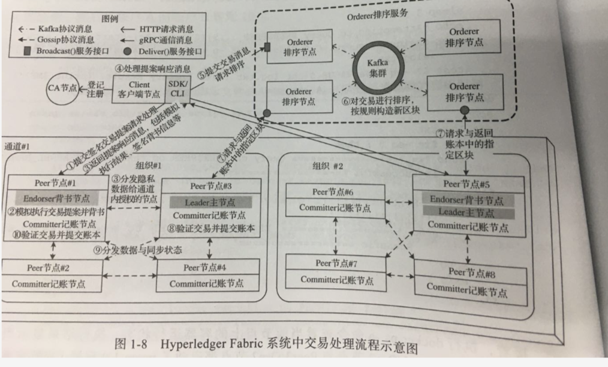

<!--ts-->
   * [前言](#前言)

<!-- Added by: anapodoton, at: 2020年 5月22日 星期五 16时00分40秒 CST -->

<!--te-->

# 前言

我们可以看到，Fabric网络使用了kafka协议消息，http请求消息，Gossip协议消息，gRPC通信消息来进行通信。然后Orderer节点还提供了Broadcast()交易广播服务，Deliver()区块分发服务。

我们将对此进行讲解。

我们先来总结下：

- gRPC：
  - 客户端节点和Peer节点的通信
  - 客户端节点和Orderer节点的通信
  - Orderer和Leader节点
- Http
  - 客户端和CA节点
- Gossip
  - Peer节点之间
- kafka协议
  - Orderer节点和Kafka节点之间
- Broadcast()交易广播服务
  - 我的理解是Orderer节点会把peer传递的交易广播给kafka集群
- Deliver()区块分发服务

我们可以看到，核心的通信都是gRPC来完成的。
