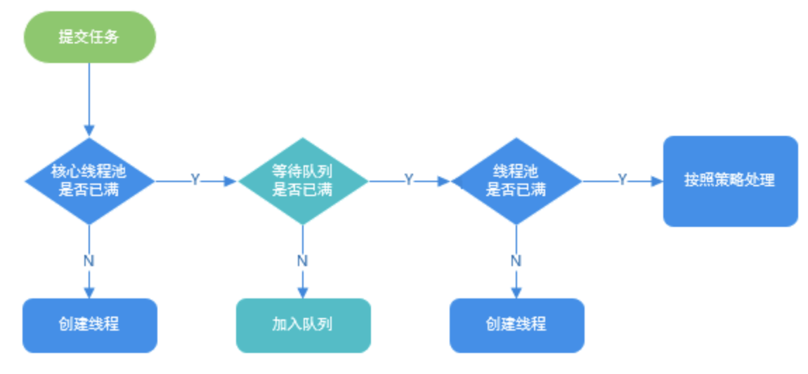
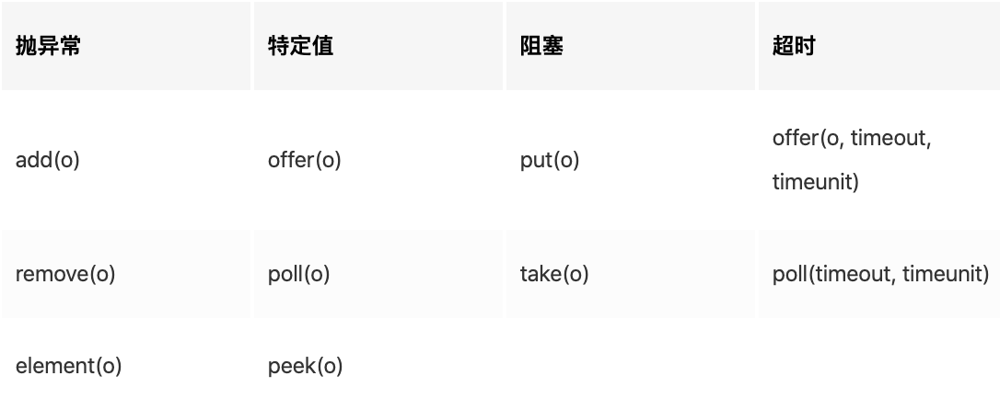
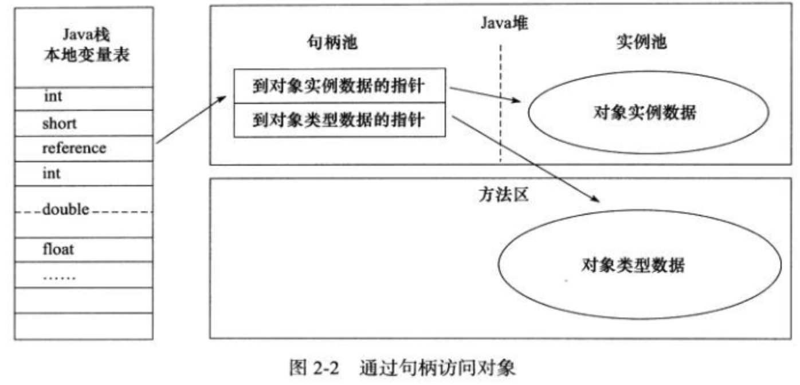
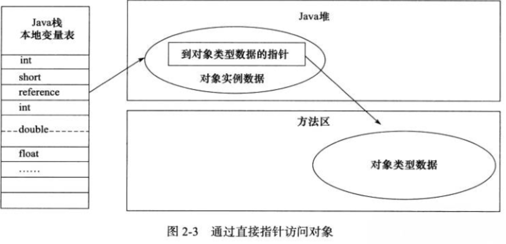
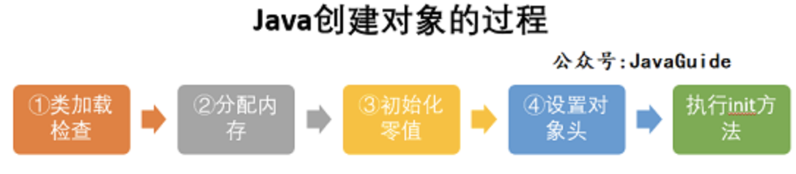
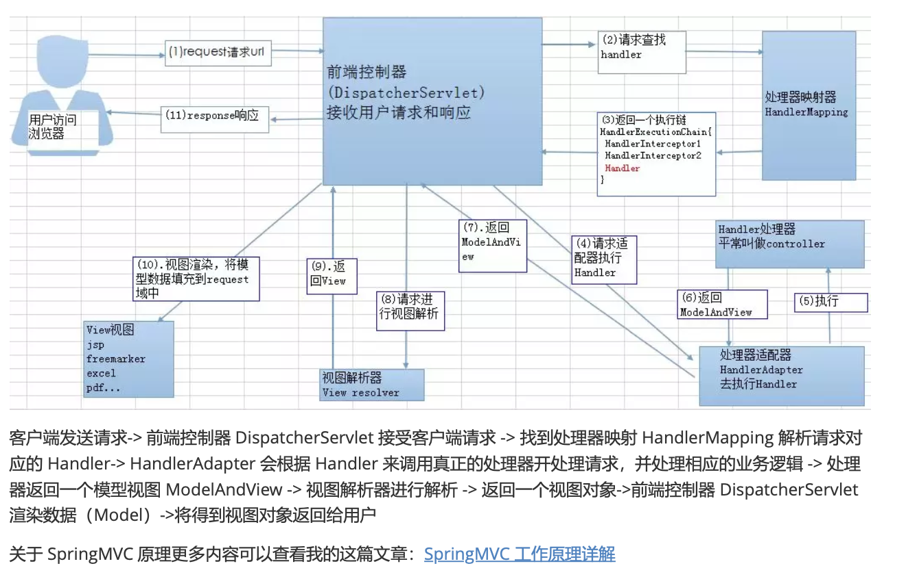
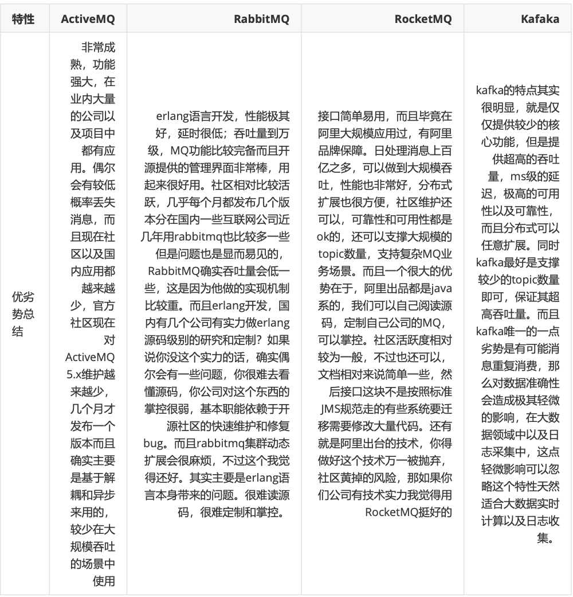

<!--ts-->
   * [1. Java](#1-java)
      * [1.1 java基础](#11-java基础)
         * [1.1.1 面向对象](#111-面向对象)
            * [1.1.1.1 什么是面向对象？@@@](#1111-什么是面向对象)
            * [1.1.1.2 值传递](#1112-值传递)
            * [1.1.1.3 组合和继承 @@@](#1113-组合和继承-)
            * [1.1.1.4 成员变量和方法的作用域](#1114-成员变量和方法的作用域)
            * [1.1.1.5 抽象类和接口](#1115-抽象类和接口)
            * [1.1.1.6 内部类](#1116-内部类)
            * [1.1.1.7  Object类相关题目 @@@@@](#1117--object类相关题目-)
         * [1.1.2 基础知识](#112-基础知识)
            * [1.1.2.1 自动拆装箱 @@@](#1121-自动拆装箱-)
            * [1.1.2.3 String相关 @@@@@](#1123-string相关-)
            * [1.1.2.4 java关键字](#1124-java关键字)
               * [1.1.2.4.1 transient](#11241-transient)
               * [1.1.2.4.2 staic @@@@](#11242-staic-)
               * [1.1.2.4.3 final  vs finally vs finalize @@@@](#11243-final--vs-finally-vs-finalize-)
               * [1.1.2.4.4 swith](#11244-swith)
               * [1.1.2.4.5 java中的深拷贝和浅拷贝](#11245-java中的深拷贝和浅拷贝)
         * [1.1.3 集合@@@@@](#113-集合)
            * [1.1.3.1 常用集合类的使用](#1131-常用集合类的使用)
            * [1.1.3.2 Collections和Arrays区别](#1132-collections和arrays区别)
         * [1.1.4 IO  BIO NIO AIO @@@](#114-io--bio-nio-aio-)
         * [1.1.5 序列化](#115-序列化)
         * [1.1.6 异常@@@](#116-异常)
      * [1.2 并发编程 @@@@@](#12-并发编程-)
         * [1.2.1 线程 @@@@@](#121-线程-)
            * [1.2.2.1 线程的状态](#1221-线程的状态)
            * [1.2.2.2 线程调度](#1222-线程调度)
            * [1.2.2.3 创建线程的多种方式](#1223-创建线程的多种方式)
            * [1.1.2.4 ThreadLocal](#1124-threadlocal)
            * [1.1.2.5 线程池 @@@@@](#1125-线程池-)
            * [1.1.2.10 锁 @@@@@](#11210-锁-)
            * [1.1.2.11 synchronized @@@@@](#11211-synchronized-)
            * [1.1.2.12 volatile](#11212-volatile)
            * [1.1.2.13 写代码来解决生产者消费者问题（实现线程的顺序打印）@@@@@](#11213-写代码来解决生产者消费者问题实现线程的顺序打印)
            * [1.1.2.14 AQS @@@@@](#11214-aqs-)
         * [1.2.2 并发包juc](#122-并发包juc)
            * [1.2.2.1 ConcurrentHashMap](#1221-concurrenthashmap)
            * [1.2.2.2 LinkedBlockingQueue](#1222-linkedblockingqueue)
            * [1.2.2.3 ConcurrentLinkedQueue](#1223-concurrentlinkedqueue)
            * [1.2.2.4 Atomic 原子类](#1224-atomic-原子类)
      * [1.3 jvm @@@@@](#13-jvm-)
         * [1.3.1 jvm内存结构 @@@@@](#131-jvm内存结构-)
         * [1.3.2 Java内存模型 @@@@@](#132-java内存模型-)
         * [1.3.3 Java对象模型@@@@](#133-java对象模型)
         * [1.3.4 Java的垃圾回收机制 @@@@](#134-java的垃圾回收机制-)
         * [1.3.5 类加载机制 @@@@@](#135-类加载机制-)
         * [1.3.6 常用Java命令 @@@](#136-常用java命令-)
      * [1.4 Java EE @@@@@](#14-java-ee-)
         * [1.4.1 Servlet](#141-servlet)
         * [1.4.2 Cookie和Session有什么区别？](#142-cookie和session有什么区别)
         * [1.4.3 转发和重定向](#143-转发和重定向)
         * [1.4.3 Spring](#143-spring)
            * [1.4.3.1 Spring Bean 的作用域](#1431-spring-bean-的作用域)
            * [1.4.3.2 Spring 事务中的隔离级别](#1432-spring-事务中的隔离级别)
            * [1.4.3.3 Spring事务传播行为](#1433-spring事务传播行为)
         * [1.4.5 Mybatis](#145-mybatis)
         * [1.4.6 redis](#146-redis)
            * [1.4.6.1 为什么要用 redis](#1461-为什么要用-redis)
            * [1.4.6.2 redis 和 memcached 的区别](#1462-redis-和-memcached-的区别)
            * [1.4.6.3 redis 常见数据结构以及使用场景分析](#1463-redis-常见数据结构以及使用场景分析)
            * [1.4.6.4 redis 设置过期时间](#1464-redis-设置过期时间)
            * [1.4.6.5 redis 内存淘汰机制](#1465-redis-内存淘汰机制)
            * [1.4.6.6 redis 持久化机制](#1466-redis-持久化机制)
            * [1.4.6.7 redis 事务](#1467-redis-事务)
            * [1.4.6.8 缓存雪崩和缓存穿透问题解决方案](#1468-缓存雪崩和缓存穿透问题解决方案)
            * [1.4.6.9 如何解决 Redis 的并发竞争 Key 问题](#1469-如何解决-redis-的并发竞争-key-问题)
            * [1.4.6.10 如何保证缓存与数据库双写时的数据一致性](#14610-如何保证缓存与数据库双写时的数据一致性)
            * [1.4.6.11 <strong>使用过Redis分布式锁么，它是什么回事？</strong>](#14611-使用过redis分布式锁么它是什么回事)
            * [1.4.6.12 其他](#14612-其他)
         * [1.4.7 nginx](#147-nginx)
         * [1.4.8 消息队列](#148-消息队列)
            * [1.4.8.1 介绍一下消息队列MQ的应用场景/使用消息队列的好处](#1481-介绍一下消息队列mq的应用场景使用消息队列的好处)
            * [1.4.8.2 使用消息队列会带来什么问题?考虑过这些问题吗?](#1482-使用消息队列会带来什么问题考虑过这些问题吗)
            * [1.4.8.3 介绍一下你知道哪几种消息队列,该如何选择呢?](#1483-介绍一下你知道哪几种消息队列该如何选择呢)
         * [1.4.9 dubbo](#149-dubbo)
         * [1.4.10 git](#1410-git)
      * [1.5 liteSpring相关知识 @@@@@](#15-litespring相关知识-)
   * [2. 数据结构与算法](#2-数据结构与算法)
   * [3. mysql](#3-mysql)
      * [3.1 三大范式](#31-三大范式)
      * [3.2 索引](#32-索引)
         * [3.2.1 概述](#321-概述)
         * [3.2.2 索引的分类](#322-索引的分类)
         * [3.3.3 建索引的原则](#333-建索引的原则)
         * [3.3.5 索引数据结构：B 树](#335-索引数据结构b树)
      * [3.3 数据库的锁](#33-数据库的锁)
      * [3.4 事务的ACID](#34-事务的acid)
      * [3.5 优化（explain，慢查询，show profile）](#35-优化explain慢查询show-profile)
      * [3.6 引擎对比（MyISAM，InnoDB）](#36-引擎对比myisaminnodb)
      * [3.7 数据库中的连接](#37-数据库中的连接)
      * [3.8 sql语法（join，union，子查询，having，group by）](#38-sql语法joinunion子查询havinggroup-by)
   * [4. 计算机网络](#4-计算机网络)
      * [4.1 基础网络概念@@@@@](#41-基础网络概念)
      * [4.2 Unix网络编程 @@@@@](#42-unix网络编程-)
      * [4.3 常见协议区分](#43-常见协议区分)
         * [4.3.1 rpc vs http](#431-rpc-vs-http)
   * [5. 操作系统](#5-操作系统)
      * [5.1 操作系统@@@@@](#51-操作系统)
         * [5.1.1 进程和线程](#511-进程和线程)
         * [5.1.2 进程通信IPC](#512-进程通信ipc)
         * [5.1.3 进程同步](#513-进程同步)
         * [5.1.4 死锁](#514-死锁)
         * [5.1.6 进程的调度算法](#516-进程的调度算法)
         * [5.1.7 内存管理](#517-内存管理)
         * [5.1.8 特殊进程](#518-特殊进程)
      * [5.2 linux常用命令](#52-linux常用命令)
         * [5.2.1 文件系统相关](#521-文件系统相关)
            * [5.2.2.4 压缩文件的操作命令](#5224-压缩文件的操作命令)
            * [5.2.2.5 grep、sed 以及 awk 命令](#5225-grepsed-以及-awk-命令)
            * [5.2.2.6 监测程序命令：ps、top](#5226-监测程序命令pstop)
      * [5.2 docker](#52-docker)
   * [6. 设计模式](#6-设计模式)
      * [五大原则](#五大原则)
      * [6.1 单例模式 @@@@@](#61-单例模式-)
      * [6.2 工厂模式](#62-工厂模式)
      * [6.3 代理模式](#63-代理模式)
      * [6.4 观察者模式](#64-观察者模式)
   * [7. 分布式算法](#7-分布式算法)
      * [7.1 发展](#71-发展)
      * [7.2 Paxos](#72-paxos)
      * [7.3 Raft @@@@@](#73-raft-)
      * [7.4 Zookeeper](#74-zookeeper)
      * [7.5 kafka @@@@@](#75-kafka-)
      * [7.6 PBFT](#76-pbft)
      * [7.7 PoW](#77-pow)
   * [8. 密码学算法](#8-密码学算法)
   * [9. 项目](#9-项目)
      * [9.1 智能合约形式化定义](#91-智能合约形式化定义)
      * [9.2 版权保护](#92-版权保护)
      * [9.3 跨链](#93-跨链)
      * [9.4 国密改造](#94-国密改造)
      * [9.5 KLedger-Auto](#95-kledger-auto)
      * [9.6 阿里IP商业化](#96-阿里ip商业化)
   * [10. 其他](#10-其他)
      * [10.1 海量数据问题](#101-海量数据问题)
         * [10.1.1 分而治之](#1011-分而治之)
         * [10.1.2 外部排序](#1012-外部排序)
         * [10.1.3 Mapreduce](#1013-mapreduce)
         * [10.1.4 Bit-map](#1014-bit-map)
         * [10.1.5 Bloom Filter](#1015-bloom-filter)
      * [10.2 计算机网络相关问题](#102-计算机网络相关问题)

<!-- Added by: anapodoton, at: 2020年 8月19日 星期三 00时41分53秒 CST -->

<!--te-->

# 1. Java

## 1.1 java基础

### 1.1.1 面向对象

#### 1.1.1.1 什么是面向对象？@@@

- 什么是面向过程：把问题分解成一个一个步骤，每个步骤都是函数或者表达式，这样的编程思想就是面向过程。
- 什么是面向对象:对象是属性和行为的集合体。把问题分解成一个一个步骤，每个步骤都是对象及对象的行为调用，这样的编程思想就是面向对象。
-  二者区别：面向过程以过程为中心，关注问题的解决过程顺序，而面向对象以对象为中心，将问题分解并抽象成多个对象，关注对象及对象之间的关系。
- 三大基本特征：
  - [封装](https://gitee.com/haojunsheng/JavaLearning/blob/master/Java-basic/object-oriented/object-oriented-detail.md#21-%E5%B0%81%E8%A3%85)：把客观事物封装成抽象的类，并且类可以把自己的数据和方法只让可信的类或者对象操作。封装是面向对象的特征之一，是对象和类概念的主要特性。通过这种方式，对象对内部数据提供了不同级别的保护，以防止程序中无关的部分意外的改变或错误的使用了对象的私有部分。
  - [继承](https://gitee.com/haojunsheng/JavaLearning/blob/master/Java-basic/object-oriented/object-oriented-detail.md#22-%E7%BB%A7%E6%89%BF):可以使用现有类的所有功能，并在无需重新编写原来的类的情况下对这些功能进行扩展。继承的过程，就是从一般到特殊的过程。
  - [多态](https://gitee.com/haojunsheng/JavaLearning/blob/master/Java-basic/object-oriented/object-oriented-detail.md#23-%E5%A4%9A%E6%80%81):所谓多态就是指一个类实例的相同方法在不同情形有不同表现形式。多态机制使具有不同内部结构的对象可以共享相同的外部接口。这意味着，虽然针对不同对象的具体操作不同，但通过一个公共的类，它们可以通过相同的方式予以调用。最常见的多态就是将子类传入父类参数中，运行时调用父类方法时通过传入的子类决定具体的内部结构或行为。
    - 重载（Overloading）：签名不一样，编译期。函数的返回值不同不可以构成重载。
    - 重写（Overriding）：子类重写父类，签名一样，运行期。
- [五大原则](https://gitee.com/haojunsheng/JavaLearning/blob/master/Java-basic/object-oriented/object-oriented-detail.md#3-%E4%BA%94%E5%A4%A7%E5%9F%BA%E6%9C%AC%E5%8E%9F%E5%88%99):
  - S：单一职责原则:一个类，最好只做一件事，只有一个引起它的变化。
  - O：开放封闭原则:软件实体应该是可扩展的，而不可修改的。也就是，对扩展开放，对修改封闭的。
  - L：里氏替换原则:子类必须能够替换其基类。
  - I：接口隔离原则：我们在进行类和接口设计时，如果在一个接口里定义了太多方法，其子类很可能面临两难，就是只有部分方法对它是有意义的，这就破坏了程序的内聚性。
  - D：依赖倒置原则：实体应该依赖于抽象而不是实现。也就是说高层次模块，不应该依赖于低层次模块，而是应该基于抽象。实践这一原则是保证产品代码之间适当耦合度的法宝。

#### 1.1.1.2 值传递

Java中只有值传递。

- 形参和实参：前者是用于接收实参内容的参数，后者是真正传递的内容。
- 值传递和引用传递的区别在于：**传递后会不会影响实参的值**，前者会创建副本，后者不会创建副本。

#### 1.1.1.3 组合和继承 @@@

[组合和继承](https://gitee.com/haojunsheng/JavaLearning/blob/master/Java-basic/object-oriented/combination-vs-inheritance.md)

- 组合是has-a，继承是is-a；多用组合，少用继承；只有需要从新类向基类进行向上转型的时候，才使用继承。

| 组 合 关 系                                                  | 继 承 关 系                                                  |
| ------------------------------------------------------------ | ------------------------------------------------------------ |
| 优点：不破坏封装，整体类与局部类之间松耦合，彼此相对独立     | 缺点：破坏封装，子类与父类之间紧密耦合，子类依赖于父类的实现，子类缺乏独立性 |
| 优点：具有较好的可扩展性                                     | 缺点：支持扩展，但是往往以增加系统结构的复杂度为代价         |
| 优点：支持动态组合。在运行时，整体对象可以选择不同类型的局部对象 | 缺点：不支持动态继承。在运行时，子类无法选择不同的父类       |
| 优点：整体类可以对局部类进行包装，封装局部类的接口，提供新的接口 | 缺点：子类不能改变父类的接口                                 |
| 缺点：整体类不能自动获得和局部类同样的接口                   | 优点：子类能自动继承父类的接口                               |
| 缺点：创建整体类的对象时，需要创建所有局部类的对象           | 优点：创建子类的对象时，无须创建父类的对象                   |

#### 1.1.1.4 成员变量和方法的作用域

[参考](https://gitee.com/haojunsheng/JavaLearning/blob/master/Java-basic/object-oriented/object-oriented-detail.md#4-%E5%9B%9B%E7%A7%8D%E8%AE%BF%E9%97%AE%E7%BA%A7%E5%88%AB)

- public :表明该成员变量或者方法是对所有类或者对象都是可见的,所有类或者对象都可以直接访问
- protected:表明成员变量或者方法对类自身,与同在一个包中的其他类可见,其他包下的类不可访问,除非是他的子类
- default:表明该成员变量或者方法只有自己和其位于同一个包的内可见,其他包内的类不能访问,即便是它的子类。
- private:表明该成员变量或者方法是私有的,只有当前类对其具有访问权限,除此之外其他类或者对象都没有访问权限.子类也没有访问权限。

外部类的作用域只有public和default。因为如果是private，那么别的类就无法对其进行实例化，毫无意义。对于protected，**类B继承类A的前提又是类B可以访问到类A**。继承的核心是继承属性和方法，在说一句，只有可以访问到，才有继承。所以类的修饰符只有public和default。

#### 1.1.1.5 抽象类和接口

[抽象类和接口](https://gitee.com/haojunsheng/JavaLearning/blob/master/Java-basic/object-oriented/abstract-class-vs-interface.md)

- 抽象类是不能实例化的类，用abstract关键字修饰class，其目的主要是代码重用。除了不能实例化，形式上和一般的Java类并没有太大区别，可以有一个或者多个抽象方法，也可 以没有抽象方法。抽象类大多用于抽取相关Java类的共用方法实现或者是共同成员变量，然后通过继承的方式达到代码复用的目的。Java标准库中，比如collection框架，很多通用 部分就被抽取成为抽象类，例如java.util.AbstractList。
- 接口：对行为进行抽象。是抽象方法的集合，利用接口可以达到API定义和实现分离的目的。接口，不能实例化;不能包含任何非常量成员，任何feld都是隐含着public static final的意义;同时，没有非静态方法实现，也就是说要么是抽象方法，要么是静态方法。Java标准类库中，定义了非常多的接口，比如java.util.List。


如何选择：

1. 如果要创建不带任何方法定义和成员变量的基类，那么就应该选择接口而不是抽象类。
2. 如果知道某个类应该是基类，那么第一个选择的应该是让它成为一个接口，只有在必须要有方法定义和成员变量的时候，才应该选择抽象类。因为抽象类中允许存在一个或多个被具体实现的方法，只要方法没有被全部实现该类就仍是抽象类。

#### 1.1.1.6 内部类

[内部类](https://gitee.com/haojunsheng/JavaLearning/blob/master/Java-basic/object-oriented/inner-class.md)

- 每个内部类都能独立地继承一个（接口的）实现，所以无论外围类是否已经继承了某个（接口的）实现，对于内部类都没有影响，**解决多重继承问题**。
- 内部类可以用多个实例，每个实例都有自己的状态信息，并且与其他外围对象的信息相互独立。
- 在单个外围类中，可以让多个内部类以不同的方式实现同一个接口，或者继承同一个类。
- 创建内部类对象的时刻并不依赖于外围类对象的创建。
- 内部类并没有令人迷惑的“is-a”关系，他就是一个独立的实体。
- 内部类提供了更好的封装，除了该外围类，其他类都不能访问。

#### 1.1.1.7  Object类相关题目 @@@@@

```java
public final native Class<?> getClass()//native方法，用于返回当前运行时对象的Class对象，使用了 final关键字修饰，故不允许子类重写。
public native int hashCode() //native方法，用于返回对象的哈希码，主要使用在哈希表中，比如JDK中的 HashMap。
public boolean equals(Object obj)//用于比较2个对象的内存地址是否相等，String类对该方法进行了重写用户比较字符串的值是否相等。
protected native Object clone() throws CloneNotSupportedException//naitive方法，用于创建并返回 当前对象的一份拷贝。一般情况下，对于任何对象 x，表达式 x.clone() != x 为true，x.clone().getClass() == x.getClass() 为true。Object本身没有实现Cloneable接口，所以不重写clone方法并且进行调用的话会发生 CloneNotSupportedException异常。
public String toString()//返回类的名字@实例的哈希码的16进制的字符串。建议Object所有的子类都重写这个方 法。
public final native void notify()//native方法，并且不能重写。唤醒一个在此对象监视器上等待的线程(监视 器相当于就是锁的概念)。如果有多个线程在等待只会任意唤醒一个。
public final native void notifyAll()//native方法，并且不能重写。跟notify一样，唯一的区别就是会唤醒 在此对象监视器上等待的所有线程，而不是一个线程。
public final native void wait(long timeout) throws InterruptedException//native方法，并且不能 重写。暂停线程的执行。注意:sleep方法没有释放锁，而wait方法释放了锁 。timeout是等待时间。
public final void wait(long timeout, int nanos) throws InterruptedException//多了nanos参数， 这个参数表示额外时间(以毫微秒为单位，范围是 0-999999)。 所以超时的时间还需要加上nanos毫秒。
public final void wait() throws InterruptedException//跟之前的2个wait方法一样，只不过该方法一直等 待，没有超时时间这个概念
protected void finalize() throws Throwable { }//实例被垃圾回收器回收的时候触发的操作
```

- hashCode()与equals()的相关规定

1. 如果两个对象相等，则hashcode一定也是相同的

2. 两个对象有相同的hashcode值，它们也不一定是相等的。因为hashCode() 所使用的杂凑算法也许刚好会让多个对象传回相同的杂凑值
3. equals方法被覆盖过，则hashCode方法也必须被覆盖。

速度的考量。因为相同对象的hash值必然相等，hashcode用来把对象的地址映射为一个整数,用来定位一个对象。如果不重写，那么两个对象的hash值大概率是不相等的，所以必须重写。

- 为什么要有hashCode

先判断hashcode，如果不相等，可以立即返回。这样我们可以大大减少equals的次数，相应就大大提高了执行速度。

- ==与equals

== : 它的作用是判断两个对象的地址是不是相等。即，判断两个对象是不是同一个对象。(基本数据类型`==比较的是值，引用数据类型==比较的是内存地址)`
 equals() : 它的作用也是判断两个对象是否相等。但它一般有两种使用情况:

- 情况1:类没有覆盖equals()方法。则通过equals()比较该类的两个对象时，等价于通过“==”比较这两个对象。

- 情况2:类覆盖了equals()方法。一般，我们都覆盖equals()方法来两个对象的内容相等;若它们的内容相等， 则返回true(即，认为这两个对象相等)。

### 1.1.2 基础知识

#### 1.1.2.1 自动拆装箱 @@@

[自动拆箱与装箱](https://gitee.com/haojunsheng/JavaLearning/blob/master/Java-basic/java-auto-unbox.md)

- WHY:为什么需要自动拆装箱?因为需要在基本数据类型和包装类之类进行转换。为了减少开发人员的工作。

  为什么需要包装类？ 1. 基本类型无法表示null。2. java是面向对象的，很多地方必须使用对象，比如集合，需要使用泛型。

- WHAT:什么是自动拆装箱? 就是将包装类自动转换成对应的基本数据类型。

- HOW:自动拆装箱是如何实现的? 自动装箱：`***.valueOf()`;自动拆箱：xxxValue()

- WHERE:什么地方可能会自动进行自动拆装箱
  
  - 三目运算符;基本数据类型放到集合类;包装类型和基本类型的大小比较;
  
- OTHER:自动拆装箱可能会带来那些问题？
  - Interger的缓存问题：**缓存支持-128到127之间的自动装箱过程**
  - 包装对象的数值比较，不能简单的使用`==`，虽然-128到127之间的数字可以，但是这个范围之外还是需要使用`equals`比较。
  - 由于自动拆箱，如果包装类对象为null，那么自动拆箱时就有可能抛出NPE。
  - 如果一个增强for循环中有大量拆装箱操作，会浪费很多资源。

#### 1.1.2.3 String相关 @@@@@

[String详细学习](https://gitee.com/haojunsheng/JavaLearning/blob/master/Java-basic/String-detail.md)

- [字符串的不可变性](https://gitee.com/haojunsheng/JavaLearning/blob/master/Java-basic/String-detail.md#41-%E5%AE%9A%E4%B9%89%E4%B8%80%E4%B8%AA%E5%AD%97%E7%AC%A6%E4%B8%B2)（String是用final数组实现的）

- [JDK 6和JDK 7中substring的原理及区别](https://gitee.com/haojunsheng/JavaLearning/blob/master/Java-basic/String-detail.md#71-substring-%E7%9A%84%E4%BD%9C%E7%94%A8)

  - jdk6仍然指向原字符串，会造成内存泄露的问题;jdk7会创建一个新的字符串;
  
- [String对“+”的重载](https://gitee.com/haojunsheng/JavaLearning/blob/master/Java-basic/String-detail.md#158-string%E5%AF%B9%E7%9A%84%E9%87%8D%E8%BD%BD)、字符串拼接的几种方式和区别
  - +是唯一重载的运算符。使用了StringBuilder以及他的append、toString两个方法。
  - "a"+"b"是在编译期完成的，s1+"b"和s1+s2是在运行期完成的。

- 字符串池、常量池（运行时常量池、Class常量池）、intern

  - class常量池是编译期生成的，"a"+"b"这种会在编译期直接优化为"ab"，但是s1+s2在运行期才知道
  - 运行时常量池:class常量池在运行期的，不同的jdk位置也不同
  - 字符串常量池：1.6之后，只存储字面量的引用
  - intern：如果已经有缓存的字符串，就会返回缓存里的实例，否则将其缓存起来。使用intern后直接指向字面量所在的位置。1.6之前是在永久代中的。7放到了堆中,jdk8本地内存元数据区。

- 直接使用双引号声明出来的 String 对象会直接存储在常量池中。

```java
String str1 = "abcd";//先检查字符串常量池中有没有"abcd"，如果字符串常量池中没有，则创建一个，然后 str1 指向字符串常量池中的对象，如果有，则直接将 str1 指向"abcd""；
String str2 = new String("abcd");//堆中创建一个新的对象
String str3 = new String("abcd");//堆中创建一个新的对象
String str4 = new String("abcd").intern();
System.out.println(str1==str2);//false
System.out.println(str2==str3);//false
System.out.ptrintln(str1==str4);//true
```

第一种方式是在常量池中拿对象；第二种方式是直接在堆内存空间创建一个新的对象。

 String s1 = new String("abc");创建几个对象。将创建 1 或 2 个。如果池中已存在字符串常量“abc”，则只会在堆空间创建一个字符串常量“abc”。如果池中没有字符串常量“abc”，那么它将首先在池中创建，然后在堆空间中创建，因此将创建总共 2 个字符串对象。

- [String、StringBuffer、StringBuilder区别](https://gitee.com/haojunsheng/JavaLearning/blob/master/Java-basic/String-detail.md#114-%E6%AD%A3%E7%A1%AE%E4%BD%BF%E7%94%A8stringstringbufferstringbuilder)

  - |                | String       | StringBuffer | StringBuilder |
    | -------------- | ------------ | ------------ | ------------- |
    | 可变           | 否,final数组 | 是           | 是            |
    | 线程安全       | 是           | 是           | 否            |
    | 修改创建新对象 | 是           | 否           | 否            |


#### 1.1.2.4 java关键字

##### 1.1.2.4.1 transient

[transient](https://gitee.com/haojunsheng/JavaLearning/blob/master/Java-basic/Java-keyword/transient-keyword.md)

禁止某个变量序列化。

1）一旦变量被transient修饰，变量将不再是对象持久化的一部分，该变量内容在序列化后无法获得访问。

2）transient关键字只能修饰变量，而不能修饰方法和类。

3）被transient关键字修饰的变量不再能被序列化，一个静态变量不管是否被transient修饰，均不能被序列化。

**序列化的本质是序列化对象，而不是类相关的信息。**  

Arraylist会用到。

##### 1.1.2.4.2 staic @@@@

[static](https://gitee.com/haojunsheng/JavaLearning/blob/master/Java-basic/Java-keyword/static-detail.md)

- static变量
  - 静态变量是随着类加载时被完成初始化的，它在内存中仅有一个，且JVM也只会为它分配一次内存，同时类所有的实例都共享静态变量，可以直接通过类名来访问它。
  - 实例变量则不同，它是伴随着实例的，每创建一个实例就会产生一个实例变量，它与该实例同生共死。
- static方法: 通过类名对其进行直接调用
- static代码块：被static修饰的代码块，我们称之为静态代码块，**静态代码块会随着类的加载一块执行**，而且他可以随意放，可以存在于的任何地方。
- 执行顺序: 静态代码块 > 构造代码块(指的是{}括起来的代码块) > 构造函数

##### 1.1.2.4.3 final  vs finally vs finalize @@@@

[final](https://gitee.com/haojunsheng/JavaLearning/blob/master/Java-basic/Java-keyword/final-detail.md)

不想被改变的原因有两个：**效率、设计**。

- final常量
  - **编译期常量**，永远不可改变。只能使用基本类型，而且必须要在定义时进行初始化。
  - **运行期初始化时，我们希望它不会被改变**。希望它可以根据对象的不同而表现不同，但同时又不希望它被改变，这个时候我们就可以使用运行期常量。对于运行期常量，它既可是基本数据类型，也可是引用数据类型。**基本数据类型不可变的是其内容，而引用数据类型不可变的是其引用，引用所指定的对象内容是可变的。**
  - 在并发编程中，可以用来保护只读数据，减少了同步开销。
- final方法：所有被final标注的方法都是不能被继承、更改的。不可以重写的(override)。
- final类：该类是最终类，它不希望也不允许其他来继承它。
- final参数：代表了该参数是不可改变的(指向不变，但指向的内容本身可以变化)
- final & static
  - **final强调的是不可改变的量**
  - **static强调的生命周期**

fnally则是Java保证重点代码一定要被执行的一种机制。我们可以使用try-fnally或者try-catch-fnally来进行类似关闭JDBC连接、保证unlock锁等动作。

finalize是基础类java.lang.Object的一个方法，它的设计目的是保证对象在被垃圾收集前完成特定资源的回收。fnalize机制现在已经不推荐使用，并且在JDK 9开始被标记 为deprecated。fnalize本质上成为了快速回收的阻碍者，可能 导致你的对象经过多个垃圾收集周期才能被回收。拖慢垃圾收集，导致大量对象堆积。

##### 1.1.2.4.4 swith

[switch](https://gitee.com/haojunsheng/JavaLearning/blob/master/Java-basic/Java-keyword/Java-Switch.md)：**其实swich只支持一种数据类型，那就是整型，其他数据类型都是转换成整型之后在使用switch的。**

整型：直接比较整数的值; 字符：比较ASCII码 ;字符串：equals和hashcode

##### 1.1.2.4.5 java中的深拷贝和浅拷贝

一个拷贝引用，另外一个重新分配空间。

1. **浅拷贝**：对基本数据类型进行值传递，对引用数据类型进行引用传递般的拷贝，此为浅拷贝。
2. **深拷贝**：对基本数据类型进行值传递，对引用数据类型，创建一个新的对象，并复制其内容，此为深拷贝。


### 1.1.3 集合@@@@@

#### 1.1.3.1 常用集合类的使用

[集合类概览](https://gitee.com/haojunsheng/JavaLearning/blob/master/Java-basic/Java-collection/collection-family.md)

- 数组：数组是**将数字和对象联系起来**，它**保存明确的对象**。（固定大小）

- Collection：保存单一的元素（可扩容）
  - [list](https://gitee.com/haojunsheng/JavaLearning/blob/master/Java-basic/Java-collection/list-detail.md#41-arraylist-vs-linkedlist-vs-vector):有序可重复的Collection，**有序指的是放入顺序，而不是大小顺序**。

    |          | [ArrayList](https://gitee.com/haojunsheng/JavaLearning/blob/master/Java-basic/Java-collection/list-detail.md#1-arraylist) | [LinkedList](https://gitee.com/haojunsheng/JavaLearning/blob/master/Java-basic/Java-collection/list-detail.md#2-linkedlist) | [Vector](https://gitee.com/haojunsheng/JavaLearning/blob/master/Java-basic/Java-collection/list-detail.md#3-vector) | [Stack](https://gitee.com/haojunsheng/JavaLearning/blob/master/Java-basic/Java-collection/list-detail.md#stack) | SynchronizedList                                   |
    | -------- | ------------------------------------------------------------ | ------------------------------------------------------------ | ------------------------------------------------------------ | ------------------------------------------------------------ | -------------------------------------------------- |
    | 实现方式 | 数组                                                         | 1.6之前是循环链表，之后是双向链表                            | 数组                                                         | 继承自Vector,实现一个后进先出的堆栈                          |                                                    |
    | 线程安全 | 否                                                           | 否                                                           | 是                                                           | 是                                                           | 是，同步代码块，遍历需要手动同步，可以锁定指定对象 |
    | 扩容     | [1.5倍](https://gitee.com/haojunsheng/JavaLearning/blob/master/Java-basic/Java-collection/list-detail.md#126-%E6%89%A9%E5%AE%B9) |                                                              | 2倍                                                          |                                                              | 1.5                                                |

1. [ArrayList的扩容机制](https://github.com/Snailclimb/JavaGuide/blob/master/docs/java/collection/ArrayList-Grow.md)：add方法会调用ensureCapacityInternal(size + 1)方法，然后会调用ensureExplicitCapacity(minCapacity)方法，当需要扩容的时候，调用grow(minCapacity)方法，会计算新的容量（原来的1.5倍），然后会调用Arrays.copyOf进行拷贝。

Arrays.copyOf()调用了System.arraycopy()方法。

- Arrays.copyOf(T[] original, int newLength)：系统自动在内部新建一个数组，并返回该数组。
- System.arraycopy(Object src,  int  srcPos, Object dest, int destPos, int length)：需要目标数组，将原数组拷贝到你自己定义的数组里或者原数组，而且可以选择拷贝的起点和长度以及放入新数组中的位置。

2. ArrayList是怎么实现序列化和反序列化的

把elementData定义为transient，然后重写writeObject和readObject方法，优势在于**自己根据size序列化真实的元素，而不是根据数组的长度序列化元素，减少了空间占用。**

- set无序不可重复

  |          | HashSet |
  | -------- | ------- |
  | 初始容量 | 16      |
  | 加载因子 | 0.75    |
  | 扩容     | 2倍     |

  List,Set都是继承自Collection接口。都是用来存储一组相同类型的元素的。

  |      | List | Set  |
| ---- | ---- | ---- |
  | 顺序 | 有   | 无   |
| 重复 | 可以 | 不可 |
  
HashSet基于HashMap。
  
1. Set怎么保证添加元素不重复？
  
   在Java的Set体系中，根据实现方式不同主要分为两大类。HashSet和TreeSet。
  
   1）TreeSet 是二叉树实现的,Treeset中的数据是自动排好序的，不允许放入null值 
  
   2）HashSet 是哈希表实现的,HashSet中的数据是无序的，可以放入null，但只能放入一个null。
  
   HashSet内部使用HashMap的key存储元素，以此来保证元素不重复；当你把对象加入`HashSet`时，HashSet会先计算对象的`hashcode`值来判断对象加入的位置，同时也会与其他加入的对象的hashcode值作比较，如果没有相符的hashcode，HashSet会假设对象没有重复出现。但是如果发现有相同hashcode值的对象，这时会调用`equals()`方法来检查hashcode相等的对象是否真的相同。如果两者相同，HashSet就不会让加入操作成功。
  
   TreeSet的底层是TreeMap的keySet()，而TreeMap是基于红黑树实现的，红黑树是一种平衡二叉查找树，它能保证任何一个节点的左右子树的高度差不会超过较矮的那棵的一倍。
  
   TreeMap是按key排序的，元素在插入TreeSet时compareTo()方法要被调用，所以TreeSet中的元素要实现Comparable接口。TreeSet作为一种Set，它不允许出现重复元素。TreeSet是用compareTo()来判断重复元素的。
  
2. HashSet是有序的吗？HashSet是无序的，因为Hashset的值保存在hashmap的key中。
  
3. HashSet是否允许null元素？HashSet中允许有一个null元素，因为HashMap允许key为null；
  
4. HashSet是非线程安全的；
  
  5. HashSet是没有get()方法的；
  
  6. LinkedHashSet的底层使用LinkedHashMap存储元素。
  
  7. LinkedHashSet是有序的吗？怎么个有序法？LinkedHashSet是有序的，它是按照插入的顺序排序的。
  
  8. TreeSet是有序的；
  
  9. TreeSet是非线程安全的；
  
  


- [map](https://gitee.com/haojunsheng/JavaLearning/blob/master/Java-basic/Java-collection/map-detail.md)：保存相关联的值键对  

  |            | HashMap                                                      | HashTable              | LinkedHashMap      | ConcurrentHashMap                                            |
  | ---------- | ------------------------------------------------------------ | ---------------------- | ------------------ | ------------------------------------------------------------ |
  | null       | 键和值都可以为null                                           | 键和值都不允许为null   |                    | 键和值都不允许为null                                         |
  | 线程安全   | 否                                                           | 是                     | 否                 | 是                                                           |
  | 插入顺序   | 否(插入的时候算hash)                                         |                        | 插入有序，双向链表 |                                                              |
  | 加锁粒度   |                                                              | 整个table只加了一把锁  |                    | jdk7分段来加锁，Segment默认是16，2的幂；jdk8取消了Segment分段锁，使用synchronized 和 CAS，只锁定当前链表或红黑二叉树的首节点 |
  | 继承关系   | AbstractMap                                                  | Dictionary             |                    |                                                              |
  | 容量和扩容 | 初始16，扩容*2                                               | 初始11，扩容old*2+1    |                    |                                                              |
  | hash值     | [重新计算](https://gitee.com/haojunsheng/JavaLearning/blob/master/Java-basic/Java-collection/map-detail.md#43-hashmap%E4%B8%AD%E7%9A%84hash%E7%AE%97%E6%B3%95%E5%AE%9E%E7%8E%B0) | 直接使用对象的hashCode |                    |                                                              |
  | 遍历方式   | Iterator                                                     | Enumeration，Iterator  |                    |                                                              |
| 加载因子   | 0.75                                                         |                        |                    |                                                              |
  

Segment继承了ReentrantLock，所以它就是一种可重入锁（ReentrantLock)。

（1）HashMap是一种散列表，采用（数组+ 链表 + 红黑树）的存储结构；

（2）HashMap的默认初始容量为16（1<<4），默认装载因子为0.75f，容量总是2的n次方；取余(%)操作中如果除数是2的幂次则等价于与其 除数减一的与(&)操作(也就是说 hash%length==hash&(length-1)的前提是 length 是2的 n 次方;

（3）HashMap扩容时每次容量变为原来的两倍；

（4）当桶的数量小于64时不会进行树化，只会扩容；

（5）当桶的数量大于64且单个桶中元素的数量大于8时，进行树化；

（6）当单个桶中元素数量小于6时，进行反树化；

（7）HashMap数组的查询效率为O(1)，链表的查询效率是O(k)，红黑树的查询效率是O(log k)

**HashMap的核心概念**：

- size 和 capacity:
  - size记录了Map中KV对的个数,数组的长度(实际的长度)；capacity:最多装的元素
- loadFactor和
  - loadFactor：用来衡量HashMap满的程度，loadFactor的默认值为0.75f
    - 0.75有一个好处，那就是**0.75正好是3/4，而capacity又是2的幂。所以，两个数的乘积都是整数**。
  - threshold：临界值，当实际KV个数超过threshold时，HashMap会将容量扩容，threshold＝容量*加载因子。

**HashMap 的长度为什么是2的幂次方**

为了能让 HashMap 存取高效，尽量较少碰撞，也就是要尽量把数据分配均匀。Hash 值的范围值-2147483648到2147483647，前后加起来大概40亿的映射空间。但问题是一个40亿长度的数组，内存是放不下的。所以这个散列值是不能直接拿来用的。用之前还要先做对数组的长度取模运算，得到的余数才能用来要存放的位置也就是对应的数组下标。这个数组下标的计算方法是“ `(n - 1) & hash`”。（n代表数组长度）。这也就解释了 HashMap 的长度为什么是2的幂次方。但是，**“取余(%)操作中如果除数是2的幂次则等价于与其除数减一的与(&)操作（也就是说 hash%length==hash&(length-1)的前提是 length 是2的 n 次方；）。”** 并且 **采用二进制位操作 &，相对于%能够提高运算效率，这就解释了 HashMap 的长度为什么是2的幂次方。**

**HashMap中的hash算法实现**

- hash ：该方法主要是将Object转换成一个整型。
- indexFor ：该方法主要是将hash生成的整型转换成链表数组中的下标。

#### 1.1.3.2 Collections和Arrays区别

[参考](https://gitee.com/SnailClimb/JavaGuide/blob/master/docs/java/basic/Arrays,CollectionsCommonMethods.md)

Collections 工具类常用方法:

- 排序

```java
void reverse(List list)//反转
void shuffle(List list)//随机排序
void sort(List list)//按自然排序的升序排序
void sort(List list, Comparator c)//定制排序，由Comparator控制排序逻辑
void swap(List list, int i , int j)//交换两个索引位置的元素
void rotate(List list, int distance)//旋转。当distance为正数时，将list后distance个元素整体移到前面。当distance为负数时，将 list的前distance个元素整体移到后面。
```

- 查找,替换操作

```java
int binarySearch(List list, Object key)//对List进行二分查找，返回索引，注意List必须是有序的
int max(Collection coll)//根据元素的自然顺序，返回最大的元素。 类比int min(Collection coll)
int max(Collection coll, Comparator c)//根据定制排序，返回最大元素，排序规则由Comparatator类控制。类比int min(Collection coll, Comparator c)
void fill(List list, Object obj)//用指定的元素代替指定list中的所有元素。
int frequency(Collection c, Object o)//统计元素出现次数
int indexOfSubList(List list, List target)//统计target在list中第一次出现的索引，找不到则返回-1，类比int lastIndexOfSubList(List source, list target).
boolean replaceAll(List list, Object oldVal, Object newVal), 用新元素替换旧元素
```

Arrays常用方法：

```java
排序 : sort()，Arrays.sort({ 1, 3, 2, 7, 6, 5, 4, 9 });
查找 : binarySearch()
比较: equals()
填充 : fill()
转列表: asList()
转字符串 : toString()
复制: copyOf()
```

### 1.1.4 IO  BIO NIO AIO @@@

同步、异步是指调用方要不要去主动询问/等待结果返回。阻塞，非阻塞，是描述调用方的。同步不一定阻塞，异步也不一定非阻塞。

首先，传统的java.io包，它基于流模型实现，提供了我们最熟知的一些IO功能，比如File抽象、输入输出流等。交互方式是同步、阻塞的方式，也就是说，在读取输入流或者写入输出流时，在读、写动作完成之前，线程会一直阻塞在那里，它们之间的调用是可靠的线性顺序。java.io包的好处是代码比较简单、直观，缺点则是IO效率和扩展性存在局限性，容易成为应用性能的瓶颈。很多时候，人们也把java.net下面提供的部分网络API，比如Socket、ServerSocket、HttpURLConnection也归类到同步阻塞IO类库，因为网络通信同样是IO行为。

第二，在Java 1.4中引入了NIO框架(java.nio包)，提供了Channel、Selector、Bufer等新的抽象，可以构建多路复用的、同步非阻塞IO程序，同时提供了更接近操作系统底层 的高性能数据操作方式。

第三，在Java 7中，NIO有了进一步的改进，也就是NIO 2，引入了异步非阻塞IO方式，也有很多人叫它AIO(Asynchronous IO)。异步IO操作基于事件和回调机制，可以简单 理解为，应用操作直接返回，而不会阻塞在那里，当后台处理完成，操作系统会通知相应线程进行后续工作。

输入流、输出流(InputStream/OutputStream)是用于读取或写入字节的。而Reader/Writer则是用于操作字符，增加了字符编解码等功能。BuferedOutputStream等带缓冲区的实现，可以避免频繁的磁盘读写，进而提高IO处理效率。这种设计利用了缓冲区，将批量数据进行一次操作。


[BIO、NIO和AIO的区别、三种IO的用法与原理](https://gitee.com/haojunsheng/JavaLearning/blob/master/Java-basic/Java-io-detail.md#6-bio-vs-nio-vs-aio)

- **BIO (Blocking I/O):** 同步阻塞 I/O 模式，数据的读取写入必须阻塞在一个线程内等待其完成。在活动连接数不是特别高（小于单机 1000）的情况下，这种模型是比较不错的，可以让每一个连接专注于自己的 I/O 并且编程模型简单，也不用过多考虑系统的过载、限流等问题。线程池本身就是一个天然的漏斗，可以缓冲一些系统处理不了的连接或请求。但是，当面对十万甚至百万级连接的时候，传统的 BIO 模型是无能为力的。因此，我们需要一种更高效的 I/O 处理模型来应对更高的并发量。
- **NIO (Non-blocking/New I/O):** NIO 是一种同步非阻塞的 I/O 模型。Bufer，高效的数据容器，除了布尔类型，所有原始数据类型都有相应的Bufer实现。 Channel，类似在Linux之类操作系统上看到的文件描述符，是NIO中被用来支持批量式IO操作的一种抽象。File或者Socket，通常被认为是比较高层次的抽象，而Channel则是更加操作系统底层的一种抽象，这也使得NIO得以充分利用现代操作系统底层机制，获得特定场景的性能优 化，例如，DMA(Direct Memory Access)等。不同层次的抽象是相互关联的，我们可以通过Socket获取Channel，反之亦然。Selector，是NIO实现多路复用的基础，它提供了一种高效的机制，可以检测到注册在Selector上的多Channel中，是否有Channel处于就绪状态，进而实现了单线程对 多Channel的高效管理。
  - IO都是同步阻塞模式，所以需要多线程以实现多任务处理。
  - NIO则是利用了单线程轮询事件的机制，通过高效地定位就绪的Channel，来决定做什 么，仅仅select阶段是阻塞的，可以有效避免大量客户端连接时，频繁线程切换带来的问题，应用的扩展能力有了非常大的提高。
- **AIO (Asynchronous I/O):** AIO 也就是 NIO 2。在 Java 7 中引入了 NIO 的改进版 NIO 2,它是异步非阻塞的 IO 模型。异步 IO 是基于事件和回调机制实现的，也就是应用操作之后会直接返回，不会堵塞在那里，当后台处理完成，操作系统会通知相应的线程进行后续的操作。AIO 是异步 IO 的缩写，虽然 NIO 在网络操作中，提供了非阻塞的方法，但是 NIO 的 IO 行为还是同步的。对于 NIO 来说，我们的业务线程是在 IO 操作准备好时，得到通知，接着就由这个线程自行进行 IO 操作，IO 操作本身是同步的。

### 1.1.5 序列化

[序列化](https://gitee.com/haojunsheng/JavaLearning/blob/master/Java-basic/Java-serialize.md)

- 什么是序列化与反序列化？
  - **序列化 (Serialization)是将对象的状态信息转换为可以存储或传输的形式的过程。**

- 序列化底层原理
  - writeObject和readObject方法

### 1.1.6 异常@@@

[异常](https://gitee.com/haojunsheng/JavaLearning/blob/master/Java-basic/java-execption-learning.md)

异常和错误的区别:异常能被程序本身可以处理，错误是无法处理。

finally和return的执行顺序:在return之前是会保证finally执行的。


## 1.2 并发编程 @@@@@

### 1.2.1 线程 @@@@@

#### 1.2.2.1 线程的状态

[线程的状态](https://gitee.com/haojunsheng/JavaLearning/blob/master/Java-basic/Java-concurrent-programming/2-deep-learning-thread.md#3-%E7%BA%BF%E7%A8%8B%E7%9A%84%E7%8A%B6%E6%80%81)

- 新建，就绪(需要时间片)，运行，阻塞(需要资源)，等待(需要其他线程通知notify)，终止
- sleep 和 wait
  - sleep不释放锁，wait会释放锁。wait 通常被用于线程间交互/通信，sleep 通常被用于暂停执行。
- **sleep()方法和yield()**
  - sleep()方法给其他线程运行机会时不考虑线程的优先级，yield()方法只会给相同优先级或更高优先级的线程以运行的机会。
  - 线程执行sleep()方法后转入阻塞（blocked）状态，而执行yield()方法后转入就绪（ready）状态；
  -  sleep()方法声明抛出InterruptedException，而yield()方法没有声明任何异常。
- notify 和 notifyAll
  - notify是随机唤醒一个，notifyAll是唤醒全部

#### 1.2.2.2 线程调度

[线程调度](https://gitee.com/haojunsheng/JavaLearning/blob/master/Java-basic/Java-concurrent-programming/2-deep-learning-thread.md#4-%E7%BA%BF%E7%A8%8B%E7%9A%84%E8%B0%83%E5%BA%A6) 

- 一个线程想要从就绪状态变成运行中状态，这个过程需要系统调度，即给线程分配CPU的使用权，获得CPU使用权的线程才会从就绪状态变成运行状态。给多个线程按照特定的机制分配CPU的使用权的过程就叫做线程调度。
- 协同式调度(自己工作完了,把CPU交给其他的线程)
- 抢占式调度(java默认模型)
- 线程调度的时候保存的上下文是什么：TCB

#### 1.2.2.3 创建线程的多种方式

[创建线程的多种方式](https://gitee.com/haojunsheng/JavaLearning/blob/master/Java-basic/Java-concurrent-programming/3-java-thread-create-four-way.md)

- 继承Thread类创建线程

  ```java
  SubClassThread subClassThread = new SubClassThread();
  subClassThread.start(); 
  class SubClassThread extends Thread {
      @Override
      public void run() {
          System.out.println();
      }
  }
  ```

- 实现Runnable接口创建线程
  - 二者之间的区别是，一旦java是单继承的，所以最好使用Runnable
  
  - 二者共同的缺点是：**在执行完任务之后无法获取执行结果**。
  
  - ```java
    RunnableThread runnableThread = new RunnableThread();
    new Thread(runnableThread).start();
    class RunnableThread implements Runnable {
        @Override
        public void run() {
            System.out.println(Thread.currentThread().getName());
        }
    }
    ```
  
- 通过Callable和FutureTask创建线程,可以在执行完任务之后获取执行结果。

  ```java
  CallableThread callableThread = new CallableThread();
  FutureTask futureTask = new FutureTask<>(callableThread);
  new Thread(futureTask).start();
  System.out.println(futureTask.get());
  class CallableThread implements Callable {
      @Override
      public Object call() throws Exception {
          System.out.println(Thread.currentThread().getName());
          return "Hollis";
      }
  }
  ```

- 通过线程池创建线程，**线程池本质是一个hashset。多余的任务会放在阻塞队列中。**

  ```java
  ExecutorService executorService = new ThreadPoolExecutor(1, 1, 60L, TimeUnit.SECONDS,
              new ArrayBlockingQueue<Runnable>(10));
          executorService.execute(new Runnable() {
              @Override
              public void run() {
                  System.out.println(Thread.currentThread().getName());
              }
          });
  ```

#### 1.1.2.4 ThreadLocal

[ThreadLocal](https://gitee.com/haojunsheng/JavaLearning/blob/master/Java-basic/Java-concurrent-programming/2-deep-learning-thread.md#7-threadlocal)

- **通过为每一个线程创建一份共享变量的副本**来保证各个线程之间的变量的访问和修改互相不影响；
- **ThreadLocal 适用于每个线程需要自己独立的实例且该实例需要在多个方法中被使用，也即变量在线程间隔离而在方法或类间共享的场景。**局部变量没有此问题。
- 每个线程可能有多个ThreadLocal。每个线程持有一个 Map 并维护了 ThreadLocal 对象与具体实例的映射，该 Map 由于只被持有它的线程访问，故不存在线程安全以及锁的问题。

  



#### 1.1.2.5 线程池 @@@@@

[线程池](https://tech.meituan.com/2020/04/02/java-pooling-pratice-in-meituan.html)

- 池化技术：提前保存大量的资源。线程池提供了一种限制和管理资源(包括执行一个任务)。 
  - 线程池、连接池、内存池、对象池等。
  - 降低资源消耗。 通过重复利用已创建的线程降低线程创建和销毁造成的消耗。
  - 提高响应速度。 当任务到达时，任务可以不需要的等到线程创建就能立即执行。
  - 提高线程的可管理性。 线程是稀缺资源，如果无限制的创建，不仅会消耗系统资源，还会降低系统的稳定性， 使用线程池可以进行统一的分配，调优和监控。
- 线程池原理：**线程池本质是一个hashSet**。线程池原理关键技术：锁（lock,cas）、阻塞队列、hashSet（资源池）
  - 首先检测线程池运行状态，如果不是RUNNING，则直接拒绝，线程池要保证在RUNNING的状态下执行任务。
  - 如果workerCount < corePoolSize，则创建并启动一个线程来执行新提交的任务。
  - 如果workerCount >= corePoolSize，且线程池内的阻塞队列未满，则将任务添加到该阻塞队列中。
  - 如果workerCount >= corePoolSize && workerCount < maximumPoolSize，且线程池内的阻塞队列已满，则创建并启动一个线程来执行新提交的任务。
  - 如果workerCount >= maximumPoolSize，并且线程池内的阻塞队列已满, 则根据拒绝策略来处理该任务, 默认的处理方式是直接抛异常。
  - ThreadPoolExecutor
    - corePoolSize: 核心线程数量，可以类比正式员工数量。
      - cpu密集型（加密）：CPU核心数+1
      - IO密集型：CPU核心数 × (1+平均等待时间/平均工作时间)
    - workQueue：多余任务等待队列，再多的人都处理不过来了，需要等着，在这个地方等。
      - 
    - maximumPoolSize: 最大的线程数量，公司最多雇佣员工数量。
    - keepAliveTime：非核心线程空闲时间，就是外包人员等了多久，如果还没有活干，解雇了。减少线程数过多造成的浪费。
    - threadFactory: 创建线程的工厂，在这个地方可以统一处理创建的线程的属性。
    - handler：线程池拒绝策略。
      - 
- 实现Runnable接口和Callable接口的区别：**两者的区别在于 Runnable 接口不会返回结果但 是 Callable 接口可以返回结果。**

#### 1.1.2.10 锁 @@@@@

[锁](https://gitee.com/haojunsheng/JavaLearning/blob/master/Java-basic/Java-concurrent-programming/lock.md)

- [数据库相关锁机制](https://gitee.com/haojunsheng/JavaLearning/blob/master/Java-basic/Java-concurrent-programming/lock.md#11-%E6%95%B0%E6%8D%AE%E5%BA%93%E7%9A%84%E9%94%81%E6%9C%BA%E5%88%B6)

- 

- [乐观锁与悲观锁](https://gitee.com/haojunsheng/JavaLearning/blob/master/Java-basic/Java-concurrent-programming/lock.md#1-%E4%B9%90%E8%A7%82%E9%94%81-vs-%E6%82%B2%E8%A7%82%E9%94%81)：线程要不要锁住同步资源
  
  - 悲观锁是一定使用了锁机制的（适合写操作多），**共享资源每次只给一个线程使用，其它线程阻塞，用完后再把资源转让给其它线程**。乐观锁则并未真正加锁(适合读操作多)。实现方式有版本号和CAS。
  - 版本号
    - 一般是在数据表中加上一个数据版本号version字段，表示数据被修改的次数，当数据被修改时，version值会加一。当线程A要更新数据值时，在读取数据的同时也会读取version值，在提交更新时，若刚才读取到的version值为当前数据库中的version值相等时才更新，否则重试更新操作，直到更新成功。
  - [CAS](https://gitee.com/haojunsheng/JavaLearning/blob/master/Java-basic/Java-concurrent-programming/lock.md#3-%E4%B9%90%E8%A7%82%E9%94%81%E7%9A%84%E4%B8%80%E7%A7%8D%E5%AE%9E%E7%8E%B0%E6%96%B9%E5%BC%8Fcas)
    - **Compare and Swap**(`CAS`)
      - 需要读写的内存值 V。进行比较的值 A。要写入的新值 B。
      - 当且仅当 V 的值等于 A 时，CAS通过原子方式用新值B来更新V的值（“比较+更新”整体是一个原子操作），否则不会执行任何操作。一般情况下，“更新”是一个不断重试的操作。
    - 存在ABA问题，循环时间长开销大，只能保证一个共享变量的原子操作
      - 使用版本号来解决
      - JDK 1.5 以后的 `AtomicStampedReference 类`就提供了此种能力，其中的 `compareAndSet 方法`就是首先检查当前引用是否等于预期引用，并且当前标志是否等于预期标志，如果全部相等，则以原子方式将该引用和该标志的值设置为给定的更新值。
    - **循环时间长开销大**。CAS操作如果长时间不成功，会导致其一直自旋，给CPU带来非常大的开销。
    - **只能保证一个共享变量的原子操作**。1.5之后，可以使用AtomicReference。
  
- [阻塞锁vs非阻塞锁](https://gitee.com/haojunsheng/JavaLearning/blob/master/Java-basic/Java-concurrent-programming/lock.md#2-%E8%87%AA%E6%97%8B%E9%94%81-vs-%E9%80%82%E5%BA%94%E6%80%A7%E8%87%AA%E6%97%8B%E9%94%81)：锁住同步资源失败，线程要不要阻塞

  - 到底要不要放弃处理器的执行时间。阻塞锁是放弃了CPU时间，进入了等待区，等待被唤醒。而自旋锁是一直“自旋”在那里，时刻的检查共享资源是否可以被访问。

- [无锁vs偏向锁vs轻量级锁vs重量级锁](https://gitee.com/haojunsheng/JavaLearning/blob/master/Java-basic/Java-concurrent-programming/lock.md#3-%E6%97%A0%E9%94%81-vs-%E5%81%8F%E5%90%91%E9%94%81-vs-%E8%BD%BB%E9%87%8F%E7%BA%A7%E9%94%81-vs-%E9%87%8D%E9%87%8F%E7%BA%A7%E9%94%81)：对性能影响的大小,多个线程竞争同步资源的细节
  
  - 无锁:没有对资源进行锁定，所有的线程都能访问并修改同一个资源，但同时只有一个线程能修改成功。
  
  - 偏向锁：一段同步代码一直被一个线程所访问，那么该线程会自动获取锁，降低获取锁的代价。
  
  - 轻量级锁：当锁是偏向锁的时候，被另外的线程所访问，偏向锁就会升级为轻量级锁，其他线程会通过自旋的形式尝试获取锁，不会阻塞，从而提高性能。
  
  - 重量级锁：使用`Monitor`进行加锁，这是一种互斥锁，称做重量级锁
  
  - | 锁状态   | 存储内容                                                | 存储内容 |
    | :------- | :------------------------------------------------------ | :------- |
    | 无锁     | 对象的hashCode、对象分代年龄、是否是偏向锁（0）         | 01       |
    | 偏向锁   | 偏向线程ID、偏向时间戳、对象分代年龄、是否是偏向锁（1） | 01       |
    | 轻量级锁 | 指向栈中锁记录的指针                                    | 00       |
    | 重量级锁 | 指向互斥量（重量级锁）的指针                            | 10       |
  
- [可重入锁 vs 非可重入锁：](https://gitee.com/haojunsheng/JavaLearning/blob/master/Java-basic/Java-concurrent-programming/lock.md#5-%E5%8F%AF%E9%87%8D%E5%85%A5%E9%94%81-vs-%E9%9D%9E%E5%8F%AF%E9%87%8D%E5%85%A5%E9%94%81)
  
  - 可重入锁又名递归锁，是指在同一个线程在外层方法获取锁的时候，再进入该线程的内层方法会自动获取锁
  
- 锁消除：即无锁。

- 锁粗化：锁变大。

- [死锁？](https://gitee.com/haojunsheng/JavaLearning/blob/master/Java-basic/Java-concurrent-programming/lock.md#6-java%E7%BA%A7%E5%88%AB%E7%9A%84%E6%AD%BB%E9%94%81)

  - 死锁如何排查：jps获取进程id，Jstack获取线程栈：区分线程状态 -> 查看等待目标 -> 对比Monitor等持有状态。
    - **JConsole工具**
  - 死锁的原因：资源竞争
    - 互斥条件：进程要求对所分配的资源进行排它性控制，即在一段时间内某资源仅为一进程所占用。
    - 请求和保持条件：当进程因请求资源而阻塞时，对已获得的资源保持不放。
    - 不剥夺条件：进程已获得的资源在未使用完之前，不能剥夺，只能在使用完时由自己释放。
    - 环路等待条件：在发生死锁时，必然存在一个进程--资源的环形链。
  - 死锁的解决办法
    - 确定的顺序获取锁
    - 死锁检测与死锁恢复:不不试图阻⽌止死锁，⽽而是检测到死锁发⽣生时，采取措施进恢复。


#### 1.1.2.11 synchronized @@@@@

- [synchronized是如何实现的？](https://gitee.com/haojunsheng/JavaLearning/blob/master/jvmLearning/Java-memory-model.md#71-synchronized)

synchronized关键字解决的是多个线程之间访问资源的同步性，synchronized关键字可以保证被**它修饰的方法或者代码块**在任意时刻只能有一个线程执行。

另外，在Java早期版本中，synchronized属于重量级锁，效率低下，因为**监视器锁(monitor)是依赖于底层的操 作系统的 Mutex Lock** 来实现的，Java 的线程是映射到操作系统的原生线程之上的。如果要挂起或者唤醒一个线程， 都需要操作系统帮忙完成，而操作系统实现线程之间的切换时需要从用户态转换到内核态，这个状态之间的转换需要相对比较长的时间，时间成本相对较高，这也是为什么早期的 synchronized 效率低的原因。

synchronized关键字最主要的三种使用方式:

- **修饰实例方法**，作用于当前**对象实例加锁**，进入同步代码前要获得当前对象实例的锁 ,**通过ACC_SYNCHRONIZED标识。**
- **修饰静态方法**，作用于当前类对象加锁，进入同步代码前要获得当前类对象的锁 。也就是给当前类加锁，会作 用于类的所有对象实例，因为静态成员不属于任何一个实例对象，是类成员( static 表明这是该类的一个静态 资源，不管new了多少个对象，只有一份，所以对该类的所有对象都加了锁)。所以如果一个线程A调用一个实 例对象的非静态 synchronized 方法，而线程B需要调用这个实例对象所属类的静态 synchronized 方法，是允 许的，不会发生互斥现象，因为访问静态 synchronized 方法占用的锁是当前类的锁，而访问非静态 synchronized 方法占用的锁是当前实例对象锁。 
- 修饰代码块，**（通过monitorenter 和 monitorexit 指令）**指定加锁对象，对给定对象加锁，进入同步代码库前要获得给定对象的锁。 当执行 monitorenter 指令时，线程试图 获取锁也就是获取 monitor(monitor对象存在于每个Java对象的对象头中，synchronized 锁便是通过这种方式获取 锁的，也是为什么Java中任意对象可以作为锁的原因) 的持有权.当计数器为0则可以成功获取，获取后将锁计数器设 为1也就是加1。相应的在执行 monitorexit 指令后，将锁计数器设为0，表明锁被释放。如果获取对象锁失败，那当 前线程就要阻塞等待，直到锁被另外一个线程释放为止。

**java 1.6之后对锁的优化**

JDK1.6 对锁的实现引入了大量的优化，如偏向锁、轻量级锁、自旋锁、适应性自旋锁、锁消除、锁粗化等技术来减少锁操作的开销。

锁主要存在四中状态，依次是：无锁状态、偏向锁状态、轻量级锁状态、重量级锁状态，他们会随着竞争的激烈而逐渐升级。注意锁可以升级不可降级，这种策略是为了提高获得锁和释放锁的效率。

- 无锁:没有对资源进行锁定，所有的线程都能访问并修改同一个资源，但同时只有一个线程能修改成功。

- 偏向锁：一段同步代码一直被一个线程所访问，那么该线程会自动获取锁，降低获取锁的代价。**在无竞争的情况下会把整个同步都消除掉**。

- 轻量级锁：当锁是偏向锁的时候，被另外的线程所访问，偏向锁就会升级为轻量级锁，其他线程会通过自旋的形式尝试获取锁，不会阻塞，从而提高性能。**轻量级锁在无竞争的情况下使用 CAS 操作去代替使用互斥量**。

- 重量级锁：使用`Monitor`进行加锁，这是一种互斥锁，称做重量级锁。

轻量级锁失败后，虚拟机为了避免线程真实地在操作系统层面挂起，还会进行一项称为自旋锁的优化手段。

互斥同步对性能最大的影响就是阻塞的实现，因为挂起线程/恢复线程的操作都需要转入内核态中完成（用户态转换到内核态会耗费时间）。

**一般线程持有锁的时间都不是太长，所以仅仅为了这一点时间去挂起线程/恢复线程是得不偿失的。** 所以，虚拟机的开发团队就这样去考虑：“我们能不能让后面来的请求获取锁的线程等待一会而不被挂起呢？看看持有锁的线程是否很快就会释放锁”。**为了让一个线程等待，我们只需要让线程执行一个忙循环（自旋），这项技术就叫做自旋**。

**在 JDK1.6 中引入了自适应的自旋锁。自适应的自旋锁带来的改进就是：自旋的时间不在固定了，而是和前一次同一个锁上的自旋时间以及锁的拥有者的状态来决定，虚拟机变得越来越“聪明”了**。

锁消除理解起来很简单，它指的就是虚拟机即使编译器在运行时，如果检测到那些共享数据不可能存在竞争，那么就执行锁消除。锁消除可以节省毫无意义的请求锁的时间。

原则上，我们再编写代码的时候，总是推荐将同步快的作用范围限制得尽量小——只在共享数据的实际作用域才进行同步，这样是为了使得需要同步的操作数量尽可能变小，如果存在锁竞争，那等待线程也能尽快拿到锁。

大部分情况下，上面的原则都是没有问题的，但是如果一系列的连续操作都对同一个对象反复加锁和解锁，那么会带来很多不必要的性能消耗。

**synchronized和ReenTrantLock 的区别**

1. 两者都是可重入锁

两者都是可重入锁。“可重入锁”概念是:自己可以再次获取自己的内部锁。比如一个线程获得了某个对象的锁，此时 这个对象锁还没有释放，当其再次想要获取这个对象的锁的时候还是可以获取的，如果不可锁重入的话，就会造成死锁。同一个线程每次获取锁，锁的计数器都自增1，所以要等到锁的计数器下降为0时才能释放锁。

2. synchronized 依赖于 JVM 而 ReenTrantLock 依赖于 API

synchronized 是依赖于 JVM 实现的，前面我们也讲到了 虚拟机团队在 JDK1.6 为 synchronized 关键字进行了很多优化，但是这些优化都是在虚拟机层面实现的，并没有直接暴露给我们。ReenTrantLock 是 JDK 层面实现的(也就 是 API 层面，需要 lock() 和 unlock 方法配合 try/finally 语句块来完成)，所以我们可以通过查看它的源代码，来看 它是如何实现的。

3. ReenTrantLock 比 synchronized 增加了一些高级功能

相比synchronized，ReenTrantLock增加了一些高级功能。主要来说主要有三点:1等待可中断;2可实现公平锁; 3可实现选择性通知(锁可以绑定多个条件)

- ReenTrantLock提供了一种能够中断等待锁的线程的机制，通过lock.lockInterruptibly()来实现这个机制。也 就是说正在等待的线程可以选择放弃等待，改为处理其他事情。 ReenTrantLock可以指定是公平锁还是非公平锁。而synchronized只能是非公平锁。所谓的公平锁就是先等 待的线程先获得锁。 ReenTrantLock默认情况是非公平的，可以通过 ReenTrantLock类的

- ReentrantLock(boolean fair)构造方法来制定是否是公平的。 **而synchronized只能是非公平锁。所谓的公平锁就是先等待的线程先获得锁。** ReenTrantLock默认情况是非公平的，可以通过 ReenTrantLock类的`ReentrantLock(boolean fair)`构造方法来制定是否是公平的。
- synchronized关键字与wait()和notify/notifyAll()方法相结合可以实现等待/通知机制，ReentrantLock类当然也可以实现，但是需要借助于Condition接口与newCondition() 方法。Condition是JDK1.5之后才有的，它具有很好的灵活性，比如可以实现多路通知功能也就是在一个Lock对象中可以创建多个Condition实例（即对象监视器），**线程对象可以注册在指定的Condition中，从而可以有选择性的进行线程通知，在调度线程上更加灵活。 在使用notify/notifyAll()方法进行通知时，被通知的线程是由 JVM 选择的，用ReentrantLock类结合Condition实例可以实现“选择性通知”** ，这个功能非常重要，而且是Condition接口默认提供的。而synchronized关键字就相当于整个Lock对象中只有一个Condition实例，所有的线程都注册在它一个身上。如果执行notifyAll()方法的话就会通知所有处于等待状态的线程这样会造成很大的效率问题，而Condition实例的signalAll()方法 只会唤醒注册在该Condition实例中的所有等待线程。

如果你想使用上述功能，那么选择ReenTrantLock是一个不错的选择。 

4. 性能已不是选择标准

**JDK1.6 之后，synchronized 和 ReenTrantLock 的性能基本是持平了。所以网上那些说因为性能才选择 ReenTrantLock 的文章都是错的！JDK1.6之后，性能已经不是选择synchronized和ReenTrantLock的影响因素了！而且虚拟机在未来的性能改进中会更偏向于原生的synchronized，所以还是提倡在synchronized能满足你的需求的情况下，优先考虑使用synchronized关键字来进行同步！优化后的synchronized和ReenTrantLock一样，在很多地方都是用到了CAS操作**。

#### 1.1.2.12 volatile

[volatile](https://gitee.com/haojunsheng/JavaLearning/blob/master/jvmLearning/Java-memory-model.md#72-volatile)

- 只能修饰变量
- happens-before
- 内存屏障
- 禁止编译器指令重排和CPU指令重排
- volatile的实现原理
- volatile和原子性、可见性和有序性之间的关系
  - 原子性：不支持
  - 可见性：修改后立即同步到主存
  - 有序性：内存屏障
- [有了symchronized为什么还需要volatile](https://gitee.com/haojunsheng/JavaLearning/blob/master/jvmLearning/Java-memory-model.md#727-%E6%97%A2%E7%94%9Fsynchronized%E4%BD%95%E7%94%9Fvolatile)
  - 有性能损耗
  - 产生阻塞
  - 可以禁止指令重排

#### 1.1.2.13 写代码来解决生产者消费者问题（实现线程的顺序打印）@@@@@

```java
// 实现线程的顺序打印
public class Test implements Runnable {

    private static final Object LOCK = new Object();

    /**
     * 当前即将打印的数字
     */
    private static int current = 0;

    /**
     * 当前线程编号，从0开始
     */
    private int threadNo;

    /**
     * 线程数量
     */
    private int threadCount;

    /**
     * 打印的最大数值
     */
    private int max;

    public Test(int threadNo, int threadCount, int max) {
        this.threadNo = threadNo;
        this.threadCount = threadCount;
        this.max = max;
    }

    @Override
    public void run() {
        while (true) {
            synchronized (LOCK) {
                // 判断是否轮到当前线程执行
                while (current % threadCount != threadNo) {
                    if (current > max) {
                        break;
                    }
                    try {
                        // 如果不是，则当前线程进入wait
                        LOCK.wait();
                    } catch (InterruptedException e) {
                        e.printStackTrace();
                    }
                }
                // 最大值跳出循环
                if (current > max) {
                    break;
                }
                System.out.println("thread-" + threadNo + " : " + current);
                current++;
                // 唤醒其他wait线程
                LOCK.notifyAll();
            }
        }
    }

    public static void main(String[] args) {
        int threadCount = 3;
        int max = 2;
        for (int i = 0; i < threadCount; i++) {
            new Thread(new Test(i, threadCount, max)).start();
        }
    }
}
```

```java
// 生产者和消费者，wait()和notify()的实现
// wait(),暂停线程的执行。注意:sleep方法没有释放锁，而wait方法释放了锁 。timeout是等待时间。
// notify(),唤醒一个在此对象监视器上等待的线程(监视器相当于就是锁的概念)。
// 如果有多个线程在等待只会任意唤醒一个。
// notifyAll(),跟notify一样，唯一的区别就是会唤醒 在此对象监视器上等待的所有线程，而不是一个线程。
public class Test1 {
    private static Integer count = 0;
    private static final Integer FULL = 10;
    private static String LOCK = "lock";

    public static void main(String[] args) {
        Test1 test1 = new Test1();
        new Thread(test1.new Producer()).start();
        new Thread(test1.new Consumer()).start();
        new Thread(test1.new Producer()).start();
        new Thread(test1.new Consumer()).start();
        new Thread(test1.new Producer()).start();
        new Thread(test1.new Consumer()).start();
        new Thread(test1.new Producer()).start();
        new Thread(test1.new Consumer()).start();
    }

    class Producer implements Runnable {
        @Override
        public void run() {
            for (int i = 0; i < 10; i++) {
                try {
                    Thread.sleep(3000);
                } catch (Exception e) {
                    e.printStackTrace();
                }
                synchronized (LOCK) {
                    while (count.equals(FULL)) {
                        try {
                            LOCK.wait();
                        } catch (Exception e) {
                            e.printStackTrace();
                        }
                    }
                    count++;
                    System.out.println(Thread.currentThread().getName() + "生产者生产，目前总共有" + count);
                    LOCK.notifyAll();
                }
            }
        }
    }

    class Consumer implements Runnable {
        @Override
        public void run() {
            for (int i = 0; i < 10; i++) {
                try {
                    Thread.sleep(3000);
                } catch (InterruptedException e) {
                    e.printStackTrace();
                }
                synchronized (LOCK) {
                    while (count == 0) {
                        try {
                            LOCK.wait();
                        } catch (Exception e) {
                        }
                    }
                    count--;
                    System.out.println(Thread.currentThread().getName() + "消费者消费，目前总共有" + count);
                    LOCK.notifyAll();
                }
            }
        }
    }
}
```


为什么使用notifyAll() ，不使用notify()，就是随便叫醒一个消费者呢？

使用 notify() 是叫醒 LOCK 阻塞队列里面的任意一个线程，假如此时我们的临界区域已经满了，此时唤醒的是一个生产者线程，就会导致死锁，所以我们在这里采用的是 notifyAll() 这个方法，意思就是唤醒阻塞队列里面的全部线程，这样某一个消费者就可以去取出临界区里面的产品，从而避免死锁的发生，但是很显然，从上面打印的结果可以看出，顺序是无法保证的，想要保证顺序，可以试着使用可重入锁 ReentrantLock 来实现。


java.util.concurrent.lock 中的 Lock 框架是锁定的一个抽象，通过对lock的lock()方法和unlock()方法实现了对锁的显示控制，而synchronize()则是对锁的隐性控制。
可重入锁，也叫做递归锁，指的是同一线程 外层函数获得锁之后 ，内层递归函数仍然有获取该锁的代码，但不受影响，简单来说，该锁维护这一个与获取锁相关的计数器，如果拥有锁的某个线程再次得到锁，那么获取计数器就加1，函数调用结束计数器就减1，然后锁需要被释放两次才能获得真正释放。已经获取锁的线程进入其他需要相同锁的同步代码块不会被阻塞。

```java
import java.util.concurrent.locks.Condition;
import java.util.concurrent.locks.Lock;
import java.util.concurrent.locks.ReentrantLock;
// 生产者和消费者，可重入锁ReentrantLock的实现
public class Test1 {
    private static Integer count = 0;
    private static final Integer FULL = 10;
    //创建一个锁对象
    private Lock lock = new ReentrantLock();
    //创建两个条件变量，一个为缓冲区非满，一个为缓冲区非空
    private final Condition notFull = lock.newCondition();
    private final Condition notEmpty = lock.newCondition();

    public static void main(String[] args) {
        Test1 test2 = new Test1();
        new Thread(test2.new Producer()).start();
        new Thread(test2.new Consumer()).start();
        new Thread(test2.new Producer()).start();
        new Thread(test2.new Consumer()).start();
        new Thread(test2.new Producer()).start();
        new Thread(test2.new Consumer()).start();
        new Thread(test2.new Producer()).start();
        new Thread(test2.new Consumer()).start();
    }

    class Producer implements Runnable {
        @Override
        public void run() {
            for (int i = 0; i < 10; i++) {
                try {
                    Thread.sleep(3000);
                } catch (Exception e) {
                    e.printStackTrace();
                }
                //获取锁
                lock.lock();
                try {
                    while (count.equals(FULL)) {
                        try {
                            notFull.await();
                        } catch (InterruptedException e) {
                            e.printStackTrace();
                        }
                    }
                    count++;
                    System.out.println(Thread.currentThread().getName()
                            + "生产者生产，目前总共有" + count);
                    //唤醒消费者
                    notEmpty.signal();
                } finally {
                    //释放锁
                    lock.unlock();
                }
            }
        }
    }

    class Consumer implements Runnable {
        @Override
        public void run() {
            for (int i = 0; i < 10; i++) {
                try {
                    Thread.sleep(3000);
                } catch (InterruptedException e1) {
                    e1.printStackTrace();
                }
                lock.lock();
                try {
                    while (count == 0) {
                        try {
                            notEmpty.await();
                        } catch (Exception e) {
                            e.printStackTrace();
                        }
                    }
                    count--;
                    System.out.println(Thread.currentThread().getName()
                            + "消费者消费，目前总共有" + count);
                    notFull.signal();
                } finally {
                    lock.unlock();
                }
            }
        }
    }
}
```


**阻塞队列BlockingQueue的实现**

BlockingQueue即阻塞队列，从阻塞这个词可以看出，在某些情况下对阻塞队列的访问可能会造成阻塞。被阻塞的情况主要有如下两种:

1. 当队列满了的时候进行入队列操作
2. 当队列空了的时候进行出队列操作
   因此，当一个线程对已经满了的阻塞队列进行入队操作时会阻塞，除非有另外一个线程进行了出队操作，当一个线程对一个空的阻塞队列进行出队操作时也会阻塞，除非有另外一个线程进行了入队操作。
   从上可知，阻塞队列是线程安全的。
   下面是BlockingQueue接口的一些方法:



这四类方法分别对应的是：
1 . ThrowsException：如果操作不能马上进行，则抛出异常
2 . SpecialValue：如果操作不能马上进行，将会返回一个特殊的值，一般是true或者false
3 . Blocks:如果操作不能马上进行，操作会被阻塞
4 . TimesOut:如果操作不能马上进行，操作会被阻塞指定的时间，如果指定时间没执行，则返回一个特殊值，一般是true或者false
下面来看由阻塞队列实现的生产者消费者模型,这里我们使用take()和put()方法，这里生产者和生产者，消费者和消费者之间不存在同步，所以会出现连续生成和连续消费的现象

```java
// 生产者和消费者，使用BlockingQueue实现生产者消费者模型
public class Test1 {
    private static Integer count = 0;
    //创建一个阻塞队列
    final BlockingQueue blockingQueue = new ArrayBlockingQueue<>(10);
    public static void main(String[] args) {
        Test1 test3 = new Test1();
        new Thread(test3.new Producer()).start();
        new Thread(test3.new Consumer()).start();
        new Thread(test3.new Producer()).start();
        new Thread(test3.new Consumer()).start();
        new Thread(test3.new Producer()).start();
        new Thread(test3.new Consumer()).start();
        new Thread(test3.new Producer()).start();
        new Thread(test3.new Consumer()).start();
    }
    class Producer implements Runnable {
        @Override
        public void run() {
            for (int i = 0; i < 10; i++) {
                try {
                    Thread.sleep(3000);
                } catch (Exception e) {
                    e.printStackTrace();
                }
                try {
                    blockingQueue.put(1);
                    count++;
                    System.out.println(Thread.currentThread().getName()
                            + "生产者生产，目前总共有" + count);
                } catch (InterruptedException e) {
                    e.printStackTrace();
                }
            }
        }
    }
    class Consumer implements Runnable {
        @Override
        public void run() {
            for (int i = 0; i < 10; i++) {
                try {
                    Thread.sleep(3000);
                } catch (InterruptedException e1) {
                    e1.printStackTrace();
                }
                try {
                    blockingQueue.take();
                    count--;
                    System.out.println(Thread.currentThread().getName()
                            + "消费者消费，目前总共有" + count);
                } catch (InterruptedException e) {
                    e.printStackTrace();
                }
            }
        }
    }
}
```

**信号量Semaphore的实现**

Semaphore（信号量）是用来控制同时访问特定资源的线程数量，它通过协调各个线程，以保证合理的使用公共资源，在操作系统中是一个非常重要的问题，可以用来解决哲学家就餐问题。Java中的Semaphore维护了一个许可集，一开始先设定这个许可集的数量，可以使用acquire()方法获得一个许可，当许可不足时会被阻塞，release()添加一个许可。在下列代码中，还加入了另外一个mutex信号量，维护生产者消费者之间的同步关系，保证生产者和消费者之间的交替进行。

```java
// 生产者和消费者，使用semaphore信号量实现
public class Test1 {
    private static Integer count = 0;
    //创建三个信号量
    final Semaphore notFull = new Semaphore(10);
    final Semaphore notEmpty = new Semaphore(0);
    final Semaphore mutex = new Semaphore(1);

    public static void main(String[] args) {
        Test1 test4 = new Test1();
        new Thread(test4.new Producer()).start();
        new Thread(test4.new Consumer()).start();
        new Thread(test4.new Producer()).start();
        new Thread(test4.new Consumer()).start();
        new Thread(test4.new Producer()).start();
        new Thread(test4.new Consumer()).start();
        new Thread(test4.new Producer()).start();
        new Thread(test4.new Consumer()).start();
    }

    class Producer implements Runnable {
        @Override
        public void run() {
            for (int i = 0; i < 10; i++) {
                try {
                    Thread.sleep(3000);
                } catch (InterruptedException e) {
                    e.printStackTrace();
                }
                try {
                    notFull.acquire();
                    mutex.acquire();
                    count++;
                    System.out.println(Thread.currentThread().getName()
                            + "生产者生产，目前总共有" + count);
                } catch (InterruptedException e) {
                    e.printStackTrace();
                } finally {
                    mutex.release();
                    notEmpty.release();
                }
            }
        }
    }

    class Consumer implements Runnable {
        @Override
        public void run() {
            for (int i = 0; i < 10; i++) {
                try {
                    Thread.sleep(3000);
                } catch (InterruptedException e1) {
                    e1.printStackTrace();
                }
                try {
                    notEmpty.acquire();
                    mutex.acquire();
                    count--;
                    System.out.println(Thread.currentThread().getName()
                            + "消费者消费，目前总共有" + count);
                } catch (InterruptedException e) {
                    e.printStackTrace();
                } finally {
                    mutex.release();
                    notFull.release();
                }
            }
        }
    }
}

```

```java
import java.util.LinkedList;
import java.util.Queue;
public class MessageQueue {
    private int capacity = 10;
    private Queue<Integer> mq = new LinkedList<>();

    public MessageQueue(int cap) {
        this.capacity = cap;
    }

    public synchronized void push(Integer val) {
        while (mq.size() == capacity) {
            try {
                wait();
            } catch (InterruptedException e) {
            }
        }
        System.out.println("当前数量: " + mq.size());
        mq.offer(val);
        notifyAll();
    }

    public synchronized Integer pop() {
        while (mq.size() == 0) {
            try {
                wait();
            } catch (InterruptedException e) {
            }
        }
        Integer val = mq.poll();
        notifyAll();
        return val;
    }

    public static void main(String[] args) {
        MessageQueue mq = new MessageQueue(15);

        Customer c = new Customer(mq);
        Producer p = new Producer(mq);

        Thread t1 = new Thread(c);
        Thread t2 = new Thread(c);
        Thread t3 = new Thread(c);

        Thread t4 = new Thread(p);
        Thread t5 = new Thread(p);
        Thread t6 = new Thread(p);

        t1.start();
        t2.start();
        t3.start();
        t4.start();
        t5.start();
        t6.start();

    }
}

class Producer implements Runnable {
    private MessageQueue mq;

    Producer(MessageQueue mq) {
        this.mq = mq;
    }

    public void run() {
        for(int i = 0; i <= 100; i++) {
            mq.push(i);
            System.out.println("生产者 " + Thread.currentThread().getId() + " 加入值: " + i);
            try {
                Thread.sleep(1000);
            } catch (Exception e) {

            }
        }
    }
}

class Customer implements Runnable {
    private MessageQueue mq;

    Customer(MessageQueue mq) {
        this.mq = mq;
    }

    public void run() {
        while(true) {
            int val = mq.pop();
            System.out.println("消费者 " + Thread.currentThread().getId() + " 消费值: " + val);
            try {
                Thread.sleep(1000);
            } catch (Exception e) {

            }
        }
    }
}
```

#### 1.1.2.14 AQS @@@@@

AQS的全称为(AbstractQueuedSynchronizer)，这个类在java.util.concurrent.locks包下面。AQS是一种提供了原子式管理同步状态、阻塞和唤醒线程功能以及队列模型的简单框架。


**AQS核心思想是**，如果被请求的共享资源空闲，则将当前请求资源的线程设置为有效的工作线程，并且将共享资源设置为锁定状态。如果被请求的共享资源被占用，那么就需要一套线程阻塞等待以及被唤醒时锁分配的机制，这个机制 AQS是用CLH队列锁实现的，即将暂时获取不到锁的线程加入到队列中。


- Exclusive(独占):只有一个线程能执行，如ReentrantLock。又可分为公平锁和非公平锁:
  - 公平锁:按照线程在队列中的排队顺序，先到者先拿到锁
  - 非公平锁:当线程要获取锁时，无视队列顺序直接去抢锁，谁抢到就是谁的 
- Share(共享):多个线程可同时执行，如Semaphore/CountDownLatch。Semaphore、 CountDownLatCh、 CyclicBarrier、ReadWriteLock 我们都会在后面讲到。


### 1.2.2 并发包juc

提供了比synchronized更加高级的各种同步结构，包括CountDownLatch、CyclicBarrier、Semaphore等，可以实现更加丰富的多线程操作，比如利用Semaphore作为资源。

- CountDownLatch：用来协调多个线程之间的同步。这 个工具通常用来控制线程等待，它可以让某一个线程等待直到倒计时结束，再开始执行。
- CyclicBarrier：一种辅助性的同步结构，允许多个线程等待到达某个屏障。CyclicBarrier 和 CountDownLatch 非常类似，它也可以实现线程间的技术等待， 但是它的功能比 CountDownLatch 更加复杂和强大。主要应用场景和 CountDownLatch 类似。CyclicBarrier 的字面意思是可循环使用(Cyclic)的屏障(Barrier)。它要做的事情是，让一组线程到达一个屏障(也可以叫 同步点)时被阻塞，直到最后一个线程到达屏障时，屏障才会开门，所有被屏障拦截的线程才会继续干活。 CyclicBarrier默认的构造方法是 CyclicBarrier(int parties)，其参数表示屏障拦截的线程数量，每个线程调用 await方法告诉 CyclicBarrier 我已经到达了屏障，然后当前线程被阻塞。
- Semaphore(信号量)：Java版本的信号量实现。允许多个线程同时访问: synchronized 和 ReentrantLock 都是一次只允许一个线程访问 某个资源，Semaphore(信号量)可以指定多个线程同时访问某个资源。

控制器，限制同时进行工作的线程数量。 各种线程安全的容器，比如最常见的ConcurrentHashMap、有序的ConcunrrentSkipListMap，或者通过类似快照机制，实现线程安全的动态数组CopyOnWriteArrayList等。
 各种并发队列实现，如各种BlockedQueue实现，比较典型的ArrayBlockingQueue、 SynchorousQueue或针对特定场景的PriorityBlockingQueue等。 强大的Executor框架，可以创建各种不同类型的线程池，调度任务运行等，绝大部分情况下，不再需要自己从头实现线程池和任务调度器。

#### 1.2.2.1 ConcurrentHashMap

jdk7分段来加锁，Segment默认是16，2的幂；jdk8取消了Segment分段锁，使用synchronized 和 CAS，只锁定当前链表或红黑二叉树的首节点。

分离锁，也就是将内部进行分段(Segment)，里面则是HashEntry的数组，和HashMap类似，哈希相同的条目也是以链表形式存放。HashEntry内部使用volatile的value字段来保证可见性，也利用了不可变对象的机制以改进利用Unsafe提供的底层能力，比如volatile access，去直接完成部分操作，以最优化 性能，毕竟Unsafe中的很多操作都是JVM intrinsic优化过的。

#### 1.2.2.2 LinkedBlockingQueue

使用到了LinkedBlockingQueue，是一个基于双向链表实现的双向并发阻塞队列，默认容量大小等于Integer.MAX_VALUE。头、尾操作使用不同的锁。

- 若某线程(线程A)要取出数据时，队列正好为空，则该线程会执行notEmpty.await()进行等待；当其它某个线程(线程B)向队列中插入了数据之后，会调用notEmpty.signal()唤醒“notEmpty上的等待线程”。此时，线程A会被唤醒从而得以继续运行。 此外，线程A在执行取操作前，会获取takeLock，在取操作执行完毕再释放takeLock。
- 若某线程(线程H)要插入数据时，队列已满，则该线程会它执行notFull.await()进行等待；当其它某个线程(线程I)取出数据之后，会调用notFull.signal()唤醒“notFull上的等待线程”。此时，线程H就会被唤醒从而得以继续运行。 此外，线程H在执行插入操作前，会获取putLock，在插入操作执行完毕才释放putLock。

使用到了可重入互斥锁[ReentrantLock](https://www.cnblogs.com/skywang12345/p/3496101.html)，[Condition](https://www.cnblogs.com/skywang12345/p/3496716.html)，Condition中的await()方法相当于Object的[wait()](http://www.cnblogs.com/skywang12345/p/3479224.html)方法，signal()方法相当于notify()方法，signalAll()相当于notifyAll()方法。不同的是，Object中的[wait(),notify(),notifyAll()](http://www.cnblogs.com/skywang12345/p/3479224.html)方法是和["同步锁"(synchronized关键字)](http://www.cnblogs.com/skywang12345/p/3479202.html)捆绑使用的；而Condition是需要与["互斥锁"/"共享锁"](http://www.cnblogs.com/skywang12345/p/3496101.html)捆绑使用的。

CLH(Craig,Landin,and Hagersten)队列是一个虚拟的双向队列（虚拟的双向队列即不存在队列实例，仅存在结
点之间的关联关系）。AQS是将每条请求共享资源的线程封装成一个CLH锁队列的一个结点（Node）来实现锁。

AQS使用一个int成员变量来表示同步状态，通过内置的FIFO队列来完成获取资源线程的排队工作。AQS使用CAS对该同步状态进行原子操作实现对其值的修改。

#### 1.2.2.3 ConcurrentLinkedQueue

结果的保存用到了ConcurrentLinkedQueue这个集合，是一个非阻塞，无锁，无界，线程安全的集合，采用了CAS。

ConcurrentLinkedQueue 由 head 节点和 tair 节点组成。入队：

- 第一是定位出尾节点。tail 节点并不总是尾节点，所以每次入队都必须先通过 tail 节点来找到尾节点，尾节点可能就是 tail 节点，也可能是 tail 节点的 next 节点。代码中循环体中的第一个 if 就是判断 tail 是否有 next 节点，有则表示 next 节点可能是尾节点。
- 第二是使用 CAS 算法能将入队节点设置成尾节点的 next 节点，如不成功则重试。

为了优化，加入了hops。

出队：

首先获取头节点的元素，然后判断头节点元素是否为空，如果为空，表示另外一个线程已经进行了一次出队操作将该节点的元素取走，如果不为空，则使用 CAS 的方式将头节点的引用设置成 null，如果 CAS 成功，则直接返回头节点的元素，如果不成功，表示另外一个线程已经进行了一次出队操作更新了 head 节点，导致元素发生了变化，需要重新获取头节点。

#### 1.2.2.4 Atomic 原子类

Atomic 翻译成中文是原子的意思。在化学上，我们知道原子是构成一般物质的最小单位，在化学反应中是不可分割 的。在我们这里 Atomic 是指一个操作是不可中断的。即使是在多个线程一起执行的时候，一个操作一旦开始，就不 会被其他线程干扰。

所以，所谓原子类说简单点就是具有原子/原子操作特征的类。
 并发包 java.util.concurrent 的原子类都存放在 java.util.concurrent.atomic 下,如下图所示。


2. JUC 包中的原子类是哪4类?

   基本类型：使用原子的方式更新基本类型

   AtomicInteger:整形原子类 

   AtomicLong:长整型原子类

    AtomicBoolean :布尔型原子类

   数组类型：使用原子的方式更新数组里的某个元素

   - AtomicIntegerArray:整形数组原子类 
   - AtomicLongArray:长整形数组原子类 
   - AtomicReferenceArray :引用类型数组原子类

   引用类型

   - AtomicReference:引用类型原子类 
   - AtomicStampedRerence:原子更新引用类型里的字段原子类
   -  AtomicMarkableReference :原子更新带有标记位的引用类型

   对象的属性修改类型 

   - AtomicIntegerFieldUpdater:原子更新整形字段的更新器
   - AtomicLongFieldUpdater:原子更新长整形字段的更新器
   - AtomicStampedReference :原子更新带有版本号的引用类型。该类将整数值与引用关联起来，可用于解决原 子的更新数据和数据的版本号，可以解决使用 CAS 进行原子更新时可能出现的 ABA 问题。

3. 讲讲 AtomicInteger 的使用

   AtomicInteger 类常用方法

   ```
   public final int get() //获取当前的值
   public final int getAndSet(int newValue)//获取当前的值，并设置新的值
   public final int getAndIncrement()//获取当前的值，并自增
   public final int getAndDecrement() //获取当前的值，并自减
   public final int getAndAdd(int delta) //获取当前的值，并加上预期的值
   boolean compareAndSet(int expect, int update) //如果输入的数值等于预期值，则以原子方式将该值设置为输 入值(update)
   public final void lazySet(int newValue)//最终设置为newValue,使用 lazySet 设置之后可能导致其他线程 在之后的一小段时间内还是可以读到旧的值。
   ```

   AtomicInteger 类的使用示例
    使用 AtomicInteger 之后，不用对 increment() 方法加锁也可以保证线程安全。

   ```
   class AtomicIntegerTest {
           private AtomicInteger count = new AtomicInteger();
   //使用AtomicInteger之后，不需要对该方法加锁，也可以实现线程安全。 public void increment() {
   count.incrementAndGet();
   }
   public int getCount() { return count.get();
   } }
   ```

4. 能不能给我简单介绍一下 AtomicInteger 类的原理

   AtomicInteger 线程安全原理简单分析
    AtomicInteger 类的部分源码:

   ```
   // setup to use Unsafe.compareAndSwapInt for updates(更新操作时提供“比较并替换”的作用) private static final Unsafe unsafe = Unsafe.getUnsafe();
   private static final long valueOffset;
   static { try {
   valueOffset = unsafe.objectFieldOffset (AtomicInteger.class.getDeclaredField("value"));
       } catch (Exception ex) { throw new Error(ex); }
   }
   private volatile int value;
   ```

   AtomicInteger 类主要利用 CAS (compare and swap) + volatile 和 native 方法来保证原子操作，从而避免 synchronized 的高开销，执行效率大为提升。

   CAS的原理是拿期望的值和原本的一个值作比较，如果相同则更新成新的值。UnSafe 类的 objectFieldOffset() 方法 是一个本地方法，这个方法是用来拿到“原来的值”的内存地址，返回值是 valueOffset。另外 value 是一个volatile变 量，在内存中可见，因此 JVM 可以保证任何时刻任何线程总能拿到该变量的最新值。

- executor部分：散落在java.util.concurrent包中，提供线程池相关的功能；
- collections部分：散落在java.util.concurrent包中，提供并发容器相关功能；
- tools部分：散落在java.util.concurrent包中，提供同步工具类，如信号量、闭锁、栅栏等功能；

## 1.3 jvm @@@@@

### 1.3.1 jvm内存结构 @@@@@

- [class文件格式](https://gitee.com/haojunsheng/JavaLearning/blob/master/jvmLearning/Class-strcture.md)

- 

  

这个玩意可以帮我们看懂字节码，如果有增强字节码的需求也是看这里。主要是搞明白字节码结构图。java字节码是按照一定的规则来组成的，这样jvm才可以进行解释。

- [运行时数据区：堆、栈、方法区、直接内存](https://gitee.com/haojunsheng/JavaLearning/blob/master/jvmLearning/jvm-memory-component-heap.md)

- 程序计数器

在JVM规范中，每个线程都有它自己的程序计数器，并且任何时间一个线程都只有一个方法在执行，也就是所谓的当前方法。程序计数器会存储当前线程正在执行的Java方法的JVM指令地址;

**为了线程切换后能恢复到正确的执行位置，每条线程都需要有一个独立的程序计数器，各线程之间计数器互不影响，独立存储，我们称这类内存区域为“线程私有”的内存。**

**从上面的介绍中我们知道程序计数器主要有两个作用：**

1. 字节码解释器通过改变程序计数器来依次读取指令，从而实现代码的流程控制，如：顺序执行、选择、循环、异常处理。
2. 在多线程的情况下，程序计数器用于记录当前线程执行的位置，从而当线程被切换回来的时候能够知道该线程上次运行到哪儿了。

**注意：程序计数器是唯一一个不会出现 OutOfMemoryError 的内存区域，它的生命周期随着线程的创建而创建，随着线程的结束而死亡。**

- 虚拟机栈

**与程序计数器一样，Java 虚拟机栈也是线程私有的，它的生命周期和线程相同，描述的是 Java 方法执行的内存模型，每次方法调用的数据都是通过栈传递的。**

Java 内存可以粗糙的区分为堆内存（Heap）和栈内存 (Stack),其中栈就是现在说的虚拟机栈。

**局部变量表主要存放了编译器可知的各种数据类型**（boolean、byte、char、short、int、float、long、double）、**对象引用**。

**Java 虚拟机栈会出现两种错误：StackOverFlowError 和 OutOfMemoryError。**

- **StackOverFlowError：** 若 Java 虚拟机栈的内存大小不允许动态扩展，那么当线程请求栈的深度超过当前 Java 虚拟机栈的最大深度的时候，就抛出 StackOverFlowError 错误。
- **OutOfMemoryError：** 若 Java 虚拟机栈的内存大小允许动态扩展，且当线程请求栈时内存用完了，无法再动态扩展了，此时抛出 OutOfMemoryError 错误。


Java 方法有两种返回方式：return 语句；抛出异常。

- 堆

Java 虚拟机所管理的内存中最大的一块，Java 堆是所有线程共享的一块内存区域，在虚拟机启动时创建。**此内存区域的唯一目的就是存放对象实例，几乎所有的对象实例以及数组都在这里分配内存。**

堆这里最容易出现的就是 OutOfMemoryError 错误，并且出现这种错误之后的表现形式还会有几种，比如：

1. **`OutOfMemoryError: GC Overhead Limit Exceeded`** ： 当JVM花太多时间执行垃圾回收并且只能回收很少的堆空间时，就会发生此错误。
2. **`java.lang.OutOfMemoryError: Java heap space`** :假如在创建新的对象时, 堆内存中的空间不足以存放新创建的对象, 就会引发`java.lang.OutOfMemoryError: Java heap space` 错误。(和本机物理内存无关，和你配置的内存大小有关！)

- 方法区

所有线程共享的一块内存区域，用于存储所谓的元(Meta)数据，例如类结构信息，以及对应的运行时常量池、字段、方法代码等。

方法区与 Java 堆一样，是各个线程共享的内存区域，它用于存储已被虚拟机加载的类信息、常量、静态变量、即时编译器编译后的代码等数据。虽然 **Java 虚拟机规范把方法区描述为堆的一个逻辑部分**，但是它却有一个别名叫做 **Non-Heap（非堆）**，目的应该是与 Java 堆区分开来。

所以我们把**类的信息，以及一些实例无关的信息(即编译器被确定的值)**放到了方法区。

在来看堆与栈，**栈是用来存储局部变量和计算的过程，堆用来存储实例**。

这些的区分一定是为了效率。需要考虑变量的生命周期，访问的速度，空间大小，使用过程中是否保持有序。

- [方法区和运行时常量池](https://gitee.com/haojunsheng/JavaLearning/blob/master/jvmLearning/method-area-constants-pool.md)

方法区的一部分。Java的常量池可以存放各种常量信息，不管是编译期生成的各种字面量，还是需要在运行时决定的符号引用，所以它比一般语言的符号表存储的信息更加宽泛。

常量池分为**class常量池，运行时常量池，字符串常量池**。

class常量池中的字面量和符号引用（**符号引用主要是用来重定位的**）的概念很重要，需要掌握。这两个玩意都是编译原理里面的。常量是怎么存储的，也很重要，和数据类型是息息相关的。

运行时常量池里保存了符号引用，**进而解析为直接引用**。

字符串常量池则比较复杂，在不同版本的虚拟机中是不同的，最开始在方法区中，后来移入到了堆中，在后来移动到了本地内存中。其中，方法区在1.8之后移动到本地内存中。

运行时常量池是方法区的一部分。Class 文件中除了有类的版本、字段、方法、接口等描述信息外，还有常量池信息（用于存放编译期生成的各种字面量和符号引用）。既然运行时常量池是方法区的一部分，自然受到方法区内存的限制，当常量池无法再申请到内存时会抛出 OutOfMemoryError 错误。

**JDK1.7 及之后版本的 JVM 已经将运行时常量池从方法区中移了出来，在 Java 堆（Heap）中开辟了一块区域存放运行时常量池。**


### 1.3.2 Java内存模型 @@@@@

计算机内存模型、缓存一致性、MESI协议

可见性、原子性、顺序性、happens-before、

内存屏障、synchronized、volatile、final、锁

[java内存模型](https://gitee.com/haojunsheng/JavaLearning/blob/master/jvmLearning/Java-memory-model.md)

这个玩意需要我们好好去学，学好了这个也就入门了并发编程，这个复杂的问题，而这个问题，在面试中也是要必考的。我们需要回答：**Java内存模型是什么，为什么要有Java内存模型，Java内存模型解决了什么问题？**

由于我们抽象了计算机的硬件,在多线程的情况下,会带来**缓存一致性问题**。为了使处理器内部的运算单元能够尽量的被充分利用，处理器可能会对输入代码进行乱序执行处理。这就是**处理器优化**，会进一步带来指令重排的问题。

这三个问题对应了我们讲的**原子性，可见性和有序性**问题。这三个问题是核心的问题，我做了一系列的工作就是为了解决这三个问题。

**原子性**是指在一个操作中就是cpu不可以在中途暂停然后再调度，既不被中断操作，要不执行完成，要不就不执行。

**可见性**是指当多个线程访问同一个变量时，一个线程修改了这个变量的值，其他线程能够立即看得到修改的值。

**有序性**即程序执行的顺序按照代码的先后顺序执行。

我们对此进行对应，**缓存一致性问题**其实就是**可见性问题**，而**处理器优化**是可以导致**原子性问题**的，**指令重排**即会导致**有序性问题**。

所以我们定义了内存模型，来解决上面的问题，主要是**限制处理器优化**和**使用内存屏障**。

那么我们比较关注的是java内存模型究竟是怎么实现的？

我们可以看到的是java为我们提供了这些关键字`volatile`、`synchronized`、`final`、`concurren`来封装了java内存模型底层的实现了。

**原子性**主要依靠：两个高级的字节码指令`monitorenter`和`monitorexit`，对应java中的`synchronized`。

**可见性**是指每次修改完立即同步到主存，读取前从主存刷新，依靠`volatile`。`synchronized`和`final`两个关键字也可以实现可见性，但是方式是不同的。

**有序性**：我们使用`synchronized`和`volatile`来保证有序性，区别是`synchronized`关键字保证同一时刻只允许一条线程操作，`volatile`关键字会禁止指令重排。

我们好奇的是java的内存模型解决了缓存一致性问题，那么到底是怎么解决的呢？

在最开始，我们是通过在总线上加锁来实现的，但是导致效率低下的问题，后来我们采用缓存一致性协议来解决。

其中，最著名的协议是Intel 的MESI协议。MESI协议保证了**每个缓存中使用的共享变量的副本是一致的。**核心思想是：当CPU写数据时，如果发现操作的变量是共享变量，即在其他CPU中也存在该变量的副本，会发出信号通知其他CPU将该变量的缓存行置为无效状态，因此当其他CPU需要读取这个变量时，发现自己缓存中缓存该变量的缓存行是无效的，那么它就会从内存重新读取。

我们需要了解[synchronized](https://gitee.com/haojunsheng/JavaLearning/blob/master/jvmLearning/deep-understand-multi-thread.md#1synchronized%E7%9A%84%E5%AE%9E%E7%8E%B0%E5%8E%9F%E7%90%86)和volatile究竟是怎么实现的。

- 其中Synchronized对原子性的保证是通过（monitorenter和monitorexit）来实现的，对可见性是通过加锁来实现的(**对一个变量解锁之前，必须先把此变量同步回主存中**)，对有序性是通过（as-if-serial）语义来实现的。Synchronized能修饰变量，方法(`ACC_SYNCHRONIZED`)和代码块(monitorenter、monitorexit)。

- Volatile对可见性是通过（强制刷新内存，强制从内存读进行实现的）,对有序性是通过禁止指令重排实现的(增加了**内存屏障**)。但是不能保证原子性，因为并没有加锁。**Volatile只能修饰变量，不能修饰方法和代码块。**

### 1.3.3 Java对象模型@@@@

[对象模型](https://gitee.com/haojunsheng/JavaLearning/blob/master/jvmLearning/deep-understand-multi-thread.md#21-java的对象模型)

java的对象模型主要包含对象头，实例数据和对齐填充，主要是研究java的对象是怎么存储的。其中对象头是很重要的，因为**对象头中包含锁状态标志、线程持有的锁等标志**。

设计了一个`OOP-Klass Model`。**OOP（`Ordinary Object Pointer`）指的是普通对象指针，而`Klass`用来描述对象实例的具体类型**。

因为对象头中有和锁相关的运行时数据，这些运行时数据是`synchronized`以及其他类型的锁实现的重要基础，而**关于锁标记、GC分代等信息均保存在`_mark`中**。

每一个Java类，在被JVM加载的时候，JVM会给这个类创建一个`instanceKlass`，保存在方法区，用来在JVM层表示该Java类。当我们在Java代码中，使用new创建一个对象的时候，JVM会创建一个`instanceOopDesc`对象，这个对象中包含了对象头以及实例数据。

在 Hotspot 虚拟机中，对象在内存中的布局可以分为 3 块区域：**对象头**、**实例数据**和**对齐填充**。

**Hotspot 虚拟机的对象头包括两部分信息**，**第一部分用于存储对象自身的运行时数据**（哈希码、GC 分代年龄、锁状态标志等等），**另一部分是类型指针**，即对象指向它的类元数据的指针，虚拟机通过这个指针来确定这个对象是那个类的实例。

**实例数据部分是对象真正存储的有效信息**，也是在程序中所定义的各种类型的字段内容。

**对齐填充部分不是必然存在的，也没有什么特别的含义，仅仅起占位作用。** 因为 Hotspot 虚拟机的自动内存管理系统要求对象起始地址必须是 8 字节的整数倍，换句话说就是对象的大小必须是 8 字节的整数倍。而对象头部分正好是 8 字节的倍数（1 倍或 2 倍），因此，当对象实例数据部分没有对齐时，就需要通过对齐填充来补全。

对象的访问定位的两种方式(句柄和直接指针两种方式)。**这两种对象访问方式各有优势。使用句柄来访问的最大好处是 reference 中存储的是稳定的句柄地址，在对象被移动时只会改变句柄中的实例数据指针，而 reference 本身不需要修改。使用直接指针访问方式最大的好处就是速度快，它节省了一次指针定位的时间开销。**

- **句柄：** 如果使用句柄的话，那么 Java 堆中将会划分出一块内存来作为句柄池，reference 中存储的就是对象的句柄地址，而句柄中包含了对象实例数据与类型数据各自的具体地址信息；



- **直接指针：** 如果使用直接指针访问，那么Java堆对象的布局中就必须考虑如何放置访问类型数据的相关信息，而 reference 中存储的直接就是对象的地址。



到这里，我们需要对内存结构，内存模型和对象模型做一个区分：

[内存结构vs内存模型vs对象模型](https://gitee.com/haojunsheng/JavaLearning/blob/master/jvmLearning/jvm-memoryStrcture-vs-memoryModel-vs-objectModel.md)

内存结构讲的是java内存的划分，和运行时区域有关系；

内存模型用来解决java的并发编程问题的，和原子性，有序性，可见性有关。

### 1.3.4 Java的垃圾回收机制 @@@@

[垃圾回收](https://gitee.com/haojunsheng/JavaLearning/blob/master/jvmLearning/garbage-collection.md)

我们的学习思路是哪些内存需要回收？什么时候回收？如何回收？这几个问题。

- [哪些内存需要回收](https://gitee.com/haojunsheng/JavaLearning/blob/master/jvmLearning/garbage-collection.md#12-%E5%93%AA%E4%BA%9B%E5%9E%83%E5%9C%BE%E9%9C%80%E8%A6%81%E5%9B%9E%E6%94%B6)
  
  - 主要回收堆内存，方法区或者堆中的永久代（不同的jdk版本不同）也有可能回收。
- [什么时候回收](https://gitee.com/haojunsheng/JavaLearning/blob/master/jvmLearning/garbage-collection.md#13-%E4%BB%80%E4%B9%88%E6%97%B6%E5%80%99%E8%BF%9B%E8%A1%8C%E5%9E%83%E5%9C%BE%E5%9B%9E%E6%94%B6)：
  - 我们需要先判断一个对象有没有存活？
    - 引用计数法：当两个对象**相互引用**，但是二者已经没有作用时，按照常规，应该对其进行垃圾回收，但是其相互引用，又不符合垃圾回收的条件，因此无法完美处理这块内存清理。
    - 可达性分析算法:从一个叫GC Roots的对象开始，向下搜索，如果一个对象不能到达GC Roots对象的时候，说明它已经不再被引用，即可被进行垃圾回收。（当一个对象不再被引用时，并没有完全“死亡”，如果类重写了finalize()方法，且没有被系统调用过，那么系统会调用一次finalize()方法，以完成最后的工作，在这期间，如果可以将对象重新与任何一个和GC Roots有引用的对象相关联，则该对象可以“重生”，如果不可以，那么就说明彻底可以被回收了）
      - 虚拟机栈中引用的对象
      - 方法区中静态属性引用的对象
      - 方法区中常量引用的对象
      - native方法医用的对象
  - 四种引用：不同的引用类型，主要体现的是对象不同的可达性(reachable)状态和对垃圾收集的影响。
    - 强引用：刚被new出来的对象所加的引用，表明对象还活着。
    
    - 软引用：可被回收的对象（如缓存的对象），内存不足时会去回收。
    
    - 弱引用：弱引用的对象就是一定需要进行垃圾回收的
    
    - 虚引用：唯一作用就是做一些跟踪记录，辅助finalize函数的使用。
    
      
- Minor Gc和Full GC 有什么不同呢
  - Minor GC：老年代。
  - Full GC：整个堆。
- 如何回收
  - 堆内存分块，jdk7之前，7之后移除了永久代
  - 
    - 新生代
      - 一个Eden区，两个Survivor区。
      - 当Eden区满时，还存活的对象将被复制到Survivor区(两个中的一个)，当Eden区再次满的时候，Eden区存活的对象和其中一个Survivor的对象将被复制到另外一个Survivor区，当这个Survivor区也满了的时候，从第一个Survivor区复制过来的并且此时还存活的对象，将被复制“年老区(Tenured)”。**晋升**
    - 老年代：放置长生命周期的对象，通常都是从Survivor区域拷贝过来的对象大对象会直接进入老年代。需要大量连续内存空间的对象（比如：字符串、数组）
    - 早期Hotspot JVM的方法区实现方式了，储存Java类元数据、常量池、Intern字符串缓存。
    - 最大堆：-Xmx value；最小堆：-Xms value；老年代和新生代比例-XX:NewRatio=value。默认是3。新生代是堆大小的1/4。
  - 垃圾回收算法
    - 标记清除算法：首先标记出所有需要回收的对象，在标记完成后统一回收所有被标记的对象。
      - 标记和清除的效率都不高；存在大量的空间碎片。
    - 标记复制算法：解决了内存碎片的问题，缺陷是可以使用的内存变成了原来的一半。将现有的内存空间分为两快，每次只使用其中一块，在垃圾回收时将正在使用的内存中的存活对象复制到未被使用的内存块中，之后，清除正在使用的内存块中的所有对象，交换两个内存的角色，完成垃圾回收。（**用在新生代**，因为存活的对象比较少，需要复制的不多）
    - 标记-压缩算法：解决了内存碎片化的问题。**针对老年代**（需要回收的对象不多）。首先需要从根节点开始对所有可达对象做一次标记，但之后，它并不简单地清理未标记的对象，而是**将所有的存活对象压缩到内存的一端**。之后，清理边界外所有的空间。
    - 分代收集算法：根据对象的存活特性。**比如在新生代中，每次收集都会有大量对象死去，所以可以选择复制算法，只需要付出少量对象的复制成本就可以完成每次垃圾收集。而老年代的对象存活几率是比较高的，而且没有额外的空间对它进行分配担保，所以我们必须选择“标记-清除”或“标记-整理”算法进行垃圾收集。**
  - 垃圾回收器（评价垃圾处理器的指标：吞吐量，垃圾回收器负载，停顿时间，垃圾回收频率，反应时间，堆分配）
    - Serial收集器：单线程回收，stop the world，独占式的垃圾回收。**新生代采用复制算法，老年代采用标记-压缩算法。**
    - ParNew：Serial收集器的多线程版本。
    - Concurrent Mark Sweep:**cms**，基于标记-清除算法，主要关注于**系统停顿时间**。存在着内存碎片化问题，强调了并发(Concurrent)，CMS会占用更多CPU资源，并和用户线程争抢。初始标记和重新标记是独占系统资源的，而并发标记、并发清除和并发重置是可以和用户线程一起执行的。因此，从整体上来说，CMS 收集不是独占式的，它可以在应用程序运行过程中进行垃圾回收。
      - 初始标记：暂停所有的其他线程，并记录下直接与 root 相连的对象，速度很快。
      - 并发标记： 同时开启 GC 和用户线程，用一个闭包结构去记录可达对象。但在这个阶段结束，这个闭包结构并不能保证包含当前所有的可达对象。因为用户线程可能会不断的更新引用域，所以 GC 线程无法保证可达性分析的实时性。所以这个算法里会跟踪记录这些发生引用更新的地方。
      - 重新标记： 重新标记阶段就是为了修正并发标记期间因为用户程序继续运行而导致标记产生变动的那一部分对象的标记记录，这个阶段的停顿时间一般会比初始标记阶段的时间稍长，远远比并发标记阶段时间短。
      - 并发清除和并发重置：开启用户线程，同时 GC 线程开始对为标记的区域做清扫。
      - 缺点：对 CPU 资源敏感，无法处理浮动垃圾，它使用的回收算法-“标记-清除”算法会导致收集结束时会有大量空间碎片产生。
    - Parrallel GC：吞吐量优先。
    - G1:Garbage First，兼顾吞吐量和停顿时间。以极高概率满足 GC 停顿时间要求的同时,还具备高吞吐量性能特征.新生代采用并行的复制算法，发送stop the world。老年代采用并发标记-压缩算法。
      - **并行与并发**：G1 能充分利用 CPU、多核环境下的硬件优势，使用多个 CPU（CPU 或者 CPU 核心）来缩短 Stop-The-World 停顿时间。部分其他收集器原本需要停顿 Java 线程执行的 GC 动作，G1 收集器仍然可以通过并发的方式让 java 程序继续执行。
      - **分代收集**：虽然 G1 可以不需要其他收集器配合就能独立管理整个 GC 堆，但是还是保留了分代的概念。
      - **空间整合**：与 CMS 的“标记--清理”算法不同，G1 从整体来看是基于“标记整理”算法实现的收集器；从局部上来看是基于“复制”算法实现的。
      - **可预测的停顿**：这是 G1 相对于 CMS 的另一个大优势，降低停顿时间是 G1 和 CMS 共同的关注点，但 G1 除了追求低停顿外，还能建立可预测的停顿时间模型，能让使用者明确指定在一个长度为 M 毫秒的时间片段内。
      - **初始标记，并发标记，最终标记，筛选回收。**
      - **G1 收集器在后台维护了一个优先列表，每次根据允许的收集时间，优先选择回收价值最大的 Region(这也就是它的名字 Garbage-First 的由来)**。这种使用 Region 划分内存空间以及有优先级的区域回收方式，保证了 G1 收集器在有限时间内可以尽可能高的收集效率（把内存化整为零）。
  - 可以阅读垃圾回收日志

```
33.125：[GC [DefNew：3324K-＞152K（3712K），0.0025925 secs]3324K-＞152K（11904K），0.0031680 secs]
100.667：[Full GC [Tenured：0K-＞210K（10240K），0.0149142secs]4603K-＞210K（19456K），[Perm：2999K-＞2999K（21248K）]，0.0150007 secs][Times：user=0.01 sys=0.00，real=0.02 secs]
```

- 33.125代表GC发生的时间，从jvm启动以来的秒数。
- 日志开头“[GC ”和“[Full GC”说明了这次垃圾收集的停顿类型。有"Full"说明这次GC是发生了Stop-The-World的。一般因为出现了分配担保失败之类的问题才会导致STW。如果调用System.gc()方法所触发的收集，那么这里将显示“[Full GC(System)”。
- “ [DefNew”、“[Tenured”、“[Perm”表示GC发生区域，这里显示区域名称与使用的GC收集器密切相关，例如上面样例所使用的Serial收集器中的新生代名为“Default New Generation”，所以显示的是“[DefNew”。如果是ParNew收集器，新生代名称就会变为“[ParNew”，意为“Parallel New Generation”。如果采用Parallel Scavenge收集器，那它配套的新生代称为“PSYoungGen”，老年代和永久代同理，名称也是由收集器决定的。
- 后面方括号内部的“3324K-＞152K（3712K）”含义是“GC前该内存区域已使用容量-＞GC后该内存区域已使用容量（该内存区域总容量）”。而在方括号之外的“3324K-＞152K（11904K）”表示“GC前Java堆已使用容量-＞GC后Java堆已使用容量（Java堆总容量）”。
- 再往后，“0.0025925 secs”表示该内存区域GC所占用的时间，单位是秒。有的收集器会给出更具体的时间数据，如“[Times：user=0.01 sys=0.00，real=0.02 secs]”，这里面的user、sys和real与Linux的time命令所输出的时间含义一致，分别代表用户态消耗的CPU时间、内核态消耗的CPU时间和操作从开始到结束所经过的墙钟时间（Wall Clock Time）。CPU时间与墙钟时间的区别是，墙钟时间包括各种非运算的等待耗时，例如等待磁盘I/O、等待线程阻塞，而CPU时间不包括这些耗时，但当系统有多CPU或者多核的话，多线程操作会叠加这些CPU时间，所以读者看到user或sys时间超过real时间是完全正常的。

### 1.3.5 类加载机制 @@@@@

**对象创建**



**java类装载器**有三个，分别是BootStrap（加载核心类， jre/lib下面的jar文件），ExtClassLoader（加载扩展类jre/lib/ext/），AppClassLoader（加载classpath）。

双亲加载模型指的不是2个父亲，而是指父类和bootstrap classloader。

加载过程，先是父类加载，加载失败，让引导器加载，都失败，自己加载。

**类加载器**简言之，就是用于把`.class`文件中的**字节码信息**转化为具体`的java.lang.Class`**对象**的过程的工具。

具体过程：

1. 在实际类加载过程中，`JVM`会将所有的`.class`字节码文件中的**二进制数据**读入内存中，导入运行时数据区的**方法区**中。
2. 当一个类首次被**主动加载**或**被动加载**时，类加载器会对此类执行类加载的流程 – **加载**、**连接**（**验证**、**准备**、**解析**）、**初始化**。
3. 如果类加载成功，**堆内存**中会产生一个新的`Class`对象，`Class`对象封装了类在**方法区**内的**数据结构**。

加载，连接（验证，准备和解析），初始化。

- 加载：查找并加载类的**二进制数据**的过程。
  - 通过类的**全限定名**定位`.class`文件，并获取其**二进制字节流**。
  - 把字节流所代表的**静态存储结构**转换为**方法区**的**运行时数据结构**。
  - 在`Java`**堆**中生成一个此类的`java.lang.Class`对象，作为方法区中这些数据的**访问入口**。
- 连接
  - 验证：保证字节流符合虚拟机的要求，并且不会危害虚拟机自身的安全。
  - 准备：为类的**静态变量**分配内存，并将其初始化为**默认值**。准备过程通常分配一个结构用来存储类信息，这个结构中包含了类中定义的**成员变量**，**方法**和**接口信息**等。
  - 解析：把类中对**常量池**内的**符号引用**转换为**直接引用**。
- 初始化
  - 对**类静态变量**赋予正确的初始值 (注意和连接时的**解析过程**区分开)。

**对象的初始化顺序**：

静态变量/静态代码块 -> 普通代码块 -> 构造函数

1. 父类**静态变量**和**静态代码块**（先声明的先执行）； 

2. 子类**静态变量**和**静态代码块**（先声明的先执行）； 
3. 父类**普通成员变量**和**普通代码块**（先声明的先执行）； 

4. 父类的**构造函数**；

5. 子类**普通成员变量**和**普通代码块**（先声明的先执行）； 

6. 子类的**构造函数**。

[Java双亲委派模型及破坏 - CSDN博客](https://blog.csdn.net/zhangcanyan/article/details/78993959)

tomcat类加载有什么不同，说加载顺序并不是双亲模型，具体顺序说一下

我们来看下为什么要破坏双亲模型？

1. 隔离性。一个web容器可能需要部署两个应用程序，不同的应用程序可能会依赖**同一个第三方类库的不同版本**，不能要求同一个类库在同一个服务器只有一份，因此要保证每个应用程序的类库都是独立的，保证相互隔离。
2. **灵活性**：Web应用之间的类加载器相互独立，那么就能针对一个Web应用进行重新部署，此时Web应用的类加载器会被重建，而且不会影响其他的Web应用。如果采用一个类加载器，类之间的依赖是杂乱复杂的，无法完全移出某个应用的类。
3. **性能**：部署在同一个Web容器上的两个Web应用程序所使用的Java类库可以互相共享。这个需求也很常见，例如，用户可能有10个使用Spring组织的应用程序部署在同一台服务器上，如果把10份Spring分别存放在各个应用程序的隔离目录中，将会是很大的资源浪费。

所以tomcat重新定义了类加载器。


**Common**：以应用类加载器为父类，是tomcat顶层的公用类加载器，其路径由conf/catalina.properties中的common.loader指定，默认指向${catalina.home}/lib下的包。

**Catalina**：以Common类加载器为父类，是用于加载Tomcat应用服务器的类加载器，其路径由server.loader指定，默认为空，此时tomcat使用Common类加载器加载应用服务器。

**Shared**：以Common类加载器为父类，是所有Web应用的父类加载器，其路径由shared.loader指定，默认为空，此时tomcat使用Common类加载器作为Web应用的父加载器。

**Web应用**：以Shared类加载器为父类，加载/WEB-INF/classes目录下的未压缩的Class和资源文件以及/WEB-INF/lib目录下的jar包，该类加载器只对当前Web应用可见，对其他Web应用均不可见。

Web应用类加载器默认的加载顺序是：

(1).先从缓存中加载；
 (2).如果没有，则从JVM的Bootstrap类加载器加载；
 (3).如果没有，则从当前类加载器加载（按照WEB-INF/classes、WEB-INF/lib的顺序）；
 (4).如果没有，则从父类加载器加载，由于父类加载器采用默认的委派模式，所以加载顺序是AppClassLoader、Common、Shared。

### 1.3.6 常用Java命令 @@@

 [常用Java命令](https://gitee.com/haojunsheng/JavaLearning/blob/master/jvmLearning/java-command.md)

javac 、javap 、jps、jstack,jinfo、jstat 、jmap 、jhat

[jps](http://www.hollischuang.com/archives/105):查看本机的Java中进程信息。`jps -q` ：只输出进程的本地虚拟机唯一 ID。`jps -l`:输出主类的全名，如果进程执行的是 Jar 包，输出 Jar 路径。`jps -v`：输出虚拟机进程启动时 JVM 参数。`jps -m`：输出传递给 Java 进程 main() 函数的参数。

[jstack](http://www.hollischuang.com/archives/110):打印线程的栈信息,制作线程Dump。线程快照就是当前虚拟机内每一条线程正在执行的方法堆栈的集合.生成线程快照的目的主要是定位线程长时间出现停顿的原因，如线程间死锁、死循环、请求外部资源导致的长时间等待等都是导致线程长时间停顿的原因。线程出现停顿的时候通过`jstack`来查看各个线程的调用堆栈，就可以知道没有响应的线程到底在后台做些什么事情，或者在等待些什么资源。可以检查死锁。

[jmap](http://www.hollischuang.com/archives/303):打印内存映射,制作堆Dump。`jmap` 的作用并不仅仅是为了获取 dump 文件，它还可以查询 finalizer 执行队列、Java 堆和永久代的详细信息，如空间使用率、当前使用的是哪种收集器等。和`jinfo`一样，`jmap`有不少功能在 Windows 平台下也是受限制的。

[jstat](http://www.hollischuang.com/archives/481):性能监控工具。( JVM Statistics Monitoring Tool）: 用于收集 HotSpot 虚拟机各方面的运行数据。比如 `jstat -gc -h3 31736 1000 10`表示分析进程 id 为 31736 的 gc 情况，每隔 1000ms 打印一次记录，打印 10 次停止，每 3 行后打印指标头部。

[jhat](http://www.hollischuang.com/archives/1047):内存分析工具。**`jhat`** 用于分析 heapdump 文件，它会建立一个 HTTP/HTML 服务器，让用户可以在浏览器上查看分析结果。

## 1.4 Java EE @@@@@

[后端编程](https://gitee.com/haojunsheng/NetworkLearning/blob/master/http-server.md)

RFC规范中定义了TCP/UDP的通信规范，像是3次握手，累积确认等，很复杂，我们于是抽象出来了socket的概念。大概是这样的：**(客户端IP, 客户端Port, 服务器端IP, 服务器端Port)**

我们来看下Http Server的演化，第一个阶段是借助socket来传输文件。但是存在的问题是阻塞的问题。我们引入了多进程编程：当accept连接以后，对于这个新的socket ， 不在主进程里处理， 而是新创建子进程来接管。 这样主进程就不会阻塞在receive 上， 可以继续接受新的连接了。

问题没有得到完美的解决，当请求数量多的时候，我们需要耗费大量的资源，即使把进程换成线程，依然解决不了这个问题。

我们需要解决这个问题，来思考这个问题：

> **一个Socket连接就是一个所谓的文件描述符（File Descriptor ,简称 fd , 是个整数） , 这个fd 背后是一个简单的数据结构， 但是我们用了一个非常重量级的东西-- 进程 --来表示对它的读写操作， 有点浪费啊**。

我们需要改变服务器的工作方式，当接受了客户端连接以后， 不能那么着急的去读， 把每个socket fd告诉内核，然后阻塞。操作系统会在后台检查这些编号的socket, 如果发现这些socket 可以读写， 会把对应的socket 做个标记， 把服务器唤醒去处理这些socket 的数据， 处理完了，再把socket fd 告诉内核， 再次进入阻塞，如此循环往复。

进程告诉操作系统要等待什么东西， 然后阻塞， 如果事件发生了， 操作系统就把进程唤醒， 让进程做事情。

关键点是进程等操作系统的通知， 操作系统把内核从阻塞状态唤醒后， 内核一定要去遍历一遍所有的socket fd，看看谁有标记， 有标记的做相应处理。 把这种方式叫做 select。

用select的方式改写了Http server， 抛弃了一个socket请求对于一个进程的模式， 现在用一个进程就可以处理所有的socket了。

到这里似乎完美的解决了问题，但是还是存在着问题，第一个问题是一个进程最多有1024个socket fd，另一个问题是每次从阻塞中恢复以后，需要遍历这1000多个socket fd， 看看有没有标志位需要处理。

事实上， **很多socket 并不活跃**，每次可能只有几十个需要处理的socket，但是不得不查看所有的socket fd。所以引入了epoll模型。

**静态服务器vs动态服务器**

然后最开始服务器是静态的，工作很简单，在80端口上监听，解析客户端发过来的HTTP的请求， 然后把相对应的HTML文件、Image等返回给客户端就可以了。

但是如果想再往前走一步，让Web服务器能产生动态内容，那就难了。我们为了让进程间通信，引入了CGI通用网关接口（Common Gateway Interface），（一个CGI程序将他的动态内容发送到标准输出，在子进程加载并运行CGI程序之前，他使用Unix dup2函数将标准输出到重定向到客户端相关联的已连接描述符。注意，父进程不知道子进程生成的内容的类型和大小，所以子进程负责生成Content-type和Content-length响应报头，终止报头的空行。）但是CGI过于复杂(需要为每个请求启动一个操作CGI程序的系统进程。如果请求频繁，这将会带来很大的开销;需要为每个请求加载和运行一个CGI程序，这将带来很大的开销;需要重复编写处理网络协议的代码以及编码，这些工作都是非常耗时的。)，我们抽象出了Servlet(1，只需要启动一个操作系统进程以及加载一个JVM，大大降低了系统的开销;2，如果多个请求需要做同样处理的时候，这时候只需要加载一个类，这也大大降低了开销;3，所有动态加载的类可以实现对网络协议以及请求解码的共享，大大降低了工作量。4，Servlet能直接和Web服务器交互，而普通的CGI程序不能。Servlet还能在各个程序之间共享数据，使数据库连接池之类的功能很容易实现。)，为了管理Servlet，我们又抽象出了tomcat。但问题是Servlet是java的规范，于是定义了通用的WSGI，这样任何语言都可以了。

重点就是HTTP协议。

### 1.4.1 Servlet

Servlet抽象了CGI。其实质就是运行在 Web 应用服务器上的 Java 程序，可以对 Web 浏览器或其他 HTTP 客户端程序发送的请求进行处理。

- **Servlet的生命周期。**

**生命周期：** **Web容器加载Servlet并将其实例化后，Servlet生命周期开始**，容器运行其**init()方法**进行Servlet的初始化；请求到达时调用Servlet的**service()方法**，service()方法会根据需要调用与请求对应的**doGet或doPost**等方法；当服务器关闭或项目被卸载时服务器会将Servlet实例销毁，此时会调用Servlet的**destroy()方法**。**init方法和destroy方法只会执行一次，service方法客户端每次请求Servlet都会执行**。Servlet中有时会用到一些需要初始化与销毁的资源，因此可以把初始化资源的代码放入init方法中，销毁资源的代码放入destroy方法中，这样就不需要每次处理客户端的请求都要初始化与销毁资源。

- **为什么Servlet是单例的？**

**浏览器多次对Servlet的请求，**一般情况下，**服务器只创建一个Servlet对象，**也就是说，Servlet对象**一旦创建了，**就会**驻留在内存中，为后续的请求做服务，直到服务器关闭。**

对于**每次访问请求，**Servlet引擎都会**创建一个新的HttpServletRequest请求对象和一个新的HttpServletResponse响应对象，**然后将这**两个对象作为参数传递给它调用的Servlet的service()方法，**service方法再根据请求方式分别调用doXXX方法。

当多个用户访问Servlet的时候，**服务器会为每个用户创建一个线程。**当多个用户并发访问Servlet共享资源的时候就会出现线程安全问题。

### 1.4.2 Cookie和Session有什么区别？

我们知道http是无状态的，请求和响应都没有序列化，所以我们引入了cookie技术。Cookie 技术通过在请求和响应报文中写入Cookie信息来控制客户端的状态。

- **Name**：就是cookieName
- **value**：cookieName对应的值。
- domain：域，表示当前cookie所属于哪个域或子域下面
- path：表示cookie的所属路径，一般设为“/”，表示同一个站点的所有页面都可以访问这个cookie。
- expiration：表示了cookie的有效期。
- **secure**：表示该cookie只能用https传输。

cookie是服务器“贴在”客户端身上的标签，由客户端维护的状态片段，并且只会回送给合适的站点。有两类cookie: 会话cookie、持久cookie. 会话cookie在退出浏览器后就被删除了；而持久cookie则保存在硬盘中，计算机重启后仍然存在。

- Cookie仅仅可以存储String类型，Session值的数据类型可以是任意的
- Cookie 的数据是存放在客户的浏览器上，Session 数据放在服务器上；
- Cookie 不是很安全，文本形式存储在客户端，别人可以分析存放在本地的 Cookie 并进行 Cookie 欺骗，如果考虑安全问题则应当使用 Session，Session是加过密来存储的；
- Session 会在一定时间内保存在服务器上，当访问增多，会比较占用服务器的资源，所以如果考虑性能问题，则应当使用 Cookie；
- 单个 Cookie 在客户端的限制是 3k ，就是说一个站点在客户端存放的 Cookie 不能超过 3k。Session则没有限制。
- Cookie可能被禁掉，但是Session是不能被禁掉的。

### 1.4.3 转发和重定向

转发是服务器行为，重定向是客户端行为。

1. 从地址栏显示来说: forward是服务器请求资源,服务器直接访问目标地址的URL,把那个URL的响应内容读取过来, 然后把这些内容再发给浏览器.浏览器根本不知道服务器发送的内容从哪里来的,所以它的地址栏还是原来的地址. redirect是服务端根据逻辑,发送一个状态码,告诉浏览器重新去请求那个地址.所以地址栏显示的是新的URL.
2. 从数据共享来说: forward:转发页面和转发到的页面可以共享request里面的数据. redirect:不能共享数据.
3. 从运用地方来说: forward:一般用于用户登陆的时候,根据角色转发到相应的模块. redirect:一般用于用户注销登陆时返回主页面和跳转到其它的网站等
4. 从效率来说: forward:高. redirect:低.

### 1.4.3 Spring

- spring：Spring是一个开源容器框架，可以接管web层，业务层，dao层，持久层的组件，并且可以配置各种bean,和维护bean与bean之间的关系。其核心就是控制反转(IOC),和面向切面(AOP),简单的说就是一个分层的轻量级开源框架。
- spring mvc：使用mvc框架来开发代码。SpringMVC是一种web层mvc框架，用于替代servlet（处理|响应请求，获取表单参数，表单校验等。SpringMVC是一个MVC的开源框架，SpringMVC=struts2+spring，springMVC就相当于是Struts2加上Spring的整合。


- spring boot：约定大于配置，自动的配置和依赖管理。Spring Boot是为了简化Spring应用的创建、运行、调试、部署等而出现的，使用它可以做到专注于Spring应用的开发，而无需过多关注XML的配置。提供了一堆依赖打包，并已经按照使用习惯解决了依赖问题--->习惯大于约定。

#### 1.4.3.1 Spring Bean 的作用域

简单地讲，bean 就 是由 IOC 容器初始化、装配及管理的对象，除此之外，bean 就与应用程序中的其他对象没有什么区别了。而 bean 的定义以及 bean 相互间的依赖关系将通过配置元数据来描述。

Spring中的bean默认都是单例的，这些单例Bean在多线程程序下如何保证线程安全呢? 例如对于Web应用来说， Web容器对于每个用户请求都创建一个单独的Sevlet线程来处理请求，引入Spring框架之后，每个Action都是单例 的，那么对于Spring托管的单例Service Bean，如何保证其安全呢? Spring的单例是基于BeanFactory也就是Spring 容器的，单例Bean在此容器内只有一个，Java的单例是基于 JVM，每个 JVM 内只有一个实例。


#### 1.4.3.2 Spring 事务中的隔离级别

TransactionDefinition 接口中定义了五个表示隔离级别的常量:

- TransactionDefinition.ISOLATION_DEFAULT: 使用后端数据库默认的隔离级别，Mysql 默认采用的 REPEATABLE_READ隔离级别 Oracle 默认采用的 READ_COMMITTED隔离级别.
- TransactionDefinition.ISOLATION_READ_UNCOMMITTED: 最低的隔离级别，允许读取尚未提交的数据变 更，可能会导致脏读、幻读或不可重复读
- TransactionDefinition.ISOLATION_READ_COMMITTED: 允许读取并发事务已经提交的数据，可以阻止脏 读，但是幻读或不可重复读仍有可能发生
- TransactionDefinition.ISOLATION_REPEATABLE_READ: 对同一字段的多次读取结果都是一致的，除非数据 是被本身事务自己所修改，可以阻止脏读和不可重复读，但幻读仍有可能发生.
- TransactionDefinition.ISOLATION_SERIALIZABLE: 最高的隔离级别，完全服从ACID的隔离级别。所有的事 务依次逐个执行，这样事务之间就完全不可能产生干扰，也就是说，该级别可以防止脏读、不可重复读以及幻 读。但是这将严重影响程序的性能。通常情况下也不会用到该级别。



#### 1.4.3.3 Spring事务传播行为

事务传播行为(为了解决业务层方法之间互相调用的事务问题): 当事务方法被另一个事务方法调用时，必须指定 事务应该如何传播。例如:方法可能继续在现有事务中运行，也可能开启一个新事务，并在自己的事务中运行。在 TransactionDefinition定义中包括了如下几个表示传播行为的常量:

支持当前事务的情况：

- TransactionDefinition.PROPAGATION_REQUIRED: 如果当前存在事务，则加入该事务;如果当前没有事务， 则创建一个新的事务。
-  TransactionDefinition.PROPAGATION_SUPPORTS: 如果当前存在事务，则加入该事务;如果当前没有事务， 则以非事务的方式继续运行。
- TransactionDefinition.PROPAGATION_MANDATORY: 如果当前存在事务，则加入该事务;如果当前没有事 务，则抛出异常。(mandatory:强制性)

不支持当前事务的情况：

- TransactionDefinition.PROPAGATION_REQUIRES_NEW: 创建一个新的事务，如果当前存在事务，则把当前 事务挂起。
-  TransactionDefinition.PROPAGATION_NOT_SUPPORTED: 以非事务方式运行，如果当前存在事务，则把当 前事务挂起。
- TransactionDefinition.PROPAGATION_NEVER: 以非事务方式运行，如果当前存在事务，则抛出异常。

TransactionDefinition 接口中定义了五个表示隔离级别的常量:

- TransactionDefinition.ISOLATION_DEFAULT: 使用后端数据库默认的隔离级别，Mysql 默认采用的 REPEATABLE_READ隔离级别 Oracle 默认采用的 READ_COMMITTED隔离级别.
- TransactionDefinition.ISOLATION_READ_UNCOMMITTED: 最低的隔离级别，允许读取尚未提交的数据变 更，可能会导致脏读、幻读或不可重复读

TransactionDefinition.ISOLATION_READ_COMMITTED: 允许读取并发事务已经提交的数据，可以阻止脏 读，但是幻读或不可重复读仍有可能发生
 TransactionDefinition.ISOLATION_REPEATABLE_READ: 对同一字段的多次读取结果都是一致的，除非数据 是被本身事务自己所修改，可以阻止脏读和不可重复读，但幻读仍有可能发生。 TransactionDefinition.ISOLATION_SERIALIZABLE: 最高的隔离级别，完全服从ACID的隔离级别。所有的事 务依次逐个执行，这样事务之间就完全不可能产生干扰，也就是说，该级别可以防止脏读、不可重复读以及幻 读。但是这将严重影响程序的性能。通常情况下也不会用到该级别。

### 1.4.5 Mybatis

[mybatis](https://mp.weixin.qq.com/s?__biz=MzI4Njg5MDA5NA==&mid=2247483937&idx=1&sn=85727e94ad3d1af1ef99cfefa420520c&chksm=ebd74320dca0ca367f869427202eb029bf3cf8dd4dc71dae26d925aaaabc2c8ea704735b3b87&scene=21###wechat_redirect)

1. `#`符号将传入的数据都当做一个字符串，会对自动传入的数据加一个双引号
2. `$`符号将传入的数据直接显示生成SQL中。
3. `#`符号存在预编译的过程，对问号赋值，防止SQL注入。
4. `$`符号是直译的方式，一般用在orderby {列名} 语句中。
5. 能用`#`号就不要用`$`符号

**MyBatis中命名空间（namespace）的作用。**
答：在大型项目中，可能存在大量的SQL语句，这时候为每个SQL语句起一个唯一的标识（ID）就变得并不容易了。为了解决这个问题，在MyBatis中，可以为每个映射文件起一个唯一的命名空间，这样定义在这个映射文件中的每个SQL语句就成了定义在这个命名空间中的一个ID。只要我们能够保证每个命名空间中这个ID是唯一的，即使在不同映射文件中的语句ID相同，也不会再产生冲突了。

### 1.4.6 redis

#### 1.4.6.1 为什么要用 redis

高性能:假如用户第一次访问数据库中的某些数据。这个过程会比较慢，因为是从硬盘上读取的。将该用户访问的数据存在数 缓存中，这样下一次再访问这些数据的时候就可以直接从缓存中获取了。操作缓存就是直接操作内存，所以速度相当 快。如果数据库中的对应数据改变的之后，同步改变缓存中相应的数据即可!

高并发:直接操作缓存能够承受的请求是远远大于直接访问数据库的，所以我们可以考虑把数据库中的部分数据转移到缓存中 去，这样用户的一部分请求会直接到缓存这里而不用经过数据库。

#### 1.4.6.2 redis 和 memcached 的区别

对于 redis 和 memcached 我总结了下面四点。现在公司一般都是用 redis 来实现缓存，而且 redis 自身也越来越强大了!

1. redis支持更丰富的数据类型(支持更复杂的应用场景):Redis不仅仅支持简单的k/v类型的数据，同时还提供 list，set，zset，hash等数据结构的存储。memcache支持简单的数据类型，String。
2. Redis支持数据的持久化，可以将内存中的数据保持在磁盘中，重启的时候可以再次加载进行使用,而 Memecache把数据全部存在内存之中。
3. 集群模式:memcached没有原生的集群模式，需要依靠客户端来实现往集群中分片写入数据;但是 redis 目前 是原生支持 cluster 模式的.

4. Memcached是多线程，非阻塞IO复用的网络模型;**Redis使用单线程的多路 IO 复用模型**。


#### 1.4.6.3 redis 常见数据结构以及使用场景分析


#### 1.4.6.4 redis 设置过期时间

Redis中有个设置时间过期的功能，即对存储在 redis 数据库中的值可以设置一个过期时间。作为一个缓存数据库， 这是非常实用的。如我们一般项目中的 token 或者一些登录信息，尤其是短信验证码都是有时间限制的，按照传统的数据库处理方式，一般都是自己判断过期，这样无疑会严重影响项目性能。

我们 set key 的时候，都可以给一个 expire time，就是过期时间，通过过期时间我们可以指定这个 key 可以存活的 时间。

如果假设你设置了一批 key 只能存活1个小时，那么接下来1小时后，redis是怎么对这批key进行删除的? 定期删除+惰性删除。
 通过名字大概就能猜出这两个删除方式的意思了。

- 定期删除:redis默认是每隔 100ms 就随机抽取一些设置了过期时间的key，检查其是否过期，如果过期就删 除。注意这里是随机抽取的。为什么要随机呢?你想一想假如 redis 存了几十万个 key ，每隔100ms就遍历所 有的设置过期时间的 key 的话，就会给 CPU 带来很大的负载!
- 惰性删除 :定期删除可能会导致很多过期 key 到了时间并没有被删除掉。所以就有了惰性删除。假如你的过期 key，靠定期删除没有被删除掉，还停留在内存里，除非你的系统去查一下那个 key，才会被redis给删除掉。这 就是所谓的惰性删除，也是够懒的哈!

但是仅仅通过设置过期时间还是有问题的。我们想一下:如果定期删除漏掉了很多过期 key，然后你也没及时去查， 也就没走惰性删除，此时会怎么样?如果大量过期key堆积在内存里，导致redis内存块耗尽了。怎么解决这个问题呢？

#### 1.4.6.5 redis 内存淘汰机制

MySQL里有2000w数据，Redis中只存20w的数据，如何保证Redis中的数据都是热点数据?

和内存淘汰类似。

redis 提供 6种数据淘汰策略:

1. volatile-lru:从已设置过期时间的数据集(server.db[i].expires)中挑选最近最少使用的数据淘汰
2. volatile-ttl:从已设置过期时间的数据集(server.db[i].expires)中挑选将要过期的数据淘汰
3. volatile-random:从已设置过期时间的数据集(server.db[i].expires)中任意选择数据淘汰
4. allkeys-lru:当内存不足以容纳新写入数据时，在键空间中，移除最近最少使用的key(这个是最常用的).
5. allkeys-random:从数据集(server.db[i].dict)中任意选择数据淘汰
6. no-eviction:禁止驱逐数据，也就是说当内存不足以容纳新写入数据时，新写入操作会报错。这个应该没人使 用吧!

#### 1.4.6.6 redis 持久化机制

很多时候我们需要持久化数据也就是将内存中的数据写入到硬盘里面，大部分原因是为了之后重用数据(比如重启机 器、机器故障之后回复数据)，或者是为了防止系统故障而将数据备份到一个远程位置。

Redis不同于Memcached的很重一点就是，Redis支持持久化，而且支持两种不同的持久化操作。Redis的一种持久 化方式叫快照(snapshotting，RDB),另一种方式是只追加文件(append-only file,AOF).这两种方法各有千 秋，下面我会详细这两种持久化方法是什么，怎么用，如何选择适合自己的持久化方法。

快照(snapshotting)持久化(RDB)

Redis可以通过创建快照来获得存储在内存里面的数据在某个时间点上的副本。Redis创建快照之后，可以对快照进行 备份，可以将快照复制到其他服务器从而创建具有相同数据的服务器副本(Redis主从结构，主要用来提高Redis性 能)，还可以将快照留在原地以便重启服务器的时候使用。

快照持久化是Redis默认采用的持久化方式，在redis.conf配置文件中默认有此下配置:

#### 1.4.6.7 redis 事务

Redis 通过 MULTI、EXEC、WATCH 等命令来实现事务(transaction)功能。事务提供了一种将多个命令请求打包，然 后一次性、按顺序地执行多个命令的机制，并且在事务执行期间，服务器不会中断事务而改去执行其他客户端的命令 请求，它会将事务中的所有命令都执行完毕，然后才去处理其他客户端的命令请求。

在传统的关系式数据库中，常常用 ACID 性质来检验事务功能的可靠性和安全性。在 Redis 中，事务总是具有原子性 (Atomicity)、一致性(Consistency)和隔离性(Isolation)，并且当 Redis 运行在某种特定的持久化模式下时，事务 也具有持久性(Durability)。

#### 1.4.6.8 缓存雪崩和缓存穿透问题解决方案

**缓存雪崩**

简介:缓存同一时间大面积的失效，所以，后面的请求都会落到数据库上，造成数据库短时间内承受大量请求而崩 掉。

解决办法:

- 事前:尽量保证整个 redis 集群的高可用性，发现机器宕机尽快补上。选择合适的内存淘汰策略。 
- 事中:本地ehcache缓存 + hystrix限流&降级，避免MySQL崩掉
- 事后:利用 redis 持久化机制保存的数据尽快恢复缓存


**缓存穿透**

简介:一般是黑客故意去请求缓存中不存在的数据，导致所有的请求都落到数据库上，造成数据库短时间内承受大量 请求而崩掉。

解决办法: 有很多种方法可以有效地解决缓存穿透问题，最常见的则是采用**布隆过滤器**，将所有可能存在的数据哈 希到一个足够大的bitmap中，一个一定不存在的数据会被 这个bitmap拦截掉，从而避免了对底层存储系统的查询压 力。另外也有一个更为简单粗暴的方法(我们采用的就是这种)，如果一个查询返回的数据为空(不管是数 据不存 在，还是系统故障)，我们仍然把这个空结果进行缓存，但它的过期时间会很短，最长不超过五分钟。

布隆过滤器hash三次，减少了内存空间的占用。

#### 1.4.6.9 如何解决 Redis 的并发竞争 Key 问题

所谓 Redis 的并发竞争 Key 的问题也就是多个系统同时对一个 key 进行操作，但是最后执行的顺序和我们期望的顺 序不同，这样也就导致了结果的不同!

推荐一种方案:分布式锁(zookeeper 和 redis 都可以实现分布式锁)。

基于zookeeper临时有序节点可以实现的分布式锁。大致思想为:每个客户端对某个方法加锁时，在zookeeper上的 与该方法对应的指定节点的目录下，生成一个唯一的瞬时有序节点。 判断是否获取锁的方式很简单，只需要判断有 序节点中序号最小的一个。 当释放锁的时候，只需将这个瞬时节点删除即可。同时，其可以避免服务宕机导致的锁 无法释放，而产生的死锁问题。完成业务流程后，删除对应的子节点释放锁。

在实践中，当然是从以可靠性为主。**所以首推Zookeeper**。

#### 1.4.6.10 如何保证缓存与数据库双写时的数据一致性

你只要用缓存，就可能会涉及到缓存与数据库双存储双写，你只要是双写，就一定会有数据一致性的问题，那么你如

何解决一致性问题?

一般来说，就是如果你的系统不是严格要求缓存+数据库必须一致性的话，缓存可以稍微的跟数据库偶尔有不一致的 情况，最好不要做这个方案，读请求和写请求串行化，串到一个内存队列里去，这样就可以保证一定不会出现不一致 的情况串行化之后，就会导致系统的吞吐量会大幅度的降低，用比正常情况下多几倍的机器去支撑线上的一个请求。

#### 1.4.6.11 **使用过Redis分布式锁么，它是什么回事？**

先拿setnx来争抢锁，抢到之后，再用expire给锁加一个过期时间防止锁忘记了释放。

这时候对方会告诉你说你回答得不错，然后接着问如果在setnx之后执行expire之前进程意外crash或者要重启维护了，那会怎么样？

这时候你要给予惊讶的反馈：唉，是喔，这个锁就永远得不到释放了。紧接着你需要抓一抓自己得脑袋，故作思考片刻，好像接下来的结果是你主动思考出来的，然后回答：我记得set指令有非常复杂的参数，这个应该是可以同时把setnx和expire合成一条指令来用的！

#### 1.4.6.12 其他

**1. 假如Redis里面有1亿个key，其中有10w个key是以某个固定的已知的前缀开头的，如果将它们全部找出来？**

使用keys指令可以扫出指定模式的key列表。

对方接着追问：如果这个redis正在给线上的业务提供服务，那使用keys指令会有什么问题？

这个时候你要回答redis关键的一个特性：redis的单线程的。keys指令会导致线程阻塞一段时间，线上服务会停顿，直到指令执行完毕，服务才能恢复。这个时候可以使用scan指令，scan指令可以无阻塞的提取出指定模式的key列表，但是会有一定的重复概率，在客户端做一次去重就可以了，但是整体所花费的时间会比直接用keys指令长。


### 1.4.7 nginx

Nginx是一款轻量级的Web 服务器/反向代理服务器及电子邮件(IMAP/POP3)代理服务器。 Nginx 主要提供反向代

理、负载均衡、动静分离(静态资源服务)等服务。下面我简单地介绍一下这些名词。

**反向代理**

谈到反向代理，就不得不提一下正向代理。无论是正向代理，还是反向代理。

- 正向代理:代理客户端
- 反向代理: 是用来代理服务器的，代理我们要访问的目标服务器

**负载均衡** 

在高并发情况下需要使用，其原理就是将并发请求分摊到多个服务器执行，减轻每台服务器的压力，多台服务器(集群)共同完成工作任务，从而提高了数据的吞吐量。 Nginx支持的weight轮询(默认)、ip_hash、fair、url_hash这四种负载均衡调度算法，感兴趣的可以自行查阅。

负载均衡相比于反向代理更侧重的时将请求分担到多台服务器上去，所以谈论负载均衡只有在提供某服务的服务器大 于两台时才有意义。

**动静分离**

动静分离是让动态网站里的动态网页根据一定规则把不变的资源和经常变的资源区分开来，动静资源做好了拆分以 后，我们就可以根据静态资源的特点将其做缓存操作，这就是网站静态化处理的核心思路。

Nginx 有以下5个优点:

1. 高并发、高性能(这是其他web服务器不具有的)
2. 可扩展性好(模块化设计，第三方插件生态圈丰富)
3. 高可靠性(可以在服务器行持续不间断的运行数年)
4. 热部署(这个功能对于 Nginx 来说特别重要，热部署指可以在不停止 Nginx服务的情况下升级 Nginx)
5. BSD许可证(意味着我们可以将源代码下载下来进行修改然后使用自己的版本)

**Nginx 的四个主要组成部分了解吗**

- Nginx 二进制可执行文件:由各模块源码编译出一个文件 
- Nginx.conf 配置文件:控制Nginx 行为
- acess.log 访问日志: 记录每一条HTTP请求信息 
- error.log 错误日志:定位问题

### 1.4.8 消息队列

#### 1.4.8.1 介绍一下消息队列MQ的应用场景/使用消息队列的好处

在不使用消息队列服务器的时候，用户的请求数据直接写入数据库，在高并发的情况下数据库压力剧增，使 得响应速度变慢。但是在使用消息队列之后，用户的请求数据发送给消息队列之后立即 返回，再由消息队列的消费者进程从消息队列中获取数据，异步写入数据库。由于消息队列服务器处理速度快于数据库(消息队列也比数据库有更好的伸缩性)，因此响应速度得到大幅改善。

通过以上分析我们可以得出消息队列具有很好的**削峰**作用的功能——即通过异步处理，将短时间高并发产生的事务消 息存储在消息队列中，从而削平高峰期的并发事务。 举例:在电子商务一些秒杀、促销活动中，合理使用消息队列 可以有效抵御促销活动刚开始大量订单涌入对系统的冲击。如下图所示:


**解耦**。因为用户请求数据写入消息队列之后就立即返回给用户了，但是请求数据在后续的业务校验、写数据库等操作中可能 失败。因此使用消息队列进行异步处理之后，需要适当修改业务流程进行配合，比如用户在提交订单之后，订单数据写入消息队列，不能立即返回用户订单提交成功，需要在消息队列的订单消费者进程真正处理完该订单之后，甚至出库后，再通过电子邮件或短信通知用户订单成功，以免交易纠纷。这就类似我们平时手机订火车票和电影票。


消息队列使利用发布-订阅模式工作，消息发送者(生产者)发布消息，一个或多个消息接受者(消费者)订阅消
 息。 从上图可以看到消息发送者(生产者)和消息接受者(消费者)之间没有直接耦合，消息发送者将消息发送至 分布式消息队列即结束对消息的处理，消息接受者从分布式消息队列获取该消息后进行后续处理，并不需要知道该消 息从何而来。对新增业务，只要对该类消息感兴趣，即可订阅该消息，对原有系统和业务没有任何影响，从而实现网 站业务的可扩展性设计。

消息接受者对消息进行过滤、处理、包装后，构造成一个新的消息类型，将消息继续发送出去，等待其他消息接受者 订阅该消息。因此基于事件(消息对象)驱动的业务架构可以是一系列流程。

另外为了避免消息队列服务器宕机造成消息丢失，会将成功发送到消息队列的消息存储在消息生产者服务器上，等消 息真正被消费者服务器处理后才删除消息。在消息队列服务器宕机后，生产者服务器会选择分布式消息队列服务器集 群中的其他服务器发布消息。

备注: 不要认为消息队列只能利用发布-订阅模式工作，只不过在解耦这个特定业务环境下是使用发布-订阅模式的， 比如在我们的ActiveMQ消息队列中还有点对点工作模式，具体的会在后面的文章给大家详细介绍，这一篇文章主要 还是让大家对消息队列有一个更透彻的了解。

#### 1.4.8.2 使用消息队列会带来什么问题?考虑过这些问题吗?

- 系统可用性降低: 系统可用性在某种程度上降低，为什么这样说呢?在加入MQ之前，你不用考虑消息丢失或 者说MQ挂掉等等的情况，但是，引入MQ之后你就需要去考虑了!
- 系统复杂性提高: 加入MQ之后，你需要保证消息没有被重复消费、处理消息丢失的情况、保证消息传递的顺 序性等等问题!
- 一致性问题: 我上面讲了消息队列可以实现异步，消息队列带来的异步确实可以提高系统响应速度。但是，万 一消息的真正消费者并没有正确消费消息怎么办?这样就会导致数据不一致的情况了!

#### 1.4.8.3 介绍一下你知道哪几种消息队列,该如何选择呢?




### 1.4.9 dubbo


上述节点简单说明:

Provider: 暴露服务的服务提供方
Consumer: 调用远程服务的服务消费方
Registry: 服务注册与发现的注册中心
Monitor: 统计服务的调用次数和调用时间的监控中心

Container: 服务运行容器

调用关系说明:

1. 服务容器负责启动，加载，运行服务提供者。

2. 服务提供者在启动时，向注册中心注册自己提供的服务。

3. 服务消费者在启动时，向注册中心订阅自己所需的服务。

4. 注册中心返回服务提供者地址列表给消费者，如果有变更，注册中心将基于长连接推送变更数据给消费者。

5. 服务消费者，从提供者地址列表中，基于软负载均衡算法，选一台提供者进行调用，如果调用失败，再选另一

   台调用。

6. 服务消费者和提供者，在内存中累计调用次数和调用时间，定时每分钟发送一次统计数据到监控中心。

重要知识点总结:

- 注册中心负责服务地址的注册与查找，相当于目录服务，服务提供者和消费者只在启动时与注册中心交互，注 册中心不转发请求，压力较小 
- 监控中心负责统计各服务调用次数，调用时间等，统计先在内存汇总后每分钟一次发送到监控中心服务器，并 以报表展示
- 注册中心，服务提供者，服务消费者三者之间均为长连接，监控中心除外 
- 注册中心通过长连接感知服务提供者的存在，服务提供者宕机，注册中心将立即推送事件通知消费者 
- 注册中心和监控中心全部宕机，不影响已运行的提供者和消费者，消费者在本地缓存了提供者列表 
- 注册中心和监控中心都是可选的，服务消费者可以直连服务提供者 服务提供者无状态，任意一台宕掉后，不影响使用 
- 服务提供者全部宕掉后，服务消费者应用将无法使用，并无限次重连等待服务提供者恢复


RPC 只是一种概念、一种设计，就是为了解决 **不同服务之间的调用问题**, 它一般会包含有 **传输协议** 和 **序列化协议** 这两个。但是，HTTP 是一种协议，RPC框架可以使用 HTTP协议作为传输协议或者直接使用TCP作为传输协议，使用不同的协议一般也是为了适应不同的场景。

http是面向资源的，rpc是面向函数的。

http存在大量无用的信息，浪费资源，rpc可以自定义头，节省资源。

HTTP协议，以其中的Restful规范为代表，其优势很大。它**可读性好**，且**可以得到防火墙的支持、跨语言的支持**。

HTTP也有其缺点，这是与其优点相对应的。首先是**有用信息占比少**，毕竟HTTP工作在第七层，包含了大量的HTTP头等信息。其次是**效率低**，还是因为第七层的缘故。还有，其**可读性似乎没有必要**，因为我们可以引入网关增加可读性。此外，使用HTTP协议**调用远程方法比较复杂**，要封装各种参数名和参数值。

成熟的 RPC框架还提供好了“服务自动注册与发现”、"智能负载均衡"、“可视化的服务治理和运维”、“运行期流量调度”等等功能，这些也算是选择 RPC 进行服务注册和发现的一方面原因吧！

基于Restful的远程过程调用有着明显的缺点，主要是效率低、封装调用复杂。当存在大量的服务间调用时，这些缺点变得更为突出。服务A调用服务B的过程是应用间的内部过程，**牺牲可读性提升效率、易用性是可取的**。基于这种思路，RPC产生了。通常，RPC要求在调用方中放置被调用的方法的接口。**调用方只要调用了这些接口，就相当于调用了被调用方的实际方法，十分易用**。于是，调用方可以像调用内部接口一样调用远程的方法，而不用封装参数名和参数值等操作。

首先，调用方调用的是接口，必须得为接口构造一个假的实现。显然，要使用动态代理。这样，调用方的调用就被动态代理接收到了。

第二，动态代理接收到调用后，应该想办法调用远程的实际实现。这包括下面几步：

- 识别具体要调用的远程方法的IP、端口
- 将调用方法的入参进行序列化
- 通过通信将请求发送到远程的方法中

这样，远程的服务就接收到了调用方的请求。它应该：

- 反序列化各个调用参数
- 定位到实际要调用的方法，然后输入参数，执行方法
- 按照调用的路径返回调用的结果

整个过程如下所示。


### 1.4.10 git

rebase:提交历史会成一条线；merge：提交历史会变成交织的网状。

## 1.5 liteSpring相关知识 @@@@@

- IOC：控制反转，是一种**设计思想**，就是 **将原本在程序中手动创建对象的控制权，交由Spring框架来管理**，不关心对象的创建过程。将对象之间的相互依赖关系交给 IoC 容器来管理】。 **IoC 容器就像是一个工厂一样，当我们需要创建一个对象的时候，只需要配置好配置文件/注解即可，完全不用考虑对象是如何被创建出来的。** 在实际项目中一个 Service 类可能有几百甚至上千个类作为它的底层，假如我们需要实例化这个 Service，你可能要每次都要搞清这个 Service 所有底层类的构造函数，这可能会把人逼疯。如果利用 IoC 的话，你只需要配置好，然后在需要的地方引用就行了，这大大增加了项目的可维护性且降低了开发难度。
- AOP：能够将那些与业务无关，**却为业务模块所共同调用的逻辑或责任（例如事务处理、日志管理、权限控制等）封装起来**，便于**减少系统的重复代码**，**降低模块间的耦合度**，并**有利于未来的可拓展性和可维护性。**指 Spring 创建对象的过程中，将对象依赖属性（简单值，集合，对象）通过配置设值给该对象。

从最简单的结构（也就是基于XML的BeanFadctory，只有缺省构造函数的Bean）开始，一步步扩展到setter注入， 有参数的构造函数，注解，auto-scan ， 用cglib实现AOP，用java动态代理实现AOP。

**第一件要做的事情是根据Bean的定义生成Bean的实例**：

给定一个xml配置的文件（内含bean的定义），可以获取Bean的定义和Bean的实例。使用BeanDefinition来表示Bean的定义，BeanFactory来表示Spring Bean容器的根接口（负责创建和管理Bean）,提供了getBean方法，使用了dom4j解析xml，并且自定义了2个异常（定义异常和创建异常）。为了方便使用，实现了ApplicationContext和ClassPathXmlApplicationContext，当我们传入配置文件和beanID即可获得bean实例。还需要注意的一点是，实例的生成方式，我实现了单例模式和prototype(多例)模式。

**小结**：

beanDefinitionMap 存放beanID 和 BeanDefinition的映射,然后使可以获取bean的名字，进而得到bean的实例。使用了单一职责原则，抽象出了XMLBeanDefinitionReader，用来解析xml。

下面开始实现**setter注入**：

1. xml解析：首先定义了PropertyValue接口来表示property属性，此处肯能有的坑是property属性可能是值，也可能是引用，所以在BeanDefinition接口增加了getPropertyValues方法，同时在GenericBeanDefinition中进行了实现。
2. 实现setter注入：定义了BeanDefinitionResolver去resolve相应的bean，生成实例，并实现setter注入(instantiateBean和populateBean，前者用来创建实例，后者用来设置属性)。我们这里使用了反射的技术来生成新的实例。
3. 同时定义了TypeConverter接口，用于把xml中的数字和字符转成对应的类型，由于比较复杂，仅仅实现了数字和字符串。
4. 在实现setter注入的时候，深刻的体会到了开闭原则（AbstractApplicationContext满足了对修改封闭，对扩展开放的原则），单一职责原则（XmlBeanDefinitionReader负责解析xml），接口隔离原则（DefaultBeanFactory）。

接着实现了**构造函数注入**：

这个其实和setter注入是类似的，我们定义一个和PropertyValue类似的接口ConstuctorArgument来表示构造函数的类型和参数，同样在BeanDefinition接口增加了getConstuctorArgument方法。和之前一样，解析xml，填充数据结构，定义了ConstructorResolver类，在autowireConstructor方法中，会和类文件进行匹配，找到合适的构造函数进行注入，找不到则抛出异常。

最后实现了**注解注入**：

这个是比较复杂的，首先需要了解[asm修改java字节码](https://tech.meituan.com/2019/09/05/java-bytecode-enhancement.html)的知识。

1. 我们要实现一个PackageResourceLoader，把一个package下面的class 变成resource，

2. 然后实现两个Visitor：ClassMetadataReadingVisitor和AnnotationMetadataReadingVisitor，用于读取类和注解的信息。

3. 为了方便使用，使用SimpleMetadataReader对ASM进行了封装。

4. 接着，实现scanner，把标记为@Component 的类，创建ScannedGenericBeanDefinition 来表示扫描出来的类的信息。

5. 但是问题是我们没有BeanID，所以需要生成BeanID，我们定义了AnnotationBeanNameGenerator用来生成beanID。综上：我们使用ClassPathBeanDefinitionScanner从包下获得BeanDefinition，使用ScannedGenericBeanDefinition获得元数据。

6. 最后，根据BeanDefinition获取Bean的实例，并且进行注入。其实在上面我们处理的都是@Component注解，下面需要开始处理@Autowired注解，该注解可能会出现在字段，方法上，为了简单起见，只处理了字段。定义了DependencyDescriptor用来描述依赖的字段，InjectioMetadata则把字段注入到targetClass中。为了简化，我们又定义了AutowiredAnnotationProcessor来封装InjectioMetadata，

7. 到这里我们完成了准备工作，那么我们需要在什么时候完成注入呢？这里又引入了Bean的生命周期，我们要在实例化之后，初始化之前拦截，进行注入，我们定义了BeanPostProcessor接口，提供了beforeInitialization和afterInitialization函数来实现功能。

8. 总结：我们首先使用DependencyDescriptor来获取对某个字段的描述。然后在DefaultBeanFactory中通过resolveDependency(Depen dencyDescriptor descriptor)来把标记为@Autowired的字段进行实例化。

   然后我们使用new AutowiredFieldElement(Field f,boolean required,AutowireCapableBeanFactory factory)的方式创建注解的元素，然后使用new InjectionMetadata(clz,elements)创建了实例，最后使用metadata.inject(Object target)把meta注入到target对象中。

到现在实现了IOC，最后来实现AOP。

我们首先来看下，我们为什么需要AOP，因为我们想要使用xml或注解的形式来表示业务代码和日志代码的关系。

反射机制是Java语言提供的一种基础功能，赋予程序在运行时自省的能力。通过反射我们可以直接操作类或者对象，比如获取某个对象的类定义，获取类声明的属性和方法，调用方法或者构造对象，甚至可以运行时修改类定义。

**AspectJ 是编译时增强，**基于字节码操作(Bytecode Manipulation)。如果我们的切面比较少，那么两者性能差异不大。但是，当切面太多的话，最好选择 AspectJ ，它比Spring AOP 快很多。


- 静态代理：让调用者和实现者进行解耦。目标类和代理对象都要实现某个接口，代理对象只能为一个目标对象服务。如果为所有对象创建代理，用**静态代理要写很多类**，如果接口变化，那么代理类和目标对象都要变化。如果使用动态代理，就不用写一个代理类，相同的逻辑用同一个invokeHandler就可以了。
- 动态代理
  - JDK Proxy动态代理（反射）：目标类需要实现接口，但是代理对象不需要实现接口，是目标类的兄弟类，通过反射来实现的。最小化依赖关系，减少依赖意味着简化开发和维护;
  - CGLIB：是目标类的子类，通过字节码增强技术来实现的。不需要实现接口。 

那么我们怎么实现AOP呢，在编译期来做显然是不可能的，因为我们需要业务源码，所以只能在运行期来做，但是我们知道的是java字节码一旦装入方法区就无法修改。所以我们必须漫天过海，动态生成一个类，一个方法是继承原来的类(CGLIB)，另外一个是使用动态代理，定义一个接口，然后实现其兄弟类。我们必须掌握AOP定义出来的一些术语：

- “切面“类(Aspect)，是一个普通的java类，不用实现什么“乱七八糟”的接口。是非业务类，需要被织入的类。
- PointCut：切点。如果连接点相当于数据中的记录，那么切点相当于查询条件，一个切点可以匹配多个连接点。Spring AOP的规则解析引擎负责解析切点所设定的查询条件，找到对应的连接点。
- 连接点（Joinpoint）：程序执行的某个特定位置（如：某个方法调用前、调用后，方法抛出异常后）。一个类或一段程序代码拥有一些具有边界性质的特定点，这些代码中的特定点就是连接点。Spring仅支持方法的连接点。
- *Advice*：增强是织入到目标类连接点上的一段程序代码。”在方法调用之前/之后 ， 需要执行xxx“ ，继承了MethodInterceptor，类似于拦截器。

1. 首先我们需要定义PoinCut(切入点，定义了哪些连接点需要被织入需要被织入横切逻辑)和MethodMatcher接口（判断是否符合是否符合pointcut的表达式）,然后定义了AspectJExpressionPointcut来实现这两个接口。
2. 接着我们实现MethodLocatingFactory。根据bean的名字和方法名，获取BeanDefinition,继而获取到bean的字节码，最后定位到Method，然后通过反射调用。
3. 然后下一个重点是**实现指定次序的链式调用**。给定一个对象(petStoreService)和方法(placeOrder) + 若干拦截器，拦截器能够以正确的次序执行。所以我们实现了**ReflectiveMethodInvocation**(保证拦截器按顺序执行，实现Advice按顺序执行，主要是使用了递归的功能),这个是核心。
4. 在然后我们把CGLIB(Code Generation Library)和链式拦截器调用进行结合。实现AopProxyFactory:给定一个AopConfig,使用Cglib生成一个被增强过的对象的实例；
5. 引入FactoryBean和BeanFactoryAware。(区分FactoryBean和BeanFactory，前者是用来自定义Bean的创建逻辑，IOC的逻辑满足不了我们的需求)，BeanFactoryAware用来设置Bean。
6. 创建合成的BeanDefinition:从xml中创建BeanDefinition。我们可以发现Bean的定义发生了很大的变化，主要依靠ConfigBeanDefinitionParser这个类来解析aop的xml。
7. 从“合成”Bean定义创建Bean实例；
8. 用AspectJAutoProxyCreator组合所有功能;使用到了注解注入中定义的BeanPostProcessor。核心是链式调用和CGLIB动态生成代理。
9. 实现Java动态代理aop。

- **工厂设计模式** : Spring使用工厂模式通过 `BeanFactory`、`ApplicationContext` 创建 bean 对象。
- **代理设计模式** : Spring AOP 功能的实现。
- **单例设计模式** : Spring 中的 Bean 默认都是单例的。
- **模板方法模式** : Spring 中 `jdbcTemplate`、`hibernateTemplate` 等以 Template 结尾的对数据库操作的类，它们就使用到了模板模式。
- **包装器设计模式** : 我们的项目需要连接多个数据库，而且不同的客户在每次访问中根据需要会去访问不同的数据库。这种模式让我们可以根据客户的需求能够动态切换不同的数据源。
- **观察者模式:** Spring 事件驱动模型就是观察者模式很经典的一个应用。
- **适配器模式** :Spring AOP 的增强或通知(Advice)使用到了适配器模式、spring MVC 中也是用到了适配器模式适配`Controller`。

**asm修改java字节码**：使用到了设计模式中的**访问者模式**，访问者模式主要用于修改或操作一些数据结构比较稳定的数据，而通过第一章，我们知道字节码文件的结构是由JVM固定的，所以很适合利用访问者模式对字节码文件进行修改。


- ClassReader：用于读取已经编译好的.class文件。
- ClassWriter：用于重新构建编译后的类，如修改类名、属性以及方法，也可以生成新的类的字节码文件。
- 各种Visitor类：如上所述，CoreAPI根据字节码从上到下依次处理，对于字节码文件中不同的区域有不同的Visitor，比如用于访问方法的MethodVisitor、用于访问类变量的FieldVisitor、用于访问注解的AnnotationVisitor等。为了实现AOP，重点要使用的是MethodVisitor。

**Bean的生命周期**：


Spring是如何解决循环依赖的？

[参考](http://cmsblogs.com/?p=2887)

1. 什么是循环依赖

循环依赖其实就是循环引用，就是两个或者两个以上的 bean 互相引用对方，最终形成一个闭环，如 A 依赖 B，B 依赖 C，C 依赖 A，如下：


循环依赖 其实就是一个死循环的过程，在初始化 A 的时候发现引用了 B，这时就会去初始化 B，然后又发现 B 引用 C，跑去初始化 C，初始化 C 的时候发现引用了 A，则又会去初始化 A，依次循环永不退出，除非有终结条件。 Spring 循环依赖的场景有两种：

1. 构造器的循环依赖（无法处理，因为对象都还在创建中）
2. field 属性的循环依赖setter方式（因为都是先初始化了实例再填充字段值的）

对于构造器的循环依赖，Spring 是无法解决的，只能抛出 BeanCurrentlyInCreationException 异常表示循环依赖，所以下面我们分析的都是基于 field 属性的循环依赖。 在博客 [【死磕 Spring】----- IOC 之开启 bean 的加载](http://cmsblogs.com/?p=2806) 中提到，Spring 只解决 scope 为 singleton 的循环依赖。

意义如下：

- singletonObjects：单例对象的cache
- singletonFactories ： 单例对象工厂的cache
- earlySingletonObjects ：提前暴光的单例对象的Cache

他们就是 Spring 解决 singleton bean 的关键因素所在，我称他们为**三级缓存**，第一级为 singletonObjects，第二级为 earlySingletonObjects，第三级为 singletonFactories。这里我们可以通过 `getSingleton()` 看到他们是如何配合的，这分析该方法之前，提下其中的 `isSingletonCurrentlyInCreation()` 和 `allowEarlyReference`。

- `isSingletonCurrentlyInCreation()`：判断当前 singleton bean 是否处于创建中。bean 处于创建中也就是说 bean 在初始化但是没有完成初始化，有一个这样的过程其实和 Spring 解决 bean 循环依赖的理念相辅相成，因为 Spring 解决 singleton bean 的核心就在于提前曝光 bean。
- allowEarlyReference：从字面意思上面理解就是允许提前拿到引用。其实真正的意思是是否允许从 singletonFactories 缓存中通过 `getObject()` 拿到对象，为什么会有这样一个字段呢？原因就在于 singletonFactories 才是 Spring 解决 singleton bean 的诀窍所在，这个我们后续分析。

Spring 在创建 bean 的时候并不是等它完全完成，而是在创建过程中将创建中的 bean 的 ObjectFactory 提前曝光（即加入到 singletonFactories 缓存中），这样一旦下一个 bean 创建的时候需要依赖 bean ，则直接使用 ObjectFactory 的 `getObject()` 获取了，也就是 `getSingleton()` 中的代码片段了。 到这里，关于 Spring 解决 bean 循环依赖就已经分析完毕了。最后来描述下就上面那个循环依赖 Spring 解决的过程：首先 A 完成初始化第一步并将自己提前曝光出来（通过 ObjectFactory 将自己提前曝光），在初始化的时候，发现自己依赖对象 B，此时就会去尝试 get(B)，这个时候发现 B 还没有被创建出来，然后 B 就走创建流程，在 B 初始化的时候，同样发现自己依赖 C，C 也没有被创建出来，这个时候 C 又开始初始化进程，但是在初始化的过程中发现自己依赖 A，于是尝试 get(A)，这个时候由于 A 已经添加至缓存中（一般都是添加至三级缓存 singletonFactories ），通过 ObjectFactory 提前曝光，所以可以通过 `ObjectFactory.getObject()` 拿到 A 对象，C 拿到 A 对象后顺利完成初始化，然后将自己添加到一级缓存中，回到 B ，B 也可以拿到 C 对象，完成初始化，A 可以顺利拿到 B 完成初始化。到这里整个链路就已经完成了初始化过程了。

# 2. 数据结构与算法

# 3. mysql

[参考](https://mp.weixin.qq.com/s/qHJiTjpvDikFcdl9SRL97Q)

## 3.1 三大范式

列不可分，消除非主属性对码的部分函数依赖，消除非主属性对码的传递函数依赖。

## 3.2 索引


### 3.2.1 概述

**索引这么多优点，为什么不对表中的每一个列创建一个索引呢?**

1. 当对表中的数据进行增加、删除和修改的时候，索引也要动态的维护，这样就降低了数据的维护速度。
2. 索引需要占物理空间，除了数据表占数据空间之外，每一个索引还要占一定的物理空间，如果要建立聚簇索 引，那么需要的空间就会更大。
3. 创建索引和维护索引要耗费时间，这种时间随着数据量的增加而增加。

### 3.2.2 索引的分类

**每一个索引在 InnoDB 里面对应一棵 B+ 树**。根据叶子节点的内容，索引类型分为主键索引和非主键索引。

- 主键索引的叶子节点存的是整行数据。在 InnoDB 里，主键索引也被称为聚簇索引 (clustered index)。
- 非主键索引的叶子节点内容是主键的值。在InnoDB里，非主键索引也被称为二级索引 (secondary index)。MyISAM也是非聚簇索引(叶子节点存放记录的物理地址)。先根据索引查主键，在根据主键查数据，过程被称为回表，基于非主键索引的查询需要多扫描一棵索引树。

mysql会默认根据主键建立索引，会生成一颗B+树。  如果我们用其他字段建立索引的话，也会生成一颗B+树，为了节省空间，其他索引不用包含所有字段的信息，再去主键索引表中去查即可。

B+树索引的使用：

- 覆盖索引：避免回表。辅助索引中包含了查询的需求，不需要去查询聚集索引。减少搜索次数。
- 联合索引：对表上的多个列进行索引，减少回表次数。最左前缀原则。
  - 需要考虑索引复用能力。如果通过调整顺序，可以少维护一个索引，那么这个顺序往往就是需要优先考虑采用的。
  - 空间。name 字段是比 age 字段大的 ，那我就建议你创建一个(name,age) 的联合索引和一个 (age) 的单字段 索引。
- 最左前缀索引：可以是联合索引的最左 N 个字段，也可以是字符串索引的最左 M 个字符。
- 倒排索引（全文检索）：

### 3.3.3 建索引的原则

1. 较频繁的作为查询条件的字段应该创建索引；
2. 唯一性太差的字段不适合单独创建索引，即使该字段频繁作为查询条件；（如男女）
3. 更新非常频繁的字段不适合创建索引。
4. 不为null的字段


1.最左前缀匹配原则，非常重要的原则，mysql会一直向右匹配直到遇到范围查询(>、<、between、like)就停止匹配，比如a = 1 and b = 2 and c > 3 and d = 4 如果建立(a,b,c,d)顺序的索引，d是用不到索引的，如果建立(a,b,d,c)的索引则都可以用到，a,b,d的顺序可以任意调整。

2.=和in可以乱序，比如a = 1 and b = 2 and c = 3 建立(a,b,c)索引可以任意顺序，mysql的查询优化器会帮你优化成索引可以识别的形式。

3.尽量选择区分度高的列作为索引，区分度的公式是count(distinct col)/count(*)，表示字段不重复的比例，比例越大我们扫描的记录数越少，唯一键的区分度是1，而一些状态、性别字段可能在大数据面前区分度就是0，那可能有人会问，这个比例有什么经验值吗？使用场景不同，这个值也很难确定，一般需要join的字段我们都要求是0.1以上，即平均1条扫描10条记录。

4.索引列不能参与计算，保持列“干净”，比如from_unixtime(create_time) = ’2014-05-29’就不能使用到索引，原因很简单，b+树中存的都是数据表中的字段值，但进行检索时，需要把所有元素都应用函数才能比较，显然成本太大。所以语句应该写成create_time = unix_timestamp(’2014-05-29’)。

5.尽量的扩展索引，不要新建索引。比如表中已经有a的索引，现在要加(a,b)的索引，那么只需要修改原来的索引即可。

### 3.3.5 索引数据结构：B+树

- 数据库的索引为什么采用树？因为查询效率高，而且有序。
- 为什么不用哈希算法？存在hash冲突的问题，且没办法做数据高效范围查找,只可以做等值查询。
- 为什么没有采用二叉查找树？极端情况下会退化为线性链表，失衡。

索引不止存在内存中，还要写到磁盘上。访问一行数据需要logn次磁盘IO，所以采用n叉树(n差不多是1200)来降低树的高度。一般来讲，3层的b+树可以表示上百万的数据，时间复杂度为常量级别。

- 为什么不采用红黑树？数量过大，二叉树总是不太低,每次IO只能查询到一个节点上的数（一个节点只存一个）
- 为什么不采用AVL

  - 优点：不错的查找性能（O（logn）），不存在极端的低效查找的情况。可以实现范围查找、数据排序。
  - 缺点：每一个树节点只存储了一个数据，我们一次磁盘 IO 只能取出来一个节点上的数据加载到内存里。
- 为什么不采用B-树？B-树是多路平衡查找树，k阶（k取决于磁盘页大小）B-树。和二叉查找树相比，B-树在查找中的次数并不比BST少，但是内存中的比较耗时相比IO要快。
- 
- Mysql为什么采用B+树？
  

  - B树和B+树区别
  - B+树中间节点包含更多的信息，叶子节点包含所有元素的信息。叶子节点形成一个有序链表，便于范围查找。
    - B 树一个节点里存的是数据，而 B+树存储的是索引。同样大小的磁盘页B+树可以存放更多的节点元素。一旦放到内层节点，磁盘块的数据项会大幅度下降，导致树增高。当数据项等于1时将会退化成线性表。IO次数取决于b+数的高度h，假设当前数据表的数据为N，每个磁盘块的数据项的数量是m，则有h=㏒(m+1)N，当数据量N一定的情况下，m越大，h越小；而m = 磁盘块的大小 / 数据项的大小，磁盘块的大小也就是一个数据页的大小，是固定的，如果数据项占的空间越小，数据项的数量越多，树的高度越低。
    - B树查找性能不稳定，B+树查找性能稳定，必须查找到根节点。

## 3.3 数据库的锁

（行锁，表锁，页级锁，意向锁，读锁，写锁，悲观锁，乐观锁，以及加锁的select sql方式）

- 锁的概念和大类别（悲观并发控制，乐观并发控制，MVCC 等）；

- 数据库锁的类别（主要是悲观锁，表锁/叶锁/行锁，意向锁，共享锁/排它锁，更新锁，记录锁/间隙锁/Next-Key锁等）；
- InnoDB，索引加锁，行锁的使用（比较执行代价），行锁死锁（所以行锁复杂），意向锁（解决行表锁冲突），行锁（记录/间隙/Next-Key），更新锁（避免先S后X的死锁）等；

MVCC 的概念，时间戳版本号，快照版本与当前版本，适用场景等。

## 3.4 事务的ACID

- 原子性（Atomicity）：事务作为一个整体被执行 ，要么全部执行，要么全部不执行
- 一致性（Consistency）：保证数据库状态从一个一致状态转变为另一个一致状态
- 隔离性（Isolation）：多个事务并发执行时，一个事务的执行不应影响其他事务的执行
- 持久性（Durability）：一个事务一旦提交，对数据库的修改应该永久保存

隔离级别，依次解决的问题（脏读、不可重复读、幻读）

- 读未提交（READ UNCOMMITTED）：事务1第二次读数据的时候，读到了事务2未提交的数据。通常又称为**dirty read**。
- 读已提交（READ COMMITTED）：在一个事务中只允许对其它事务已经 commit 的记录可见，该隔离级别不能避免**不可重复读**问题（两次读的结果不同）；
- 可重复读（REPEATABLE READ）：在一个事务开始后，其他事务对数据库的修改（**插入仍然可见**）在本事务中不可见，直到本事务 commit 或 rollback。有**幻读**的问题(其他事务的插入是可见的)，两次查询到的个数不用。
- 串行化（SERIALIZABLE）：最高级别的隔离，只允许事务串行执行。解决幻读。

MVCC(多版本并发控制)，是一种不利用锁机制实现的隔离级别，主要实现了在保证数据的一致性的前提下，实现了读写的并行。mvcc的原理是给每一数据的更新都有一个版本号。当写事务正在进行时，此时过来一个读事务，读事务会首先生成一个版本号，即该事物想读取哪一个版本的数据。然后，写事务更新数据，读事务读取之前相应版本的数据，而保证了不出现不可重复读和脏读的情况。

## 3.5 优化（explain，慢查询，show profile）

**rows是核心指标，绝大部分rows小的语句执行一定很快。**

0.先运行看看是否真的很慢，注意设置SQL_NO_CACHE。

1.where条件单表查，锁定最小返回记录表。这句话的意思是把查询语句的where都应用到表中返回的记录数最小的表开始查起，单表每个字段分别查询，看哪个字段的区分度最高。

2.explain查看执行计划，是否与1预期一致（从锁定记录较少的表开始查询）。

3.order by limit 形式的sql语句让排序的表优先查。

4.了解业务方使用场景。

5.加索引时参照建索引的几大原则。

6.观察结果，不符合预期继续从0分析。

- 为查询缓存优化你的查询
- 通过explain查询和分析SQL的执行计划

  - 知道MySQL是如何处理你的SQL语句的，索引主键被如何利用的，你的数据表是如何被搜索和排序的。
- 当只要一行数据时使用 LIMIT 1
- 为搜索字段建索引：索引并不一定就是给主键或是唯一的字段。如果在你的表中，有某个字段你总要会经常用来做搜索，那么，请为其建立索引吧。
- 在Join表的时候使用相当类型的例，并将其索引。如果你的应用程序有很多 JOIN 查询，你应该确认两个表中Join的字段是被建过索引的。这样，MySQL内部会启动为你优化Join的SQL语句的机制。
- 不要使用select *
- 永远为每张表设置一个ID：我们应该为数据库里的每张表都设置一个ID做为其主键，而且最好的是一个INT型的（推荐使用UNSIGNED），并设置上自动增加的AUTO_INCREMENT标志。
- 使用 ENUM 而不是 VARCHAR

explain可以列出执行计划。

- select_type: SELECT 查询的类型.simple是最常见的，表示此查询不包含 UNION 查询或子查询。
- type: 全表扫描还是索引扫描。
- rows: 显示此查询一共扫描了多少行. 这个是一个估计值.


## 3.6 引擎对比（MyISAM，InnoDB）

|        | MyISAM         | InnoDB                                 |
| ------ | -------------- | -------------------------------------- |
| 锁粒度 | 表级锁         | 行级锁和表级锁                         |
| 事务   | 不支持         | 支持事务和崩溃后的安全恢复，还支持MVCC |
| 外键   | 不支持         | 支持                                   |
| 场景   | 读写分离时常用 | 写                                     |

innodb采用聚集索引（索引和数据放在一块），Myisam是非聚集索引，数据和索引进行分开存放。都是B+树。


Innodb 创建表后生成的文件有：frm:创建表的语句；idb:表里面的数据+索引文件；

Myisam 创建表后生成的文件有：frm:创建表的语句;MYD:表里面的数据文件（myisam data）;MYI:表里面的索引文件（myisam index）。


## 3.7 数据库中的连接

只返回两张表匹配的记录，这叫内连接（inner join）。


返回匹配的记录，以及表 A 多余的记录，这叫左连接（left join）。
返回匹配的记录，以及表 B 多余的记录，这叫右连接（right join）。
返回匹配的记录，以及表 A 和表 B 各自的多余记录，这叫全连接（full join）。

## 3.8 sql语法（join，union，子查询，having，group by）

- char：定长数组
- varchar：变长数组，最大是n
- text：文本，速度慢，只能前缀索引
- blob：二进制大对象

**数据增删：** 除了一些常规的每日运行的计算任务外，很多时候我们只是单纯地想对一张表进行处理，比如**插入几条数据，更新某个字段值，或者剔除几条数据**。这些操作往往是单次的，局部的，目的清晰，所以掌握几个关键字就可以实现，如INSERT/UPDATE/DELETE等。

**视图应用：** 视图的引入，相当于在统计逻辑和实际库表之间提供了一种折中的方案。完成这个功能，逻辑上是必须有这么几道工序的，但又不想在每一道工序里都落地一张实际的数据表，显得繁琐而臃肿，那就引入视图吧，**把这些中间的工序用视图的形式去实现和替代**。

**关键字：** 其实SQL真的是一门很简洁的语言，市面上也不会有大本的书籍专门讲述SQL的书写方式，因为相对于其它语言来说，SQL归根到底，只是围绕着几个关键字的一些基础语句而已。**只要把这几个关键字掌握了，SQL的大部分内容其实就已经展开了。**


前面讲数据查询语句，不管怎么查询，其实并不影响原生的表结构，即原来的表是按照什么逻辑写的数据，查询结果里的数据也是基于这种逻辑，只是筛选了局部数据而已。但数据聚合与连接就不一样了，**聚合会在纵向上改变原生表结构，连接则在横向上拓展了表结构。**

前面讲数据查询语句，不管怎么查询，其实并不影响原生的表结构，即原来的表是按照什么逻辑写的数据，查询结果里的数据也是基于这种逻辑，只是筛选了局部数据而已。但数据聚合与连接就不一样了，**聚合会在纵向上改变原生表结构，连接则在横向上拓展了表结构。**

# 4. 计算机网络

socket是对TCP/IP的抽象， 网络编程肯定绕不过socket，绝大部分语言都提供了socket相关的API。

首先需要学习的计算机网络的基础概念和几层协议，这里主要参考的鸟哥的Linux私房菜，其中比较重要的概念有

- 网络IP层，需要掌握的知识点包括IP表头结构，IP地址的表示，IP地址的组成，分级，**Public IP**和**Private IP**，NAT技术，DHCP技术，**Netmask**，路由技术，IP和MAC地址的转换技术ARP。
- 传输层TCP、UDP：TCP的表头结构，三次握手，四次挥手的详细细节，TCP的重传机制，TCP滑动窗口机制，拥塞处理机制
- 网络层http：这一块也是硬骨头，需要掌握http 0.9/1.1/2/3之间的区别，http支持的方法，持久连接技术，cookie技术，http报文详解，压缩技术，MIME类型，状态码，代理技术，缓冲技术，重定向技术，https，http认证方式，http的优化Websocket技术。
- socket网络编程：我们需要掌握socket网络编程,包括套接字的结构，常用的套接字的函数，select和poll模型。
- 需要学会使用常见的命令**ifconfig**，**netstat**，ping，traceroute，nslookup，tcpdump等命令和**wireshark**分析网络包的工具。
- 区分常见的协议：socket，http，rpc，websocket等，以及计算机通信技术的演化过程。
- 后端编程：我们需要熟练使用socket编程的API；http server的四个演化阶段：socket来传输文件，多进程编程，Select模型模型，epoll模型；理解**web服务器VS web容器**的区别；静态服务器向动态服务器的演化的过程中的技术：CGI标准，Java的Servlet，Tomcat，以及Python的WSGI。需要系统的掌握：浏览器和服务器是怎么打交道的（HTTP协议），url 和代码之间的关联，数据的验证、转换和绑定，数据库访问（ORM），业务代码的执行，如何把对象变成json和其他格式。

## 4.1 基础网络概念@@@@@

[基础网络概念](https://gitee.com/haojunsheng/NetworkLearning/blob/master/vbird.md)

应用层，表示层，会话层，传输层，网络层，数据链路层和物理层。

URL到网络显示的过程：

- 浏览器查找域名（DNS解析）：浏览器缓存，路由器缓存，DNS缓存。
- 建立TCP连接
  - 网络层使用IP协议
  - 路由器使用OPSF协议（Open Shortest Path First开放式最短路径优先）
  - ARP(Address Resolution Protocol, 网络地址解析)：IP和MAC地址之间进行转换
- 发送Http请求
- 服务器处理请求
- 服务器返回html，浏览器渲染html

链接层：

- 需要了解MAC (Media Access Control) ，是网卡的编号。
- MTU (Maximum Transmission Unit, 最大传输单位)

网络层IP@@@@@
- 主要关注：TTL(**存活时间**,最大值255，每经过一个路由器，减一，减为0时，丢弃), Protocol, 来源地址与目标地址
- ARP (Address Resolution Protocol, 网络地址解析) ,根据IP地址获取物理地址
- NAT(Network Address Translation，网络地址转换),公网和内网IP地址之间进行转换
- DHCP(动态主机配置协议)

- [传输层TCP/UDP](https://gitee.com/haojunsheng/NetworkLearning/blob/master/TCP.md)
  - 
  - TCP的表头结构
    - **Sequence Number**是包的序号，**用来解决网络包乱序（reordering）问题。**
    - **Acknowledgement Number**就是ACK——用于确认收到，**用来解决不丢包的问题**。
    - **Window又叫Advertised-Window**，著名的滑动窗口（Sliding Window），**用于解决流控的**。**流量控制是为了控制发送方发送速率，保证接收方来得及接收。**接收方发送的确认报文中的窗口字段可以用来控制发送方窗口大小，从而影响发送方的发送速率。将窗口字段设置为 0，则发送方不能发送数据。
    - **TCP Flag** (Code)，也就是包的类型，**主要是用于操控TCP的状态机的**。
      - URG(Urgent)：若为 1 则代表该封包为紧急封包， 接收端应该要紧急处理。
      - ACK(Acknowledge)：若为 1 代表这个封包为响应封包。
      - PSH(Push function)：若为 1 时，代表要求对方立即传送缓冲区内的其他对应封包，而无须等待缓冲区满了才送。
      - RST(Reset)：如果 RST 为 1 的时候，表示联机会被马上结束，而无需等待终止确认手续。这也就是说， 这是个强制结束的联机，且发送端已断线。
      - SYN(Synchronous)：若为 1，表示发送端希望双方建立同步处理， 也就是要求建立联机。通常带有 SYN 标志的封包表示『主动』要连接到对方的意思。
      - FIN(Finish)：若为 1 ，表示传送结束，所以通知对方数据传毕， 是否同意断线，只是发送者还在等待对方的响应而已。
    - Checksum(确认检查码) 当数据要由发送端送出前，会进行一个检验的动作，并将该动作的检验值标注在这个字段上； 而接收者收到这个封包之后，会再次的对封包进行验证，并且比对原发送的 Checksum 值是否相符，如果相符就接受，若不符就会假设该封包已经损毁，进而要求对方重新发送此封包！
  - 三次握手

    

    - 主要是要初始化Sequence Number 的初始值。通信的双方要互相通知对方自己的初始化的Sequence Number（缩写为ISN：Inital Sequence Number）——所以叫SYN，全称Synchronize Sequence Numbers。
    - SYN Flood攻击，利用建连接时SYN超时。server端接到了clien发的SYN后回了SYN-ACK后client掉线了，server端没有收到client回来的ACK，那么，这个连接处于一个中间状态，即没成功，也没失败。于是，server端如果在一定时间内没有收到的TCP会重发SYN-ACK。然后服务端会重试，63s后TCP才会断开链接。
  - 四次挥手的详细细节
    - 因为TCP是全双工的，所以发送方和接收方都需要Fin和Ack。
    - **ISN的初始化**,Maximum Segment Lifetime,包的最大存活时间。
    - 在TCP的状态图中，从TIME_WAIT状态到CLOSED状态，有一个超时设置，这个超时设置是 2*MSL。TIME-WAIT=2*MSL。TIME_WAIT确保有足够的时间让对端收到了ACK，如果被动关闭的那方没有收到Ack，就会触发被动端重发Fin，一来一去正好2个MSL(2个来回,Maximum Segment Lifetime)；
  - TCP的重传机制：SeqNum和Ack是以字节数为单位，所以ack的时候，不能跳着确认，只能确认最大的连续收到的包。超时重传机制;快速重传机制。
  - TCP滑动窗口机制
    - TCP必需要知道网络实际的数据处理带宽或是数据处理速度，这样才不会引起网络拥塞，导致丢包。
    - \#1已收到ack确认的数据。#2发还没收到ack的。#3在窗口中还没有发出的（接收方还有空间）。#4窗口以外的数据（接收方没空间）
    - 需要依赖于连接的发送端和接收端，其并不知道网络中间发生了什么
    
  - 拥塞处理机制，探测到网络阻塞的时候，降低发送速率
    - 慢热启动算法 – Slow Start
      - 连接建好的开始先初始化cwnd = 1
      - 每当收到一个ACK，cwnd++; 呈线性上升
      - 每当过了一个RTT（一个数据包从发出去到回来的时间），cwnd = cwnd*2; 呈指数让升
    - 拥塞避免
      - 当cwnd >= ssthresh时，就会进入“拥塞避免算法”
      - 收到一个ACK时，cwnd = cwnd + 1/cwnd
      - 当每过一个RTT时，cwnd = cwnd + 1
    - 快速重传：如果发送方连续收到3次相同的ack，就重传。
    - 快速恢复
  - UDP：无连接，尽力而为，面向报文，无各种控制，一对一，一对多，多对多，首部大小及结构，校验和计算过程（求和，溢出回卷，反码，校验等）

- [应用层](https://haojunsheng.github.io/2019/12/http-learning/)
  - http演化过程
    - 0.9/1.0
      - 0.9只支持get；1.0加了版本号，header，状态码，Content-Type
    - 1.1，解决性能
      - keepalive，复用TCP，长连接；pipeline网络传输；支持 Chunked Responses，也称作**服务端Push模型**，客户端就不能断连接，直到收到服务端的EOF标识；cache control 机制；增加了HOST字段，一台服务器部署多个应用；加入了 `OPTIONS` 方法，用于跨域；支持TLS；支持传统的短链接，重用TCP的的长链接模型，服务端push的模型，WebSocket模型。
    - 2：二进制直接传输，一个TCP可以并发HTTP
    
  - cookie和Session
    - Cookie数据保存在客户端(浏览器端)，Session 数据保存在服务器端。
    - 在服务端保存 Session 的方法很多，最常用的就是内存和数据库(比如是使用内存数据库redis保存)。既然 Session 存放在服务器端，那么我们如何实现 Session 跟踪呢？大部分情况下，我们都是通过在 Cookie 中附加一个 Session ID 来方式来跟踪。
    - Cookie被禁用。最常用的就是利用 URL 重写把 Session ID 直接附加在URL路径的后面。
    
  - http报文（请求报文，响应报文）

    

    - 请求报文：
      - 请求行：请求方法、URL，协议版本。
      - 请求头：**Host**，User-Agent
      - 请求正文：get没有
    - 响应报文
      - 状态行：协议版本，状态码，状态码描述；
      - 响应头：
      - 响应正文

  - 状态码
    - 2**：响应结果表明请求被正常处理。200代表成功。204代表处理成功，但是没有可返回的资源。**206 Partial Content 表示返回部分数据。
    - 3**重定向类的，**表明浏览器需要执行某些特殊的处理以正确处理请求。301 Moved Permanently，永久性重定向(客户端来做)。302临时性重定向（服务端来做）。
    - 4客户端错误的。**400 Bad Request** ，表示请求报文中存在语法错误；**401 Unauthorized** ；**403 Forbidden** ；**404 Not Found** 。
    - 5服务器错误。**500 Internal Server Error** ；**503 Service Unavailable** 。
    
  - 缓存
    - If-Modified-Since，如果在xx时间(此时间即为If-Modified-Since的值)之后内容没有变化，服务器会回应一个 `304NotModified`（缓存命中）。和Last-Modified结合使用，获取资源的更新时间。
    - **If-None-Match**和ETag的值不一致的时候，可处理该请求。
    
  - 认证方式
    - **BASIC** 认证(基本认证)：Base64(用户名:密码)，缺点是未加密。使用Base64的目的无非就是为了把一些特殊的字符给搞掉。
    - **DIGEST** 认证(摘要认证)：可以防止密码窃听，无法防止用户伪装
    - **SSL** 客户端认证：需要收费
    
  - websocket
    - http的缺点：一条连接上只可发送一个请求；请求只能从客户端开始，客户端不可以接收除响应以外的指令；请求 **/** 响应首部未经压缩就发送；发送冗长的首部；可任意选择数据压缩格式。
    - 推出了SPDY：在会话层。1. TCP多路复用流。2. 赋予请求优先级。3. 压缩**HTTP**首部。4. 推送功能。5. 服务器提示功能。
    - 缺点：一台服务器多个域名效果不好。
    - 全双工通信的 **WebSocket**，推送功能，减少通信量。

- https的流程（http端口号是80，https是443）
  - 浏览器发送请求
  - 服务器发送数字证书包含公钥，数字证书中包含个人信息和公钥的hash和签名(RSA和AES)
  - 浏览器用预置的的CA进行验证证书是否合法
  - 浏览器生成随机的对称密钥，用服务器的公钥加密
  - 服务器用私钥进行解密，得到对称密钥
  - 进行通信

- 对称加密的密钥如何在不可信的网络中分发，结合非对称，生成对称密钥后，通过非对称密钥来传输。但是客户端向服务端发公钥的时候，可能被拦截替换，存在中间人攻击。引入了PKI体系，有一个根CA，会把个人信息和公钥进行hash，然后把hash的结果进行签名，这样就无法篡改了。

## 4.2 Unix网络编程 @@@@@

[unix网络编程](https://gitee.com/haojunsheng/NetworkLearning/blob/master/unix-network-socket-api.md)

[Unix网络编程2](https://haojunsheng.github.io/2020/01/inter-process-communication/#24-%E5%A5%97%E6%8E%A5%E5%AD%97%E6%8E%A5%E5%8F%A3)

socket抽象了TCP来传输文件，多进程编程，Select模型模型，epoll模型。

最开始是一个进程处理一个socket，这样太奢侈了。用户量高达百万，我们不可能创建百万个进程。我们想创建一个进程来维护百万个socket。

I/O工作模型，一个输入操作通常包括两个不同的阶段：

(1) 等待数据准备好；

(2) 从内核向进程复制数据。


- 阻塞式I/O模型：进程阻塞在recvfrom的系统调用。
- **非阻塞式I/O模型：通过轮询反复调用recvfrom系统调用**
-  I/O复用模型(select/poll),我们不阻塞在系统I/O上，阻塞在select上。
  - select：int select (int n, fd_set *readfds, fd_set *writefds, fd_set *exceptfds, struct timeval *timeout);该函数允许进程指示内核等待多个事件中的任何一个发生，并只在有一个或多个事件发生或经历一段指定的时间后才唤醒它。当select函数返回后，可以通过遍历fdset，来找到就绪的描述符。规范是可以监听1024个文件描述符，可以通过FD_SETSIZE来修改。
  - poll:int poll (struct pollfd *fds, unsigned int nfds, int timeout);处理流设备。pollfd结构包含了要监视的event和发生的event，不再使用select“参数-值”传递的方式。和select函数一样，poll返回后，需要轮询pollfd来获取就绪的描述符。无最大值限制。
  - epoll：没有描述符限制，和内存大小是相关的。IO的效率不会随着监视fd的数量的增长而下降。epoll不同于select和poll轮询的方式，而是通过每个fd定义的回调函数来实现的。只有就绪的fd才会执行回调函数。
  - 在 select/poll中，进程只有在调用一定的方法后，内核才对所有监视的文件描述符进行扫描，而**epoll事先通过epoll_ctl()来注册一 个文件描述符，一旦基于某个文件描述符就绪时，内核会采用类似callback的回调机制，迅速激活这个文件描述符，当进程调用epoll_wait() 时便得到通知**。(`此处去掉了遍历文件描述符，而是通过监听回调的的机制`。这正是epoll的魅力所在。)**内核除了帮我们在epoll文件系统里建了个file结点，在内核cache里建了个红黑树用于存储以后epoll_ctl传来的socket外，还会再建立一个list双向链表，用于存储准备就绪的事件.**当**epoll_wait调用时，仅仅观察这个list链表里有没有数据即可。有数据就返回，没有数据就sleep，等到timeout时间到后即使链表没数据也返回。所以，epoll_wait非常高效**。执行epoll_create时，创建了红黑树和就绪链表，执行epoll_ctl时，如果增加socket句柄，则检查在红黑树中是否存在，存在立即返回，不存在则添加到树干上，然后向内核注册回调函数，用于当中断事件来临时向准备就绪链表中插入数据。执行epoll_wait时立刻返回准备就绪链表里的数据即可。
- **信号驱动式I/O模型(sigio)：让内核在描述符就绪时发送SIGIO信号通知我们**。
- 异步I/O模型：告知内核启动某个操作，并让内核在整个操作（包括将数据从内核复制到我们自己的缓冲区）完成后通知我们。这种模型与前一节介绍的信号驱动模型的主要区别在于：信号驱动式I/O是由内核通知我们何时可以启动一个I/O操作，而异步I/O模型是由内核通知我们I/O操作何时完成。

## 4.3 常见协议区分

### 4.3.1 rpc vs http

[常见协议的区别](https://gitee.com/haojunsheng/NetworkLearning/blob/master/protocol-diff-and-rpc.md)

http是协议，rpc是一种规范（生成服务端代理和客户端代理，可以基于tcp，也可以使用http），http连接需要三次握手，rpc可以有服务发现。

http是通用的协议，rpc是自定义的协议，一般用在内部子系统之间。

http是面向资源的，rpc是面向函数的。

http存在大量无用的信息，浪费资源，rpc可以自定义头，节省资源。

HTTP协议，以其中的Restful规范为代表，其优势很大。它**可读性好**，且**可以得到防火墙的支持、跨语言的支持**。

HTTP也有其缺点，这是与其优点相对应的。首先是**有用信息占比少**，毕竟HTTP工作在第七层，包含了大量的HTTP头等信息。其次是**效率低**，还是因为第七层的缘故。还有，其**可读性似乎没有必要**，因为我们可以引入网关增加可读性。此外，使用HTTP协议**调用远程方法比较复杂**，要封装各种参数名和参数值。

基于Restful的远程过程调用有着明显的缺点，主要是效率低、封装调用复杂。当存在大量的服务间调用时，这些缺点变得更为突出。服务A调用服务B的过程是应用间的内部过程，**牺牲可读性提升效率、易用性是可取的**。基于这种思路，RPC产生了。通常，RPC要求在调用方中放置被调用的方法的接口。**调用方只要调用了这些接口，就相当于调用了被调用方的实际方法，十分易用**。于是，调用方可以像调用内部接口一样调用远程的方法，而不用封装参数名和参数值等操作。

首先，调用方调用的是接口，必须得为接口构造一个假的实现。显然，要使用动态代理。这样，调用方的调用就被动态代理接收到了。

第二，动态代理接收到调用后，应该想办法调用远程的实际实现。这包括下面几步：

- 识别具体要调用的远程方法的IP、端口
- 将调用方法的入参进行序列化
- 通过通信将请求发送到远程的方法中

这样，远程的服务就接收到了调用方的请求。它应该：

- 反序列化各个调用参数
- 定位到实际要调用的方法，然后输入参数，执行方法
- 按照调用的路径返回调用的结果

整个过程如下所示。


# 5. 操作系统

[操作系统笔记](https://haojunsheng.github.io/2019/11/os-learning/)

## 5.1 操作系统@@@@@

**什么是系统调用？**

根据进程访问资源的特点，我们可以把进程在系统上的运行分为两个级别：

1. 用户态(user mode) : 用户态运行的进程或可以直接读取用户程序的数据。
2. 内核态(kernel mode):可以简单的理解系统态运行的进程或程序几乎可以访问计算机的任何资源，不受限制。

说了用户态和系统态之后，那么什么是系统调用呢？

我们运行的程序基本都是运行在用户态，如果我们调用操作系统提供的系统态级别的子功能咋办呢？也就是说在我们运行的用户程序中，凡是与系统态级别的资源有关的操作，都必须通过系统调用方式向操作系统提出服务请求，并由操作系统代为完成。线程创建完全在用户空间中完成，并且一个应用程序中的多个用户级线程被映射到一些内核级线程上，相当于是一种折中方案。

这些系统调用按功能大致可分为如下几类：

- 设备管理。完成设备的请求或释放，以及设备启动等功能。
- 文件管理。完成文件的读、写、创建及删除等功能。
- 进程控制。完成进程的创建、撤销、阻塞及唤醒等功能。
- 进程通信。完成进程之间的消息传递或信号传递等功能。
- 内存管理。完成内存的分配、回收以及获取作业占用内存区大小及地址等功能。

fork，子进程返回0，父进程返回子进程ID。

- 内核线程
  - 系统调用的代价相对较高，需要在用户态（User Mode）和内核态（Kernel Mode）中来回切换。
  - 要消耗一定的内核资源（如内核线程的栈空间),因此一个系统支持轻量级进程的数量是有限的。
- 用户线程实现
  - 特点：用户线程的建立、同步、销毁和调度完全在用户态中完成。1:N
  - 优点：操作可以是非常快速且低消耗的，也可以支持规模更大的线程数量。
  - 缺点：用户完成进程的切换，调度很困难.进程可能完全被阻塞
- 使用用户线程加轻量级进程混合实现（GO里面叫做协程）
  - 特点：N:M
  - 优点：**用户线程还是完全建立在用户空间中，因此用户线程的创建、切换、析构等操作依然廉价，并且可以支持大规模的用户线程并发。**线程调度功能及处理器映射，系统调用通过内核线程来完成。

### 5.1.1 进程和线程

进程是资源分配的基本单位，拥有自己的地址空间。进程控制块 (Process Control Block, PCB) 描述进程的基本信息和运行状态，所谓的创建进程和撤销进程，都是指对 PCB 的操作。

线程是独立调度的基本单位。一个进程中可以有多个线程，它们共享进程资源。

进程的创建和切换需要内核的帮助，开销比较大，线程切换时只需保存和设置少量寄存器内容，开销很小。

进程通信需要IPC，线程共享同一个地址空间，可以通过直接读写同一进程中的数据进行通信。

一个线程死掉，整个进程死掉。

### 5.1.2 进程通信IPC

进程同步与进程通信很容易混淆，它们的区别在于：

- 进程同步：控制多个进程按一定顺序执行，对资源使用的协调。
- 进程通信：进程间传输信息。

进程通信是一种手段，而进程同步是一种目的。

1. **管道/匿名管道(Pipes)** ：管道是内核缓冲区，用于具有亲缘关系的父子进程间或者兄弟进程之间的通信。半双工，数据单向流动，
2. **有名管道(Names Pipes)** : 匿名管道只能用于亲缘关系的进程间通信。为了克服这个缺点，提出了有名管道。有名管道严格遵循**先进先出(first in first out)**。有名管道以磁盘文件的方式存在，可以实现本机任意两个进程通信。
3. **信号(Signal)** ：信号是一种比较复杂的通信方式，用于通知接收进程某个事件已经发生；
4. **消息队列(Message Queuing)** ：消息队列是消息的链表,具有特定的格式,存放在内存中并由消息队列标识符标识。管道和消息队列的通信数据都是先进先出的原则。与管道（无名管道：只存在于内存中的文件；命名管道：存在于实际的磁盘介质或者文件系统）不同的是消息队列存放在内核中，只有在内核重启(即，操作系统重启)或者显示地删除一个消息队列时，该消息队列才会被真正的删除。消息队列可以实现消息的随机查询,消息不一定要以先进先出的次序读取,也可以按消息的类型读取.比FIFO更有优势。**消息队列克服了信号承载信息量少，管道只能承载无格式字 节流以及缓冲区大小受限等缺。**
5. **信号量(Semaphores)** ：信号量是一个计数器，用于多进程对共享数据的访问，信号量的意图在于进程间同步。这种通信方式主要用于解决与同步相关的问题并避免竞争条件。
6. **共享内存(Shared memory)** ：使得多个进程可以访问同一块内存空间，不同进程可以及时看到对方进程中对共享内存中数据的更新。这种方式需要依靠某种同步操作，如互斥锁和信号量等。可以说这是最有用的进程间通信方式。
7. **套接字(Sockets)** : 此方法主要用于在客户端和服务器之间通过网络进行通信。套接字是支持TCP/IP的网络通信的基本操作单元，可以看做是不同主机之间的进程进行双向通信的端点，简单的说就是通信的两方的一种约定，用套接字中的相关函数来完成通信过程。

### 5.1.3 进程同步

线程同步是两个或多个共享关键资源的线程的并发执行。应该同步线程以避免关键的资源使用冲突。操作系统一般有下面三种线程同步的方式：

1. **互斥量(Mutex)**：采用互斥对象机制，只有拥有互斥对象的线程才有访问公共资源的权限。因为互斥对象只有一个，所以可以保证公共资源不会被多个线程同时访问。比如 Java 中的 synchronized 关键词和各种 Lock 都是这种机制。
2. **信号量(Semphares)** ：它允许同一时刻多个线程访问同一资源，但是需要控制同一时刻访问此资源的最大线程数量。 P 和 V 操作


一次只能被一个进程所占用的资源就是所谓的临界资源,对于临界资源的访问，必须是互斥进行。也就是当临界资源被占用时，另一个申请临界资源的进程会被阻塞，直到其所申请的临界资源被释放。而进程内访问临界资源的代码被成为临界区。

对于临界区的访问过程分为四个部分：

1. 进入区:查看临界区是否可访问，如果可以访问，则转到步骤二，否则进程会被阻塞
2. 临界区:在临界区做操作
3. 退出区:清除临界区被占用的标志
4. 剩余区：进程与临界区不相关部分的代码;

**使用信号量实现生产者-消费者问题**

问题描述：使用一个缓冲区来保存物品，只有缓冲区没有满，生产者才可以放入物品；只有缓冲区不为空，消费者才可以拿走物品。

因为缓冲区属于临界资源，因此需要使用一个互斥量 mutex 来控制对缓冲区的互斥访问。

信号量是一个确定的二元组（s，q），其中s是一个具有非负初值的整形变量，q是一个初始状态为空的队列，整形变量s表示系统中某类资源的数目：

- 当其值 ≥ 0 时，表示系统中当前可用资源的数目
- 当其值 ＜ 0 时，其绝对值表示系统中因请求该类资源而被阻塞的进程数目

为了同步生产者和消费者的行为，需要记录缓冲区中物品的数量。数量可以使用信号量来进行统计，这里需要使用两个信号量：empty 记录空缓冲区的数量，full 记录满缓冲区的数量。其中，empty 信号量是在生产者进程中使用，当 empty 不为 0 时，生产者才可以放入物品；full 信号量是在消费者进程中使用，当 full 信号量不为 0 时，消费者才可以取走物品。**P用来申请资源，V用来释放资源**。

```java
P(sem s){
	s.val--;
	if(s.value<0){
		sleep();
	}
}
V(sem s){
	s.val++;
	if(s.val<=0){
		wakeup();
	}
}
```


```c
semaphore fullBuffers = 0; /*仓库中已填满的货架个数*/
semaphore emptyBuffers = BUFFER_SIZE;/*仓库货架空闲个数*/
semaphore mutex = 1; /*生产-消费互斥信号*/

Producer()
{
    while(True)
    {
       /*生产产品item*/
       emptyBuffers.P();
       mutex.P();
       /*item存入仓库buffer*/
       mutex.V();
       fullBuffers.V();
    }
}

Consumer()
{
    while(True)
    {
        fullBuffers.P();
        mutex.P();
        /*从仓库buffer中取产品item*/
        mutex.V();
        emptyBuffers.V();
        /*消费产品item*/
    }
}
```

### 5.1.4 死锁

线程死锁描述的是这样一种情况：多个线程同时被阻塞，它们中的一个或者全部都在等待某个资源被释放。由于线程被无限期地阻塞，因此程序不可能正常终止。

必要条件：

- 互斥：每个资源要么已经分配给了一个进程，要么就是可用的。
- 占有和等待：已经得到了某个资源的进程可以再请求新的资源。
- 不可抢占：已经分配给一个进程的资源不能强制性地被抢占，它只能被占有它的进程显式地释放。
- 环路等待：有两个或者两个以上的进程组成一条环路，该环路中的每个进程都在等待下一个进程所占有的资源。

处理非法：

- 鸵鸟策略：大多数操作系统，包括 Unix，Linux 和 Windows，处理死锁问题的办法仅仅是忽略它。
- 死锁检测与死锁恢复
- 死锁预防
- 死锁避免

### 5.1.6 进程的调度算法

为了确定首先执行哪个进程以及最后执行哪个进程以实现最大CPU利用率，计算机科学家已经定义了一些算法，它们是：

- **先到先服务(FCFS)调度算法** : 从就绪队列中选择一个最先进入该队列的进程为之分配资源，使它立即执行并一直执行到完成或发生某事件而被阻塞放弃占用CPU时再重新调度。
- **短作业优先(SJF)的调度算法** : 从就绪队列中选出一个估计运行时间最短的进程为之分配资源，使它立即执行并一直执行到完成或发生某事件而被阻塞放弃占用CPU时再重新调度。
- **时间片轮转调度算法** : 时间片轮转调度是一种最古老，最简单，最公平且使用最广的算法，又称RR(Round robin)调度。每个进程被分配一个时间段，称作它的时间片，即该进程允许运行的时间。
- **多级反馈队列调度算法** ：前面介绍的几种进程调度的算法都有一定的局限性。如**短进程优先的调度算法，仅照顾了短进程而忽略了长进程** 。多级反馈队列调度算法既能使高优先级的作业得到响应又能使短作业（进程）迅速完成。，因而它是目前**被公认的一种较好的进程调度算法**，UNIX操作系统采取的便是这种调度算法。
- **优先级调度** ： 为每个流程分配优先级，首先执行具有最高优先级的进程，依此类推。具有相同优先级的进程以FCFS方式执行。可以根据内存要求，时间要求或任何其他资源要求来确定优先级。

### 5.1.7 内存管理

 操作系统的内存管理主要负责内存的分配与回收，另外地址转换也就是将逻辑地址转换成相应的物理地址等功能也是操作系统内存管理做的事情。

**常见的几种内存管理机制**

1. **块式管理** ： 远古时代的计算机操系统的内存管理方式。将内存分为几个固定大小的块，每个块中只包含一个进程。如果程序运行需要内存的话，操作系统就分配给它一块，如果程序运行只需要很小的空间的话，分配的这块内存很大一部分几乎被浪费了。这些在每个块中未被利用的空间，我们称之为碎片。
2. **页式管理** ：把主存分为大小相等且固定的一页一页的形式，页较小，相对相比于块式管理的划分力度更大，提高了内存利用率，减少了碎片。页式管理通过页表对应逻辑地址和物理地址。
3. **段式管理** ： 页式管理虽然提高了内存利用率，但是页式管理其中的页实际并无任何实际意义。 段式管理把主存分为一段段的，每一段的空间又要比一页的空间小很多 。但是，最重要的是段是有实际意义的，每个段定义了一组逻辑信息，例如,有主程序段 MAIN、子程序段 X、数据段 D 及栈段 S 等。 段式管理通过段表对应逻辑地址和物理地址。

段页式管理机制就是把主存先分成若干段，每个段又分成若干页。

**快表和多级页表**

在分页内存管理中，很重要的两点是：

虚拟地址到物理地址的转换要快；解决虚拟地址空间大，页表也会很大的问题。

- 快表

为了解决虚拟地址到物理地址的转换速度，操作系统在 **页表方案** 基础之上引入了 **快表** 来加速虚拟地址到物理地址的转换。使用快表之后的地址转换流程是这样的：

1. 根据虚拟地址中的页号查快表；
2. 如果该页在快表中，直接从快表中读取相应的物理地址；
3. 如果该页不在快表中，就访问内存中的页表，再从页表中得到物理地址，同时将页表中的该映射表项添加到快表中；
4. 当快表填满后，又要登记新页时，就按照一定的淘汰策略淘汰掉快表中的一个页。

- 多级页表

引入多级页表的主要目的是为了避免把全部页表一直放在内存中占用过多空间，特别是那些根本就不需要的页表就不需要保留在内存中。多级页表属于时间换空间的典型场景。

**分页机制和分段机制的区别和联系**

1. 共同点
   - 分页机制和分段机制都是为了提高内存利用率，较少内存碎片。
   - 页和段都是离散存储的，所以两者都是离散分配内存的方式。但是，每个页和段中的内存是连续的。
2. 区别
   - 页的大小是固定的，由操作系统决定；而段的大小不固定，取决于我们当前运行的程序。
   - 分页仅仅是为了满足操作系统内存管理的需求，而段是逻辑信息的单位，在程序中可以体现为代码段，数据段，能够更好满足用户的需要。

**逻辑地址和物理地址**

我们编程一般只有可能和逻辑地址打交道，比如在 C 语言中，指针里面存储的数值就可以理解成为内存里的一个地址，这个地址也就是我们说的逻辑地址，逻辑地址由操作系统决定。物理地址指的是真实物理内存中地址，更具体一点来说就是内存地址寄存器中的地址。物理地址是内存单元真正的地址。

**CPU寻址了解吗?为什么需要虚拟地址空间?**

现代处理器使用的是一种称为 **虚拟寻址(Virtual Addressing)** 的寻址方式。**使用虚拟寻址，CPU需要将虚拟地址翻译成物理地址，这样才能访问到真实的物理内存。** 实际上完成虚拟地址转换为物理地址转换的硬件是 CPU 中含有一个被称为 **内存管理单元（Memory Management Unit, MMU）** 的硬件。

**为什么要有虚拟地址空间呢？**

先从没有虚拟地址空间的时候说起吧！没有虚拟地址空间的时候，**程序都是直接访问和操作的都是物理内存** 。但是这样有什么问题呢？

1. 用户程序可以访问任意内存，寻址内存的每个字节，这样就很容易破坏操作系统，造成操作系统崩溃。
2. 想要同时运行多个程序特别困难。

**总结来说：如果直接把物理地址暴露出来的话会带来严重问题，比如可能对操作系统造成伤害以及给同时运行多个程序造成困难。**

32位的操作系统是4G的空间，其中内核占用1个G，寻址范围是0-1G。

通过虚拟地址访问内存有以下优势：

- 程序可以使用一系列相邻的虚拟地址来访问物理内存中不相邻的大内存缓冲区。
- 程序可以使用一系列虚拟地址来访问大于可用物理内存的内存缓冲区。当物理内存的供应量变小时，内存管理器会将物理内存页（通常大小为 4 KB）保存到磁盘文件。数据或代码页会根据需要在物理内存与磁盘之间移动。
- 不同进程使用的虚拟地址彼此隔离。一个进程中的代码无法更改正在由另一进程或操作系统使用的物理内存。

**什么是虚拟内存(Virtual Memory)?**

虚拟内存的目的是为了让物理内存扩充成更大的逻辑内存，从而让**程序获得更多的可用内存**。**虚拟内存为每个进程提供了一个一致的、私有的地址空间，它让每个进程产生了一种自己在独享主存的错觉（每个进程拥有一片连续完整的内存空间）**。**虚拟内存的重要意义是它定义了一个连续的虚拟地址空间**，并且 **把内存扩展到硬盘空间**。

**虚拟存储器**

不管是上面那种实现方式，我们一般都需要：

1. 一定容量的内存和外存：在载入程序的时候，只需要将程序的一部分装入内存，而将其他部分留在外存，然后程序就可以执行了；
2. **缺页中断**：如果**需执行的指令或访问的数据尚未在内存**（称为缺页或缺段），则由处理器通知操作系统将相应的页面或段**调入到内存**，然后继续执行程序；
3. **虚拟地址空间** ：逻辑地址到物理地址的变换。

**页面置换算法**

- **FIFO页面置换算法（先进先出页面置换算法）**
- **LRU页面置换算法（最近未使用页面置换算法）** ：LRU（Least Currently Used）
- **LFU页面置换算法（最少使用页面排序算法）** : LFU（Least Frequently Used）

### 5.1.8 特殊进程

孤儿进程：父进程先退出,子进程还没退出，那么子进程将被托孤给init进程；

僵尸进程：子进程退出，但是文件描述符还在，父进程未调用wait，导致耗尽进程号；

## 5.2 linux常用命令

[常见命令](https://mp.weixin.qq.com/s?__biz=MzI4Njg5MDA5NA==&mid=2247485440&idx=1&sn=85b40c173d66b62b3e870dd0e095c72c&chksm=ebd74901dca0c01727ed2cff30acc5d39948eda5bf4252f1d96526f951591f69edcfccbbad29&token=2078489135&lang=zh_CN###rd)

### 5.2.1 文件系统相关

- 查看日志相关：

cat,tail,vim，head，more。

文件过大，需要配合grep使用。

- 查进程和端口

ps -ef和ps aux。如ps aux | grep java.

一般不要使用kill -9,最好使用kill -15。

查端口：netstat -lntup。查询端口的详细信息：lsof -i:4000。


查看挂载的文件系统：cat /proc/filesystems
查看目录的使用情况：df -h //-h表示以G为单位查看
查看文件或目录大小：df -sh
查看文件夹的磁盘使用情况：du -a // -a表示全部目录下每个文件所占的磁盘空间

显示所有文件及目录 (ls内定将文件名或目录名称开头为"."的视为隐藏档，不会列出)：ls -a
除文件名称外，亦将文件型态、权限、拥有者、文件大小等资讯详细列出：ls -l
将文件以相反次序显示(原定依英文字母次序)；ls -r
将文件依建立时间之先后次序列出：ls -t
递归列出文件夹中的文件：ls -R

显示文件的前n行或后n行：head -n; tail -n;
修改文件拥有者：chown -R path
统计文件字数：wc -c file // -l表示行数; -w表示单词数; -c表示字符数


df:显示磁盘空间的使用情况，h 以方便阅读的方式显示信息。

du:是对文件和目录磁盘使用的空间的查看。

#### 5.2.2.4 压缩文件的操作命令

c表示压缩，x表示解压，f指定压缩文件，z表示gip,v显示整个过程，czvf表示压缩为.tar.gz。

#### 5.2.2.5 grep、sed 以及 awk 命令

解析：sed是用来处理和编辑文件的。

- grep 更适合单纯的查找或匹配文本,grep [option] pattern file|dir
- sed 更适合编辑匹配到的文本
- awk 更适合格式化文本，对文本进行较复杂格式处理

#### 5.2.2.6 监测程序命令：ps、top

ps (Process Status)工具标识进程的5种状态码:

**命令参数：**

```
-A 显示所有进程
a 显示所有进程
-a 显示同一终端下所有进程
c 显示进程真实名称
e 显示环境变量
f 显示进程间的关系
r 显示当前终端运行的进程
-aux 显示所有包含其它使用的进程
```

eg. 找出进程名中包括 java 的所有进程：ps -ef | grep java

ps -ef/ps aux: 这两个命令都是查看当前系统正在运行进程，两者的区别是展示格式不同。如果想要查看特定的进程可以使用这样的格式: (查看包括redis字符串的进程)。

top 命令实时监测进程,显示当前系统正在执行的进程的相关信息，包括进程 ID、内存占用率、CPU 占用率等

**常用参数：**

```
-c 显示完整的进程命令
-s 保密模式
-p <进程号> 指定进程显示
-n <次数>循环显示次数
```

top 命令输出的第一部分：显示系统的概括。

1. 第一行显示了当前时间、系统的运行时间、登录的用户数和系统的平均负载（平均负载有 3 个值：最近 1min 5min 15min）；
2. 第二行显示了进程的概要信息，有多少进程处于运行、休眠、停止或者僵化状态；
3. 第三行是 CPU 的概要信息；
4. 第四行是系统内存的状态。
5. **第五行，swap交换分区信息**。
6. **第七行以下：各进程（任务）的状态监控**。

**ps 和 top 命令的区别：**

1. ps 看到的是命令执行瞬间的进程信息 , 而 top 可以持续的监视；
2. ps 只是查看进程 , 而 top 还可以监视系统性能 , 如平均负载 ,cpu 和内存的消耗；
4. ps 主要是查看进程的，关注点在于查看需要查看的进程；
5. top 主要看 cpu, 内存使用情况，及占用资源最多的进程由高到低排序，关注点在于资源占用情况。

## 5.2 docker

1. **DevOps的优势**
   1. 持续的软件交付，修复不太复杂的问题，更快地解决问题
   2. 更快地解决问题，更稳定的操作环境，有更多时间可以增加价值

**2. 什么是虚拟化？**

 1. 虚拟化允许您在相同的硬件上运行两个完全不同的操作系统。每个客户操作系统都经历了引导，加载内核等所有过程。您可以拥有非常严格的安全性，例如，客户操作系统无法完全访问主机操作系统或其他客户端并搞砸了

 2. 可以基于虚拟化方法如何模仿客户操作系统的硬件并模拟客户操作环境来对虚拟化方法进行分类。主要有三种类型的虚拟化：仿真，半虚拟化，基于容器的虚拟化。hypervisor创建的虚拟环境叫做虚拟机

 3. **Docker与虚拟机有何不同？**

    	1. Docker不是虚拟化方法。它依赖于实际实现基于容器的虚拟化或操作系统级虚拟化的其他工具。为此，Docker最初使用LXC驱动程序，然后移动到libcontainer现在重命名为runc。Docker主要专注于在应用程序容器内自动部署应用程序。应用程序容器旨在打包和运行单个服务，而系统容器则设计为运行多个进程，如虚拟机。因此，Docker被视为容器化系统上的容器管理或应用程序部署工具。
    	2. 容器虚拟的是操作系统，虚拟机虚拟的是硬件
    	4. 与虚拟机不同（加载内核，是硬件层的抽象），容器（为每个运行的程序提供了隔离的环境）不需要引导操作系统内核，因此可以在不到一秒的时间内创建容器。此功能使基于容器的虚拟化比其他虚拟化方法更加独特和可取。
    	5. 由于基于容器的虚拟化为主机增加了很少或没有开销，因此基于容器的虚拟化具有接近本机的性能
    	7. 主机上的所有容器共享主机的调度程序，从而节省了额外资源的需求。
    	8. 与虚拟机映像相比，容器状态（Docker或LXC映像）的大小很小，因此容器映像很容易分发。
    	9. 容器中的资源管理是通过cgroup实现的。Cgroups不允许容器消耗比分配给它们更多的资源。虽然主机的所有资源都在虚拟机中可见，但无法使用。这可以通过在容器和主机上同时运行top或htop来实现。所有环境的输出看起来都很相似。

# 6. 设计模式

- 创建型模式，是对对象创建过程的各种问题和解决方案的总结，包括各种工厂模式(Factory、Abstract Factory)、单例模式(Singleton)、构建器模式(Builder)、原型模式(ProtoType )。 
- 结构型模式，是针对软件设计结构的总结，关注于类、对象继承、组合方式的实践经验。常见的结构型模式，包括桥接模式(Bridge)、适配器模式(Adapter)、装饰者模式(Decorator)、代理模式(Proxy)、组合模式(Composite)、外观模式(Facade)、享元模式(Flyweight)等。
- 行为型模式，是从类或对象之间交互、职责划分等角度总结的模式。比较常见的行为型模式有策略模式(Strategy)、解释器模式(Interpreter)、命令模式(Command)、观察者模式(Observer)、迭代器模式(Iterator)、模板方法模式(Template Method)、访问者模式(Visitor)。

## 五大原则

S: 单一职责原则:一个类，最好只做一件事，只有一个引起它的变化。

O：开放封闭原则:软件实体应该是可扩展的，而不可修改的。也就是，对扩展开放，对修改封闭的。

L：里氏替换原则:子类必须能够替换其基类。

I：接口隔离原则：

D：依赖倒置原则（AOP）

## 6.1 单例模式 @@@@@

- 对于频繁使用的对象，可以省略创建对象所花费的时间，这对于那些重量级对象而言，是非常可观的一笔系统 开销;
-  由于 new 操作的次数减少，因而对系统内存的使用频率也会降低，这将减轻 GC 压力，缩短 GC 停顿时间。

[单例模式的实现方法](https://gitee.com/haojunsheng/JavaLearning/blob/master/Java-basic/seven-singleton-pattern.md)

```java
// 懒汉模式，效率很低，99%情况下不需要同步
public class Singleton {  
    private static Singleton instance;  
  	// 构造函数私有化
    private Singleton (){}  
    public static synchronized Singleton getInstance() {  
    if (instance == null) {  
        instance = new Singleton();  
    }  
    return instance;  
    }  
}
// 饿汉模式，基于classloder机制
public class Singleton {  
    private static Singleton instance = new Singleton();  
    private Singleton (){}  
    public static Singleton getInstance() {  
    return instance;  
    }  
}
// 静态内部类，基于classloder机制，实现了lazy loading
public class Singleton {  
    private static class SingletonHolder {  
    private static final Singleton INSTANCE = new Singleton();  
    }  
    private Singleton (){}  
    public static final Singleton getInstance() {  
    return SingletonHolder.INSTANCE;  
    }  
}
// 双重校验锁
public class Singleton {  
    private volatile static Singleton singleton;  
    private Singleton (){}  
    public static Singleton getSingleton() {  
    if (singleton == null) {  
        synchronized (Singleton.class) {  
        if (singleton == null) {  
            singleton = new Singleton();  
        }  
        }  
    }  
    return singleton;  
    }  
}
```

## 6.2 工厂模式

简单工厂 ： 用来生产同一等级结构中的任意产品。（对于增加新的产品，主要是新增产品，就要修改工厂类。符合单一职责原则。不符合开放-封闭原则）

工厂方法 ：用来生产同一等级结构中的固定产品。（支持增加任意产品，新增产品时不需要更改已有的工厂，需要增加该产品对应的工厂。符合单一职责原则、符合开放-封闭原则。但是引入了复杂性）

抽象工厂 ：用来生产不同产品族的全部产品。（增加新产品时，需要修改工厂，增加产品族时，需要增加工厂。符合单一职责原则，部分符合开放-封闭原则，降低了复杂性）

## 6.3 代理模式

- 静态代理：在使用静态代理时,被代理对象与代理对象需要一起实现相同的接口或者是继承相同父类，因此要定义一个接口或抽象类.
  - 可以做到在不修改目标对象的功能前提下,对目标功能扩展.
  - 因为代理对象需要与目标对象实现一样的接口,所以会有很多代理类,类太多.同时,一旦接口增加方法,目标对象与代理对象都要维护.
- 动态代理：代理对象不需要实现接口,但是目标对象一定要实现接口,否则不能使用动态代理，因此这也算是这种方式的缺陷。
- CGLIB：是继承的关系。

## 6.4 观察者模式

观察者模式（Observer Pattern）也叫做发布-订阅(Publish/Subscribe)模式，

# 7. 分布式算法

[分布式参考](https://github.com/CyC2018/CS-Notes/blob/master/notes/%E5%88%86%E5%B8%83%E5%BC%8F.md)

## 7.1 发展

- 发展：由于数据量，计算量和访问量越来越大，集中的服务器越来越无法满足我们的需求，开始研究分布式。网络的不可靠和机器宕机是两个很让人头疼的问题。

- 状态复制**：所有的节点以相同的顺序执行一个命令序列。是分布式系统的**基本性质。状态机。
- CAP原理
  - 一致性（ Consistency）：指的是强一致性
  - 可用性（ Availablity）：服务一直可用，而且是正常响应时间
  - 分区容忍性（ Partition）：分布式系统在遇到某**节点或网络分区故障**的时候，仍然能够对外提供满足一致性和可用性的服务。
- 串行化器：单个服务器称为串行化器，用来进行分发命令，实现状态复制。也被称为主从复制（Master-Slave Replication）。由于只使用了一个串行化器，在某些节点出现宕机或者网络状态较差的时候，可能会出现执行结果不一致的问题，此外，还存在单点故障（Single Point of Failure）的问题。我们也称之为1PC。
- 我们结合分布式事务的概念，提出了两阶段提交协议。
  - 在准备阶段，协调者会向所有参与者询问“是否可以执行提交”操作，同时会开始等待各参与者节点回复。参与着执行协调者的事务操作，将操作信息写入日志。如果参与的事务操作执行成功，则返回“同意”消息，否则回复“终止”消息。
  - 在提交阶段（可能出现超时的情况），当第一个节点所有参与着都回复“同意”时，协调者会向所有节点发出正式“正式提交”操作请求。如果有节点不同意或者超时，所有节点回滚，否则，提交。
  - 缺点：事务的提交的过程中节点是处于阻塞状态的，及节点在等待其他节点返回时无法响应其他服务。并且如果出现参与者宕机或者无响应时，协调者需要通过超时机制来恢复，系统无法容错且低效。我们开始研究三阶段提交协议，我们引入了超时机制（协调者和参与者），和两阶段的区别是把询问和事务操作进行了分离。减少了阻塞的发生，但是其缺点也是很明显的，无法处理节点发生故障的情况，因为其需要所有节点的参与，无法处理节点发生宕机的情况，只是可以保证事务失败的时候可以进行回滚操作。

## 7.2 Paxos

- Paxos算法，可以一个在异步通信环境，并容忍在只有多数派机器存活的情况下，仍然能完成一个一致性写入的协议。

  

  - **本质是为了解决效率的问题，而不是一致性的问题**。每个实例中都有Proposer和Acceptor，Learner三个角色

  - **确定一个值**：Proposer只需要与多数派的Acceptor交互，即可完成一个值的确定（paxos instance），但一旦这个值被确定下来后，无论Proposer再发起任何值的写入，Data数据都不会再被修改。但是没找到其应用价值。我们同时运行着多个实例，那么我们就能完成**确定多个值**的目标。一个实例确定一个值，多个实例确定多个值，但各个实例独立，互不干涉。

  - 有序的确定多个值：LevelDB，都是以AppendLog的形式，确定一个操作系列，而后需要恢复存储的时候都可以通过这个操作系列来恢复，而这个操作系列，正是确定之后就永远不会被修改的。如果可以通过paxos完成一个多机一致的有序的操作系列，那么通过这个操作系列的演进，那么就可以实现存储服务了。

  - 如何保证有序？：首先给实例一个编号，定义为i，i从0开始，只增不减，**由本机器生成**，不依赖网络。其次，我们保证一台机器任一时刻只能有一个实例在工作，这时候Proposer往该机器的写请求都会被当前工作的实例受理。最后，当编号为i的实例获知已经确定好一个值之后，这个实例将会被销毁，进而产生一个编号为i+1的实例。

  - Leader为了避免多个Proposer同时写入，我们需要一个Leader的概念，注意，Leader的引入，不是为了解决一致性问题，而是为了解决性能问题。所以，即使leader挂掉，也不会影响数据的一致性。

- 朴素Paxos算法理论

​    Prepare、Promise、Accepte三个流程。即询问（Prepare只是用来保证有大多数节点能响应，并且保证提案顺序的合法性而已），提案和确定值。重要的是MaxVote的约束和原理（在多轮投票里面找到这些成员小于这个编号的所有投票当中，最大编号的那个投票）

   prepare阶段的目的并不是让大家认可这个数据，只是用来保证有大多数节点能响应，并且保证提案顺序的合法性而已。在prepare阶段就算认可了，如果有新的提案的编号更大，则会直接覆盖。

- Multi-Paxos

​      Multi-Paxos通过改变Promised的生效范围至全局的Instance，来优化性能。但会带来相互竞争过于激烈的问题，为了效率，我们引入了Leader，Leader的产生不需要选举：

如果一个节点向其他节点发送Accept请求，之后收到来自其他节点的Accept确认，则他会认为自己是Leader，并进行一段时间的拒绝其他节点的Prepare提交请求。

如果一个节点收到来自其它节点发送的Accept请求，那么他会认为请求方是Leader。并承诺一段时间内不会发起Prepare。

## 7.3 Raft @@@@@

[参考](https://www.infoq.cn/article/raft-paper)


1. leader选举
   1. Follower, Candidate, Leader。最开始都是Follower，正常情况下，Leader会不停的给Follower发心跳，来保持自己的权威。当Leader异常，Follower收不到新的心跳的时候，follower就变成Candidate，term加1，参加选举，当收到多数派的同意后，这个Candidate就变成了leader。每个leader对应一个term，每个term最多只有一个leader。为了防止split vote，引入了**随机化的election timeout**，election timeout小的那个节点最先参与选举，有效的避免了split vote的问题。
   2. 选举超时和心跳超时。election timeout，发生在follower成为candidate的时间，选举超时后，follower成为candidate，开始一个新的选举周期，给自己投一票，同时向其他节点发送投票请求，如果接受到投票请求的节点在该周期内没有投票，则把票投给候选者，节点将会重置选举周期，一旦一个节点获得大多数节点的票，将会成为leader。


2. **日志复制** 
   1. raft客户端的读写请求都是由leader来处理的，如果是follower收到了读写的请求，会把请求转发给leader来处理。raft的日志只会从leader向follower流动。Log Matching Property：每条日志都记录有日志所在的term，以及日志的index。在AppendEntry的时候，会对比上一条日志的term和index看和leader的是否一致，如果不一致的话，会向前滚动，直到一致为止，然后从这个一致的地方开始同步日志，这样所有的日志都以leader的为准。
   
   
   
   2. 第一个阶段选出主后，会进入第二个阶段Log replication，这个阶段Leader就开始处理客户端的请求，每一个请求包含一个被副本状态机执行的命令。Leader将该命令作为一个新的记录追加在日志结尾。同时调用其他节点的追加记录的接口，将操作同步给其他副本。如果某个Follower宕机、运行地很慢或者网络丢包，那么Leader会一直重试直到副本与与Leader状态一致。
   
3. **成员变更**

   raft集群成员变更主要是要避免同时有两个主的场景，raft使用两阶段的方式来解决这个问题。第一阶段先提交一个joint的配置，然后第二阶段再提交new的配置。

4. 和paxos对比

   1. Multi-Paxos的Leader不需要选举，raft需要选举Leader

      Leader在时。由Leader向Follower同步日志。Leader挂掉了，选一个新Leader，Leader选举算法。
   3. Raft（ZAB）不允许并发提交proposals，而是只能由Leader来提交
   4. entries(Multi-Paxos：提案;  raft：日志)
   5. leader合法性（Multi-Paxos：proposer-id;  raft：term）
   6. Multi-Paxos允许日志出现空洞，raft要求日志连续

5. raft算法leader算法故障

   - 数据到达 Leader 节点，成功复制到 Follower 所有节点，但还未向 Leader 响应接收？

     这个阶段 Leader 挂掉，虽然数据在 Follower 节点处于未提交状态（Uncommitted）但保持一致，重新选出 Leader 后可完成数据提交，此时 Client 由于不知到底提交成功没有，可重试提交。针对这种情况 Raft 要求 RPC 请求实现幂等性，也就是要实现内部去重机制。

   - 数据到达 Leader 节点，成功复制到 Follower 部分节点，但还未向 Leader 响应接收

     这个阶段 Leader 挂掉，数据在 Follower 节点处于未提交状态（Uncommitted）且不一致，Raft 协议要求投票只能投给拥有最新数据的节点。所以拥有最新数据的节点会被选为 Leader 再强制同步数据到 Follower，数据不会丢失并最终一致。

   - 数据到达 Leader 节点，成功复制到 Follower 所有或多数节点，数据在 Leader 处于已提交状态，但在 Follower 处于未提交状态

     这个阶段 Leader 挂掉，重新选出新 Leader 后的处理流程和阶段 3 一样。

   - 数据到达 Leader 节点，成功复制到 Follower 所有或多数节点，数据在所有节点都处于已提交状态，但还未响应 Client

     这个阶段 Leader 挂掉，Cluster 内部数据其实已经是一致的，Client 重复重试基于幂等策略对一致性无影响。

   - 网络分区导致的脑裂情况，出现双 Leader

     网络分区将原先的 Leader 节点和 Follower 节点分隔开，Follower 收不到 Leader 的心跳将发起选举产生新的 Leader。这时就产生了双 Leader，原先的 Leader 独自在一个区，向它提交数据不可能复制到多数节点所以永远提交不成功。向新的 Leader 提交数据可以提交成功，网络恢复后旧的 Leader 发现集群中有更新任期（Term）的新 Leader 则自动降级为 Follower 并从新 Leader 处同步数据达成集群数据一致。

## 7.4 Zookeeper

- 核心概念
  - **Session：**表示某个客户系统（例如Batch Job）和ZooKeeper之间的连接会话

  - znode：树形结构中的每个节点叫做znode， 按类型可以分为**永久的znode**（除非主动删除，否则一直存在），**临时的znode**（Session结束就会删除）和 **顺序znode**（就是小蔡的分布式锁中的process_01,process_02.....）
  - **Watch** ： 某个客户系统（例如Batch Job）可以监控znode， znode节点的变化（删除，修改数据等）都可以通知Batch Job， 这样Batch Job可以采取相应的动作，例如争抢着去创建节点。

对比Raft：https://my.oschina.net/pingpangkuangmo/blog/782702

- 选举轮次：Raft定义了term来表示选举轮次，ZooKeeper定义了electionEpoch来表示

- leader包含更多的日志：（日志的越新越大表示：轮次新的优先，然后才是同一轮次下日志记录大的优先
  - Raft：term大的优先，然后entry的index大的优先
  - peerEpoch大的优先，然后zxid大的优先
  - ZooKeeper有2个轮次，一个是选举轮次electionEpoch，另一个是日志的轮次peerEpoch；Raft则是只有一个轮次，相当于日志轮次和选举轮次共用了

- leader选举的效率

ZAB高。Raft中的每个server在某个term轮次内只能投一次票，可能出现split vote；ZooKeeper中的每个server，在某个electionEpoch轮次内，可以投多次票，只要遇到更大的票就更新。

- 怎么发现已完成选举的leader
  - Raft：比较简单，该server启动后，会收到leader的AppendEntries RPC,这时就会从RPC中获取leader信息，识别到leader，即使该leader是一个老的leader，之后新leader仍然会发送AppendEntries RPC,这时就会接收到新的leader了（因为新leader的term比老leader的term大，所以会更新leader）
  - ZooKeeper：该server启动后，会向所有的server发送投票通知，这时候就会收到处于LOOKING、FOLLOWING状态的server的投票（这种状态下的投票指向的leader），则该server放弃自己的投票，判断上述投票是否过半，过半则可以确认该投票的内容就是新的leader。

- 加入过程是否阻塞整个请求？
  - Raft的日志是依靠index来实现连续的
  - ZooKeeper的日志zxid并不是严格连续的，允许有空洞

- leader选举触发（leader选举完成之后，检测到超时触发）
  - Raft：目前只是follower在检测。
  - ZooKeeper：leader和follower都有各自的检测超时方式。


## 7.5 kafka @@@@@

- 为什么需要kafka
  - 数据库存储数据，但不擅长通知。通知：轮询（效率低），应用程序之间直接交互（调用方的责任太大）
  - 引入消息队列（解耦：，消峰）
    - MQ的重要功能就是解耦，让两个系统可以独立运行，异步操作，互不影响。允许程序A疯狂地向其中放消息，程序B 可以慢悠悠地处理，这就起到了“消峰”的效果。
    - 缺点是一个消息确认被读取以后，就会被删除。
  - 引入kafka（结合数据库持久化和MQ的优点），发布订阅模型。消息可以持久化，让多个程序都可以读取。


1. **Producer（生产者）** : 产生消息的一方。
2. **Consumer（消费者）** : 消费消息的一方。
3. **Broker（代理）** : 可以看作是一个独立的 Kafka 实例。多个 Kafka Broker 组成一个 Kafka Cluster。
4. **Topic（主题）** : Producer 将消息发送到特定的主题，Consumer 通过订阅特定的 Topic(主题) 来消费消息。
5. **Partition（分区）** : Partition 属于 Topic 的一部分。一个 Topic 可以有多个 Partition ，并且同一 Topic 下的 Partition 可以分布在不同的 Broker 上，这也就表明一个 Topic 可以横跨多个 Broker 。**Kafka 中的 Partition（分区） 实际上可以对应成为消息队列中的队列。**

- kafka多副本机制

还有一点我觉得比较重要的是 Kafka 为分区（Partition）引入了多副本（Replica）机制。分区（Partition）中的多个副本之间会有一个叫做 leader 的家伙，其他副本称为 follower。我们发送的消息会被发送到 leader 副本，然后 follower 副本才能从 leader 副本中拉取消息进行同步。

> 生产者和消费者只与 leader 副本交互。你可以理解为其他副本只是 leader 副本的拷贝，它们的存在只是为了保证消息存储的安全性。当 leader 副本发生故障时会从 follower 中选举出一个 leader,但是 follower 中如果有和 leader 同步程度达不到要求的参加不了 leader 的竞选。

**Kafka 的多分区（Partition）以及多副本（Replica）机制有什么好处呢？**

1. Kafka 通过给特定 Topic 指定多个 Partition, 而各个 Partition 可以分布在不同的 Broker 上, 这样便能提供比较好的并发能力（负载均衡）。
2. Partition 可以指定对应的 Replica 数, 这也极大地提高了消息存储的安全性, 提高了容灾能力，不过也相应的增加了所需要的存储空间。

- **zookeeper 在 Kafka 中的作用**

ZooKeeper 主要为 Kafka 提供元数据的管理的功能。

从图中我们可以看出，Zookeeper 主要为 Kafka 做了下面这些事情：

1. **Broker 注册** ：在 Zookeeper 上会有一个专门**用来进行 Broker 服务器列表记录**的节点。每个 Broker 在启动时，都会到 Zookeeper 上进行注册，即到/brokers/ids 下创建属于自己的节点。每个 Broker 就会将自己的 IP 地址和端口等信息记录到该节点中去
2. **Topic 注册** ： 在 Kafka 中，同一个**Topic 的消息会被分成多个分区**并将其分布在多个 Broker 上，**这些分区信息及与 Broker 的对应关系**也都是由 Zookeeper 在维护。比如我创建了一个名字为 my-topic 的主题并且它有两个分区，对应到 zookeeper 中会创建这些文件夹：`/brokers/topics/my-topic/Partitions/0`、`/brokers/topics/my-topic/Partitions/1`
3. **负载均衡** ：上面也说过了 Kafka 通过给特定 Topic 指定多个 Partition, 而各个 Partition 可以分布在不同的 Broker 上, 这样便能提供比较好的并发能力。 对于同一个 Topic 的不同 Partition，Kafka 会尽力将这些 Partition 分布到不同的 Broker 服务器上。当生产者产生消息后也会尽量投递到不同 Broker 的 Partition 里面。当 Consumer 消费的时候，Zookeeper 可以根据当前的 Partition 数量以及 Consumer 数量来实现动态负载均衡。

- kafka保证消费的顺序

我们在使用消息队列的过程中经常有业务场景需要严格保证消息的消费顺序，比如我们同时发了 2 个消息，这 2 个消息对应的操作分别对应的数据库操作是：更改用户会员等级、根据会员等级计算订单价格。假如这两条消息的消费顺序不一样造成的最终结果就会截然不同。

我们知道 Kafka 中 Partition(分区)是真正保存消息的地方，我们发送的消息都被放在了这里。而我们的 Partition(分区) 又存在于 Topic(主题) 这个概念中，并且我们可以给特定 Topic 指定多个 Partition。

每次添加消息到 Partition(分区) 的时候都会采用尾加法，如上图所示。Kafka 只能为我们保证 Partition(分区) 中的消息有序，而不能保证 Topic(主题) 中的 Partition(分区) 的有序。

> 消息在被追加到 Partition(分区)的时候都会分配一个特定的偏移量（offset）。Kafka 通过偏移量（offset）来保证消息在分区内的顺序性。

所以，我们就有一种很简单的保证消息消费顺序的方法：**1 个 Topic 只对应一个 Partition**。这样当然可以解决问题，但是破坏了 Kafka 的设计初衷。

Kafka 中发送 1 条消息的时候，可以指定 topic, partition, key,data（数据） 4 个参数。如果你发送消息的时候指定了 Partition 的话，所有消息都会被发送到指定的 Partition。并且，同一个 key 的消息可以保证只发送到同一个 partition，这个我们可以采用表/对象的 id 来作为 key 。

总结一下，对于如何保证 Kafka 中消息消费的顺序，有了下面两种方法：

1. 1 个 Topic 只对应一个 Partition。
2. （推荐）发送消息的时候指定 key/Partition。

- kafka保证消息不丢失
  1.  生产者丢失消息

生产者(Producer) 调用`send`方法发送消息之后，消息可能因为网络问题并没有发送过去。所以，我们不能默认在调用`send`方法发送消息之后消息消息发送成功了。为了确定消息是发送成功，我们要判断消息发送的结果。

加回调函数的形式，如果消息发送失败的话，我们检查失败的原因之后重新发送即可！

**另外这里推荐为 Producer 的`retries`（重试次数）设置一个比较合理的值，一般是 3 ，但是为了保证消息不丢失的话一般会设置比较大一点。设置完成之后，当出现网络问题之后能够自动重试消息发送，避免消息丢失。另外，建议还要设置重试间隔，因为间隔太小的话重试的效果就不明显了，网络波动一次你3次一下子就重试完了**。

2. 消费者丢失消息

我们知道消息在被追加到 Partition(分区)的时候都会分配一个特定的偏移量（offset）。偏移量（offset)表示 Consumer 当前消费到的 Partition(分区)的所在的位置。Kafka 通过偏移量（offset）可以保证消息在分区内的顺序性。

当消费者拉取到了分区的某个消息之后，消费者会自动提交了 offset。自动提交的话会有一个问题，试想一下，当消费者刚拿到这个消息准备进行真正消费的时候，突然挂掉了，消息实际上并没有被消费，但是 offset 却被自动提交了。**解决办法也比较粗暴，我们手动关闭闭自动提交 offset，每次在真正消费完消息之后之后再自己手动提交 offset 。** 但是，细心的朋友一定会发现，这样会带来消息被重新消费的问题。比如你刚刚消费完消息之后，还没提交 offset，结果自己挂掉了，那么这个消息理论上就会被消费两次。

3. kafka丢消息

我们知道 Kafka 为分区（Partition）引入了多副本（Replica）机制。分区（Partition）中的多个副本之间会有一个叫做 leader 的家伙，其他副本称为 follower。我们发送的消息会被发送到 leader 副本，然后 follower 副本才能从 leader 副本中拉取消息进行同步。生产者和消费者只与 leader 副本交互。你可以理解为其他副本只是 leader 副本的拷贝，它们的存在只是为了保证消息存储的安全性。

**试想一种情况：假如 leader 副本所在的 broker 突然挂掉，那么就要从 follower 副本重新选出一个 leader ，但是 leader 的数据还有一些没有被 follower 副本的同步的话，就会造成消息丢失。**

**设置 acks = all**

解决办法就是我们设置 **acks = all**。acks 是 Kafka 生产者(Producer) 很重要的一个参数。

acks 的默认值即为1，代表我们的消息被leader副本接收之后就算被成功发送。当我们配置 **acks = all** 代表则所有副本都要接收到该消息之后该消息才算真正成功被发送。

**设置 replication.factor >= 3**

为了保证 leader 副本能有 follower 副本能同步消息，我们一般会为 topic 设置 **replication.factor >= 3**。这样就可以保证每个 分区(partition) 至少有 3 个副本。虽然造成了数据冗余，但是带来了数据的安全性。

**设置 min.insync.replicas > 1**

一般情况下我们还需要设置 **min.insync.replicas> 1** ，这样配置代表消息至少要被写入到 2 个副本才算是被成功发送。**min.insync.replicas** 的默认值为 1 ，在实际生产中应尽量避免默认值 1。

但是，为了保证整个 Kafka 服务的高可用性，你需要确保 **replication.factor > min.insync.replicas** 。为什么呢？设想一下加入两者相等的话，只要是有一个副本挂掉，整个分区就无法正常工作了。这明显违反高可用性！一般推荐设置成 **replication.factor = min.insync.replicas + 1**。

**设置 unclean.leader.election.enable = false**

> **Kafka 0.11.0.0版本开始 unclean.leader.election.enable 参数的默认值由原来的true 改为false**

我们最开始也说了我们发送的消息会被发送到 leader 副本，然后 follower 副本才能从 leader 副本中拉取消息进行同步。多个 follower 副本之间的消息同步情况不一样，当我们配置了 **unclean.leader.election.enable = false** 的话，当 leader 副本发生故障时就不会从 follower 副本中和 leader 同步程度达不到要求的副本中选择出 leader ，这样降低了消息丢失的可能性。

Kafka 中的可靠性保证有如下四点：

- 对于一个分区来说，它的消息是有序的。如果一个生产者向一个分区先写入消息A，然后写入消息B，那么消费者会先读取消息A再读取消息B。
- 当消息写入所有in-sync状态的副本后，消息才会认为**已提交（committed）**。这里的写入有可能只是写入到文件系统的缓存，不一定刷新到磁盘。生产者可以等待不同时机的确认，比如等待分区主副本写入即返回，后者等待所有in-sync状态副本写入才返回。
- 一旦消息已提交，那么只要有一个副本存活，数据不会丢失。
- 消费者只能读取到已提交的消息。

## 7.6 PBFT

在一个拜占庭将军问题中，总节点为N的环境下，最多只能f个拜占庭节点，且N>=3f+1。PBFT是一种基于副本状态机复制的算法。将不可信环境一致性达成分成3个阶段，分别是预准备、准备和确认。


1. 请求过程

   请求（request）：客户端c向服务器0发起一个请求

   2. 预准备阶段（pre-prepare）：该阶段，服务器0分配一个整数n给收到的请求，并将消息广播给所有的副本节点，同时将消息添加到日志的结尾，消息格式为，其中v表示发送消息的视图、m表示客户端发送的消息，d表示消息的摘要。副本收到消息后会进行消息的签名验证、消息摘要验证、视图验证和水平线验证，验证通过的消息予以接收。
   3. 准备阶段（prepare）：当副本接受了消息时，就会进入prepare阶段，这个阶段，副本会广播消息，同时将预准备消息和准备消息写入日志。当所有正常节点对统一视图v的请求序号n达成一致时，会进入确认阶段。
   4. 提交（commit）：该阶段，副本会广播。其他副本会进行消息验证和确认，当确认后，会将消息写入日志
   5. 回复(Reply）：对客户端C进行反馈。

2. 对于prepare和commit来说，节点需要在2f+1个状态复制机的沟通内就要做出决定，这是刚好可以保证一致性的，考虑最坏的情况：我们假设收到的有f个是正常节点发过来的，也有f个是恶意节点发过来的，那么，第2f+1个只可能是正常节点发过来的。（因为我们限制了最多只有f个恶意节点）由此可知，“大多数”正常的节点还是可以让系统工作下去的。所以2f+1这个参数和n>3f+1的要求是逻辑自洽的。

3. 如果顺利的话，一个节点收到1个pre-prepare消息和2f个和prepare消息进入commit阶段，2f+1个commit消息后可以reply给client，client收到f+1个回复就可以确认提交成功。

4. client只需要f+1个相同的reply就可以了呢？

   之前我们说，prepare和commit阶段为何都要2f+1个节点反馈，才能确认。client只需要f+1个相同的reply就可以了呢？我们还是来考虑最坏的情况，我们假设这f+1个相同的reply中，有f个都是恶意节点。

   所以至少有一个rely是正常节点发出来的，因为在prepare阶段，这个正常的节点已经可以保证prepared(m,v,n,i)为真，所以已经能代表大多数的意见，所以，client只需要f+1个相同的reply就能保证他拿到的是整个系统内“大多数正常节点“的意见，从而达到一致性。

7. 缺点

系统中的节点规模不能很大，因为系统中的每个节点都要频繁地和其他说有节点进行通信，当系统节点规模太大后，系统将无法运行。

## 7.7 PoW

公链系统，如比特币、以太坊节点数都超过了1W个。在这样的系统中PBFT和SBFT都无法很好地工作。

PoW算法致力于寻找一个值，使得它SHA256的hash值以若干个0开始。随着0的个数的增加，算出目标hash值的工作量耗费会呈指数上升，但是可以只通过一次hash运算就可以验证谜题。

# 8. 密码学算法

- hash算法
  - 概要：它能任意长度的二进制值（明文）映射为较短的固定长度的二进制值（Hash值），并且不同的明文很难映射为相同的Hash值。
  - 特点：正向快速，逆向困难，输入敏感，冲突避免
  - MD5
    - 原理：MD5算法用512位分组来处理用户输入的信息，每一个分组将会被划分成16个32位的子分组。经过一系列处理后，算法的输出由四个32位的输出组成，最后再把这四个32位的分组进行连接形成128位的散列值。
    - 步骤
      - 原文处理：由于用户输入的信息的长度不一致，所以我们需要对其进行处理，对其进行补位。用输入的长度对448取余，不足448的进行补位，填充的方法是第一位补1，其他位补0。经过补位后，现在的长度为512*N+448。经过上面的处理之后，我们处理之后的信息的长度为512*(N+1)
      - 设置初始值：MD5的hash结果为128位，可分为ABCD四组，每组为32位，都有其初始值。
      - 循环加工：
  - SHA256
    - MD5  128位，SHA256 256位，
    - MD5 128bit的信息摘要分成A，B，C，D 4段，SHA256 分为A，B，C，D，E，F，G，H 8段，更为的复杂
- 对称加密
  - 替换密码：其他字符替代明文字符
    - 凯撒密码：穷举破译
    - 维吉尼亚密码：统计学破译
    - 弗纳姆密码：一次一密思想
    - 迭代密码体制（非幂等比较好）
    - 混淆（替换）和扩散（置换）
  - 置换密码：重新排列元素，不改变元素本身。
    - 栅栏技术：按照对角线顺序写出明文，并以行的顺序读出作为密文。
    - 周期置换：将明文串P按固定长度m分组，然后对每组中的 子串按1，2，....m的某个置换重新排列得到密文。
    - 列置换：明文按行填写在一个矩形中，密文 则是以预定的顺序按列读取生成。
    - 多次列置换
  - 分组模式
    - 原因：对称加密算法只能加密固定长度的明文。如果我们想加密任意长度的明文，则需要对明文进行分组，然后对每组进行加密。迭代产生的密文在每一轮中使用不同的子密钥，而这些子密钥由原密钥生成。
    - SP网络（Substitution-permutation Network，替换-置换网络）
    - S替换的基本性质是其非线性映射，它的输出不能通过对输入的线性变换得到，使密文与密钥之间的关系复杂化，使明文和密钥充分混合在一起，难以从密文提取出明文或者密钥信息。
    - P置换是让明文的统计特征消散在密文中，让明文的每一比特影响尽可能多的每一比特。
- DES
  - 特点：分组加密算法，输入的明文为64位，密钥为64位。
  - 依赖Feistel网络
  - 加密模块
    - 初始置换IP
    - 轮结构
    - 子密钥生成算法：置换选择1、循环左移、置换选择2，产生出16个48位长的子密钥
  - 加密过程
    - 64位密钥经子密钥产生算法产生出16个48位子密钥
    - 64位明文首先经过初始置换IP，将数据打乱重新排列并分成左右两半，左边32位构成L0，右边32位构成R0。
    - 第i次加密迭代：分别是**扩充变换E，与密钥按位异或，S盒变换，P盒变换**
    - 按照上一步的规则进行16次加密迭代。
    - 第16次加密迭代结束后，以R16为左，L16为右，合并产生一个64位的数据组。再经过逆初始置换IP-1，将数据重新排列，便得到64位密文。
  - 安全性：只有S盒是保密的，非线性变换，

- AES
  - 特点：数据块长度和密钥长度都可独立地选定为大于等于128位且小于等于256位的32位的任意倍数。而美国颁布AES时却规定数据块的长度为128位，密钥的长度可分别选择为128位、192位或256位。
  - 实现过程
    - S盒变换
    - 行移位变换
    - 列混合变换
    - 轮密钥加变换
    - 轮密钥产生算法

- 非对称加密
  - 大数质因子分解（RSA）
  - 离散对数，幂模运算y=α^d(mod p)，(Diffie-Hellman，ElGamal)
  - 基于对椭圆曲线上特定点进行特殊乘法逆运算难（ECC）

- DH算法密钥协商（协商一个对称密钥），借助于幂模运算。 @@@@@
  - 双方协商公共参数g和n（底数和模数）
  - Alice和Bob分别在0到n-1之间随机生成xa,xb作为各自的私钥，这个私钥是要保密的；
  - Alice和Bob分别计算ya=g^xa mod n，yb=g^xb mod n作为各自的公钥；
  - Alice和Bob将各自的公钥发送给对方；
  - 此时Alice收到了Bob发来的yb，Bob收到了Alice发来的ya，然后分别计算ka=yb^xa mod n,kb=ya^xb mod n，并分别使用ka和kb作为对称密码的密钥。（因为ka=kb）

- RSA（RSA） @@@@@
  - 随机地选择两个大素数p和q，而且保密
  
  - 计算n=pq，将n公开
  
  - 计算φ(n)=(p-1)(q-1)，对φ(n)保密
  
  - 随机地选取一个正整数e，1<e<φ(n)且(e,φ(n))=1，将e公开

  - 根据ed=1(mod φ(n))，求出d，并对d保密
  
  - 加密运算：c=m^e(mod n)
  
  - 解密运算：m=c^d(mod n)
  
  - 在加密运算和解密运算中，m和c的值都必须小于n，也就是说，如果明文（或密文）太大，必须进行分组加密（或解密）。
  
  - 解密证明：加密过程c=m^e modn，所以存在某整数k，满足 c^d modn=(m^e)^dmodn =m^kφ(n)modn 
  
    分两种情况:
  
    1. (m, n)=1，由Euler定理m^φ(n) modn=1， 因此 m^kφ(n)modn=1，于是m^kφ(n)+1modn=m，即c^d mod n=m 
    2. (m, n) ≠1，设m=tp, 0<t<q。
       因为(tp, q)=1，由Euler定理得m^φ(n)modq=1。 所以存在整数r，满足m^φ(n)=1+rq。 等式两边同乘以m，得m^kφ(n)+1=m+rtpq 因此，c^dmodn=m^φ(n)+1modn=(m+rtpq)modn=m 
  
- PKI体系 @@@@@
  
  - 数字证书内容可能包括版本、序列号、签名算法类型、签发者信息、有效期、被签发人、签发的公开密钥、CA 数字签名、其它信息等等，一般使用最广泛的标准为 ITU 和 ISO 联合制定的 X.509 规范。
- 默克尔树：
  - 由一个根节点、一组中间节点和一组叶节点组成。最下面的叶节点包含存储数据或其哈希值，每个中间节点是它的两个孩子节点内容的哈希值，根节点也是由它的两个子节点内容的哈希值组成
  - 使用场景：快速比较大量数据：当两个默克尔树根相同时，则意味着所代表的数据必然相同；快速定位修改；
- 布隆过滤器 @@@@@
  - 是一种基于Hash的高效查找结构，能够快速（常数时间内）回答“某个元素是否在一个集合内”的问题。
  - 布隆过滤器也可以用在Redis中，用于拦截非法的请求。

# 9. 项目

## 9.1 智能合约形式化定义

第一块工作是 从学术的角度尝试为**智能合约进行形式化定义。**为实现合同条款的计算机程序,且在不需要可信第三方情况下能确保合同的正确履行。尝试基于合同的基本元素(承诺),用统一的形式化模型来描述商务合同和智能合约，承诺(Commitment) 一个承诺是一个五元组 C(x, y, p, r, tc),含义是“承诺人 x(promisor)向被承诺人y(promisee)做出承诺,如果前提 p(premise)达成,就产生结果 r(result)”。 这个项目获得了2018年“高校区块链大赛”华北赛区二等奖。

## 9.2 版权保护

我对使用区块链技术来实现版权保护很有兴趣。

学习过计算机取证与司法鉴定相关的相关知识，对于目前电子证据的法律地位，在司法实践中所认可的三种存证方式有一定的研究，即公证处取证，可信时间戳取证以及区块链取证。并且对这三种方式目前存在的优缺点有一定的理解。

在这个方向上我们有一定的研究成果，现在正在和中国人民大学法学院的教授进行合作，如何从司法的角度让区块链在版权保护上发挥更重要的作用，设计出更符合司法实践要求，并且可以让普通人易于操作的系统，从而更好的让人们认可电子证据本身的价值以及让区块链技术有更加广泛的落地场景。

传统的电子证据普遍存在以下问题：

1. 传统电子证据的司法采信度普遍较低。据统计，在司法诉讼过程中，“绝大多数情况下法庭对电子证据未明确作出是否采信的判断，其占比 92.8%;明确作出采信判断的只是少数、仅占比 7.2%” 。
2. 电子证据的虚置与转化应用。司法机关将电子证据转化为书证、言词证据、物证等形式加以采信。但是抹杀了电子证据的特定范畴，否定了电子证据这一独立证据类型。
3. 电子证据对国家公证的高度依赖性。当前的电子证据证明力是与公 证紧密联系的，并严重依赖公证机构的公证效力。对于一个法定的证据类型而言，这无疑削 弱了电子证据的司法效力。

公证处取证：三位一体的取证方式，录屏软件，摄像。

时间戳存证：简单说是基于电子签名技术，将待存证数据的哈希值(hash)与权威时间源绑定，产生时间戳文件，以证明存证数据的完整性和产生时间。

当我们采用时间戳进行固证的时候，关于可信时间戳作为电子证据的效力问题（必须是中科院国家授时中心发布的）：电子证据应该符合，设备及网络环境的清洁性以及证据内容的真实性、完整性和未篡改性。

在采用时间戳固证的过程中，我们除了从时间戳授权中心获得时间外，还需要“电脑截屏、录屏、外设录像”三位一体的取证方式。事实上比较麻烦。

区块链技术存证的基本原理是借助分布式存储方式，将时间戳文件挂载到区块链。

作为一个新兴技术，区块链最有法学价值之处就在于，它为法学界和法律实务界引入了一种有别于传统电子证据论证模式的“证据自证”模式。

## 9.3 跨链

KCross负责在不同区块链之间传输数据。基于中心化公证人的方案，引入了Raft算法来动态选举，从而解决了中心化公证人的信任和单点故障的问题。项目基于SpringBoot搭建web服务，基于Nginx对KBaaS请求做负载均衡，使用Redis保存选举结果等数据，并对Redis做主从备份，提高系统可用性。

做了哪些事情，本地事务+分布式事务。

先来看数据库的本地事务，而事务的ACID是通过InnoDB日志和锁来保证。事务的**隔离性**是通过数据库锁的机制实现的，**持久性**通过**redo log**（重做日志，用于数据库的崩溃恢复）来实现，原子性和一致性通过**Undo log**（主要记录的是数据的逻辑变化，为了在发生错误时回滚之前的操作，需要将之前的操作都记录下来，然后在发生错误时才可以回滚。）来实现。UndoLog的原理很简单，为了满足事务的原子性，在操作任何数据之前，首先将数据备份到一个地方（这个存储数据备份的地方称为UndoLog）。然后进行数据的修改。如果出现了错误或者用户执行了ROLLBACK语句，系统可以利用Undo Log中的备份将数据恢复到事务开始之前的状态。 和Undo Log相反，RedoLog记录的是新数据的备份。在事务提交前，只要将RedoLog持久化即可，不需要将数据持久化。当系统崩溃时，虽然数据没有持久化，但是RedoLog已经持久化。系统可以根据RedoLog的内容，将所有数据恢复到最新的状态。


分布式事务的核心是**冻结资源**和**幂等性**。

幂等性是指同一个操作无论请求多少次，其结果都相同。幂等操作实现方式有：
1、操作之前在业务方法进行判断如果执行过了就不再执行。
2、缓存所有请求和处理的结果，已经处理的请求则直接返回结果
3、在数据库表中加一个状态字段（未处理，已处理），数据操作时判断未处理时再处理。

分布式事务解决方案：

- 有人搞了2阶段提交，设一个全局的事务管理器，它来负责协调各个数据库的事务提交。
  -  全局的事务管理器向各个数据库发出准备消息。 各个数据库需要在本地把一切都准备好，执行操作，锁住资源， 记录redo/undo 日志， 但是并不提交， 总而言之，要进入一个时刻准备提交或回滚的状态， 然后向全局事务管理器报告是否准备好了。
  - 如果所有的数据库都报告说准备好了， 那全局的事务管理器就下命令： 提交， 这时候各个数据库才真正提交 。如果有任何一个数据库报告说没准备好， 事务管理器就下命令： 放弃， 这时候各个数据库要执行回滚操作， 并且释放各种在阶段1锁住的资源。
  - 但存在单点和阻塞的问题。大量的通信交换，网络延迟，实现复杂，强一致性，牺牲了可用性，对性能影响较大，不适合高并发高性能场景。
- 又有人搞了TCC（补偿事务），针对每个操作，都要注册一个与其对应的确认和补偿（撤销）
  - Try阶段：冻结资源，尝试执行,完成所有业务检查（一致性）,预留必须业务资源（准隔离性）
  - Confirm阶段：确认执行真正执行业务，不作任何业务检查，只使用Try阶段预留的业务资源，Confirm操作满足幂等性。要求具备幂等设计，Confirm失败后需要进行重试。
  - Cancel阶段：取消执行，释放Try阶段预留的业务资源 Cancel操作满足幂等性Cancel阶段的异常和Confirm阶段异常处理方案基本上一致。
  - 优点：实现比2阶段提交简单
  - 缺点：属于应用层进行补偿，需要业务层做很多工作
  - 异常情况：
    - 一个try成功，一个try失败？成功的去cancel。
    - 如果网络异常，无法联系try成功的？每个冻结服务都设有超时时间，到时会自动取消。
    - 两个都try成功，然后网络故障，导致两个Confirm都无法执行？依然是超时后释放资源。如果机器挂掉怎么办？TCC系统必须得记录日志，把那些没有完成的事情记录下来，持久化到硬盘上。这样下次重启就可以接着执行了。
    - 两个都try成功，其中一个Confirm成功，另外一个Confirm失败？失败的进行重试（需要满足幂等性）。如果一直失败，让成功的cancel。
- 本地消息表：将分布式事务拆分成本地事务进行处理（满足BASE ，Basically Available（基本可用）、Soft state（软状态）和 Eventually consistent（最终一致性））


消息生产方，需要额外建一个消息表，并记录消息发送状态。消息表和业务数据要在一个事务里提交，也就是说他们要在一个数据库里面。然后消息会经过MQ发送到消息的消费方。如果消息发送失败，会进行重试发送。

消息消费方，需要处理这个消息，并完成自己的业务逻辑。此时如果本地事务处理成功，表明已经处理成功了，如果处理失败，那么就会重试执行。如果是业务上面的失败，可以给生产方发送一个业务补偿消息，通知生产方进行回滚等操作。

生产方和消费方定时扫描本地消息表，把还没处理完成的消息或者失败的消息再发送一遍。如果有靠谱的自动对账补账逻辑，这种方案还是非常实用的。

A和B在channel1中，B和C在channel2中。B类似于中介的机制。

大概流程是A向B转账，这是一个本地事务，保证A的金额减少的同时B的金额增加。同时要维护一个交易流水表（解决消息丢失的问题）（需要记录交易的id，金额，目标channel，目标节点和状态：待处理，跨链成功，跨链失败）。然后把这笔交易日志放到消息队列中，channel2中的B也会启动一个本地事务，向C进行转账。转账成功，则进行回调，把交易状态修改为跨链成功。如果失败，则进行回滚。

同样的，channel2中也要维护一个交易流水表（记录这笔交易是否已经处理），避免重复消费的问题。

A的资产额度包括总额，B比较特殊，需要维护总额和可用额度（不包括跨链中的资产）。

1. 收到跨链请求的时候，比如Channel1(A->B)，Channel2(B->C)，会先去数据库检查资产是否满足需求
2. 如果满足需求，会申请一把锁，把A的总额和B的资产可用额度来进行加锁，A资产减少10，同时会生成这笔交易的hash，把这笔交易的状态标记为已锁定，然后B资产增加10，B增加成功后，把这笔交易的状态改为跨链中。同时把A的余额解锁，B的可用额度解锁。
3. 然后获取另外一个B的可用额度，如果小于10，则把前面的交易回滚，B减10，A增加10，交易状态修改为跨链失败。如果大于10，则获取B可用额度的锁和C余额的锁，B减少10，修改这笔交易的状态为已锁定，C增加10，成功的话，把B->C的交易状态修改为成功。同时修改Channel1中B的可用额度，把A->B的交易状态修改为跨链成功。
4. 否则，交易回滚，资产转移失败。

**优点：** 一种非常经典的实现，避免了分布式事务，实现了最终一致性。

**缺点：** 消息表会耦合到业务系统中，如果没有封装好的解决方案，会有很多杂活需要处理。数据库负载大，适合中等规模的场景。

- RocketMQ（支持分布式事务）

第一阶段Prepared消息，会拿到消息的地址。
第二阶段执行本地事务，第三阶段通过第一阶段拿到的地址去访问消息，并修改状态。

也就是说在业务方法内要想消息队列提交两次请求，一次发送消息和一次确认消息。如果确认消息发送失败了x会定期扫描消息集群中的事务消息，这时候发现了Prepared消息，它会向消息发送者确认，所以生产方需要实现一个check接口，RocketMQ会根据发送端设置的策略来决定是回滚还是继续发送确认消息。这样就保证了消息发送与本地事务同时成功或同时失败。

- 事务消息：消息队列 RocketMQ 版提供类似 X/Open XA 的分布式事务功能，通过消息队列 RocketMQ 版事务消息能达到分布式事务的最终一致。
- 半事务消息：暂不能投递的消息，发送方已经成功地将消息发送到了消息队列 RocketMQ 版服务端，但是服务端未收到生产者对该消息的二次确认，此时该消息被标记成“暂不能投递”状态，处于该种状态下的消息即半事务消息。
- 消息回查：由于网络闪断、生产者应用重启等原因，导致某条事务消息的二次确认丢失，消息队列 RocketMQ 版服务端通过扫描发现某条消息长期处于“半事务消息”时，需要主动向消息生产者询问该消息的最终状态（Commit 或是 Rollback），该询问过程即消息回查。


事务消息发送步骤如下：

1. 发送方将半事务消息发送至消息队列 RocketMQ 版服务端。
2. 消息队列 RocketMQ 版服务端将消息持久化成功之后，向发送方返回 Ack 确认消息已经发送成功，此时消息为半事务消息。
3. 发送方开始执行本地事务逻辑。
4. 发送方根据本地事务执行结果向服务端提交二次确认（Commit 或是 Rollback），服务端收到 Commit 状态则将半事务消息标记为可投递，订阅方最终将收到该消息；服务端收到 Rollback 状态则删除半事务消息，订阅方将不会接受该消息。

事务消息回查步骤如下：

1. 在断网或者是应用重启的特殊情况下，上述步骤 4 提交的二次确认最终未到达服务端，经过固定时间后服务端将对该消息发起消息回查。
2. 发送方收到消息回查后，需要检查对应消息的本地事务执行的最终结果。
3. 发送方根据检查得到的本地事务的最终状态再次提交二次确认，服务端仍按照步骤 4 对半事务消息进行操作。


## 9.4 国密改造

KLedger基于Fabric进行二次开发。参与国密算法的改造，修改并调试了bccsp,crypto,tls等模块。改造了 fabric交易流程和区块结构，引入了多方Diffie-Hellman算法，进而保护了用户的隐私。

## 9.5 KLedger-Auto

多机部署，容器编排，增删组织 ，增删节点，证书管理，节点监测，节点迁移，日志处理等功能。

增删组织可以说一下，这个挺复杂的，当时做的时候，基本没有什么参考资料，根据加入通道的逻辑，自己来实现的。先生成证书，然后获取配置区块，把配置区块改为json，然后添加新组织的信息，在转回pb格式，计算差值，进行签名，发送交易请求。


## 9.6 阿里IP商业化

工程提效：为降低学习成本，要从Webx切换到Pandora Boot;为降低改造成本，采取新人新办法;为降低机器成本，通过改造Aone脚本来让新旧两个应用运行在同一台机器上，并且提供一键接入的能力。降低了50%的机器资源。

IP探针是阿里巴巴IP地理库的一个重要组成部分，可以主动的探测全球的IP地址，为数据和算法同学做聚类分析，模型训练提供了重要的数据支撑。

可以用来做内容投放，黑灰产打击等。

不买的原因是：权威的whois无法满足业务需求。第三方的服务存在自主可控的风险。

理论依据是：终端的上一跳往往是城市的中心点。

面临的挑战：traceroute比较耗时，每天的任务高达数百万。避免进程调用浪费资源。

ODPS-》OSS（弹内/弹外）-》阿里云redis集群 -》无状态探针。

为什么用redis不用消息队列？

消息队列的场景是异步处理削峰填谷，还有就是解耦系统。我们的系统属于快产快消类型的，不存在高峰期和低谷期。

此外，探针是无状态的，所以可扩展性比较好。

为了提高阿里巴巴IP库的质量，使用Traceroute来主动探测IP。面临着每天几百万的IP任务，通过优化 Traceroute把单任务的时间降为原来的1/2，并设计了分布式调度系统来均衡分发任务。项目架构分为前端 展示，监控，ODPS/OSS转换，任务调度，任务处理几大模块。参与了分布式调度系统的设计和实现，该系 统支持任务的优先级，能够感知agent的运行状况，并且及时的把任务进行重新分配，此外，还考虑到系统 的可扩展性，包括国外IP的处理，whois服务的接入。


不关注消息的取出顺序，lpop一次只可以取出一个值，spop可以取出多个值。


# 10. 其他

## 10.1 海量数据问题

[参考](https://wizardforcel.gitbooks.io/the-art-of-programming-by-july/content/06.00.html)

主要是空间或者时间的问题。针对时间问题，可以采用巧妙的算法搭配合适的数据结构（如布隆过滤器、哈希、位图、堆、数据库、倒排索引、Trie树）来解决；而对于空间问题，可以采取分而治之（哈希映射）的方法，也就是说，把规模大的数据转化为规模小的，从而各个击破。

### 10.1.1 分而治之

对于海量数据而言，由于无法一次性装进内存处理，导致我们不得不把海量的数据通过hash映射分割成相应的小块数据，然后再针对各个小块数据通过hash_map进行统计或其它操作。

那什么是hash映射呢？简单来说，就是为了便于计算机在有限的内存中处理big数据，我们通过一种映射散列的方式让数据均匀分布在对应的内存位置(如大数据通过取余的方式映射成小数存放在内存中，或大文件映射成多个小文件)，而这个映射散列方式便是我们通常所说的hash函数，设计的好的hash函数能让数据均匀分布而减少冲突。

1. **海量日志数据，提取出某日访问百度次数最多的那个IP**

如果想一次性把所有IP数据装进内存处理，则内存容量明显不够，故针对数据太大，内存受限的情况，可以把大文件转化成（取模映射）小文件，从而大而化小，逐个处理。换言之，先映射，而后统计，最后排序。

分为3个步骤：

- 分而治之/hash映射：首先把这一天访问百度日志的所有IP提取出来，然后逐个写入到一个大文件中，接着采用映射的方法，比如%1000，把整个大文件映射为1000个小文件。
- hash_map统计：当大文件转化成了小文件，那么我们便可以采用hash_map(ip, value)来分别对1000个小文件中的IP进行频率统计，再找出每个小文件中出现频率最大的IP。
- 堆/快速排序：统计出1000个频率最大的IP后，依据各自频率的大小进行排序(可采取堆排序)，找出那个频率最大的IP，即为所求。

2. **寻找热门查询，300万个查询字符串中统计最热门的10个查询**

问：搜索引擎会通过日志文件把用户每次检索使用的所有检索串都记录下来，每个查询串的长度为1-255字节。假设目前有一千万个记录，请你统计最热门的10个查询串，要求使用的内存不能超过1G。

由上面第1题，我们知道，数据大则划为小的，例如一亿个ip求Top 10，可先%1000将ip分到1000个小文件中去，并保证一种ip只出现在一个文件中，再对每个小文件中的ip进行hash_map统计并按数量排序，最后归并或者最小堆依次处理每个小文件的top10以得到最后的结果。但对于本题，数据规模比较小，能一次性装入内存。因为根据题目描述，虽然有一千万个Query，但是由于重复度比较高，故去除重复后，事实上只有300万的Query，每个Query255Byte，因此我们可以考虑把他们都放进内存中去（300万个字符串假设没有重复，都是最大长度，那么最多占用内存3M*1K/4=0.75G。所以可以将所有字符串都存放在内存中进行处理）。所以我们放弃分而治之/hash映射的步骤，直接上hash_map统计，然后排序。So，针对此类典型的TOP K问题，采取的对策往往是：hash_map + 堆。

- hash_map统计
  - 先对这批海量数据预处理。具体方法是：维护一个Key为Query字串，Value为该Query出现次数的hash_map，即hash_map(Query, Value)，每次读取一个Query，如果该字串不在Table中，那么加入该字串，并将Value值设为1；如果该字串在Table中，那么将该字串的计数加1 即可。最终我们在O(N)的时间复杂度内用hash_map完成了统计；
- 堆排序
  - 借助堆这个数据结构，找出Top K，时间复杂度为NlogK。即借助堆结构，我们可以在log量级的时间内查找和调整/移动。因此，维护一个K(该题目中是10)大小的小根堆，然后遍历300万的Query，分别和根元素进行对比。所以，我们最终的时间复杂度是：O(n) + N' * O(logk），其中，N为1000万，N’为300万。

关于第2步堆排序，可以维护k个元素的最小堆，即用容量为k的最小堆存储最先遍历到的k个数，并假设它们即是最大的k个数，建堆费时O（k），并调整堆(费时O(logk))后，有k1>k2>...kmin（kmin设为小顶堆中最小元素）。继续遍历数列，每次遍历一个元素x，与堆顶元素比较，若x>kmin，则更新堆（x入堆，用时logk），否则不更新堆。这样下来，总费时O（k*logk+（n-k）*logk）=O（n*logk）。此方法得益于在堆中，查找等各项操作时间复杂度均为logk。

当然，你也可以采用trie树，关键字域存该查询串出现的次数，没有出现为0。最后用10个元素的最小推来对出现频率进行排序。

3. **有一个1G大小的一个文件，里面每一行是一个词，词的大小不超过16字节，内存限制大小是1M。返回频数最高的100个词**

- 分而治之/hash映射：顺序读取文件，对于每个词x，取hash(x)%5000，然后把该值存到5000个小文件（记为x0,x1,...x4999）中。这样每个文件大概是200k左右。当然，如果其中有的小文件超过了1M大小，还可以按照类似的方法继续往下分，直到分解得到的小文件的大小都不超过1M。
- hash_map统计：对每个小文件，采用trie树/hash_map等统计每个文件中出现的词以及相应的频率。
- 堆/归并排序：取出出现频率最大的100个词（可以用含100个结点的最小堆）后，再把100个词及相应的频率存入文件，这样又得到了5000个文件。最后就是把这5000个文件进行归并（类似于归并排序）的过程了。

4. **海量数据分布在100台电脑中，想个办法高效统计出这批数据的TOP10**

如果同一个数据元素只出现在某一台机器中，那么可以采取以下步骤统计出现次数TOP10的数据元素：

- 1.堆排序
  - 在每台电脑上求出TOP 10，可以采用包含10个元素的堆完成（TOP 10小，用最大堆，TOP 10大，用最小堆，比如求TOP10大，我们首先取前10个元素调整成最小堆，如果发现，然后扫描后面的数据，并与堆顶元素比较，如果比堆顶元素大，那么用该元素替换堆顶，然后再调整为最小堆。最后堆中的元素就是TOP 10大）。
- 2.组合归并
  - 求出每台电脑上的TOP 10后，然后把这100台电脑上的TOP 10组合起来，共1000个数据，再利用上面类似的方法求出TOP 10就可以了。

但如果同一个元素重复出现在不同的电脑中呢，比如拿两台机器求top 2的情况来说：

- 第一台的数据分布及各自出现频率为：a(50)，b(50)，c(49)，d(49) ，e(0)，f(0)
  - 其中，括号里的数字代表某个数据出现的频率，如a(50)表示a出现了50次。
- 第二台的数据分布及各自出现频率为：a(0)，b(0)，c(49)，d(49)，e(50)，f(50)

这个时候，你可以有两种方法：

- 遍历一遍所有数据，重新hash取摸，如此使得同一个元素只出现在单独的一台电脑中，然后采用上面所说的方法，统计每台电脑中各个元素的出现次数找出TOP 10，继而组合100台电脑上的TOP 10，找出最终的TOP 10。
- 或者，暴力求解：直接统计统计每台电脑中各个元素的出现次数，然后把同一个元素在不同机器中的出现次数相加，最终从所有数据中找出TOP 10。

5. **有10个文件，每个文件1G，每个文件的每一行存放的都是用户的query，每个文件的query都可能重复。要求你按照query的频度排序**

- hash映射
  - 顺序读取10个文件，按照hash(query)%10的结果将query写入到另外10个文件（记为a0,a1,..a9）中。这样新生成的文件每个的大小大约也1G（假设hash函数是随机的）。
- hash_map统计
  - 找一台内存在2G左右的机器，依次对用hash_map(query, query_count)来统计每个query出现的次数。注：hash_map(query, query_count)是用来统计每个query的出现次数，不是存储他们的值，出现一次，则count+1。
- 堆/快速/归并排序
  - 利用快速/堆/归并排序按照出现次数进行排序，将排序好的query和对应的query_cout输出到文件中，这样得到了10个排好序的文件。最后，对这10个文件进行归并排序（内排序与外排序相结合）。

6. **给定a、b两个文件，各存放50亿个url，每个url各占64字节，内存限制是4G，让你找出a、b文件共同的url？**

可以估计每个文件安的大小为5G×64=320G，远远大于内存限制的4G。所以不可能将其完全加载到内存中处理。考虑采取分而治之的方法。

- 1.分而治之/hash映射
  - 遍历文件a，对每个url求取,然后根据所取得的值将url分别存储到1000个小文件,这里漏写个了a1）中。这样每个小文件的大约为300M。遍历文件b，采取和a相同的方式将url分别存储到1000小文件中。这样处理后，所有可能相同的url都在对应的小文件中，不对应的小文件不可能有相同的url。然后我们只要求出1000对小文件中相同的url即可。
- 2.hash_set统计
  - 求每对小文件中相同的url时，可以把其中一个小文件的url存储到hash_set中。然后遍历另一个小文件的每个url，看其是否在刚才构建的hash_set中，如果是，那么就是共同的url，存到文件里面就可以了。

7. **100万个数中找出最大的100个数**

**解法一**：采用局部淘汰法。选取前100个元素，并排序，记为序列L。然后一次扫描剩余的元素x，与排好序的100个元素中最小的元素比，如果比这个最小的要大，那么把这个最小的元素删除，并把x利用插入排序的思想，插入到序列L中。依次循环，知道扫描了所有的元素。复杂度为O(100万*100)。

**解法二**：采用快速排序的思想，每次分割之后只考虑比主元大的一部分，直到比主元大的一部分比100多的时候，采用传统排序算法排序，取前100个。复杂度为O(100万*100)。

**解法三**：在前面的题中，我们已经提到了，用一个含100个元素的最小堆完成。复杂度为O(100万*lg100)。


**举一反三**：

**1**、怎么在海量数据中找出重复次数最多的一个？

提示：先做hash，然后求模映射为小文件，求出每个小文件中重复次数最多的一个，并记录重复次数。然后找出上一步求出的数据中重复次数最多的一个就是所求（具体参考前面的题）。

**2**、上千万或上亿数据（有重复），统计其中出现次数最多的前N个数据。

提示：上千万或上亿的数据，现在的机器的内存应该能存下。所以考虑采用hash_map/搜索二叉树/红黑树等来进行统计次数。然后就是取出前N个出现次数最多的数据了，可以用第2题提到的堆机制完成。

**3**、一个文本文件，大约有一万行，每行一个词，要求统计出其中最频繁出现的前10个词，请给出思想，给出时间复杂度分析。

提示：这题是考虑时间效率。用trie树统计每个词出现的次数，时间复杂度是O(n*le)（le表示单词的平准长度）。然后是找出出现最频繁的前10个词，可以用堆来实现，前面的题中已经讲到了，时间复杂度是O(n*lg10)。所以总的时间复杂度，是O(n*le)与O(n*lg10)中较大的哪一个。

**4**、1000万字符串，其中有些是重复的，需要把重复的全部去掉，保留没有重复的字符串。请怎么设计和实现？

提示：这题用trie树比较合适，hash_map也行。当然，也可以先hash成小文件分开处理再综合。

**5**、一个文本文件，找出前10个经常出现的词，但这次文件比较长，说是上亿行或十亿行，总之无法一次读入内存，问最优解。

提示：首先根据用hash并求模，将文件分解为多个小文件，对于单个文件利用上题的方法求出每个文件件中10个最常出现的词。然后再进行归并处理，找出最终的10个最常出现的词。

### 10.1.2 外部排序

所谓外排序，顾名思义，即是在内存外面的排序，因为当要处理的数据量很大，而不能一次装入内存时，此时只能放在读写较慢的外存储器上。

外排序通常采用的是一种“排序-归并”的策略。

- 在排序阶段，先读入能放在内存中的数据量，将其排序输出到一个临时文件，依此进行，将待排序数据组织为多个有序的临时文件；
- 在归并阶段将这些临时文件组合为一个大的有序文件，也即排序结果。

给你2G的数据在硬盘上，但是你只有256M的内存可以使用，怎么排这2G的数据呢？

首先我们可以将2G的数据分成8份，分别加载到内存中进行排序，在内存中的排序方法可以用内部排序如快排、希尔等。

我们可以把每份进行排序，排成8个有序的数组。然后8个两两进行归并，称为2路归并排序。但是这样归并的次数会比较多，我们可以每次多归并几个，称为多路归并（k路），比如说4路，可以减少归并次数。

**给10^7个数据量的磁盘文件排序**

输入：给定一个文件，里面最多含有n个不重复的正整数（也就是说可能含有少于n个不重复正整数），且其中每个数都小于等于n，n=10^7。 输出：得到按从小到大升序排列的包含所有输入的整数的列表。 条件：最多有大约1MB的内存空间可用，但磁盘空间足够。且要求运行时间在5分钟以下，10秒为最佳结果。

多路归并：分而治之，大而化小，也就是把整个大文件分为若干大小的几块，然后分别对每一块进行排序，最后完成整个过程的排序。

### 10.1.3 Mapreduce

MapReduce是一种计算模型，简单的说就是将大批量的工作（数据）分解（MAP）执行，然后再将结果合并成最终结果（REDUCE）。这样做的好处是可以在任务被分解后，可以通过大量机器进行并行计算，减少整个操作的时间。但如果你要我再通俗点介绍，那么，说白了，Mapreduce的原理就是一个归并排序。

适用范围：数据量大，但是数据种类小可以放入内存;

基本原理及要点：将数据交给不同的机器去处理，数据划分，结果归约。

前面说了，MapReduce是一种模式，一种什么模式呢?一种云计算的核心计算模式，一种分布式运算技术，也是简化的分布式编程模式，它主要用于解决问题的程序开发模型，也是开发人员拆解问题的方法。


MapReduce致力于解决大规模数据处理的问题，因此在设计之初就考虑了数据的局部性原理，利用局部性原理将整个问题分而治之。MapReduce集群由普通PC机构成，为无共享式架构。在处理之前，将数据集分布至各个节点。处理时，每个节点就近读取本地存储的数据处理（map），将处理后的数据进行合并（combine）、排序（shuffle and sort）后再分发（至reduce节点），避免了大量数据的传输，提高了处理效率。无共享式架构的另一个好处是配合复制（replication）策略，集群可以具有良好的容错性，一部分节点的down机对集群的正常工作不会造成影响。

### 10.1.4 Bit-map

所谓的Bit-map就是用一个bit位来标记某个元素对应的Value， 而Key即是该元素。由于采用了Bit为单位来存储数据，因此在存储空间方面，可以大大节省。

来看一个具体的例子，假设我们要对0-7内的5个元素(4,7,2,5,3)排序（这里假设这些元素没有重复）。那么我们就可以采用Bit-map的方法来达到排序的目的。要表示8个数，我们就只需要8个Bit（1Bytes），首先我们开辟1Byte的空间，将这些空间的所有Bit位都置为0(如下图：)

然后遍历这5个元素，首先第一个元素是4，那么就把4对应的位置为1（可以这样操作 p+(i/8)|(0×01<<(i%8)) 当然了这里的操作涉及到Big-ending和Little-ending的情况，这里默认为Big-ending）,因为是从零开始的，所以要把第五位置为一：

然后再处理第二个元素7，将第八位置为1,，接着再处理第三个元素，一直到最后处理完所有的元素，将相应的位置为1，这时候的内存的Bit位的状态如下：

然后我们现在遍历一遍Bit区域，将该位是一的位的编号输出（2，3，4，5，7），这样就达到了排序的目的。下面的代码给出了一个BitMap的用法：排序。

### 10.1.5 Bloom Filter

Bloom Filter，被译作称布隆过滤器，是一种空间效率很高的随机数据结构。

- 当一个元素被加入集合时，通过K个Hash函数将这个元素映射成一个位阵列（Bit array）中的K个点，把它们置为1。检索时，我们只要看看这些点是不是都是1就（大约）知道集合中有没有它了：
  - 如果这些点有任何一个0，则被检索元素一定不在；
  - 如果都是1，则被检索元素很可能在。

其可以用来实现数据字典，进行数据的判重，或者集合求交集。但Bloom Filter的这种高效是有一定代价的：在判断一个元素是否属于某个集合时，有可能会把不属于这个集合的元素误认为属于这个集合（false positive）。因此，Bloom Filter不适合那些“零错误”的应用场合。而在能容忍低错误率的应用场合下，Bloom Filter通过极少的错误换取了存储空间的极大节省。

## 10.2 计算机网络相关问题

1. ip和int互转

```java
/**
 * 将 ip 字符串转换为 int 类型的数字
 * 思路就是将 ip 的每一段数字转为 8 位二进制数，并将它们放在结果的适当位置上
 */
public static int ip2Int(String ipString) {
    // 取 ip 的各段
    String[] ipSlices = ipString.split("\\.");
    int rs = 0;
    for (int i = 0; i < ipSlices.length; i++) {
        // 将 ip 的每一段解析为 int，并根据位置左移 8 位
        int intSlice = Integer.parseInt(ipSlices[i]) << 8 * i;
        // 求与
        rs = rs | intSlice;
    }
    return rs;
}

/**
 * 将 int 转换为 ip 字符串
 */
public static String int2Ip(int ipInt) {
    String[] ipString = new String[4];
    for (int i = 0; i < 4; i++) {
        // 每 8 位为一段，这里取当前要处理的最高位的位置
        int pos = i * 8;
        // 取当前处理的 ip 段的值
        int and = ipInt & (255 << pos);
        // 将当前 ip 段转换为 0 ~ 255 的数字，注意这里必须使用无符号右移
        ipString[i] = String.valueOf(and >>> pos);
    }
    return String.join(".", ipString);
}
```


自我介绍：

尊敬的面试官，您好，我是郝俊生，现在在中国人民大学读硕士研究生，研究方向是区块链。在学校和法学院的老师共同参与了基于区块链的版权保护系统。调研了司法实践中，电子证据的现状和存在的问题，发现在司法实践中，有90%的电子证据不能够得到法院的认可。然后对比分析了传统的公证处取证，可信时间戳以及最近新的区块链取证这三者之间的优缺点。并且分析了现有区块的存证的不足，也提出我们的一些改进方案。

除此之外，在课余时间做了些工程的项目，因为比较熟悉java，当时对比了写web项目还是写一个中间件之类的，后来觉得工作了有机会写业务代码，就选择模仿java中大名鼎鼎的Spring。实现了支持IOC和AOP的Spring。可以提供setter，构造函数和注解注入，使用CGLib实现了AOP。过程中学会了UML类图使用，asm增强字节码，Bean的生命周期，Spring拦截器，动态代理等知识。

后面去金山云去实习，在金山云实习期间，主要参与了三个项目。一个是KCross，可以把它简单的理解为在不同的银行之间进行转账。这个项目是负责在不同的区块链之间传输数据。针对传统的中心化公证人的方案存在单点故障和信任的问题，引入了raft算法来动态的选举一个公证人，并且已经申请了相关专利。然后这个项目用spring boot来搭建提供的web服务，用到了nginx和redis。在这个项目中，我主要负责的是研究怎么去解决在不同的区块链之间进行转移数据，因为这个转账不是原子操作，需要对分布式事务问题进行处理。研究了两阶段提交，TCC，本地消息表和支持事务消息的RocketMQ等方案来解决跨链转账。

第二个项目是KLedger，这是基于IBM的超级账本来进行二次开发，因为我们做的是金融项目，所以说根据国家的要求，必须要改造国密算法，在一块儿我是在参与其中，完成国密算法改造。然后因为区块链的数据所有参与节点都可以看到，但是有些数据又不想让所有人都知道。所以为了保护用户的隐私，进行了相关研究，通过引入多方DH算法来加密用户的输入数据，使数据在授权的节点上完成验证，对非授权用户不可见。从而保护了用户的隐私，该方法也申请了专利。

第三个项目是KLedger的一个运维平台。使用Python的flash框架来实现，因为区块链还处于一个非常早的时期。有一些非常简单的功能，比如说动态的增删组织，官方的SDK是无法去实现的。在早期缺少参考资料的情况下，通过研究官方文档，源码和SDK，然后实现这些功能。

在工作中，我除了能够完成领导交给的任务之外。然后还能够在晚上和周末的时间继续继续学习。一般我会在实现领导交代的任务外，利用晚上和周末的时间，研究下这个技术的演化的历史，相关的方案的优缺点，然后会整理出一些博客，分享给大家，得到了比较好的反馈。比如说区块链的前世今生，帮助很多不理解区块链的同学建立一个对区块链的认识。还有共识算法的演化过程，http的演化过程等等。

除此之外，还维护了头条号和微信公众号，github。头条号有700个粉丝，然后阅读量有7万。有个美国的创业者通过我的github像我寻求过帮助。
