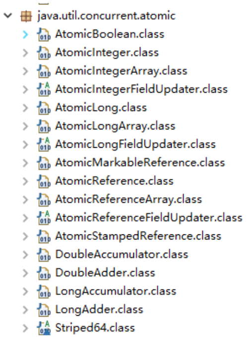

<!--ts-->
   * [1. Java](#1-java)
      * [1.1 java基础](#11-java基础)
         * [1.1.1 面向对象](#111-面向对象)
            * [1.1.1.1 什么是面向对象？@@@](#1111-什么是面向对象)
            * [1.1.1.2 平台无关性](#1112-平台无关性)
            * [1.1.1.3 值传递](#1113-值传递)
            * [1.1.1.4 重载（Overloading）和重写（Overriding）@@@](#1114-重载overloading和重写overriding)
            * [1.1.1.5 组合和继承 @@@](#1115-组合和继承-)
            * [1.1.1.6成员变量和方法的作用域](#1116成员变量和方法的作用域)
            * [1.1.1.7 抽象类和接口](#1117-抽象类和接口)
            * [1.1.1.8 内部类](#1118-内部类)
         * [1.1.2 基础知识](#112-基础知识)
            * [1.1.2.1 基本数据类型](#1121-基本数据类型)
            * [1.1.2.2 自动拆装箱 @@@](#1122-自动拆装箱-)
            * [1.1.2.3 String相关 @@@@@](#1123-string相关-)
            * [1.1.2.4 java关键字](#1124-java关键字)
               * [1.1.2.4.1 transient](#11241-transient)
               * [1.1.2.4.2 staic @@@@@](#11242-staic-)
               * [1.1.2.4.3 final @@@@@](#11243-final-)
               * [1.1.2.4.4 length vs length()](#11244-length-vs-length)
               * [1.1.2.4.5 Comparable vs Comparator](#11245-comparable-vs-comparator)
               * [1.1.2.4.6 ktve](#11246-ktve)
               * [1.1.2.4.7 equals和hashcode的协同工作 @@@@](#11247-equals和hashcode的协同工作-)
               * [1.1.2.4.8 迭代和递归](#11248-迭代和递归)
               * [1.1.2.4.9 swith](#11249-swith)
               * [1.1.2.4.10 java中的深拷贝和浅拷贝](#112410-java中的深拷贝和浅拷贝)
         * [1.1.3 集合](#113-集合)
            * [1.1.3.1 常用集合类的使用](#1131-常用集合类的使用)
            * [1.1.3.2 ArrayList和LinkedList和Vector的区别 @@@@@](#1132-arraylist和linkedlist和vector的区别-)
            * [1.1.3.3 SynchronizedList和Vector的区别 @@@@@](#1133-synchronizedlist和vector的区别-)
            * [1.1.3.4 ArrayList是怎么实现序列化和反序列化的](#1134-arraylist是怎么实现序列化和反序列化的)
            * [1.1.3.5 Array.asList 特性](#1135-arrayaslist-特性)
            * [1.1.3.6 fail-fast vs fail-safe @@@@@](#1136-fail-fast-vs-fail-safe-)
            * [1.1.3.7 ConcurrentSkipList](#1137-concurrentskiplist)
            * [1.1.3.8 set vs list](#1138-set-vs-list)
            * [1.1.3.9 set如何保证元素不重复 @@@@@](#1139-set如何保证元素不重复-)
            * [1.1.3.10 Collection和Collections区别](#11310-collection和collections区别)
         * [1.1.4 枚举](#114-枚举)
         * [1.1.5 IO](#115-io)
            * [1.1.5.2 I/O模型 @@@@@](#1151-io模型-)
            * [1.1.5.2 BIO NIO AIO区别 @@@@@](#1152-bio-nio-aio区别-)
         * [1.1.6 反射](#116-反射)
         * [1.1.7 序列化](#117-序列化)
      * [为什么序列化](#为什么序列化)
         * [1.1.8 注解](#118-注解)
         * [1.1.9 泛型](#119-泛型)
         * [1.1.10 异常](#1110-异常)
         * [1.1.11 语法糖](#1111-语法糖)
      * [1.2 并发编程 @@@@@](#12-并发编程-)
         * [1.2.1 并发与并行](#121-并发与并行)
         * [1.2.2 线程](#122-线程)
            * [1.2.2.1 线程的实现](#1221-线程的实现)
            * [1.2.2.2 线程和进程的区别](#1222-线程和进程的区别)
            * [1.2.2.3 线程的状态](#1223-线程的状态)
            * [1.2.2.4 线程优先级](#1224-线程优先级)
            * [1.2.2.5 线程调度](#1225-线程调度)
            * [1.2.2.6 创建线程的多种方式](#1226-创建线程的多种方式)
            * [1.1.2.7 守护线程](#1127-守护线程)
            * [1.1.2.8 ThreadLocal](#1128-threadlocal)
            * [1.1.2.9 线程池](#1129-线程池)
            * [1.1.2.10 锁](#11210-锁)
            * [1.1.2.11 synchronized](#11211-synchronized)
            * [1.1.2.12 volatile](#11212-volatile)
            * [1.1.2.13 写代码来解决生产者消费者问题](#11213-写代码来解决生产者消费者问题)
            * [1.1.2.14 并发包](#11214-并发包)
      * [1.3 jvm @@@@@](#13-jvm-)
         * [1.3.1 jvm内存结构 @@@@@](#131-jvm内存结构-)
         * [1.3.2 Java内存模型 @@@@@](#132-java内存模型-)
         * [1.3.3 Java对象模型@@@@](#133-java对象模型)
         * [1.3.4 Java的垃圾回收机制 @@@@](#134-java的垃圾回收机制-)
         * [1.3.5 HotSpot虚拟机 @](#135-hotspot虚拟机-)
         * [1.3.6 类加载机制 @@@@@](#136-类加载机制-)
         * [1.3.7 常用Java命令 @@@](#137-常用java命令-)
         * [1.3.8 编译与反编译 @@](#138-编译与反编译-)
      * [1.4 Java EE](#14-java-ee)
         * [1.4.1 Servlet](#141-servlet)
         * [1.4.2 Cookie和Session有什么区别？](#142-cookie和session有什么区别)
         * [1.4.3 过滤器](#143-过滤器)
         * [1.4.4. Spring](#144-spring)
            * [1.4.4.1 Spring Bean 的作用域](#1441-spring-bean-的作用域)
            * [1.4.4.2 Spring 事务中的隔离级别](#1442-spring-事务中的隔离级别)
         * [1.4.5 Mybatis](#145-mybatis)
         * [1.4.6 redis](#146-redis)
            * [1.4.6.1 为什么要用 redis](#1461-为什么要用-redis)
            * [1.4.6.2 为什么要用 redis 而不用 map/guava 做缓存?](#1462-为什么要用-redis-而不用-mapguava-做缓存)
            * [1.4.6.3 redis 和 memcached 的区别](#1463-redis-和-memcached-的区别)
            * [1.4.6.4 redis 常见数据结构以及使用场景分析](#1464-redis-常见数据结构以及使用场景分析)
            * [1.4.6.5 redis 设置过期时间](#1465-redis-设置过期时间)
            * [1.4.6.6 redis 内存淘汰机制。](#1466-redis-内存淘汰机制)
            * [1.4.6.7 redis 持久化机制](#1467-redis-持久化机制)
            * [1.4.6.8 redis 事务](#1468-redis-事务)
            * [1.4.6.9 缓存雪崩和缓存穿透问题解决方案](#1469-缓存雪崩和缓存穿透问题解决方案)
            * [1.4.6.10 如何解决 Redis 的并发竞争 Key 问题](#14610-如何解决-redis-的并发竞争-key-问题)
            * [1.4.6.11 如何保证缓存与数据库双写时的数据一致性](#14611-如何保证缓存与数据库双写时的数据一致性)
         * [1.4.7 nginx](#147-nginx)
         * [1.4.8 消息队列](#148-消息队列)
         * [1.4.9 dubbo](#149-dubbo)
      * [1.5 liteSpring相关知识](#15-litespring相关知识)
   * [2. 数据结构与算法](#2-数据结构与算法)
   * [3. mysql](#3-mysql)
      * [3.1 三大范式](#31-三大范式)
      * [3.2 索引（包括分类及优化方式，失效条件，底层结构）](#32-索引包括分类及优化方式失效条件底层结构)
         * [3.2.1 为什么要建索引](#321-为什么要建索引)
         * [3.2.2 索引的分类](#322-索引的分类)
         * [3.3.3 如何创建索引](#333-如何创建索引)
         * [3.3.4 引优化](#334-引优化)
         * [3.3.5 B 树](#335-b树)
      * [3.3 数据库的锁](#33-数据库的锁)
      * [3.4 事务的ACID](#34-事务的acid)
      * [3.5 优化（explain，慢查询，show profile）](#35-优化explain慢查询show-profile)
      * [3.6 引擎对比（InnoDB，MyISAM）](#36-引擎对比innodbmyisam)
      * [3.7 sql语法（join，union，子查询，having，group by](#37-sql语法joinunion子查询havinggroup-by)
   * [4. 计算机网络](#4-计算机网络)
      * [4.1 基础网络概念@@@@@](#41-基础网络概念)
      * [4.2 Unix网络编程 @@@@@](#42-unix网络编程-)
      * [4.3 常见协议区分](#43-常见协议区分)
   * [5. 操作系统](#5-操作系统)
      * [5.2 linux常用命令](#51-linux常用命令)
         * [5.2.1 linux文件系统](#511-linux文件系统)
         * [5.2.2 常见的命令](#512-常见的命令)
            * [5.2.2.1 目录切换命令](#5121-目录切换命令)
            * [5.2.2.2 目录的操作命令(增删改查)](#5122-目录的操作命令增删改查)
            * [5.2.2.3 文件的操作命令(增删改查)](#5123-文件的操作命令增删改查)
            * [5.2.2.4 压缩文件的操作命令](#5124-压缩文件的操作命令)
            * [5.2.2.5 grep、sed 以及 awk 命令](#5125-grepsed-以及-awk-命令)
            * [5.2.2.6 监测程序命令：ps、top](#5126-监测程序命令pstop)
      * [5.2 docker](#52-docker)
   * [6. 设计模式](#6-设计模式)
      * [五大原则](#五大原则)
      * [6.1 单例模式 @@@@@](#61-单例模式-)
      * [6.2 工厂模式](#62-工厂模式)
   * [7. 分布式算法](#7-分布式算法)
   * [8. 密码学算法](#8-密码学算法)
   * [9. 其他](#9-其他)
      * [9.1 智能合约形式化定义](#91-智能合约形式化定义)
      * [9.2 版权保护](#92-版权保护)
      * [9.3 跨链](#93-跨链)
      * [9.4 国密改造](#94-国密改造)
      * [9.5 KLedger-Auto](#95-kledger-auto)

<!-- Added by: anapodoton, at: Sun Mar 15 23:04:17 CST 2020 -->

<!--te-->

# 1. Java

## 1.1 java基础

### 1.1.1 面向对象

#### 1.1.1.1 什么是面向对象？@@@

- 什么是面向过程：把问题分解成一个一个步骤，每个步骤都是函数或者表达式，这样的编程思想就是面向过程。
- 什么是面向对象:对象是属性和行为的集合体。把问题分解成一个一个步骤，每个步骤都是对象及对象的行为调用，这样的编程思想就是面向对象。
- 二者区别：面向过程以过程为中心，关注问题的解决过程顺序，而面向对象以对象为中心，将问题分解并抽象成多个对象，关注对象及对象之间的关系。
- 三大基本特征：
  - [封装](https://gitee.com/haojunsheng/JavaLearning/blob/master/Java-basic/object-oriented/object-oriented-detail.md#21-%E5%B0%81%E8%A3%85)：所谓封装，也就是把客观事物封装成抽象的类，并且类可以把自己的数据和方法只让可信的类或者对象操作，对不可信的进行信息隐藏。封装是面向对象的特征之一，是对象和类概念的主要特性。简单的说，一个类就是一个封装了数据以及操作这些数据的代码的逻辑实体。在一个对象内部，某些代码或某些数据可以是私有的，不能被外界访问。通过这种方式，对象对内部数据提供了不同级别的保护，以防止程序中无关的部分意外的改变或错误的使用了对象的私有部分。
  - [继承](https://gitee.com/haojunsheng/JavaLearning/blob/master/Java-basic/object-oriented/object-oriented-detail.md#22-%E7%BB%A7%E6%89%BF):继承是指这样一种能力：它可以使用现有类的所有功能，并在无需重新编写原来的类的情况下对这些功能进行扩展。通过继承创建的新类称为“子类”或“派生类”，被继承的类称为“基类”、“父类”或“超类”。继承的过程，就是从一般到特殊的过程。要实现继承，可以通过“继承”（Inheritance）和“组合”（Composition）来实现。继承概念的实现方式有二类：实现继承与接口继承。实现继承是指直接使用基类的属性和方法而无需额外编码的能力；接口继承是指仅使用属性和方法的名称、但是子类必须提供实现的能力；
  - [多态](https://gitee.com/haojunsheng/JavaLearning/blob/master/Java-basic/object-oriented/object-oriented-detail.md#23-%E5%A4%9A%E6%80%81):所谓多态就是指一个类实例的相同方法在不同情形有不同表现形式。多态机制使具有不同内部结构的对象可以共享相同的外部接口。这意味着，虽然针对不同对象的具体操作不同，但通过一个公共的类，它们（那些操作）可以通过相同的方式予以调用。最常见的多态就是将子类传入父类参数中，运行时调用父类方法时通过传入的子类决定具体的内部结构或行为。
- [五大原则](https://gitee.com/haojunsheng/JavaLearning/blob/master/Java-basic/object-oriented/object-oriented-detail.md#3-%E4%BA%94%E5%A4%A7%E5%9F%BA%E6%9C%AC%E5%8E%9F%E5%88%99):
  - S：单一职责原则:一个类，最好只做一件事，只有一个引起它的变化。
  - O：开放封闭原则:软件实体应该是可扩展的，而不可修改的。也就是，对扩展开放，对修改封闭的。
  - L：里氏替换原则:子类必须能够替换其基类。
  - I：接口隔离原则：
  - D：依赖倒置原则

#### 1.1.1.2 平台无关性

[平台无关性](https://gitee.com/haojunsheng/JavaLearning/blob/master/Java-basic/object-oriented/what-is-platform-independent.md)

平台无关性就是一种语言在计算机上的运行不受平台的约束，一次编译，到处执行（Write Once ,Run Anywhere）。主要是jvm的原因。

#### 1.1.1.3 值传递

Java中只有[值传递](https://gitee.com/haojunsheng/JavaLearning/blob/master/Java-basic/object-oriented/java-only-value-pass.md)。

- 形参和实参：前者是用于接收实参内容的参数，后者是真正传递的内容。
- 值传递和引用传递的区别在于：**传递后会不会影响实参的值**，前者会创建副本，后者不会创建副本。

#### 1.1.1.4 重载（Overloading）和重写（Overriding）@@@

[重载与重写](https://gitee.com/haojunsheng/JavaLearning/blob/master/Java-basic/Java-keyword/deep-analyze-override-overloading.md)

- 重载：签名不一样，编译期。
- 重写：子类重写父类，签名一样，运行期。

函数的返回值不同不可以构成重载。

#### 1.1.1.5 组合和继承 @@@

[组合和继承](https://gitee.com/haojunsheng/JavaLearning/blob/master/Java-basic/object-oriented/combination-vs-inheritance.md)

- 组合是has-a，继承是is-a
- 多用组合，少用继承。
- 只有需要从新类向基类进行向上转型的时候，才使用继承。

| 组 合 关 系                                                  | 继 承 关 系                                                  |
| ------------------------------------------------------------ | ------------------------------------------------------------ |
| 优点：不破坏封装，整体类与局部类之间松耦合，彼此相对独立     | 缺点：破坏封装，子类与父类之间紧密耦合，子类依赖于父类的实现，子类缺乏独立性 |
| 优点：具有较好的可扩展性                                     | 缺点：支持扩展，但是往往以增加系统结构的复杂度为代价         |
| 优点：支持动态组合。在运行时，整体对象可以选择不同类型的局部对象 | 缺点：不支持动态继承。在运行时，子类无法选择不同的父类       |
| 优点：整体类可以对局部类进行包装，封装局部类的接口，提供新的接口 | 缺点：子类不能改变父类的接口                                 |
| 缺点：整体类不能自动获得和局部类同样的接口                   | 优点：子类能自动继承父类的接口                               |
| 缺点：创建整体类的对象时，需要创建所有局部类的对象           | 优点：创建子类的对象时，无须创建父类的对象                   |

#### 1.1.1.6成员变量和方法的作用域

[参考](https://gitee.com/haojunsheng/JavaLearning/blob/master/Java-basic/object-oriented/object-oriented-detail.md#4-%E5%9B%9B%E7%A7%8D%E8%AE%BF%E9%97%AE%E7%BA%A7%E5%88%AB)

- public :表明该成员变量或者方法是对所有类或者对象都是可见的,所有类或者对象都可以直接访问
- protected:表明成员变量或者方法对类自身,与同在一个包中的其他类可见,其他包下的类不可访问,除非是他的子类
- default:表明该成员变量或者方法只有自己和其位于同一个包的内可见,其他包内的类不能访问,即便是它的子类。
- private:表明该成员变量或者方法是私有的,只有当前类对其具有访问权限,除此之外其他类或者对象都没有访问权限.子类也没有访问权限.

值得注意的是，外部类的作用域只有public和default。因为如果是private，那么别的类就无法对其进行实例化，毫无意义。对于protected，**类B继承类A的前提又是类B可以访问到类A**。继承的核心是继承属性和方法，在说一句，只有可以访问到，才有继承。所以类的修饰符只有public和default。

#### 1.1.1.7 抽象类和接口

[抽象类和接口](https://gitee.com/haojunsheng/JavaLearning/blob/master/Java-basic/object-oriented/abstract-class-vs-interface.md)

- 抽象类：对类整个整体抽象。
- 接口：对行为进行抽象。


如何选择：

1. 如果要创建不带任何方法定义和成员变量的基类，那么就应该选择接口而不是抽象类。
2. 如果知道某个类应该是基类，那么第一个选择的应该是让它成为一个接口，只有在必须要有方法定义和成员变量的时候，才应该选择抽象类。因为抽象类中允许存在一个或多个被具体实现的方法，只要方法没有被全部实现该类就仍是抽象类。

#### 1.1.1.8 内部类

[内部类](https://gitee.com/haojunsheng/JavaLearning/blob/master/Java-basic/object-oriented/inner-class.md)

- 每个内部类都能独立地继承一个（接口的）实现，所以无论外围类是否已经继承了某个（接口的）实现，对于内部类都没有影响，**解决多重继承问题**。
- 内部类可以用多个实例，每个实例都有自己的状态信息，并且与其他外围对象的信息相互独立。
- 在单个外围类中，可以让多个内部类以不同的方式实现同一个接口，或者继承同一个类。
- 创建内部类对象的时刻并不依赖于外围类对象的创建。
- 内部类并没有令人迷惑的“is-a”关系，他就是一个独立的实体。
- 内部类提供了更好的封装，除了该外围类，其他类都不能访问。

### 1.1.2 基础知识

#### 1.1.2.1 基本数据类型

[7种基本类型](https://gitee.com/haojunsheng/JavaLearning/blob/master/Java-basic/Java-basic-data-type.md)

- byte：8位有符号的以二进制补码表示的整数
- short：16 位有符号的以二进制补码表示的整数
- int：32位有符号的以二进制补码表示的整数
- long：64 位有符号的以二进制补码表示的整数
- float：单精度、32位、符合IEEE 754标准的浮点数
- double：双精度、64 位、符合IEEE 754标准的浮点数
- char：单个16位Unicode字符
- boolean：true|false

**区别：占用字节和表示方式的不同。**

#### 1.1.2.2 自动拆装箱 @@@

[自动拆箱与装箱](https://gitee.com/haojunsheng/JavaLearning/blob/master/Java-basic/java-auto-unbox.md)

- WHY:为什么需要自动拆装箱。
  - 因为需要在基本数据类型和包装类之类进行转换。为了减少开发人员的工作。
- WHAT:什么是自动拆装箱。
- 就是将包装类自动转换成对应的基本数据类型。
- HOW:自动拆装箱是如何实现的。
  - 自动装箱：`***.valueOf()`
- 自动拆箱：xxxValue()
- WHEN:什么时候会用到自动拆装箱
- WHERE:什么地方可能会自动进行自动拆装箱，如三目运算符
  - 基本数据类型放到集合类
  - 包装类型和基本类型的大小比较
  - 包装类型的运算
  - 三目运算符的使用
  - 函数参数与返回值
- OTHER:自动拆装箱可能会带来那些问题？
  - Interger的缓存问题：**缓存支持-128到127之间的自动装箱过程**
  - 包装对象的数值比较，不能简单的使用`==`，虽然-128到127之间的数字可以，但是这个范围之外还是需要使用`equals`比较。
  - 由于自动拆箱，如果包装类对象为null，那么自动拆箱时就有可能抛出NPE。
  - 如果一个增强for循环中有大量拆装箱操作，会浪费很多资源。

#### 1.1.2.3 String相关 @@@@@

[String详细学习](https://gitee.com/haojunsheng/JavaLearning/blob/master/Java-basic/String-detail.md)

- [字符串的不可变性](https://gitee.com/haojunsheng/JavaLearning/blob/master/Java-basic/String-detail.md#41-%E5%AE%9A%E4%B9%89%E4%B8%80%E4%B8%AA%E5%AD%97%E7%AC%A6%E4%B8%B2)（String是用final数组实现的）

- [JDK 6和JDK 7中substring的原理及区别](https://gitee.com/haojunsheng/JavaLearning/blob/master/Java-basic/String-detail.md#71-substring-%E7%9A%84%E4%BD%9C%E7%94%A8)

  - jdk6仍然指向原字符串，会造成内存泄露的问题
  - jdk7会创建一个新的字符串

- [replaceFirst、replaceAll、replace区别](https://gitee.com/haojunsheng/JavaLearning/blob/master/Java-basic/String-detail.md#155-replacefirstreplaceallreplace%E5%8C%BA%E5%88%AB)

- [String对“+”的重载](https://gitee.com/haojunsheng/JavaLearning/blob/master/Java-basic/String-detail.md#158-string%E5%AF%B9%E7%9A%84%E9%87%8D%E8%BD%BD)、字符串拼接的几种方式和区别

  - +是唯一重载的运算符。使用了StringBuilder以及他的append、toString两个方法。
  - "a"+"b"是在编译期完成的，s1+"b"和s1+s2是在运行期完成的。
  - [字符串拼接方式](https://gitee.com/haojunsheng/JavaLearning/blob/master/Java-basic/String-detail.md#115-%E5%AD%97%E7%AC%A6%E4%B8%B2%E6%8B%BC%E6%8E%A5%E6%96%B9%E5%BC%8F)
    - +：StringBuilder的append()方法，生成新对象
    - concat()：数字拷贝，生成新对象
    - append()方法：使用原来的对象

- [String.valueOf和Integer.toString的区别](https://gitee.com/haojunsheng/JavaLearning/blob/master/Java-basic/String-detail.md#159-stringvalueof%E5%92%8Cintegertostring%E7%9A%84%E5%8C%BA%E5%88%AB)

  - `String.valueOf(i)`也是调用`Integer.toString(i)`来实现的

- 字符串池、常量池（运行时常量池、Class常量池）、intern

  - class常量池是编译期生成的，"a"+"b"这种会在编译期直接优化为"ab"，但是s1+s2在运行期才知道
  - 运行时常量池:class常量池在运行期的应，不同的jdk位置也不同
  - 字符串常量池：1.6之后，只存储字面量的引用
  - intern：使用intern后直接指向字面量所在的位置

- [String、StringBuffer、StringBuilder区别](https://gitee.com/haojunsheng/JavaLearning/blob/master/Java-basic/String-detail.md#114-%E6%AD%A3%E7%A1%AE%E4%BD%BF%E7%94%A8stringstringbufferstringbuilder)

  - |                | String       | StringBuffer | StringBuilder |
    | -------------- | ------------ | ------------ | ------------- |
    | 可变           | 否,final数组 | 是           | 是            |
    | 线程安全       | 否           | 是           | 否            |
    | 修改创建新对象 | 是           | 否           | 否            |

- [switch对String的支持](https://gitee.com/haojunsheng/JavaLearning/blob/master/Java-basic/String-detail.md#103-switch%E5%AF%B9%E5%AD%97%E7%AC%A6%E4%B8%B2%E6%94%AF%E6%8C%81%E7%9A%84%E5%AE%9E%E7%8E%B0)

#### 1.1.2.4 java关键字

##### 1.1.2.4.1 transient

[transient](https://gitee.com/haojunsheng/JavaLearning/blob/master/Java-basic/Java-keyword/transient-keyword.md)

禁止某个变量序列化。

1）一旦变量被transient修饰，变量将不再是对象持久化的一部分，该变量内容在序列化后无法获得访问。

2）transient关键字只能修饰变量，而不能修饰方法和类。注意，本地变量是不能被transient关键字修饰的。变量如果是用户自定义类变量，则该类需要实现Serializable接口。

3）被transient关键字修饰的变量不再能被序列化，一个静态变量不管是否被transient修饰，均不能被序列化。

**序列化的本质是序列化对象，而不是类相关的信息。**  

##### 1.1.2.4.2 staic @@@@@

[static](https://gitee.com/haojunsheng/JavaLearning/blob/master/Java-basic/Java-keyword/static-detail.md)

- static变量
  - 静态变量是随着类加载时被完成初始化的，它在内存中仅有一个，且JVM也只会为它分配一次内存，同时类所有的实例都共享静态变量，可以直接通过类名来访问它。
  - 实例变量则不同，它是伴随着实例的，每创建一个实例就会产生一个实例变量，它与该实例同生共死。
- static方法
  - 通过类名对其进行直接调用
- static代码块
  - 被static修饰的代码块，我们称之为静态代码块，**静态代码块会随着类的加载一块执行**，而且他可以随意放，可以存在于该了的任何地方。
- 执行顺序
  - 静态代码块 > 构造代码块(指的是{}括起来的代码块) > 构造函数

##### 1.1.2.4.3 final @@@@@

[final](https://gitee.com/haojunsheng/JavaLearning/blob/master/Java-basic/Java-keyword/final-detail.md)

不想被改变的原因有两个：**效率、设计**。

- final常量
  - **编译期常量**，永远不可改变。只能使用基本类型，而且必须要在定义时进行初始化。
  - **运行期初始化时，我们希望它不会被改变**。希望它可以根据对象的不同而表现不同，但同时又不希望它被改变，这个时候我们就可以使用运行期常量。对于运行期常量，它既可是基本数据类型，也可是引用数据类型。**基本数据类型不可变的是其内容，而引用数据类型不可变的是其引用，引用所指定的对象内容是可变的。**
- final方法
  - 所有被final标注的方法都是不能被继承、更改的
  - 方法锁定，以防止任何子类来对它的修改
- final类
  - 该类是最终类，它不希望也不允许其他来继承它
- final参数
  - 代表了该参数是不可改变的(指向不变，但指向的内容本身可以变化)
- final & static
  - 同时使用时即可修饰成员变量，该变量一旦赋值就不能改变，我们称它为“全局常量”。可以通过类名直接访问。
  - 可修饰成员方法。是不可继承和改变。可以通过类名直接访问。  
  - **final强调的是不可改变的量**
  - **static强调的生命周期**

##### 1.1.2.4.4 length vs length()

 [length vs length()](https://gitee.com/haojunsheng/JavaLearning/blob/master/Java-basic/Java-keyword/deep-analyze-java-length-length().md)

- 数组有length属性，数组的长度可以作为`final`实例变量的长度。因此，长度可以被视为一个数组的属性。
- String有length()方法。String背后的数据结构是一个char数组,所以没有必要来定义一个不必要的属性。

##### 1.1.2.4.5 Comparable vs Comparator

[Comparable vs Comparator](https://gitee.com/haojunsheng/JavaLearning/blob/master/Java-basic/Java-keyword/Java-Comparable-Comparator.md)


##### 1.1.2.4.6 ktve

[ktve](https://gitee.com/haojunsheng/JavaLearning/blob/master/Java-basic/Java-keyword/Java-K-T-V-E.md)

E – Element (在集合中使用，因为集合中存放的是元素)

T – Type（Java 类）

K – Key（键）

V – Value（值）

N – Number（数值类型）

？ – 表示不确定的java类型（无限制通配符类型）

S、U、V – 2nd、3rd、4th types

Object – 是所有类的根类，任何类的对象都可以设置给该Object引用变量，使用的时候可能需要类型强制转换，但是用使用了泛型T、E等这些标识符后，在实际用之前类型就已经确定了，不需要再进行类型强制转换。

##### 1.1.2.4.7 equals和hashcode的协同工作 @@@@

[equals和hashcode的协同工作](https://gitee.com/haojunsheng/JavaLearning/blob/master/Java-basic/object-oriented/Java-equals-hashcode.md)

1、如果两个对象相等，那么他们一定有相同的哈希值（hash code）。

2、如果两个对象的哈希值相等，那么这两个对象有可能相等也有可能不相等。（需要再通过equals来判断）

**==是对象比较，equals是内容比较。**

##### 1.1.2.4.8 迭代和递归

[迭代和递归](https://gitee.com/haojunsheng/JavaLearning/blob/master/Java-basic/Java-keyword/Java-iteration-recursion.md)

##### 1.1.2.4.9 swith

[switch](https://gitee.com/haojunsheng/JavaLearning/blob/master/Java-basic/Java-keyword/Java-Switch.md)：**其实swich只支持一种数据类型，那就是整型，其他数据类型都是转换成整型之后在使用switch的。**

- 整型：直接比较整数的值
- 字符：比较ASCII码
- 字符串：equals和hashcode

##### 1.1.2.4.10 java中的深拷贝和浅拷贝

一个拷贝引用，另外一个重新分配空间。

### 1.1.3 集合

#### 1.1.3.1 常用集合类的使用

[集合类概览](https://gitee.com/haojunsheng/JavaLearning/blob/master/Java-basic/Java-collection/collection-family.md)

- 数组：数组是**将数字和对象联系起来**，它**保存明确的对象**。（固定大小）

- Collection：保存单一的元素（可扩容）
  - list:有序可重复的Collection，注意，**有序指的是放入顺序，而不是大小顺序**。

    |            | [ArrayList](https://gitee.com/haojunsheng/JavaLearning/blob/master/Java-basic/Java-collection/list-detail.md#1-arraylist) | [LinkedList](https://gitee.com/haojunsheng/JavaLearning/blob/master/Java-basic/Java-collection/list-detail.md#2-linkedlist) | [Vector](https://gitee.com/haojunsheng/JavaLearning/blob/master/Java-basic/Java-collection/list-detail.md#3-vector) | [Stack](https://gitee.com/haojunsheng/JavaLearning/blob/master/Java-basic/Java-collection/list-detail.md#stack) |
    | ---------- | ------------------------------------------------------------ | ------------------------------------------------------------ | ------------------------------------------------------------ | ------------------------------------------------------------ |
    | 实现方式   | 数组                                                         | 链表                                                         | 数组                                                         | 继承自Vector,实现一个后进先出的堆栈                          |
    | 线程安全   | 否                                                           | 否                                                           | 是                                                           | 是                                                           |
    | 默认容量   | 10                                                           |                                                              |                                                              |                                                              |
    | 扩容       | [1.5倍](https://gitee.com/haojunsheng/JavaLearning/blob/master/Java-basic/Java-collection/list-detail.md#126-%E6%89%A9%E5%AE%B9) |                                                              | 2倍                                                          |                                                              |
    | 特性       |                                                              | size，表示大小；first,last；Node定义双向链表。               |                                                              |                                                              |
    | 适用       | 查找                                                         | 插入，删除                                                   |                                                              |                                                              |
    | 时间复杂度 | O(n),O(n),O(1)                                               |                                                              |                                                              |                                                              |
  | 加载因子   | 0.5                                                          | 1                                                            |                                                              |                                                              |
  
- set无序不可重复

  |          | HashSet | TreeSet |
  | -------- | ------- | ------- |
  | 初始容量 | 16      |         |
  | 加载因子 | 0.75    |         |
  | 扩容     | 2倍     |         |

  HashSet基于HashMap。

  1. HashSet怎么保证添加元素不重复？

     HashSet内部使用HashMap的key存储元素，以此来保证元素不重复；

  2. HashSet是有序的吗？

     HashSet是无序的，因为HashMap的key是无序的；

  3. HashSet是否允许null元素？

     HashSet中允许有一个null元素，因为HashMap允许key为null；

  4. HashSet是非线程安全的；

  5. HashSet是没有get()方法的；

  6. LinkedHashSet的底层使用LinkedHashMap存储元素。

  7. LinkedHashSet是有序的吗？怎么个有序法？

     LinkedHashSet是有序的，它是按照插入的顺序排序的。

  8. TreeSet底层使用NavigableMap存储元素；

  9. TreeSet是有序的；

  10. TreeSet是非线程安全的；

  11. TreeSet实现了NavigableSet接口，而NavigableSet继承自SortedSet接口；

  12. TreeSet实现了SortedSet接口；

  - queue

  

- [map](https://gitee.com/haojunsheng/JavaLearning/blob/master/Java-basic/Java-collection/map-detail.md)：保存相关联的值键对  

  |            | HashMap                                                      | HashTable              | LinkedHashMap | ConcurrentHashMap    | TreeMap |
  | ---------- | ------------------------------------------------------------ | ---------------------- | ------------- | -------------------- | ------- |
  | null       | 键和值都可以为null                                           | 键和值都不允许为null   |               | 键和值都不允许为null |         |
  | 线程安全   | 否                                                           | 是                     |               | 是                   |         |
  | 插入顺序   | 否(插入的时候算hash)                                         |                        | 插入有序      |                      |         |
  | 加锁粒度   |                                                              | 方法                   |               | 代码块               |         |
  | 继承关系   | AbstractMap                                                  | Dictionary             |               |                      |         |
  | 容量和扩容 | 初始16，扩容*2                                               | 初始11，扩容old*2+1    |               |                      |         |
  | hash值     | [重新计算](https://gitee.com/haojunsheng/JavaLearning/blob/master/Java-basic/Java-collection/map-detail.md#43-hashmap%E4%B8%AD%E7%9A%84hash%E7%AE%97%E6%B3%95%E5%AE%9E%E7%8E%B0) | 直接使用对象的hashCode |               |                      |         |
  | 遍历方式   | Iterator                                                     | Enumeration，Iterator  |               |                      |         |
| 加载因子   | 0.75                                                         |                        |               |                      |         |
  

（1）HashMap是一种散列表，采用（数组(也称为桶) + 链表 + 红黑树）的存储结构；

（2）HashMap的默认初始容量为16（1<<4），默认装载因子为0.75f，容量总是2的n次方；取余(%)操作中如果除数是2的幂次则等价于与其 除数减一的与(&)操作(也就是说 hash%length==hash&(length-1)的前提是 length 是2的 n 次方;

（3）HashMap扩容时每次容量变为原来的两倍；

（4）当桶的数量小于64时不会进行树化，只会扩容；

（5）当桶的数量大于64且单个桶中元素的数量大于8时，进行树化；

（6）当单个桶中元素数量小于6时，进行反树化；

（7）HashMap是非线程安全的容器；

（8）HashMap数组的查询效率为O(1)，链表的查询效率是O(k)，红黑树的查询效率是O(log k)

**HashMap的核心概念**：

- size 和 capacity:
  - Size记录了Map中KV对的个数,数组的长度(实际的长度)
  - capacity:最多装的元素
- loadFactor和
  - loadFactor：用来衡量HashMap满的程度，loadFactor的默认值为0.75f
    - 0.75有一个好处，那就是**0.75正好是3/4，而capacity又是2的幂。所以，两个数的乘积都是整数**。
  - threshold：临界值，当实际KV个数超过threshold时，HashMap会将容量扩容，threshold＝容量*加载因子。

**HashMap的初始化问题：**

**HashMap中的hash算法实现**

- hash ：该方法主要是将Object转换成一个整型。
- indexFor ：该方法主要是将hash生成的整型转换成链表数组中的下标。

**hashCode(确定对象是属于哪个桶的)和equals(桶中的各个对象之前区分)方法的作用，二者有什么关系?**

- 如果两个对象相等，那么他们一定有相同的哈希值（hash code）。
- 如果两个对象的哈希值相等，那么这两个对象有可能相等也有可能不相等。


二叉查找树(BST):

1.**左**子树上所有结点的值均**小于或等于**它的根结点的值。

2.**右**子树上所有结点的值均**大于或等于**它的根结点的值。

3.左、右子树也分别为二叉查找树。

但是可能出现左右子树失衡的情况，有人提出了AVL树，有人提出了红黑树。

平衡二叉树必须具备如下特性：**它是一棵空树或它的左右两个子树的高度差的绝对值不超过1，并且左右两个子树都是一棵平衡二叉树。也就是说该二叉树的任何一个等等子节点，其左右子树的高度都相近。**

AVL树的特点是，由于非常平衡，在插入和删除的时候，需要不断的调整树结构，很麻烦，所以引入了红黑树。

红黑树()：

1.节点是红色或黑色。

2.根节点是黑色。

3.每个叶子节点都是黑色的空节点（NIL节点）。

4 每个红色节点的两个子节点都是黑色。(从每个叶子到根的所有路径上不能有两个连续的红色节点)

5.从任一节点到其每个叶子的所有路径都包含相同数目的黑色节点。

推论：**红黑树从根节点到叶子的最长路径不会超过最短路径的2倍**。

添加或者删除节点的时候，可能会出现不满足红黑树性质的情况，这个时候我们需要进行调整，调整的方法有**变色和旋转**。变色分为红变黑和黑变红。

**本质上我们是使用红色和黑色来追踪树的高度，左旋的本质是增加左树的高度，右旋的本质是增加右树的高度。**

[HashMap的实现](https://gitee.com/haojunsheng/JavaLearning/blob/master/Java-basic/Java-collection/map-detail.md#43-hashmap%E4%B8%AD%E7%9A%84hash%E7%AE%97%E6%B3%95%E5%AE%9E%E7%8E%B0)；

  [红黑树具有哪些特性](https://gitee.com/haojunsheng/JavaLearning/blob/master/Java-basic/Java-collection/map-detail.md#32-%E7%BA%A2%E9%BB%91%E6%A0%91%E6%80%BB%E7%BB%93)

#### 1.1.3.2 ArrayList和LinkedList和Vector的区别 @@@@@

[具体详情](https://gitee.com/haojunsheng/JavaLearning/blob/master/Java-basic/Java-collection/list-detail.md#41-arraylist-vs-linkedlist-vs-vector)

|          | [ArrayList](https://gitee.com/haojunsheng/JavaLearning/blob/master/Java-basic/Java-collection/list-detail.md#1-arraylist) | [LinkedList](https://gitee.com/haojunsheng/JavaLearning/blob/master/Java-basic/Java-collection/list-detail.md#2-linkedlist) | [Vector](https://gitee.com/haojunsheng/JavaLearning/blob/master/Java-basic/Java-collection/list-detail.md#3-vector) | [Stack](https://gitee.com/haojunsheng/JavaLearning/blob/master/Java-basic/Java-collection/list-detail.md#stack) |
| -------- | ------------------------------------------------------------ | ------------------------------------------------------------ | ------------------------------------------------------------ | ------------------------------------------------------------ |
| 实现方式 | 数组                                                         | 链表                                                         | 数组                                                         | 继承自Vector,实现一个后进先出的堆栈                          |
| 线程安全 | 否                                                           | 否                                                           | 是                                                           | 是                                                           |
| 默认容量 | 10                                                           |                                                              |                                                              |                                                              |
| 扩容     | 1.5倍                                                        |                                                              | 2倍                                                          |                                                              |
| 特性     |                                                              | size，表示大小；first,last；Node定义双向链表。               |                                                              |                                                              |
| 适用     | 查找                                                         | 插入，删除                                                   |                                                              |                                                              |

#### 1.1.3.3 SynchronizedList和Vector的区别 @@@@@

|                | SynchronizedList                 | Vector    |
| -------------- | -------------------------------- | --------- |
| 包             | java.util.Collections            | java.util |
| 线程安全       | 是                               | 是        |
| 扩容机制       | 1.5倍                            | 2倍       |
| 同步方式       | 同步代码块                       | 同步方法  |
| 扩展性和兼容性 | 将所有list的子类转成线程安全的类 |           |
| 遍历           | 需要手动同步                     |           |
| 锁定对象       | 可以指定锁定的对象(构造函数传入) | this对象  |

####  1.1.3.4 ArrayList是怎么实现序列化和反序列化的

把elementData定义为transient，然后重写writeObject和readObject方法，优势在于**自己根据size序列化真实的元素，而不是根据数组的长度序列化元素，减少了空间占用。**

#### 1.1.3.5 Array.asList 特性

问：通过Array.asList获得的List有何特点，使用时应该注意什么？ 解：1. asList 得到的只是一个 Arrays 的内部类，一个原来数组的视图 List，因此如果对它进行增删操作会报错 2. 用 ArrayList 的构造器可以将其转变成真正的 ArrayList。

#### 1.1.3.6 fail-fast vs fail-safe @@@@@

[快速失败 vs 安全失败](https://gitee.com/haojunsheng/JavaLearning/blob/master/Java-basic/Java-collection/list-detail.md#44-fail-fast-vs-fail-safe)

我们都接触 HashMap、ArrayList 这些集合类，这些在 **java.util 包的集合类就都是快速失败**的；而  **java.util.concurrent 包下的类都是安全失败**，比如：ConcurrentHashMap。

集合中的快速失败：当多个线程对部分集合进行结构上的改变的操作时，有可能会产生fail-fast机制，这个时候就会抛出ConcurrentModificationException（后文用CME代替）。

**之所以会抛出CMException异常，是因为我们的代码中使用了增强for循环，而在增强for循环中，集合遍历是通过iterator进行的，但是元素的add/remove却是直接使用的集合类自己的方法。这就导致iterator在遍历的时候（会比较expectedModCount和modCount），会发现有一个元素在自己不知不觉的情况下就被删除/添加了，就会抛出一个异常，用来提示用户，可能发生了并发修改！**

遍历删除List中的元素有很多种方法，当运用不当的时候就会产生问题。下面主要看看以下几种遍历删除List中元素的形式：

1.通过增强的for循环删除符合条件的多个元素(CME)

2.通过增强的for循环删除符合条件的一个元素(正常)

3.通过普通的for删除删除符合条件的多个元素(无异常，但结果可能错误)

4.通过Iterator进行遍历删除符合条件的多个元素(使用Iterator的remove方法正常，使用集合的remove则CME异常)

**安全失败：**

fail-safe集合的所有对集合的修改都是先拷贝一份副本，然后在副本集合上进行的，并不是直接对原集合进行修改。并且这些修改方法，如add/remove都是通过加锁来控制并发的。

所以，CopyOnWriteArrayList中的迭代器在迭代的过程中不需要做fail-fast的并发检测。（因为fail-fast的主要目的就是识别并发，然后通过异常的方式通知用户）

迭代器遍历的是开始遍历那一刻拿到的集合拷贝，在遍历期间原集合发生的修改迭代器是不知道的。

CopyOnWriteArrayList是怎么保证并发安全的？

Copy-On-Write简称COW，是一种用于程序设计中的优化策略。**其基本思路是，从一开始大家都在共享同一个内容，当某个人想要修改这个内容的时候，才会真正把内容Copy出去形成一个新的内容然后再改，这是一种延时懒惰策略。**

CopyOnWrite vs Vector

**所以CopyOnWrite容器是一种读写分离的思想，读和写不同的容器。**而Vector在读写的时候使用同一个容器，读写互斥，同时只能做一件事儿。

总结：

- CopyOnWriteArrayList是怎么保证并发安全的？
  - CopyOnWriteArrayList使用ReentrantLock重入锁加锁，保证线程安全；
- CopyOnWriteArrayList适用于什么样的场景？
  - CopyOnWriteArrayList的写操作都要先拷贝一份新数组，在新数组中做修改，修改完了再用新数组替换老数组，所以空间复杂度是O(n)，性能比较低下；
- CopyOnWriteArrayList的读操作支持随机访问，时间复杂度为O(1)；
- CopyOnWriteArrayList的实现采用了什么思想？
  - CopyOnWriteArrayList采用读写分离的思想，读操作不加锁，写操作加锁，且写操作占用较大内存空间，所以适用于读多写少的场合；
- CopyOnWriteArrayList是不是强一致性的？
  - CopyOnWriteArrayList只保证最终一致性，不保证实时一致性；
- *为什么CopyOnWriteArrayList没有size属性？*
  - 因为每次修改都是拷贝一份正好可以存储目标个数元素的数组，所以不需要size属性了，数组的长度就是集合的大小，而不像ArrayList数组的长度实际是要大于集合的大小的。比如，add(E e)操作，先拷贝一份n+1个元素的数组，再把新元素放到新数组的最后一位，这时新数组的长度为len+1了，也就是集合的size了。

#### 1.1.3.7 ConcurrentSkipList

[ConcurrentSkipList](https://gitee.com/haojunsheng/JavaLearning/blob/master/Java-basic/Java-collection/map-detail.md#48-concurrenthashmap)

为什么Redis选择使用跳表而不是红黑树来实现有序集合

#### 1.1.3.8 set vs list

List,Set都是继承自Collection接口。都是用来存储一组相同类型的元素的。

List特点：元素有放入顺序，元素可重复 。 有顺序，即先放入的元素排在前面。

Set特点：元素无放入顺序，元素不可重复。 无顺序，即先放入的元素不一定排在前面。 不可重复，即相同元素在set中只会保留一份。所以，有些场景下，set可以用来去重。 不过需要注意的是，set在元素插入时是要有一定的方法来判断元素是否重复的。这个方法很重要，决定了set中可以保存哪些元素。

|      | List | Set  |
| ---- | ---- | ---- |
| 顺序 | 有   | 无   |
| 重复 | 可以 | 不可 |

#### 1.1.3.9 set如何保证元素不重复 @@@@@

[Set如何保证元素不重复?](https://gitee.com/hollischuang/toBeTopJavaer/blob/master/basics/java-basic/set-repetition.md)

在Java的Set体系中，根据实现方式不同主要分为两大类。HashSet和TreeSet。

1、TreeSet 是二叉树实现的,Treeset中的数据是自动排好序的，不允许放入null值 

2、HashSet 是哈希表实现的,HashSet中的数据是无序的，可以放入null，但只能放入一个null，两者中的值都不能重复，就如数据库中唯一约束

在HashSet中，基本的操作都是有HashMap底层实现的，因为HashSet底层是用HashMap存储数据的。当向HashSet中添加元素的时候，首先计算元素的hashcode值，然后通过扰动计算和按位与的方式计算出这个元素的存储位置，如果这个位置位空，就将元素添加进去；如果不为空，则用equals方法比较元素是否相等，相等就不添加，否则找一个空位添加。

TreeSet的底层是TreeMap的keySet()，而TreeMap是基于红黑树实现的，红黑树是一种平衡二叉查找树，它能保证任何一个节点的左右子树的高度差不会超过较矮的那棵的一倍。

TreeMap是按key排序的，元素在插入TreeSet时compareTo()方法要被调用，所以TreeSet中的元素要实现Comparable接口。TreeSet作为一种Set，它不允许出现重复元素。TreeSet是用compareTo()来判断重复元素的。


#### 1.1.3.10 Collection和Collections区别


### 1.1.4 枚举

[枚举的定义：](https://gitee.com/haojunsheng/JavaLearning/blob/master/Java-basic/enum-detail.md#12-%E5%AE%9A%E4%B9%89)

[枚举的用法](https://gitee.com/haojunsheng/JavaLearning/blob/master/Java-basic/enum-detail.md#16-%E7%94%A8%E6%B3%95)

[Java枚举如何比较](https://gitee.com/haojunsheng/JavaLearning/blob/master/Java-basic/enum-detail.md#3-%E6%9E%9A%E4%B8%BE%E7%B1%BB%E7%9A%84%E6%AF%94%E8%BE%83)

java 枚举值比较用 == 和 equals 方法没啥区别，两个随便用都是一样的效果。

因为枚举 Enum 类的 equals 方法默认实现就是通过 == 来比较的；

类似的 Enum 的 compareTo 方法比较的是 Enum 的 ordinal 顺序大小；

类似的还有 Enum 的 name 方法和 toString 方法一样都返回的是 Enum 的 name 值。

[switch对枚举的支持](https://gitee.com/haojunsheng/JavaLearning/blob/master/Java-basic/enum-detail.md#4-switch%E5%AF%B9%E6%9E%9A%E4%B8%BE%E7%9A%84%E6%94%AF%E6%8C%81)

Java 1.7 之前 switch 参数可用类型为 short、byte、int、char，枚举类型之所以能使用其实是编译器层面实现的，编译器会将枚举 switch 转换为类似 switch(s.ordinal()) { case Status.START.ordinal() } 形式，所以实质还是 int 参数类型，感兴趣的可以自己写个使用枚举的 switch 代码然后通过 javap -v 去看下字节码就明白了。

[枚举的序列化如何实现？为什么枚举实现的单例不存在可能序列化破坏的问题。](https://gitee.com/haojunsheng/JavaLearning/blob/master/Java-basic/enum-detail.md#5-%E6%9E%9A%E4%B8%BE%E5%BA%8F%E5%88%97%E5%8C%96%E7%9A%84%E5%AE%9E%E7%8E%B0)

[枚举的线程安全性问题](https://gitee.com/haojunsheng/JavaLearning/blob/master/Java-basic/enum-detail.md#6-%E6%9E%9A%E4%B8%BE%E5%A6%82%E4%BD%95%E4%BF%9D%E8%AF%81%E7%BA%BF%E7%A8%8B%E5%AE%89%E5%85%A8)

[请使用枚举实现一个单例。 为什么枚举实现的单例比较受推崇？有哪些好处？](https://gitee.com/haojunsheng/JavaLearning/blob/master/Java-basic/enum-detail.md#7-%E6%9E%9A%E4%B8%BE%E5%92%8C%E5%8D%95%E4%BE%8B)

[Java 枚举类可以继承其他类（或实现其他接口）或者被其他类继承吗，为什么？](https://gitee.com/haojunsheng/JavaLearning/blob/master/Java-basic/enum-detail.md#2-%E6%9E%9A%E4%B8%BE%E7%9A%84%E5%AE%9E%E7%8E%B0)

### 1.1.5 IO 

[什么是比特？什么是字节？什么是字符？它们长度是多少？各有什么区别？](https://gitee.com/haojunsheng/JavaLearning/blob/master/Java-basic/Java-io-detail.md#1-%E4%BB%80%E4%B9%88%E6%98%AF-io)


[什么是流？Java IO中包含哪几种流，之间的关系是怎样的？字节流和字符流的区别? 什么是输入流和输出流，如何区分？字节流和字符流之间如何相互转换。](https://gitee.com/haojunsheng/JavaLearning/blob/master/Java-basic/Java-io-detail.md#2-%E7%AE%80%E5%8D%95%E7%90%86%E8%A7%A3java-%E6%B5%81stream)


#### 1.1.5.2 I/O模型 @@@@@

[同步、异步、阻塞、非阻塞、Linux 5种IO模型](https://gitee.com/haojunsheng/JavaLearning/blob/master/Java-basic/Java-io-detail.md#7-%E4%BA%94%E7%A7%8Dio%E6%A8%A1%E5%9E%8B)

[同步、异步](https://github.com/hollischuang/toBeTopJavaer/blob/master/basics/java-basic/synchronized-vs-asynchronization.md)，是描述被调用方的。

阻塞，非阻塞，是描述调用方的。

同步不一定阻塞，异步也不一定非阻塞。没有必然关系。


I/O工作模型，一个输入操作通常包括两个不同的阶段：

(1) 等待数据准备好；

(2) 从内核向进程复制数据。

- 阻塞式I/O模型：两个阶段都阻塞
- **非阻塞式I/O模型**
- I/O复用模型(select/poll)：都阻塞，但是不阻塞在IO上。
  - select：该函数允许进程指示内核等待多个事件中的任何一个发生，并只在有一个或多个事件发生或经历一段指定的时间后才唤醒它。**当select函数返回后，可以通过遍历fdset，来找到就绪的描述符。**
  - poll:pollfd结构包含了要监视的event和发生的event，不再使用select“参数-值”传递的方式。和select函数一样，poll返回后，需要轮询pollfd来获取就绪的描述符。
  - epoll：不需要轮询获取就绪的描述符。通过回调模式
  - 在 select/poll中，进程只有在调用一定的方法后，内核才对所有监视的文件描述符进行扫描，而**epoll事先通过epoll_ctl()来注册一 个文件描述符，一旦基于某个文件描述符就绪时，内核会采用类似callback的回调机制，迅速激活这个文件描述符，当进程调用epoll_wait() 时便得到通知**。(`此处去掉了遍历文件描述符，而是通过监听回调的的机制`。这正是epoll的魅力所在。)
- **信号驱动式I/O模型(sigio)**
- 异步I/O模型

#### 1.1.5.2 BIO NIO AIO区别 @@@@@

[BIO、NIO和AIO的区别、三种IO的用法与原理](https://gitee.com/haojunsheng/JavaLearning/blob/master/Java-basic/Java-io-detail.md#6-bio-vs-nio-vs-aio)

- BIO(Blocking I/O):同步阻塞I/O模式,数据的读取写入必须阻塞在一个线程内等待其完成。
- NIO （New I/O）：同时支持阻塞与非阻塞模式。
- AIO （ Asynchronous I/O）：异步非阻塞I/O模型。**异步非阻塞与同步非阻塞的区别在哪里？异步非阻塞无需一个线程去轮询所有IO操作的状态改变，在相应的状态改变后，系统会通知对应的线程来处理。**

### 1.1.6 反射

[反射与工厂模式](https://gitee.com/haojunsheng/JavaLearning/blob/master/Java-basic/java-reflect-dynamic-proxy.md#%E5%8F%8D%E5%B0%84%E4%B8%8E%E5%B7%A5%E5%8E%82%E6%A8%A1%E5%BC%8F)


**反射有什么作用**：

在运行时判断任意一个对象所属的类。

在运行时判断任意一个类所具有的成员变量和方法。

在运行时任意调用一个对象的方法。

在运行时构造任意一个类的对象。


Class类

java.lang.reflect.*

动态代理

静态代理、动态代理

动态代理和反射的关系

- 动态代理的几种实现方式
  - JDK动态代理:定义接口，实现兄弟类
  - Cglib动态代理：实现子类

AOP

### 1.1.7 序列化

[序列化](https://gitee.com/haojunsheng/JavaLearning/blob/master/Java-basic/Java-serialize.md)

- 什么是序列化与反序列化？
  - **序列化 (Serialization)是将对象的状态信息转换为可以存储或传输的形式的过程。**

- 为什么序列化
  - 
- 序列化底层原理
  - writeObject和readObject方法
- 序列化与单例模式
- protobuf
- 为什么说序列化并不安全

### 1.1.8 注解

[注解](https://gitee.com/haojunsheng/JavaLearning/blob/master/Java-basic/java-annotation-detail.md)

元注解、自定义注解、Java中常用注解使用、注解与反射的结合

[如何自定义一个注解？](https://gitee.com/hollischuang/toBeTopJavaer/blob/master/basics/java-basic/create-annotation.md)

[Spring常用注解](https://gitee.com/hollischuang/toBeTopJavaer/blob/master/basics/java-basic/annotation-in-spring.md)

### 1.1.9 泛型

[泛型](https://gitee.com/haojunsheng/JavaLearning/blob/master/Java-basic/java-generics.md)

泛型与继承、类型擦除、[泛型中K T V E ？ object等的含义](https://gitee.com/hollischuang/toBeTopJavaer/blob/master/basics/java-basic/k-t-v-e.md)、泛型各种用法

限定通配符和非限定通配符、上下界限定符extends 和 super

### 1.1.10 异常

[异常](https://gitee.com/haojunsheng/JavaLearning/blob/master/Java-basic/java-execption-learning.md)

异常类型、正确处理异常、自定义异常

Error和Exception

异常链、try-with-resources

finally和return的执行顺序

### 1.1.11 语法糖

[Java中语法糖原理、解语法糖](https://gitee.com/hollischuang/toBeTopJavaer/blob/master/basics/java-basic/syntactic-sugar.md)

[语法糖：switch 支持 String 与枚举、泛型、自动装箱与拆箱、方法变长参数、枚举、内部类、条件编译、 断言、数值字面量、for-each、try-with-resource、Lambda表达式](https://gitee.com/hollischuang/toBeTopJavaer/blob/master/basics/java-basic/syntactic-sugar.md)

## 1.2 并发编程 @@@@@

这个玩意和java的内存模型是息息相关的，二者可以结合着看。

### 1.2.1 并发与并行

什么是并发

什么是并行

并发与并行的区别

[并发与并行](https://gitee.com/haojunsheng/JavaLearning/blob/master/Java-basic/Java-concurrent-programming/1-what-is-thread-safe.md)

并行是指有2个及以上CPU。

### 1.2.2 线程

#### 1.2.2.1 线程的实现

[线程的实现](https://gitee.com/haojunsheng/JavaLearning/blob/master/Java-basic/Java-concurrent-programming/2-deep-learning-thread.md#2-%E7%BA%BF%E7%A8%8B%E7%9A%84%E5%AE%9E%E7%8E%B0)

- 内核线程
  - 特点：内核完成线程的切换，1:1
  - 优点：
  - 缺点
    - 系统调用的代价相对较高，需要在用户态（User Mode）和内核态（Kernel Mode）中来回切换。
    - 要消耗一定的内核资源（如内核线程的栈空间),因此一个系统支持轻量级进程的数量是有限的。
- 用户线程实现
  - 特点：用户线程的建立、同步、销毁和调度完全在用户态中完成。1:N
  - 优点：操作可以是非常快速且低消耗的，也可以支持规模更大的线程数量。
  - 缺点：用户完成进程的切换，调度很困难.进程可能完全被阻塞
- 使用用户线程加轻量级进程混合实现（GO里面叫做协程）
  - 特点：N:M
  - 优点：**用户线程还是完全建立在用户空间中，因此用户线程的创建、切换、析构等操作依然廉价，并且可以支持大规模的用户线程并发。**线程调度功能及处理器映射，系统调用通过内核线程来完成。

#### 1.2.2.2 线程和进程的区别

[线程与进程的区别](https://gitee.com/haojunsheng/JavaLearning/blob/master/Java-basic/Java-concurrent-programming/1-what-is-thread-safe.md#3-%E5%A4%9A%E7%BA%BF%E7%A8%8B)  

- **进程是资源分配的基本单元，线程是执行的基本单元，同一个进程的多个线程之间共享资源。**

- 进程间通信

  - 管道：父子进程通信
  - 共享内存：
  - 消息队列：容量和系统有关
  - 信号量：用来同步
  - socket：不同机器之间

#### 1.2.2.3 线程的状态

[线程的状态](https://gitee.com/haojunsheng/JavaLearning/blob/master/Java-basic/Java-concurrent-programming/2-deep-learning-thread.md#3-%E7%BA%BF%E7%A8%8B%E7%9A%84%E7%8A%B6%E6%80%81)

- 新建，就绪(需要时间片)，运行，阻塞(需要资源)，等待(需要其他线程通知)，终止
- sleep 和 wait
- wait 和 notify
- notify 和 notifyAll

#### 1.2.2.4 线程优先级

[优先级](https://gitee.com/haojunsheng/JavaLearning/blob/master/Java-basic/Java-concurrent-programming/2-deep-learning-thread.md#5-%E7%BA%BF%E7%A8%8B%E4%BC%98%E5%85%88%E7%BA%A7)

- 最小是1，最大是10，正常是5

#### 1.2.2.5 线程调度

[线程调度](https://gitee.com/haojunsheng/JavaLearning/blob/master/Java-basic/Java-concurrent-programming/2-deep-learning-thread.md#4-%E7%BA%BF%E7%A8%8B%E7%9A%84%E8%B0%83%E5%BA%A6) 

- 一个线程想要从就绪状态变成运行中状态，这个过程需要系统调度，即给线程分配CPU的使用权，获得CPU使用权的线程才会从就绪状态变成运行状态。给多个线程按照特定的机制分配CPU的使用权的过程就叫做线程调度。
- 协同式调度(自己工作完了,把CPU交给其他的线程)
- 抢占式调度(java默认模型)
- 线程调度的时候保存的上下文是什么？
  - TCB

#### 1.2.2.6 创建线程的多种方式

[创建线程的多种方式](https://gitee.com/haojunsheng/JavaLearning/blob/master/Java-basic/Java-concurrent-programming/3-java-thread-create-four-way.md)

- 继承Thread类创建线程

  ```java
  SubClassThread subClassThread = new SubClassThread();
  subClassThread.start(); 
  class SubClassThread extends Thread {
      @Override
      public void run() {
          System.out.println(getName());
      }
  }
  ```

- 实现Runnable接口创建线程
  - 二者之间的区别是，一旦java是单继承的，所以最好使用Runnable
  
  - 二者共同的缺点是：**在执行完任务之后无法获取执行结果**。
  
  - ```java
    RunnableThread runnableThread = new RunnableThread();
    new Thread(runnableThread).start();
    class RunnableThread implements Runnable {
    
        @Override
        public void run() {
            System.out.println(Thread.currentThread().getName());
        }
    }
    ```
  
- 通过Callable和FutureTask创建线程,可以在执行完任务之后无法获取执行结果。

  ```java
  	CallableThread callableThread = new CallableThread();
    FutureTask futureTask = new FutureTask<>(callableThread);
    new Thread(futureTask).start();
    System.out.println(futureTask.get());
  class CallableThread implements Callable {
      @Override
      public Object call() throws Exception {
          System.out.println(Thread.currentThread().getName());
          return "Hollis";
      }
  }
  ```

- 通过线程池创建线程，**线程池本质是一个hashset。多余的任务会放在阻塞队列中。**

  ```java
  ExecutorService executorService = new ThreadPoolExecutor(1, 1, 60L, TimeUnit.SECONDS,
              new ArrayBlockingQueue<Runnable>(10));
          executorService.execute(new Runnable() {
              @Override
              public void run() {
                  System.out.println(Thread.currentThread().getName());
              }
          });
  ```

#### 1.1.2.7 守护线程

[守护线程](https://gitee.com/haojunsheng/JavaLearning/blob/master/Java-basic/Java-concurrent-programming/2-deep-learning-thread.md#6-%E5%AE%88%E6%8A%A4%E7%BA%BF%E7%A8%8B)

- 常见的是GC线程
- 通过setDaemon()可以设置守护线程
- 只有守护线程的情况下，jvm将退出

#### 1.1.2.8 ThreadLocal

[ThreadLocal](https://gitee.com/haojunsheng/JavaLearning/blob/master/Java-basic/Java-concurrent-programming/2-deep-learning-thread.md#7-threadlocal)

- **通过为每一个线程创建一份共享变量的副本**来保证各个线程之间的变量的访问和修改互相不影响；
- **ThreadLocal 适用于每个线程需要自己独立的实例且该实例需要在多个方法中被使用，也即变量在线程间隔离而在方法或类间共享的场景。**
- 每个线程持有一个 Map 并维护了 ThreadLocal 对象与具体实例的映射，该 Map 由于只被持有它的线程访问，故不存在线程安全以及锁的问题。

#### 1.1.2.9 线程池

[线程池](https://gitee.com/haojunsheng/JavaLearning/blob/master/Java-basic/Java-concurrent-programming/4-java-thread-pool.md)

- 池化技术：提前保存大量的资源。线程池提供了一种限制和管理资源(包括执行一个任务)。 每个线程池还维护一些基本统计信息，例如已完成任务的数量。
  - 线程池、连接池、内存池、对象池等。
  - 降低资源消耗。 通过重复利用已创建的线程降低线程创建和销毁造成的消耗。
  - 提高响应速度。 当任务到达时，任务可以不需要的等到线程创建就能立即执行。
  - 提高线程的可管理性。 线程是稀缺资源，如果无限制的创建，不仅会消耗系统资源，还会降低系统的稳定性， 使用线程池可以进行统一的分配，调优和监控。
- 线程池原理：预先创建好多个线程，放在池中，这样可以在需要使用线程的时候直接获取，避免多次重复创建、销毁带来的开销。线程池本质是一个hashSet。多余的任务会放在阻塞队列中,只有当阻塞队列满了后，才会触发非核心线程的创建。所以非核心线程只是临时过来打杂的。直到空闲了，然后自己关闭了。线程池提供了两个钩子（beforeExecute，afterExecute）给我们，我们继承线程池，在执行任务前后做一些事情。线程池原理关键技术：锁（lock,cas）、阻塞队列、hashSet（资源池）
  - ThreadPoolExecutor
    - corePoolSize: 核心线程数量，可以类比正式员工数量，常驻线程数量。
    - maximumPoolSize: 最大的线程数量，公司最多雇佣员工数量。常驻+临时线程数量。
    - workQueue：多余任务等待队列，再多的人都处理不过来了，需要等着，在这个地方等。
    - keepAliveTime：非核心线程空闲时间，就是外包人员等了多久，如果还没有活干，解雇了。
    - threadFactory: 创建线程的工厂，在这个地方可以统一处理创建的线程的属性。每个公司对员工的要求不一样，恩，在这里设置员工的属性。
    - handler：线程池拒绝策略，什么意思呢？就是当任务实在是太多，人也不够，需求池也排满了，还有任务咋办？默认是不处理，抛出异常告诉任务提交者，我这忙不过来了。
    - 
- 实现Runnable接口和Callable接口的区别

如果想让线程池执行任务的话需要实现的Runnable接口或Callable接口。 Runnable接口或Callable接口实现类都可 以被ThreadPoolExecutor或ScheduledThreadPoolExecutor执行。两者的区别在于 Runnable 接口不会返回结果但 是 Callable 接口可以返回结果。

备注: 工具类 Executors 可以实现 Runnable 对象和 Callable 对象之间的相互转换。 (Executors.callable(Runnable task)或Executors.callable(Runnable task，Object resule))。

- 自己设计线程池
- submit() 和execute()区别

1) 方法用于提交不需要返回值的任务，所以无法判断任务是否被线程池执行成功与否;

2)submit()方法用于提交需要返回值的任务。线程池会返回一个future类型的对象，通过这个future对象可以判断 任务是否执行成功，并且可以通过future的get()方法来获取返回值，get()方法会阻塞当前线程直到任务完成，而使用get(long timeout，TimeUnit unit)方法则会阻塞当前线程一段时间后立即返回，这时候有可能任务没有执行 完。

- 如何创建线程池

《阿里巴巴Java开发手册》中强制线程池不允许使用 Executors 去创建，而是通过 ThreadPoolExecutor 的方式，这样的处理方式让写的同学更加明确线程池的运行规则，规避资源耗尽的风险

Executors 返回线程池对象的弊端如下:

- FixedThreadPool 和 SingleThreadExecutor : 允许请求的队列长度为 Integer.MAX_VALUE,可能堆积 大量的请求，从而导致OOM。
- CachedThreadPool 和 ScheduledThreadPool : 允许创建的线程数量为 Integer.MAX_VALUE ，可能 会创建大量线程，从而导致OOM。

方式一:通过构造方法实现


方式二:通过Executor 框架的工具类Executors来实现 我们可以创建三种类型的ThreadPoolExecutor:

- FixedThreadPool : 该方法返回一个固定线程数量的线程池。该线程池中的线程数量始终不变。当有一个新的 任务提交时，线程池中若有空闲线程，则立即执行。若没有，则新的任务会被暂存在一个任务队列中，待有线 程空闲时，便处理在任务队列中的任务。
- SingleThreadExecutor: 方法返回一个只有一个线程的线程池。若多余一个任务被提交到该线程池，任务会 被保存在一个任务队列中，待线程空闲，按先入先出的顺序执行队列中的任务。
- CachedThreadPool: 该方法返回一个可根据实际情况调整线程数量的线程池。线程池的线程数量不确定，但 若有空闲线程可以复用，则会优先使用可复用的线程。若所有线程均在工作，又有新的任务提交，则会创建新 的线程处理任务。所有线程在当前任务执行完毕后，将返回线程池进行复用。

对应Executors工具类中的方法如图所示:


#### 1.1.2.10 锁

[锁](https://gitee.com/haojunsheng/JavaLearning/blob/master/Java-basic/Java-concurrent-programming/lock.md)

- [数据库相关锁机制](https://gitee.com/haojunsheng/JavaLearning/blob/master/Java-basic/Java-concurrent-programming/lock.md#11-%E6%95%B0%E6%8D%AE%E5%BA%93%E7%9A%84%E9%94%81%E6%9C%BA%E5%88%B6)

- 

- [乐观锁与悲观锁](https://gitee.com/haojunsheng/JavaLearning/blob/master/Java-basic/Java-concurrent-programming/lock.md#1-%E4%B9%90%E8%A7%82%E9%94%81-vs-%E6%82%B2%E8%A7%82%E9%94%81)：线程要不要锁住同步资源
  
  - 悲观锁是一定使用了锁机制的（适合写操作多），乐观锁则并未真正加锁(适合读操作多)。实现方式有版本号和CAS
  - [CAS](https://gitee.com/haojunsheng/JavaLearning/blob/master/Java-basic/Java-concurrent-programming/lock.md#3-%E4%B9%90%E8%A7%82%E9%94%81%E7%9A%84%E4%B8%80%E7%A7%8D%E5%AE%9E%E7%8E%B0%E6%96%B9%E5%BC%8Fcas)
    - **Compare and Swap**(`CAS`)
    - 存在ABA问题，循环时间长开销大，只能保证一个共享变量的原子操作
  
- [阻塞锁vs非阻塞锁](https://gitee.com/haojunsheng/JavaLearning/blob/master/Java-basic/Java-concurrent-programming/lock.md#2-%E8%87%AA%E6%97%8B%E9%94%81-vs-%E9%80%82%E5%BA%94%E6%80%A7%E8%87%AA%E6%97%8B%E9%94%81)：锁住同步资源失败，线程要不要阻塞

  - 到底要不要放弃处理器的执行时间。阻塞锁是放弃了CPU时间，进入了等待区，等待被唤醒。而自旋锁是一直“自旋”在那里，时刻的检查共享资源是否可以被访问。

- [无锁vs偏向锁vs轻量级锁vs重量级锁](https://gitee.com/haojunsheng/JavaLearning/blob/master/Java-basic/Java-concurrent-programming/lock.md#3-%E6%97%A0%E9%94%81-vs-%E5%81%8F%E5%90%91%E9%94%81-vs-%E8%BD%BB%E9%87%8F%E7%BA%A7%E9%94%81-vs-%E9%87%8D%E9%87%8F%E7%BA%A7%E9%94%81)：对性能影响的大小,多个线程竞争同步资源的细节
  
  - 无锁:没有对资源进行锁定，所有的线程都能访问并修改同一个资源，但同时只有一个线程能修改成功。
  
  - 偏向锁：一段同步代码一直被一个线程所访问，那么该线程会自动获取锁，降低获取锁的代价。
  
  - 轻量级锁：当锁是偏向锁的时候，被另外的线程所访问，偏向锁就会升级为轻量级锁，其他线程会通过自旋的形式尝试获取锁，不会阻塞，从而提高性能。
  
  - 重量级锁：使用`Monitor`进行加锁，这是一种互斥锁，称做重量级锁
  
  - | 锁状态   | 存储内容                                                | 存储内容 |
    | :------- | :------------------------------------------------------ | :------- |
    | 无锁     | 对象的hashCode、对象分代年龄、是否是偏向锁（0）         | 01       |
    | 偏向锁   | 偏向线程ID、偏向时间戳、对象分代年龄、是否是偏向锁（1） | 01       |
    | 轻量级锁 | 指向栈中锁记录的指针                                    | 00       |
    | 重量级锁 | 指向互斥量（重量级锁）的指针                            | 10       |
  
- [可重入锁 vs 非可重入锁：](https://gitee.com/haojunsheng/JavaLearning/blob/master/Java-basic/Java-concurrent-programming/lock.md#5-%E5%8F%AF%E9%87%8D%E5%85%A5%E9%94%81-vs-%E9%9D%9E%E5%8F%AF%E9%87%8D%E5%85%A5%E9%94%81)
  
  - 可重入锁又名递归锁，是指在同一个线程在外层方法获取锁的时候，再进入该线程的内层方法会自动获取锁
  
- 锁消除：即无锁。

- 锁粗化：锁变大。

- [monitor](https://gitee.com/haojunsheng/JavaLearning/blob/master/jvmLearning/deep-understand-multi-thread.md#4-moniter%E7%9A%84%E5%AE%9E%E7%8E%B0%E5%8E%9F%E7%90%86)

- [死锁？](https://gitee.com/haojunsheng/JavaLearning/blob/master/Java-basic/Java-concurrent-programming/lock.md#6-java%E7%BA%A7%E5%88%AB%E7%9A%84%E6%AD%BB%E9%94%81)
  
  - 死锁如何排查
    - **Jstack命令**
    - **JConsole工具**
  - 死锁的原因：资源竞争
    - 互斥条件：进程要求对所分配的资源进行排它性控制，即在一段时间内某资源仅为一进程所占用。
    - 请求和保持条件：当进程因请求资源而阻塞时，对已获得的资源保持不放。
    - 不剥夺条件：进程已获得的资源在未使用完之前，不能剥夺，只能在使用完时由自己释放。
    - 环路等待条件：在发生死锁时，必然存在一个进程--资源的环形链。
  - 死锁的解决办法
    - 确定的顺序获取锁
    - 
  
- 分布式锁（补充）

  - 数据库
  - redis
  - zookeeper

#### 1.1.2.11 synchronized

- [synchronized是如何实现的？](https://gitee.com/haojunsheng/JavaLearning/blob/master/jvmLearning/Java-memory-model.md#71-synchronized)

synchronized关键字解决的是多个线程之间访问资源的同步性，synchronized关键字可以保证被它修饰的方法或者 代码块在任意时刻只能有一个线程执行。

另外，在 Java 早期版本中，synchronized属于重量级锁，效率低下，因为监视器锁(monitor)是依赖于底层的操 作系统的 Mutex Lock 来实现的，Java 的线程是映射到操作系统的原生线程之上的。如果要挂起或者唤醒一个线程， 都需要操作系统帮忙完成，而操作系统实现线程之间的切换时需要从用户态转换到内核态，这个状态之间的转换需要 相对比较长的时间，时间成本相对较高，这也是为什么早期的 synchronized 效率低的原因。庆幸的是在 Java 6 之后 Java 官方对从 JVM 层面对synchronized 较大优化，所以现在的 synchronized 锁效率也优化得很不错了。JDK1.6对 锁的实现引入了大量的优化，如自旋锁、适应性自旋锁、锁消除、锁粗化、偏向锁、轻量级锁等技术来减少锁操作的 开销。


synchronized关键字最主要的三种使用方式:

- 修饰实例方法，作用于当前对象实例加锁，进入同步代码前要获得当前对象实例的锁 

- 修饰静态方法，作用于当前类对象加锁，进入同步代码前要获得当前类对象的锁 。也就是给当前类加锁，会作 用于类的所有对象实例，因为静态成员不属于任何一个实例对象，是类成员( static 表明这是该类的一个静态 资源，不管new了多少个对象，只有一份，所以对该类的所有对象都加了锁)。所以如果一个线程A调用一个实 例对象的非静态 synchronized 方法，而线程B需要调用这个实例对象所属类的静态 synchronized 方法，是允 许的，不会发生互斥现象，因为访问静态 synchronized 方法占用的锁是当前类的锁，而访问非静态 synchronized 方法占用的锁是当前实例对象锁。 
- 修饰代码块，指定加锁对象，对给定对象加锁，进入同步代码库前要获得给定对象的锁。 和 synchronized 方 法一样，synchronized(this)代码块也是锁定当前对象的。synchronized 关键字加到 static 静态方法和 synchronized(class)代码块上都是是给 Class 类上锁。这里再提一下:synchronized关键字加到非 static 静态 方法上是给对象实例上锁。另外需要注意的是:尽量不要使用 synchronized(String a) 因为JVM中，字符串常量 池具有缓冲功能!


- synchronized和lock之间关系
- 不使用synchronized如何实现一个线程安全的单例
- [synchronized和原子性、可见性和有序性之间的关系](https://gitee.com/haojunsheng/JavaLearning/blob/master/jvmLearning/Java-memory-model.md#713-synchronized%E4%B8%8E%E5%8E%9F%E5%AD%90%E6%80%A7)
-  synchronized和ReenTrantLock 的区别

1 两者都是可重入锁

两者都是可重入锁。“可重入锁”概念是:自己可以再次获取自己的内部锁。比如一个线程获得了某个对象的锁，此时 这个对象锁还没有释放，当其再次想要获取这个对象的锁的时候还是可以获取的，如果不可锁重入的话，就会造成死 锁。同一个线程每次获取锁，锁的计数器都自增1，所以要等到锁的计数器下降为0时才能释放锁。

2 synchronized 依赖于 JVM 而 ReenTrantLock 依赖于 API

synchronized 是依赖于 JVM 实现的，前面我们也讲到了 虚拟机团队在 JDK1.6 为 synchronized 关键字进行了很多 优化，但是这些优化都是在虚拟机层面实现的，并没有直接暴露给我们。ReenTrantLock 是 JDK 层面实现的(也就 是 API 层面，需要 lock() 和 unlock 方法配合 try/finally 语句块来完成)，所以我们可以通过查看它的源代码，来看 它是如何实现的。

3 ReenTrantLock 比 synchronized 增加了一些高级功能

相比synchronized，ReenTrantLock增加了一些高级功能。主要来说主要有三点:1等待可中断;2可实现公平锁; 3可实现选择性通知(锁可以绑定多个条件)

ReenTrantLock提供了一种能够中断等待锁的线程的机制，通过lock.lockInterruptibly()来实现这个机制。也 就是说正在等待的线程可以选择放弃等待，改为处理其他事情。 ReenTrantLock可以指定是公平锁还是非公平锁。而synchronized只能是非公平锁。所谓的公平锁就是先等 待的线程先获得锁。 ReenTrantLock默认情况是非公平的，可以通过 ReenTrantLock类的

ReentrantLock(boolean fair)构造方法来制定是否是公平的。 synchronized关键字与wait()和notify/notifyAll()方法相结合可以实现等待/通知机制，ReentrantLock类当然也 可以实现，但是需要借助于Condition接口与newCondition() 方法。Condition是JDK1.5之后才有的，它具有很 好的灵活性，比如可以实现多路通知功能也就是在一个Lock对象中可以创建多个Condition实例(即对象监视 器)，线程对象可以注册在指定的Condition中，从而可以有选择性的进行线程通知，在调度线程上更加灵
 活。 在使用notify/notifyAll()方法进行通知时，被通知的线程是由 JVM 选择的，用ReentrantLock类结合 Condition实例可以实现“选择性通知” ，这个功能非常重要，而且是Condition接口默认提供的。而 synchronized关键字就相当于整个Lock对象中只有一个Condition实例，所有的线程都注册在它一个身上。如果 执行notifyAll()方法的话就会通知所有处于等待状态的线程这样会造成很大的效率问题，而Condition实例的 signalAll()方法 只会唤醒注册在该Condition实例中的所有等待线程。

如果你想使用上述功能，那么选择ReenTrantLock是一个不错的选择。 4 性能已不是选择标准

#### 1.1.2.12 volatile

[volatile](https://gitee.com/haojunsheng/JavaLearning/blob/master/jvmLearning/Java-memory-model.md#72-volatile)

- happens-before
- 内存屏障
- 编译器指令重排和CPU指令重排
- volatile的实现原理
- volatile和原子性、可见性和有序性之间的关系
- [有了symchronized为什么还需要volatile](https://gitee.com/haojunsheng/JavaLearning/blob/master/jvmLearning/Java-memory-model.md#727-%E6%97%A2%E7%94%9Fsynchronized%E4%BD%95%E7%94%9Fvolatile)

#### 1.1.2.13 写代码来解决生产者消费者问题

#### 1.1.2.14 并发包

- Thread、Runnable、Callable、ReentrantLock、ReentrantReadWriteLock、Atomic*、Semaphore、CountDownLatch、、ConcurrentHashMap、Executors
- locks部分：包含在java.util.concurrent.locks包中，提供显式锁(互斥锁和速写锁)相关功能；
- atomic部分：包含在java.util.concurrent.atomic包中，提供原子变量类相关的功能，是构建非阻塞算法的基础；

1. 介绍一下Atomic 原子类

Atomic 翻译成中文是原子的意思。在化学上，我们知道原子是构成一般物质的最小单位，在化学反应中是不可分割 的。在我们这里 Atomic 是指一个操作是不可中断的。即使是在多个线程一起执行的时候，一个操作一旦开始，就不 会被其他线程干扰。

所以，所谓原子类说简单点就是具有原子/原子操作特征的类。
 并发包 java.util.concurrent 的原子类都存放在 java.util.concurrent.atomic 下,如下图所示。



2. JUC 包中的原子类是哪4类?

   基本类型：使用原子的方式更新基本类型

   AtomicInteger:整形原子类 

   AtomicLong:长整型原子类

    AtomicBoolean :布尔型原子类

   数组类型：使用原子的方式更新数组里的某个元素

   - AtomicIntegerArray:整形数组原子类 
   - AtomicLongArray:长整形数组原子类 
   - AtomicReferenceArray :引用类型数组原子类

   引用类型

   - AtomicReference:引用类型原子类 
   - AtomicStampedRerence:原子更新引用类型里的字段原子类
   -  AtomicMarkableReference :原子更新带有标记位的引用类型

   对象的属性修改类型 

   - AtomicIntegerFieldUpdater:原子更新整形字段的更新器
   - AtomicLongFieldUpdater:原子更新长整形字段的更新器
   - AtomicStampedReference :原子更新带有版本号的引用类型。该类将整数值与引用关联起来，可用于解决原 子的更新数据和数据的版本号，可以解决使用 CAS 进行原子更新时可能出现的 ABA 问题。

3. 讲讲 AtomicInteger 的使用

   AtomicInteger 类常用方法

   ```
   public final int get() //获取当前的值
   public final int getAndSet(int newValue)//获取当前的值，并设置新的值
   public final int getAndIncrement()//获取当前的值，并自增
   public final int getAndDecrement() //获取当前的值，并自减
   public final int getAndAdd(int delta) //获取当前的值，并加上预期的值
   boolean compareAndSet(int expect, int update) //如果输入的数值等于预期值，则以原子方式将该值设置为输 入值(update)
   public final void lazySet(int newValue)//最终设置为newValue,使用 lazySet 设置之后可能导致其他线程 在之后的一小段时间内还是可以读到旧的值。
   ```

   AtomicInteger 类的使用示例
    使用 AtomicInteger 之后，不用对 increment() 方法加锁也可以保证线程安全。

   ```
   class AtomicIntegerTest {
           private AtomicInteger count = new AtomicInteger();
   //使用AtomicInteger之后，不需要对该方法加锁，也可以实现线程安全。 public void increment() {
   count.incrementAndGet();
   }
   public int getCount() { return count.get();
   } }
   ```

4. 能不能给我简单介绍一下 AtomicInteger 类的原理

   AtomicInteger 线程安全原理简单分析
    AtomicInteger 类的部分源码:

   ```
   // setup to use Unsafe.compareAndSwapInt for updates(更新操作时提供“比较并替换”的作用) private static final Unsafe unsafe = Unsafe.getUnsafe();
   private static final long valueOffset;
   static { try {
   valueOffset = unsafe.objectFieldOffset (AtomicInteger.class.getDeclaredField("value"));
       } catch (Exception ex) { throw new Error(ex); }
   }
   private volatile int value;
   ```

   AtomicInteger 类主要利用 CAS (compare and swap) + volatile 和 native 方法来保证原子操作，从而避免 synchronized 的高开销，执行效率大为提升。

   CAS的原理是拿期望的值和原本的一个值作比较，如果相同则更新成新的值。UnSafe 类的 objectFieldOffset() 方法 是一个本地方法，这个方法是用来拿到“原来的值”的内存地址，返回值是 valueOffset。另外 value 是一个volatile变 量，在内存中可见，因此 JVM 可以保证任何时刻任何线程总能拿到该变量的最新值。

- executor部分：散落在java.util.concurrent包中，提供线程池相关的功能；
- collections部分：散落在java.util.concurrent包中，提供并发容器相关功能；
- tools部分：散落在java.util.concurrent包中，提供同步工具类，如信号量、闭锁、栅栏等功能；

## 1.3 jvm @@@@@

### 1.3.1 jvm内存结构 @@@@@

掌握：

- [class文件格式](https://gitee.com/haojunsheng/JavaLearning/blob/master/jvmLearning/Class-strcture.md)

- 

  

这个玩意可以帮我们看懂字节码，如果有增强字节码的需求也是看这里。主要是搞明白字节码结构图。java字节码是按照一定的规则来组成的，这样jvm才可以进行解释。

- [运行时数据区：堆、栈、方法区、直接内存](https://gitee.com/haojunsheng/JavaLearning/blob/master/jvmLearning/jvm-memory-component-heap.md)

这个玩意必须得区分清楚，尤其是堆栈方法区这三个。我们的关键是整明白，为什么要分这三个区？我的理解是：

其中，在c语言的世界里，是没有方法区的概念的，是java引入的，所以大胆猜测，方法区的引入和2个因素有关系：

1. java是解释性的语言，字节码在被jvm加载后，必须要有个地方来存储。存放在堆和栈里又不合适。
2. 为了支持面向对象的特性:在面向过程中，都是函数，所以用栈和堆足够了。

所以我们把**类的信息，以及一些实例无关的信息(即编译器被确定的值)**放到了方法区。

在来看堆与栈，**栈是用来存储局部变量和计算的过程，堆用来存储实例**。

这些的区分一定是为了效率。需要考虑变量的生命周期，访问的速度，空间大小，使用过程中是否保持有序。

- [方法区和运行时常量池](https://gitee.com/haojunsheng/JavaLearning/blob/master/jvmLearning/method-area-constants-pool.md)

常量池分为**class常量池，运行时常量池，字符串常量池**。

class常量池中的字面量和符号引用（**符号引用主要是用来重定位的**）的概念很重要，需要掌握。这两个玩意都是编译原理里面的。常量是怎么存储的，也很重要，和数据类型是息息相关的。

运行时常量池里保存了符号引用，**进而解析为直接引用**。

字符串常量池则比较复杂，在不同版本的虚拟机中是不同的，最开始在方法区中，后来移入到了堆中，在后来移动到了本地内存中。

- [堆和栈区别](https://gitee.com/haojunsheng/JavaLearning/blob/master/jvmLearning/heap-vs-stack.md)

[Java中的对象一定在堆上分配吗？](https://gitee.com/hollischuang/toBeTopJavaer/blob/master/basics/jvm/stack-alloc.md)

### 1.3.2 Java内存模型 @@@@@

计算机内存模型、缓存一致性、MESI协议

可见性、原子性、顺序性、happens-before、

内存屏障、synchronized、volatile、final、锁

[java内存模型](https://gitee.com/haojunsheng/JavaLearning/blob/master/jvmLearning/Java-memory-model.md)

这个玩意需要我们好好去学，学好了这个也就入门了并发编程，这个复杂的问题，而这个问题，在面试中也是要必考的。我们需要回答：**Java内存模型是什么，为什么要有Java内存模型，Java内存模型解决了什么问题？**

由于我们抽象了计算机的硬件,在多线程的情况下,会带来**缓存一致性问题**。为了使处理器内部的运算单元能够尽量的被充分利用，处理器可能会对输入代码进行乱序执行处理。这就是**处理器优化**，会进一步带来指令重排的问题。

这三个问题对应了我们讲的**原子性，可见性和有序性**问题。这三个问题是核心的问题，我做了一系列的工作就是为了解决这三个问题。

**原子性**是指在一个操作中就是cpu不可以在中途暂停然后再调度，既不被中断操作，要不执行完成，要不就不执行。

**可见性**是指当多个线程访问同一个变量时，一个线程修改了这个变量的值，其他线程能够立即看得到修改的值。

**有序性**即程序执行的顺序按照代码的先后顺序执行。

我们对此进行对应，**缓存一致性问题**其实就是**可见性问题**，而**处理器优化**是可以导致**原子性问题**的，**指令重排**即会导致**有序性问题**。

所以我们定义了内存模型，来解决上面的问题，主要是**限制处理器优化**和**使用内存屏障**。

那么我们比较关注的是java内存模型究竟是怎么实现的？

我们可以看到的是java为我们提供了这些关键字`volatile`、`synchronized`、`final`、`concurren`来封装了java内存模型底层的实现了。

**原子性**主要依靠：两个高级的字节码指令`monitorenter`和`monitorexit`，对应java中的`synchronized`。

**可见性**是指每次修改完立即同步到主存，读取前从主存刷新，依靠`volatile`。`synchronized`和`final`两个关键字也可以实现可见性，但是方式是不同的。

**有序性**：我们使用`synchronized`和`volatile`来保证有序性，区别是`synchronized`关键字保证同一时刻只允许一条线程操作，`volatile`关键字会禁止指令重排。

我们好奇的是java的内存模型解决了缓存一致性问题，那么到底是怎么解决的呢？

在最开始，我们是通过在总线上加锁来实现的，但是导致效率低下的问题，后来我们采用缓存一致性协议来解决。

其中，最著名的协议是Intel 的MESI协议。MESI协议保证了**每个缓存中使用的共享变量的副本是一致的。**核心思想是：当CPU写数据时，如果发现操作的变量是共享变量，即在其他CPU中也存在该变量的副本，会发出信号通知其他CPU将该变量的缓存行置为无效状态，因此当其他CPU需要读取这个变量时，发现自己缓存中缓存该变量的缓存行是无效的，那么它就会从内存重新读取。

我们需要了解[synchronized](https://gitee.com/haojunsheng/JavaLearning/blob/master/jvmLearning/deep-understand-multi-thread.md#1synchronized%E7%9A%84%E5%AE%9E%E7%8E%B0%E5%8E%9F%E7%90%86)和volatile究竟是怎么实现的。

- 其中Synchronized对原子性的保证是通过（monitorenter和monitorexit）来实现的，对可见性是通过加锁来实现的(**对一个变量解锁之前，必须先把此变量同步回主存中**)，对有序性是通过（as-if-serial）语义来实现的。Synchronized能修饰变量，方法(`ACC_SYNCHRONIZED`)和代码块(monitorenter、monitorexit)。

- Volatile对可见性是通过（强制刷新内存，强制从内存读进行实现的）,对有序性是通过禁止指令重排实现的(增加了**内存屏障**)。但是不能保证原子性，因为并没有加锁。**Volatile只能修饰变量，不能修饰方法和代码块。**

### 1.3.3 Java对象模型@@@@

[对象模型](https://gitee.com/haojunsheng/JavaLearning/blob/master/jvmLearning/deep-understand-multi-thread.md#21-java的对象模型)

java的对象模型主要包含对象头，实例数据和对齐填充，主要是研究java的对象是怎么存储的。其中对象头是很重要的。

到这里，我们需要对内存结构，内存模型和对象模型做一个区分：

[内存结构vs内存模型vs对象模型](https://gitee.com/haojunsheng/JavaLearning/blob/master/jvmLearning/jvm-memoryStrcture-vs-memoryModel-vs-objectModel.md)

内存结构讲的是java内存的划分，和运行时区域有关系；

内存模型用来解决java的并发编程问题的，和原子性，有序性，可见性有关。

### 1.3.4 Java的垃圾回收机制 @@@@

GC算法：标记清除、引用计数、复制、标记压缩、分代回收、增量式回收

GC参数、对象存活的判定、垃圾收集器（CMS、G1、ZGC、Epsilon）

[垃圾回收](https://gitee.com/haojunsheng/JavaLearning/blob/master/jvmLearning/garbage-collection.md)

我们的学习思路是哪些内存需要回收？什么时候回收？如何回收？这几个问题。

- [哪些内存需要回收](https://gitee.com/haojunsheng/JavaLearning/blob/master/jvmLearning/garbage-collection.md#12-%E5%93%AA%E4%BA%9B%E5%9E%83%E5%9C%BE%E9%9C%80%E8%A6%81%E5%9B%9E%E6%94%B6)
  - 主要回收堆内存，方法区或者堆中的永久代（不同的jdk版本不同）也有可能回收。
- [什么时候回收](https://gitee.com/haojunsheng/JavaLearning/blob/master/jvmLearning/garbage-collection.md#13-%E4%BB%80%E4%B9%88%E6%97%B6%E5%80%99%E8%BF%9B%E8%A1%8C%E5%9E%83%E5%9C%BE%E5%9B%9E%E6%94%B6)：
  - 我们需要先判断一个对象有没有存活？
    - 引用计数法：当两个对象**相互引用**，但是二者已经没有作用时，按照常规，应该对其进行垃圾回收，但是其相互引用，又不符合垃圾回收的条件，因此无法完美处理这块内存清理。
    - 可达性分析算法:
  - 四种引用
    - 强引用：刚被new出来的对象所加的引用
    - 软引用：可被回收的对象
    - 弱引用：弱引用的对象就是一定需要进行垃圾回收的
    - 虚引用：
  - finalize()可以起死回生
- 如何回收
  - 堆内存分块
  - 
    - 新生代
      - 一个Eden区，两个Survivor区。
      - 当Eden区满时，还存活的对象将被复制到Survivor区(两个中的一个)，当这个Survivor区满时，此区的存活对象将被复制到另外一个Survivor区，当这个Survivor区也满了的时候，从第一个Survivor区复制过来的并且此时还存活的对象，将被复制“年老区(Tenured)”。**晋升**
    - 老年代
    - 持久代
  - 垃圾回收算法
    - 标记清除算法
      - 标记和清除的效率都不高；存在大量的空间碎片。
    - 复制算法：解决了标记-清除算法的效率问题。解决了内存碎片的问题，缺陷是可以使用的内存变成了原来的一半。
    - 标记-压缩算法：针对老年代。首先需要从根节点开始对所有可达对象做一次标记，但之后，它并不简单地清理未标记的对象，而是**将所有的存活对象压缩到内存的一端**。之后，清理边界外所有的空间。
    - 分代收集算法：根据对象的存活特性。
  - 垃圾回收器
    - Serial收集器：单线程回收，stop the world
    - ParNew：Serial收集器的多线程版本
    - Parallel Scavenge：关注吞吐量
    - Serial old：老年代串行收集器
    - Parallel old：Parallel Scavenge的老年代版本
    - Concurrent Mark Sweep:**cms**，基于标记-清除算法，主要关注于系统停顿时间。
      - 初始标记
      - 并发标记
      - 重新标记
      - 并发清除和并发重置
    - G1:Garbage First，基于标记-压缩算法
      - **初始标记，并发标记，最终标记，筛选回收。**
  - 可以阅读垃圾回收日志

### 1.3.5 HotSpot虚拟机 @

[即时编译器、编译优化](https://gitee.com/haojunsheng/JavaLearning/blob/master/jvmLearning/HotSpot.md)等相关知识。

优化对现阶段的我不是很重要。

[深入浅出 JIT 编译器](https://www.ibm.com/developerworks/cn/java/j-lo-just-in-time/index.html)

[什么是即时编译（JIT）！？OpenJDK HotSpot VM剖析](http://www.infoq.com/cn/articles/OpenJDK-HotSpot-What-the-JIT)

[深入分析Java的编译原理-HollisChuang's Blog](http://www.hollischuang.com/archives/2322)（密码：Hollis和他的朋友们）

[对象和数组并不是都在堆上分配内存的。-HollisChuang's Blog](http://www.hollischuang.com/archives/2398)

### 1.3.6 类加载机制 @@@@@

双亲委派，破坏双亲委派。

[类加载机制](https://gitee.com/haojunsheng/JavaLearning/blob/master/jvmLearning/class-loader.md)

**java类装载器**有三个，分别是BootStrap（加载java核心类），ExtClassLoader（加载扩展类），AppClassLoader（加载指定路径类）。

双亲加载模型指的不是2个父亲，而是指父类和bootstrap classloader。

加载过程，先是父类加载，加载失败，让引导器加载，都失败，自己加载。

**类加载器**简言之，就是用于把`.class`文件中的**字节码信息**转化为具体`的java.lang.Class`**对象**的过程的工具。

具体过程：

1. 在实际类加载过程中，`JVM`会将所有的`.class`字节码文件中的**二进制数据**读入内存中，导入运行时数据区的**方法区**中。
2. 当一个类首次被**主动加载**或**被动加载**时，类加载器会对此类执行类加载的流程 – **加载**、**连接**（**验证**、**准备**、**解析**）、**初始化**。
3. 如果类加载成功，**堆内存**中会产生一个新的`Class`对象，`Class`对象封装了类在**方法区**内的**数据结构**。

加载，连接（验证，准备和解析），初始化。

- 加载：查找并加载类的**二进制数据**的过程。
  - 通过类的**全限定名**定位`.class`文件，并获取其**二进制字节流**。
  - 把字节流所代表的**静态存储结构**转换为**方法区**的**运行时数据结构**。
  - 在`Java`**堆**中生成一个此类的`java.lang.Class`对象，作为方法区中这些数据的**访问入口**。
- 连接
  - 验证：保证字节流符合虚拟机的要求，并且不会危害虚拟机自身的安全。
  - 准备：为类的**静态变量**分配内存，并将其初始化为**默认值**。准备过程通常分配一个结构用来存储类信息，这个结构中包含了类中定义的**成员变量**，**方法**和**接口信息**等。
  - 解析：把类中对**常量池**内的**符号引用**转换为**直接引用**。
- 初始化
  - 对**类静态变量**赋予正确的初始值 (注意和连接时的**解析过程**区分开)。

**对象的初始化顺序**：

静态变量/静态代码块 -> 普通代码块 -> 构造函数

1. 父类**静态变量**和**静态代码块**（先声明的先执行）； 

2. 子类**静态变量**和**静态代码块**（先声明的先执行）； 
3. 父类**普通成员变量**和**普通代码块**（先声明的先执行）； 

4. 父类的**构造函数**；

5. 子类**普通成员变量**和**普通代码块**（先声明的先执行）； 

6. 子类的**构造函数**。

[Java双亲委派模型及破坏 - CSDN博客](https://blog.csdn.net/zhangcanyan/article/details/78993959)

tomcat类加载有什么不同，说加载顺序并不是双亲模型，具体顺序说一下

我们来看下为什么要破坏双亲模型？

1. 隔离性。一个web容器可能需要部署两个应用程序，不同的应用程序可能会依赖**同一个第三方类库的不同版本**，不能要求同一个类库在同一个服务器只有一份，因此要保证每个应用程序的类库都是独立的，保证相互隔离。
2. **灵活性**：Web应用之间的类加载器相互独立，那么就能针对一个Web应用进行重新部署，此时Web应用的类加载器会被重建，而且不会影响其他的Web应用。如果采用一个类加载器，类之间的依赖是杂乱复杂的，无法完全移出某个应用的类。
3. **性能**：部署在同一个Web容器上的两个Web应用程序所使用的Java类库可以互相共享。这个需求也很常见，例如，用户可能有10个使用Spring组织的应用程序部署在同一台服务器上，如果把10份Spring分别存放在各个应用程序的隔离目录中，将会是很大的资源浪费。

所以tomcat重新定义了类加载器。


**Common**：以应用类加载器为父类，是tomcat顶层的公用类加载器，其路径由conf/catalina.properties中的common.loader指定，默认指向${catalina.home}/lib下的包。

**Catalina**：以Common类加载器为父类，是用于加载Tomcat应用服务器的类加载器，其路径由server.loader指定，默认为空，此时tomcat使用Common类加载器加载应用服务器。

**Shared**：以Common类加载器为父类，是所有Web应用的父类加载器，其路径由shared.loader指定，默认为空，此时tomcat使用Common类加载器作为Web应用的父加载器。

**Web应用**：以Shared类加载器为父类，加载/WEB-INF/classes目录下的未压缩的Class和资源文件以及/WEB-INF/lib目录下的jar包，该类加载器只对当前Web应用可见，对其他Web应用均不可见。

Web应用类加载器默认的加载顺序是：

(1).先从缓存中加载；
 (2).如果没有，则从JVM的Bootstrap类加载器加载；
 (3).如果没有，则从当前类加载器加载（按照WEB-INF/classes、WEB-INF/lib的顺序）；
 (4).如果没有，则从父类加载器加载，由于父类加载器采用默认的委派模式，所以加载顺序是AppClassLoader、Common、Shared。

### 1.3.7 常用Java命令 @@@

 [常用Java命令](https://gitee.com/haojunsheng/JavaLearning/blob/master/jvmLearning/java-command.md)

javac 、javap 、jps、jstack,jinfo、jstat 、jmap 、jhat

[jps](http://www.hollischuang.com/archives/105):查看本机的Java中进程信息。

[jstack](http://www.hollischuang.com/archives/110):打印线程的栈信息,制作线程Dump。

[jmap](http://www.hollischuang.com/archives/303):打印内存映射,制作堆Dump。

[jstat](http://www.hollischuang.com/archives/481):性能监控工具。

[jhat](http://www.hollischuang.com/archives/1047):内存分析工具。

jconsole:简易的可视化控制台。

jvisualvm:功能强大的控制台。

### 1.3.8 编译与反编译 @@

[Java中的编译与反编译](https://gitee.com/haojunsheng/JavaLearning/blob/master/jvmLearning/compile-decompile.md)

什么是编译？什么是反编译？Java如何编译代码，如何反编译代码？尝试反编译switch、String的“+”、lambda表达式、java 10的本地变量推断等。

了解**javap**、**jad**和**cfr**即可。

switch对整数的支持是直接的，字符是转成ASCII码对应的整数，字符串是`equals()`和`hashCode()`来实现的。

## 1.4 Java EE

[后端编程](https://gitee.com/haojunsheng/NetworkLearning/blob/master/http-server.md)

Servlet,cookie,session,过滤器，Spring，IOC，AOP，Bean，ORM，Mybatis，Redis，Nginx。


RFC规范中定义了TCP/UDP的通信规范，像是3次握手，累积确认等，很复杂，我们于是抽象出来了socket的概念。大概是这样的：**(客户端IP, 客户端Port, 服务器端IP, 服务器端Port)**

我们来看下Http Server的演化，第一个阶段是借助socket来传输文件。但是存在的问题是阻塞的问题。我们引入了多进程编程：当accept连接以后，对于这个新的socket ， 不在主进程里处理， 而是新创建子进程来接管。 这样主进程就不会阻塞在receive 上， 可以继续接受新的连接了。

问题没有得到完美的解决，当请求数量多的时候，我们需要耗费大量的资源，即使把进程换成线程，依然解决不了这个问题。

我们需要解决这个问题，来思考这个问题：

> **一个Socket连接就是一个所谓的文件描述符（File Descriptor ,简称 fd , 是个整数） , 这个fd 背后是一个简单的数据结构， 但是我们用了一个非常重量级的东西-- 进程 --来表示对它的读写操作， 有点浪费啊**。

我们需要改变服务器的工作方式，当接受了客户端连接以后， 不能那么着急的去读， 把每个socket fd告诉内核，然后阻塞。操作系统会在后台检查这些编号的socket, 如果发现这些socket 可以读写， 会把对应的socket 做个标记， 把服务器唤醒去处理这些socket 的数据， 处理完了，再把socket fd 告诉内核， 再次进入阻塞，如此循环往复。

进程告诉操作系统要等待什么东西， 然后阻塞， 如果事件发生了， 操作系统就把进程唤醒， 让进程做事情。

关键点是进程等操作系统的通知， 操作系统把内核从阻塞状态唤醒后， 内核一定要去遍历一遍所有的socket fd，看看谁有标记， 有标记的做相应处理。 把这种方式叫做 select。

用select的方式改写了Http server， 抛弃了一个socket请求对于一个进程的模式， 现在用一个进程就可以处理所有的socket了。

到这里似乎完美的解决了问题，但是还是存在着问题，第一个问题是一个进程最多有1024个socket fd，另一个问题是每次从阻塞中恢复以后，需要遍历这1000多个socket fd， 看看有没有标志位需要处理。

事实上， **很多socket 并不活跃**，每次可能只有几十个需要处理的socket，但是不得不查看所有的socket fd。所以引入了epoll模型。


然后最开始服务器是静态的，工作很简单，在80端口上监听，解析客户端发过来的HTTP的请求， 然后把相对应的HTML文件、Image等返回给客户端就可以了。

但是如果想再往前走一步，让Web服务器能产生动态内容，那就难了。我们为了让进程间通信，引入了CGI通用网关接口（Common Gateway Interface），但是CGI过于复杂，我们抽象出了Servlet，为了管理Servlet，我们又抽象出了tomcat。

但问题是Servlet是java的规范，于是定义了通用的WSGI，这样任何语言都可以了。

### 1.4.1 Servlet

Servlet抽象了CGI。其实质就是运行在 Web 应用服务器上的 Java 程序，可以对 Web 浏览器或其他 HTTP 客户端程序发送的请求进行处理。

**Servlet的生命周期。**

实例化，初始化，运行和销毁。

**为什么Servlet是单例的？**

**浏览器多次对Servlet的请求，**一般情况下，**服务器只创建一个Servlet对象，**也就是说，Servlet对象**一旦创建了，**就会**驻留在内存中，为后续的请求做服务，直到服务器关闭。**

对于**每次访问请求，**Servlet引擎都会**创建一个新的HttpServletRequest请求对象和一个新的HttpServletResponse响应对象，**然后将这**两个对象作为参数传递给它调用的Servlet的service()方法，**service方法再根据请求方式分别调用doXXX方法。

当多个用户访问Servlet的时候，**服务器会为每个用户创建一个线程。**当多个用户并发访问Servlet共享资源的时候就会出现线程安全问题。

### 1.4.2 Cookie和Session有什么区别？

我们知道http是无状态的，请求和响应都没有序列化，所以我们引入了cookie技术。Cookie 技术通过在请求和响应报文中写入 Cookie 信 息来控制客户端的状态。

- **Name**：就是cookieName
- **value**：cookieName对应的值。
- domain：域，表示当前cookie所属于哪个域或子域下面
- path：表示cookie的所属路径，一般设为“/”，表示同一个站点的所有页面都可以访问这个cookie。
- expiration：表示了cookie的有效期。
- **secure**：表示该cookie只能用https传输。

cookie是服务器“贴在”客户端身上的标签，由客户端维护的状态片段，并且只会回送给合适的站点。有两类cookie: 会话cookie、持久cookie. 会话cookie在退出浏览器后就被删除了；而持久cookie则保存在硬盘中，计算机重启后仍然存在。

- Cookie仅仅可以存储String类型，Session值的数据类型可以是任意的
- Cookie 的数据是存放在客户的浏览器上，Session 数据放在服务器上；
- Cookie 不是很安全，文本形式存储在客户端，别人可以分析存放在本地的 Cookie 并进行 Cookie 欺骗，如果考虑安全问题则应当使用 Session，Session是加过密来存储的；
- Session 会在一定时间内保存在服务器上，当访问增多，会比较占用服务器的资源，所以如果考虑性能问题，则应当使用 Cookie；
- 单个 Cookie 在客户端的限制是 3k ，就是说一个站点在客户端存放的 Cookie 不能超过 3k。Session则没有限制。
- Cookie可能被禁掉，但是Session是不能被禁掉的。

### 1.4.3 过滤器

过滤器可以对**所有的请求或者响应做拦截操作**

### 1.4.4. Spring

#### 1.4.4.1 Spring Bean 的作用域


#### 1.4.4.2 Spring 事务中的隔离级别

TransactionDefinition 接口中定义了五个表示隔离级别的常量:

- TransactionDefinition.ISOLATION_DEFAULT: 使用后端数据库默认的隔离级别，Mysql 默认采用的 REPEATABLE_READ隔离级别 Oracle 默认采用的 READ_COMMITTED隔离级别.
- TransactionDefinition.ISOLATION_READ_UNCOMMITTED: 最低的隔离级别，允许读取尚未提交的数据变 更，可能会导致脏读、幻读或不可重复读
- TransactionDefinition.ISOLATION_READ_COMMITTED: 允许读取并发事务已经提交的数据，可以阻止脏 读，但是幻读或不可重复读仍有可能发生
- TransactionDefinition.ISOLATION_REPEATABLE_READ: 对同一字段的多次读取结果都是一致的，除非数据 是被本身事务自己所修改，可以阻止脏读和不可重复读，但幻读仍有可能发生.
- TransactionDefinition.ISOLATION_SERIALIZABLE: 最高的隔离级别，完全服从ACID的隔离级别。所有的事 务依次逐个执行，这样事务之间就完全不可能产生干扰，也就是说，该级别可以防止脏读、不可重复读以及幻 读。但是这将严重影响程序的性能。通常情况下也不会用到该级别。


springMVC就相当于是Struts2加上Spring的整合。使用mvc框架来开发。


### 1.4.5 Mybatis

1. `#`符号将传入的数据都当做一个字符串，会对自动传入的数据加一个双引号
2. `$`符号将传入的数据直接显示生成SQL中。
3. `#`符号存在预编译的过程，，对问号赋值，防止SQL注入。
4. `$`符号是直译的方式，一般用在orderby {列名} 语句中。
5. 能用`#`号就不要用`$`符号

### 1.4.6 redis

#### 1.4.6.1 为什么要用 redis

主要从“高性能”和“高并发”这两点来看待这个问题。

高性能:

假如用户第一次访问数据库中的某些数据。这个过程会比较慢，因为是从硬盘上读取的。将该用户访问的数据存在数 缓存中，这样下一次再访问这些数据的时候就可以直接从缓存中获取了。操作缓存就是直接操作内存，所以速度相当 快。如果数据库中的对应数据改变的之后，同步改变缓存中相应的数据即可!

高并发:

直接操作缓存能够承受的请求是远远大于直接访问数据库的，所以我们可以考虑把数据库中的部分数据转移到缓存中 去，这样用户的一部分请求会直接到缓存这里而不用经过数据库。

#### 1.4.6.2 为什么要用 redis 而不用 map/guava 做缓存?

缓存分为本地缓存和分布式缓存。以 Java 为例，使用自带的 map 或者 guava 实现的是本地缓存，最主要的特点是 轻量以及快速，生命周期随着 jvm 的销毁而结束，并且在多实例的情况下，每个实例都需要各自保存一份缓存，缓 存不具有一致性。

使用 redis 或 memcached 之类的称为分布式缓存，在多实例的情况下，各实例共用一份缓存数据，缓存具有一致 性。缺点是需要保持 redis 或 memcached服务的高可用，整个程序架构上较为复杂。

#### 1.4.6.3 redis 和 memcached 的区别

对于 redis 和 memcached 我总结了下面四点。现在公司一般都是用 redis 来实现缓存，而且 redis 自身也越来越强大了!

1. redis支持更丰富的数据类型(支持更复杂的应用场景):Redis不仅仅支持简单的k/v类型的数据，同时还提供 list，set，zset，hash等数据结构的存储。memcache支持简单的数据类型，String。
2. Redis支持数据的持久化，可以将内存中的数据保持在磁盘中，重启的时候可以再次加载进行使用,而 Memecache把数据全部存在内存之中。
3. 集群模式:memcached没有原生的集群模式，需要依靠客户端来实现往集群中分片写入数据;但是 redis 目前 是原生支持 cluster 模式的.

4. Memcached是多线程，非阻塞IO复用的网络模型;Redis使用单线程的多路 IO 复用模型。


#### 1.4.6.4 redis 常见数据结构以及使用场景分析


#### 1.4.6.5 redis 设置过期时间

Redis中有个设置时间过期的功能，即对存储在 redis 数据库中的值可以设置一个过期时间。作为一个缓存数据库， 这是非常实用的。如我们一般项目中的 token 或者一些登录信息，尤其是短信验证码都是有时间限制的，按照传统 的数据库处理方式，一般都是自己判断过期，这样无疑会严重影响项目性能。

我们 set key 的时候，都可以给一个 expire time，就是过期时间，通过过期时间我们可以指定这个 key 可以存活的 时间。

如果假设你设置了一批 key 只能存活1个小时，那么接下来1小时后，redis是怎么对这批key进行删除的? 定期删除+惰性删除。
 通过名字大概就能猜出这两个删除方式的意思了。

- 定期删除:redis默认是每隔 100ms 就随机抽取一些设置了过期时间的key，检查其是否过期，如果过期就删 除。注意这里是随机抽取的。为什么要随机呢?你想一想假如 redis 存了几十万个 key ，每隔100ms就遍历所 有的设置过期时间的 key 的话，就会给 CPU 带来很大的负载!
- 惰性删除 :定期删除可能会导致很多过期 key 到了时间并没有被删除掉。所以就有了惰性删除。假如你的过期 key，靠定期删除没有被删除掉，还停留在内存里，除非你的系统去查一下那个 key，才会被redis给删除掉。这 就是所谓的惰性删除，也是够懒的哈!

但是仅仅通过设置过期时间还是有问题的。我们想一下:如果定期删除漏掉了很多过期 key，然后你也没及时去查， 也就没走惰性删除，此时会怎么样?如果大量过期key堆积在内存里，导致redis内存块耗尽了。怎么解决这个问题 呢?

#### 1.4.6.6 redis 内存淘汰机制。

MySQL里有2000w数据，Redis中只存20w的数据，如何保证Redis中的数据都是热点数据?

redis 提供 6种数据淘汰策略:

1. volatile-lru:从已设置过期时间的数据集(server.db[i].expires)中挑选最近最少使用的数据淘汰
2. volatile-ttl:从已设置过期时间的数据集(server.db[i].expires)中挑选将要过期的数据淘汰
3. volatile-random:从已设置过期时间的数据集(server.db[i].expires)中任意选择数据淘汰
4. allkeys-lru:当内存不足以容纳新写入数据时，在键空间中，移除最近最少使用的key(这个是最常用的).
5. allkeys-random:从数据集(server.db[i].dict)中任意选择数据淘汰
6. no-eviction:禁止驱逐数据，也就是说当内存不足以容纳新写入数据时，新写入操作会报错。这个应该没人使 用吧!

#### 1.4.6.7 redis 持久化机制

很多时候我们需要持久化数据也就是将内存中的数据写入到硬盘里面，大部分原因是为了之后重用数据(比如重启机 器、机器故障之后回复数据)，或者是为了防止系统故障而将数据备份到一个远程位置。

Redis不同于Memcached的很重一点就是，Redis支持持久化，而且支持两种不同的持久化操作。Redis的一种持久 化方式叫快照(snapshotting，RDB),另一种方式是只追加文件(append-only file,AOF).这两种方法各有千 秋，下面我会详细这两种持久化方法是什么，怎么用，如何选择适合自己的持久化方法。

快照(snapshotting)持久化(RDB)

Redis可以通过创建快照来获得存储在内存里面的数据在某个时间点上的副本。Redis创建快照之后，可以对快照进行 备份，可以将快照复制到其他服务器从而创建具有相同数据的服务器副本(Redis主从结构，主要用来提高Redis性 能)，还可以将快照留在原地以便重启服务器的时候使用。

快照持久化是Redis默认采用的持久化方式，在redis.conf配置文件中默认有此下配置:


#### 1.4.6.8 redis 事务

Redis 通过 MULTI、EXEC、WATCH 等命令来实现事务(transaction)功能。事务提供了一种将多个命令请求打包，然 后一次性、按顺序地执行多个命令的机制，并且在事务执行期间，服务器不会中断事务而改去执行其他客户端的命令 请求，它会将事务中的所有命令都执行完毕，然后才去处理其他客户端的命令请求。

在传统的关系式数据库中，常常用 ACID 性质来检验事务功能的可靠性和安全性。在 Redis 中，事务总是具有原子性 (Atomicity)、一致性(Consistency)和隔离性(Isolation)，并且当 Redis 运行在某种特定的持久化模式下时，事务 也具有持久性(Durability)。

#### 1.4.6.9 缓存雪崩和缓存穿透问题解决方案

**缓存雪崩**

简介:缓存同一时间大面积的失效，所以，后面的请求都会落到数据库上，造成数据库短时间内承受大量请求而崩 掉。

解决办法(中华石杉老师在他的视频中提到过，视频地址在最后一个问题中有提到):

- 事前:尽量保证整个 redis 集群的高可用性，发现机器宕机尽快补上。选择合适的内存淘汰策略。 
- 事中:本地ehcache缓存 + hystrix限流&降级，避免MySQL崩掉
- 事后:利用 redis 持久化机制保存的数据尽快恢复缓存


**缓存穿透**

简介:一般是黑客故意去请求缓存中不存在的数据，导致所有的请求都落到数据库上，造成数据库短时间内承受大量 请求而崩掉。

解决办法: 有很多种方法可以有效地解决缓存穿透问题，最常见的则是采用布隆过滤器，将所有可能存在的数据哈 希到一个足够大的bitmap中，一个一定不存在的数据会被 这个bitmap拦截掉，从而避免了对底层存储系统的查询压 力。另外也有一个更为简单粗暴的方法(我们采用的就是这种)，如果一个查询返回的数据为空(不管是数 据不存 在，还是系统故障)，我们仍然把这个空结果进行缓存，但它的过期时间会很短，最长不超过五分钟。

#### 1.4.6.10 如何解决 Redis 的并发竞争 Key 问题

所谓 Redis 的并发竞争 Key 的问题也就是多个系统同时对一个 key 进行操作，但是最后执行的顺序和我们期望的顺 序不同，这样也就导致了结果的不同!

推荐一种方案:分布式锁(zookeeper 和 redis 都可以实现分布式锁)。(如果不存在 Redis 的并发竞争 Key 问 题，不要使用分布式锁，这样会影响性能)

基于zookeeper临时有序节点可以实现的分布式锁。大致思想为:每个客户端对某个方法加锁时，在zookeeper上的 与该方法对应的指定节点的目录下，生成一个唯一的瞬时有序节点。 判断是否获取锁的方式很简单，只需要判断有 序节点中序号最小的一个。 当释放锁的时候，只需将这个瞬时节点删除即可。同时，其可以避免服务宕机导致的锁 无法释放，而产生的死锁问题。完成业务流程后，删除对应的子节点释放锁。

在实践中，当然是从以可靠性为主。所以首推Zookeeper。

#### 1.4.6.11 如何保证缓存与数据库双写时的数据一致性

你只要用缓存，就可能会涉及到缓存与数据库双存储双写，你只要是双写，就一定会有数据一致性的问题，那么你如

何解决一致性问题?

一般来说，就是如果你的系统不是严格要求缓存+数据库必须一致性的话，缓存可以稍微的跟数据库偶尔有不一致的 情况，最好不要做这个方案，读请求和写请求串行化，串到一个内存队列里去，这样就可以保证一定不会出现不一致 的情况

串行化之后，就会导致系统的吞吐量会大幅度的降低，用比正常情况下多几倍的机器去支撑线上的一个请求。


### 1.4.7 nginx

Nginx是一款轻量级的Web 服务器/反向代理服务器及电子邮件(IMAP/POP3)代理服务器。 Nginx 主要提供反向代

理、负载均衡、动静分离(静态资源服务)等服务。下面我简单地介绍一下这些名词。

**反向代理**

谈到反向代理，就不得不提一下正向代理。无论是正向代理，还是反向代理，说到底，就是代理模式的衍生版本罢了

- 正向代理:代理客户端
- 反向代理: 是用来代理服务器的，代理我们要访问的目标服务器

**负载均衡** 

在高并发情况下需要使用，其原理就是将并发请求分摊到多个服务器执行，减轻每台服务器的压力，多台服务器(集群)共同完成工作任务，从而提高了数据的吞吐量。 Nginx支持的weight轮询(默认)、ip_hash、fair、url_hash这四种负载均衡调度算法，感兴趣的可以自行查阅。

负载均衡相比于反向代理更侧重的时将请求分担到多台服务器上去，所以谈论负载均衡只有在提供某服务的服务器大 于两台时才有意义。

**动静分离**

动静分离是让动态网站里的动态网页根据一定规则把不变的资源和经常变的资源区分开来，动静资源做好了拆分以 后，我们就可以根据静态资源的特点将其做缓存操作，这就是网站静态化处理的核心思路。

Nginx 有以下5个优点:

1. 高并发、高性能(这是其他web服务器不具有的)
2. 可扩展性好(模块化设计，第三方插件生态圈丰富)
3. 高可靠性(可以在服务器行持续不间断的运行数年)
4. 热部署(这个功能对于 Nginx 来说特别重要，热部署指可以在不停止 Nginx服务的情况下升级 Nginx)
5. BSD许可证(意味着我们可以将源代码下载下来进行修改然后使用自己的版本)

**Nginx 的四个主要组成部分了解吗**

- Nginx 二进制可执行文件:由各模块源码编译出一个文件 
- Nginx.conf 配置文件:控制Nginx 行为
- acess.log 访问日志: 记录每一条HTTP请求信息 
- error.log 错误日志:定位问题

### 1.4.8 消息队列

“RabbitMQ?”“Kafka?”“RocketMQ?”...在日常学习与开发过程中，我们常常听到消息队列这个关键词。我也在 我的多篇文章中提到了这个概念。可能你是熟练使用消息队列的老手，又或者你是不懂消息队列的新手，不论你了不 了解消息队列，本文都将带你搞懂消息队列的一些基本理论。如果你是老手，你可能从本文学到你之前不曾注意的一 些关于消息队列的重要概念，如果你是新手，相信本文将是你打开消息队列大门的一板砖。


### 1.4.9 dubbo


## 1.5 liteSpring相关知识

IOC，AOP的知识。

从最简单的结构（也就是基于XML的BeanFactory，只有缺省构造函数的Bean）开始，一步步扩展到setter注入， 有参数的构造函数，注解，auto-scan ， 用cglib实现AOP，用java动态代理实现AOP......

**第一件要做的事情是根据Bean的定义生成Bean的实例**：

给定一个xml配置的文件（内含bean的定义），可以获取Bean的定义和Bean的实例。使用BeanDefinition来表示Bean的定义，BeanFactory来表示Spring Bean容器的根接口（负责创建和管理Bean）,提供了getBean方法，使用了dom4j解析xml，并且自定义了2个异常（定义异常和创建异常）。为了方便使用，实现了ApplicationContext和ClassPathXmlApplicationContext，当我们传入配置文件和beanID即可获得bean实例。还需要注意的一点是，实例的生成方式，我实现了单例模式和prototype(多例)模式。

下面开始实现**setter注入**：

1. xml解析：首先定义了PropertyValue接口来表示property属性，此处肯能有的坑是property属性可能是值，也可能是引用，所以在BeanDefinition接口增加了getPropertyValues方法，同时在GenericBeanDefinition中进行了实现。
2. 实现setter注入：定义了BeanDefinitionResolver去resolve相应的bean，生成实例，并实现setter注入。我们这里使用了反射的技术来生成新的实例。
3. 同时定义了TypeConverter接口，用于把xml中的数字和字符转成对应的类型，由于比较复杂，仅仅实现了数字和字符串。
4. 在实现setter注入的时候，深刻的体会到了开闭原则（AbstractApplicationContext满足了对修改封闭，对扩展开放的原则），单一职责原则（XmlBeanDefinitionReader负责解析xml），接口隔离原则（DefaultBeanFactory）。

接着实现了**构造函数注入**：

这个其实和setter注入是类似的，我们定义一个和PropertyValue类似的接口ConstuctorArgument来表示构造函数的类型和参数，同样在BeanDefinition接口增加了getConstuctorArgument方法。和之前一样，解析xml，填充数据结构，定义了ConstructorResolver类，在autowireConstructor方法中，会和类文件进行匹配，找到合适的构造函数进行注入，找不到则抛出异常。

最后实现了**注解注入**：

这个是比较复杂的，首先需要了解[asm修改java字节码](https://tech.meituan.com/2019/09/05/java-bytecode-enhancement.html)的知识。

1. 我们要实现一个PackageResourceLoader，把一个package下面的class 变成resource，
2. 然后实现两个Visitor：ClassMetadataReadingVisitor和AnnotationMetadataReadingVisitor，用于读取类和注解的信息。
3. 为了方便使用，使用SimpleMetadataReader对ASM进行了封装。
4. 接着，实现scanner，把标记为@Component 的类，创建ScannedGenericBeanDefinition 来表示扫描出来的类的信息，
5. 但是问题是我们没有BeanID，所以需要生成BeanID，我们定义了AnnotationBeanNameGenerator用来生成beanID。综上：我们使用ClassPathBeanDefinitionScanner从包下获得BeanDefinition，使用ScannedGenericBeanDefinition获得元数据。
6. 最后，根据BeanDefinition获取Bean的实例，并且进行注入。其实在上面我们处理的都是@Component注解，下面需要开始处理@Autowired注解，该注解可能会出现在字段，方法上，为了简单起见，只处理了字段。定义了DependencyDescriptor用来描述依赖的字段，InjectioMetadata则把字段注入到targetClass中。为了简化，我们又定义了AutowiredAnnotationProcessor来封装InjectioMetadata，
7. 到这里我们完成了准备工作，那么我们需要在什么时候完成注入呢？这里又引入了Bean的生命周期，我们要在实例化之后，初始化之前拦截，进行注入，我们定义了BeanPostProcessor接口，提供了beforeInitialization和afterInitialization函数来实现功能。

到现在实现了IOC，最后来实现AOP。

我们首先来看下，我们为什么需要AOP，因为我们想要使用xml或注解的形式来表示业务代码和日志代码的关系。

那么我们怎么实现AOP呢，在编译期来做显然是不可能的，因为我们需要业务源码，所以只能在运行期来做，但是我们知道的是java字节码一旦装入方法区就无法修改。所以我们必须漫天过海，动态生成一个类，一个方法是继承原来的类(CGLIB)，另外一个是使用动态代理，定义一个接口，然后实现其兄弟类。我们必须掌握AOP定义出来的一些术语：

- “切面“类(Aspect)，是一个普通的java类，不用实现什么“乱七八糟”的接口。是非业务类，需要被织入的类。
- PointCut：切点。
- *Advice*：”在方法调用之前/之后 ， 需要执行xxx“ ，继承了MethodInterceptor，类似于拦截器。

1. 首先我们需要定义PoinCut(切入点，定义了哪些连接点需要被织入需要被织入横切逻辑)和MethodMatcher接口（判断是否符合是否符合pointcut的表达式）,然后定义了AspectJExpressionPointcut来实现这两个接口。
2. 接着我们实现MethodLocatingFactory。根据bean的名字和方法名，获取BeanDefinition,继而获取到bean的字节码，最后定位到Method.
3. 然后下一个重点是**实现指定次序的链式调用**。给定一个对象(petStoreService)和方法(placeOrder) + 若干拦截器，拦截器能够以正确的次序执行。所以我们实现了**ReflectiveMethodInvocation**(保证拦截器按顺序执行，实现Advice按顺序执行),这个是核心。
4. 在然后我们把CGLIB(Code Generation Library)和链式拦截器调用进行结合。实现AopProxyFactory:给定一个AopConfig,使用Cglib生成一个被增强过的对象的实例；
5. 引入FactoryBean和BeanFactoryAware。(区分FactoryBean和BeanFactory，前者是用来自定义Bean的创建逻辑，IOC的逻辑满足不了我们的需求)，BeanFactoryAware用来设置Bean。
6. 创建合成的BeanDefinition:从xml中创建BeanDefinition。我们可以发现Bean的定义发生了很大的变化，主要依靠ConfigBeanDefinitionParser这个类来解析aop的xml。
7. 从“合成”Bean定义创建Bean实例；
8. 用AspectJAutoProxyCreator组合所有功能;使用到了注解注入中定义的BeanPostProcessor。核心是链式调用和CGLIB动态生成代理。
9. 实现Java动态代理aop。

**asm修改java字节码**：使用到了设计模式中的**访问者模式**，访问者模式主要用于修改或操作一些数据结构比较稳定的数据，而通过第一章，我们知道字节码文件的结构是由JVM固定的，所以很适合利用访问者模式对字节码文件进行修改。


- ClassReader：用于读取已经编译好的.class文件。
- ClassWriter：用于重新构建编译后的类，如修改类名、属性以及方法，也可以生成新的类的字节码文件。
- 各种Visitor类：如上所述，CoreAPI根据字节码从上到下依次处理，对于字节码文件中不同的区域有不同的Visitor，比如用于访问方法的MethodVisitor、用于访问类变量的FieldVisitor、用于访问注解的AnnotationVisitor等。为了实现AOP，重点要使用的是MethodVisitor。

**Bean的生命周期**：


Spring是如何解决循环依赖的？

[参考](http://cmsblogs.com/?p=2887)

1. 什么是循环依赖

循环依赖其实就是循环引用，就是两个或者两个以上的 bean 互相引用对方，最终形成一个闭环，如 A 依赖 B，B 依赖 C，C 依赖 A，如下：


循环依赖 其实就是一个死循环的过程，在初始化 A 的时候发现引用了 B，这时就会去初始化 B，然后又发现 B 引用 C，跑去初始化 C，初始化 C 的时候发现引用了 A，则又会去初始化 A，依次循环永不退出，除非有终结条件。 Spring 循环依赖的场景有两种：

1. 构造器的循环依赖
2. field 属性的循环依赖

对于构造器的循环依赖，Spring 是无法解决的，只能抛出 BeanCurrentlyInCreationException 异常表示循环依赖，所以下面我们分析的都是基于 field 属性的循环依赖。 在博客 [【死磕 Spring】----- IOC 之开启 bean 的加载](http://cmsblogs.com/?p=2806) 中提到，Spring 只解决 scope 为 singleton 的循环依赖，对于scope 为 prototype 的 bean Spring 无法解决，直接抛出 BeanCurrentlyInCreationException 异常。为什么 Spring 不处理 prototype bean，其实如果理解 Spring 是如何解决 singleton bean 的循环依赖就明白了。这里先卖一个关子，我们先来关注 Spring 是如何解决 singleton bean 的循环依赖的。

```java
  /** Cache of singleton objects: bean name --> bean instance */
    private final Map<String, Object> singletonObjects = new ConcurrentHashMap<>(256);

    /** Cache of singleton factories: bean name --> ObjectFactory */
    private final Map<String, ObjectFactory<?>> singletonFactories = new HashMap<>(16);

    /** Cache of early singleton objects: bean name --> bean instance */
    private final Map<String, Object> earlySingletonObjects = new HashMap<>(16);
```

意义如下：

- singletonObjects：单例对象的cache
- singletonFactories ： 单例对象工厂的cache
- earlySingletonObjects ：提前暴光的单例对象的Cache

他们就是 Spring 解决 singleton bean 的关键因素所在，我称他们为**三级缓存**，第一级为 singletonObjects，第二级为 earlySingletonObjects，第三级为 singletonFactories。这里我们可以通过 `getSingleton()` 看到他们是如何配合的，这分析该方法之前，提下其中的 `isSingletonCurrentlyInCreation()` 和 `allowEarlyReference`。

- `isSingletonCurrentlyInCreation()`：判断当前 singleton bean 是否处于创建中。bean 处于创建中也就是说 bean 在初始化但是没有完成初始化，有一个这样的过程其实和 Spring 解决 bean 循环依赖的理念相辅相成，因为 Spring 解决 singleton bean 的核心就在于提前曝光 bean。
- allowEarlyReference：从字面意思上面理解就是允许提前拿到引用。其实真正的意思是是否允许从 singletonFactories 缓存中通过 `getObject()` 拿到对象，为什么会有这样一个字段呢？原因就在于 singletonFactories 才是 Spring 解决 singleton bean 的诀窍所在，这个我们后续分析。

Spring 在创建 bean 的时候并不是等它完全完成，而是在创建过程中将创建中的 bean 的 ObjectFactory 提前曝光（即加入到 singletonFactories 缓存中），这样一旦下一个 bean 创建的时候需要依赖 bean ，则直接使用 ObjectFactory 的 `getObject()` 获取了，也就是 `getSingleton()` 中的代码片段了。 到这里，关于 Spring 解决 bean 循环依赖就已经分析完毕了。最后来描述下就上面那个循环依赖 Spring 解决的过程：首先 A 完成初始化第一步并将自己提前曝光出来（通过 ObjectFactory 将自己提前曝光），在初始化的时候，发现自己依赖对象 B，此时就会去尝试 get(B)，这个时候发现 B 还没有被创建出来，然后 B 就走创建流程，在 B 初始化的时候，同样发现自己依赖 C，C 也没有被创建出来，这个时候 C 又开始初始化进程，但是在初始化的过程中发现自己依赖 A，于是尝试 get(A)，这个时候由于 A 已经添加至缓存中（一般都是添加至三级缓存 singletonFactories ），通过 ObjectFactory 提前曝光，所以可以通过 `ObjectFactory.getObject()` 拿到 A 对象，C 拿到 A 对象后顺利完成初始化，然后将自己添加到一级缓存中，回到 B ，B 也可以拿到 C 对象，完成初始化，A 可以顺利拿到 B 完成初始化。到这里整个链路就已经完成了初始化过程了。

# 2. 数据结构与算法


# 3. mysql

[关系型 mysql](https://gitee.com/haojunsheng/JavaLearning/blob/master/Java-interview/mysql-interview.md)

## 3.1 三大范式

- 列不可分
- 消除非主属性对码的部分函数依赖
- 消除非主属性对码的传递函数依赖

## 3.2 索引（包括分类及优化方式，失效条件，底层结构）


### 3.2.1 为什么要建索引

先从 MySQL 的基本存储结构说起，MySQL的基本存储结构是页(记录都存在页里边):


- 各个数据页可以组成一个双向链表 
- 每个数据页中的记录又可以组成一个单向链表
  - 每个数据页都会为存储在它里边儿的记录生成一个页目录，在通过主键查找某条记录的时候可以在页目录 中使用二分法快速定位到对应的槽，然后再遍历该槽对应分组中的记录即可快速找到指定的记录 
  - 以其他列(非主键)作为搜索条件:只能从最小记录开始依次遍历单链表中的每条记录。

所以说，如果我们写select * from user where indexname = 'xxx'这样没有进行任何优化的sql语句，默认会这样 做:

1. 定位到记录所在的页:需要遍历双向链表，找到所在的页
2. 从所在的页内中查找相应的记录:由于不是根据主键查询，只能遍历所在页的单链表了

很明显，在数据量很大的情况下这样查找会很慢!这样的时间复杂度为O(n)。 使用索引之后 索引做了些什么可以让我们查询加快速度呢?其实就是将无序的数据变成有序(相对):

**使用索引之后** 

索引做了些什么可以让我们查询加快速度呢?其实就是将无序的数据变成有序(相对):


- **索引是对数据库表中一个或多个列的值进行排序的数据结构，以协助快速查询、更新数据库表中数据。**

### 3.2.2 索引的分类

- **唯一索引**：唯一索引不允许两行具有相同的索引值
- **主键索引**：为表定义一个主键将自动创建主键索引，主键索引是唯一索引的特殊类型。主键索引要求主键中的每个值是唯一的，并且不能为空
- **聚集索引(Clustered)**：表中各行的物理顺序与键值的逻辑（索引）顺序相同，每个表只能有一个
- **非聚集索引(Non-clustered)**：非聚集索引指定表的逻辑顺序。数据存储在一个位置，索引存储在另一个位置，索引中包含指向数据存储位置的指针。可以有多个，小于249个

### 3.3.3 如何创建索引


### 3.3.4 引优化

- 独立的列
- 多列索引：在需要使用多个列作为条件进行查询时，使用多列索引比使用多个单列索引性能更好。
- 索引列的顺序：让选择性最强的索引列放在前面。
- 前缀索引：对于 BLOB、TEXT 和 VARCHAR 类型的列，必须使用前缀索引，只索引开始的部分字符
- 覆盖索引：索引包含所有需要查询的字段的值。

### 3.3.5 B+树

- 数据库的索引为什么采用树？

  - 因为查询效率高，而且有序。

- 为什么没有采用二叉查找树？

  - 因为二叉查找树的高度可能过高。

- 那么为什么不采用平衡二叉树？

  - 因为平衡二叉树的要求过高，可能需要频繁调整树结构。

- **文件系统，非关系型数据库MongoDB**为什么采用B-树？

  - 因为查询高效。

- Mysql为什么采用B+树？

  - **底层数据结构是B+树：**
    在数据结构中，我们最为常见的搜索结构就是**二叉搜索树和AVL树**(高度平衡的二叉搜索树，为了提高二叉搜索树的效率，减少树的平均搜索长度)了。然而，无论二叉搜索树还是AVL树，当数据量比较大时，都会由于树的深度过大而造成I/O读写过于频繁，进而导致查询效率低下，因此对于索引而言，多叉树结构成为不二选择。特别地，B-Tree的各种操作能使B树保持较低的高度，从而保证高效的查找效率。

  - **使用B+树的原因：**

    1.有k个子树的中间节点包含有k个元素（B树中是k-1个元素），每个元素不保存数据，只用来索引，所有数据都保存在叶子节点。

    2.所有的叶子结点中包含了全部元素的信息，及指向含这些元素记录的指针，且叶子结点本身依关键字的大小自小而大顺序链接。

    3.所有的中间节点元素都同时存在于子节点，在子节点元素中是最大（或最小）元素。

    

    1.单一节点存储更多的元素，使得查询的IO次数更少。

    2.所有查询都要查找到叶子节点，查询性能稳定。

    3.所有叶子节点形成有序链表，便于范围查询。

  - 比B-树更加高效

  - B+树的中间节点没有卫星数据，同样大小的磁盘页可以容纳更多的节点元素。数据量相同时，B+更加高效。

  - B+树的查找**性能稳定**，因为每次都需要查找到叶子节点。

  - B-树的范围查询，比较繁琐。B+树的范围查询只需要遍历链表即可。

- 如何达到索引开销和性能的平衡，用了一个表去举例。（方法就是，根据情境看经常做的查询是哪些，然后依次是什么查询条件，保证最高效索引的同时，也保证索引不失效，避免无效开销，并且根据show profile和explain功能进行对比分析）

  

## 3.3 数据库的锁

（行锁，表锁，页级锁，意向锁，读锁，写锁，悲观锁，乐观锁，以及加锁的select sql方式）

## 3.4 事务的ACID

- 原子性（Atomicity）：事务作为一个整体被执行 ，要么全部执行，要么全部不执行
- 一致性（Consistency）：保证数据库状态从一个一致状态转变为另一个一致状态
- 隔离性（Isolation）：多个事务并发执行时，一个事务的执行不应影响其他事务的执行
- 持久性（Durability）：一个事务一旦提交，对数据库的修改应该永久保存

- 隔离级别，依次解决的问题（脏读、不可重复读、幻读）

  - 读未提交（READ UNCOMMITTED）：在这种事务隔离级别下，一个事务可以读到另外一个事务未提交的数据。最低级别的隔离，通常又称为dirty read
  - 读已提交（READ COMMITTED）：在一个事务中只允许对其它事务已经 commit 的记录可见，该隔离级别不能避免不可重复读问题（两次读的结果不同）；可以解决脏读。
  - 可重复读（REPEATABLE READ）：在一个事务开始后，其他事务对数据库的修改在本事务中不可见，直到本事务 commit 或 rollback。有幻读的问题。
  - 序列化（SERIALIZABLE）：最高级别的隔离，只允许事务串行执行。解决幻读。

## 3.5 优化（explain，慢查询，show profile）

- 通过explain查询和分析SQL的执行计划
- 索引优化


## 3.6 引擎对比（InnoDB，MyISAM）

- 事务：InnoDB 是事务型的，可以使用 Commit 和 Rollback 语句。
- count运算上的区别:因为MyISAM缓存有表meta-data(行数等)，因此在做COUNT(*)时对于一个结构很好 的查询是不需要消耗多少资源的。而对于InnoDB来说，则没有这种缓存。
- 并发：MyISAM 只支持表级锁，而 InnoDB 还支持行级锁。
- 外键：MyISAM不支持,InnoDB 支持外键
- 备份：InnoDB 支持在线热备份。
- 崩溃恢复：MyISAM 崩溃后发生损坏的概率比 InnoDB 高很多，而且恢复的速度也更慢。
- 其它特性：MyISAM 支持压缩表和空间数据索引。

MyISAM更适合读密集的表，而InnoDB更适合写密集的的表。 在数据库做主从分离的情况下，经常选择MyISAM作 为主库的存储引擎。 一般来说，如果需要事务支持，并且有较高的并发读取频率(MyISAM的表锁的粒度太大，所以 当该表写并发量较高时，要等待的查询就会很多了)，InnoDB是不错的选择。如果你的数据量很大(MyISAM支持压 缩特性可以减少磁盘的空间占用)，而且不需要支持事务时，MyISAM是最好的选择。

## 3.7 sql语法（join，union，子查询，having，group by


# 4. 计算机网络

socket是对TCP/IP的抽象， 网络编程肯定绕不过socket，绝大部分语言都提供了socket相关的API。

工作中直接对socket编程的机会不多，大多都是封装好的， 但是要理解socket在客户端和服务器端的区别，服务器端是如何维护连接的， 这就会引出一个重要的技术：**I/O多路复用（select/poll/epoll)** ，也是ngnix,redis等著名软件的基础。

I/O多路复用是I/O模型之一，其他还有同步阻塞，同步非阻塞，信号驱动和异步。

首先需要学习的计算机网络的基础概念和几层协议，这里主要参考的鸟哥的Linux私房菜，其中比较重要的概念有

- 网络IP层，需要掌握的知识点包括IP表头结构，IP地址的表示，IP地址的组成，分级，**Public IP**和**Private IP**，NAT技术，DHCP技术，**Netmask**，路由技术，IP和MAC地址的转换技术ARP。
- 传输层TCP、UDP：TCP的表头结构，三次握手，四次挥手的详细细节，TCP的重传机制，TCP滑动窗口机制，拥塞处理机制
- 网络层http：这一块也是硬骨头，需要掌握http 0.9/1.1/2/3之间的区别，http支持的方法，持久连接技术，cookie技术，http报文详解，压缩技术，MIME类型，状态码，代理技术，缓冲技术，重定向技术，https，http认证方式，http的优化Websocket技术。
- socket网络编程：我们需要掌握socket网络编程,包括套接字的结构，常用的套接字的函数，select和poll模型。
- 需要学会使用常见的命令**ifconfig**，**netstat**，ping，traceroute，nslookup，tcpdump等命令和**wireshark**分析网络包的工具。
- 区分常见的协议：socket，http，rpc，websocket等，以及计算机通信技术的演化过程。
- 后端编程：我们需要熟练使用socket编程的API；http server的四个演化阶段：socket来传输文件，多进程编程，Select模型模型，epoll模型；理解**web服务器VS web容器**的区别；静态服务器向动态服务器的演化的过程中的技术：CGI标准，Java的Servlet，Tomcat，以及Python的WSGI。需要系统的掌握：浏览器和服务器是怎么打交道的（HTTP协议），url 和代码之间的关联，数据的验证、转换和绑定，数据库访问（ORM），业务代码的执行，如何把对象变成json和其他格式。

## 4.1 基础网络概念@@@@@

[基础网络概念](https://gitee.com/haojunsheng/NetworkLearning/blob/master/vbird.md)

好多面试官会问7层：应用层，表示层，会话层，传输层，网络层，数据链路层和物理层。但其实工程上的实现都是5层。

- 链接层：
  - 需要了解MAC (Media Access Control) ，是网卡的编号。
  - MTU (Maximum Transmission Unit, 最大传输单位)
- 网络层IP@@@@@
  - 网络层的字段及其含义
  - 主要关注：TTL, Protocol, 来源地址与目标地址
  - ARP (Address Resolution Protocol, 网络地址解析) 
- [传输层TCP/UDP](https://gitee.com/haojunsheng/NetworkLearning/blob/master/TCP.md)
  - 
  - TCP的表头结构
    - **Sequence Number**是包的序号，**用来解决网络包乱序（reordering）问题。**
    - **Acknowledgement Number**就是ACK——用于确认收到，**用来解决不丢包的问题**。
    - **Window又叫Advertised-Window**，也就是著名的滑动窗口（Sliding Window），**用于解决流控的**。
    - **TCP Flag** (Code)，也就是包的类型，**主要是用于操控TCP的状态机的**。
      - URG(Urgent)：若为 1 则代表该封包为紧急封包， 接收端应该要紧急处理，且图 2.4-1 当中的 Urgent Pointer 字段也会被启用。
      - ACK(Acknowledge)：若为 1 代表这个封包为响应封包， 则与上面提到的 Acknowledge Number 有关。
      - PSH(Push function)：若为 1 时，代表要求对方立即传送缓冲区内的其他对应封包，而无须等待缓冲区满了才送。
      - RST(Reset)：如果 RST 为 1 的时候，表示联机会被马上结束，而无需等待终止确认手续。这也就是说， 这是个强制结束的联机，且发送端已断线。
      - SYN(Synchronous)：若为 1，表示发送端希望双方建立同步处理， 也就是要求建立联机。通常带有 SYN 标志的封包表示『主动』要连接到对方的意思。
      - FIN(Finish)：若为 1 ，表示传送结束，所以通知对方数据传毕， 是否同意断线，只是发送者还在等待对方的响应而已。
  - 三次握手
    - 
    - 主要是要初始化Sequence Number 的初始值。通信的双方要互相通知对方自己的初始化的Sequence Number（缩写为ISN：Inital Sequence Number）——所以叫SYN，全称Synchronize Sequence Numbers。
    - SYN Flood攻击，利用建连接时SYN超时
  - 四次挥手的详细细节
    - 因为TCP是全双工的，所以，发送方和接收方都需要Fin和Ack。
  - TCP的重传机制：SeqNum和Ack是以字节数为单位，所以ack的时候，不能跳着确认，只能确认最大的连续收到的包
    - 超时重传机制
    - 快速重传机制
      - 如果发送方连续收到3次相同的ack，就重传。
  - TCP滑动窗口机制
    - TCP必需要知道网络实际的数据处理带宽或是数据处理速度，这样才不会引起网络拥塞，导致丢包。
    - \#1已收到ack确认的数据。#2发还没收到ack的。#3在窗口中还没有发出的（接收方还有空间）。#4窗口以外的数据（接收方没空间）
    - 需要依赖于连接的发送端和接收端，其并不知道网络中间发生了什么。
  - 拥塞处理机制：
    - 慢热启动算法 – Slow Start
      - 连接建好的开始先初始化cwnd = 1
      - 每当收到一个ACK，cwnd++; 呈线性上升
      - 每当过了一个RTT，cwnd = cwnd*2; 呈指数让升
    - 拥塞避免
      - 当cwnd >= ssthresh时，就会进入“拥塞避免算法”
      - 收到一个ACK时，cwnd = cwnd + 1/cwnd
      - 当每过一个RTT时，cwnd = cwnd + 1
    - 快速重传，快速恢复
- [应用层](https://haojunsheng.github.io/2019/12/http-learning/)
- 常用网络命令

## 4.2 Unix网络编程 @@@@@

[unix网络编程](https://gitee.com/haojunsheng/NetworkLearning/blob/master/unix-network-socket-api.md)

[Unix网络编程2](https://haojunsheng.github.io/2020/01/inter-process-communication/#24-%E5%A5%97%E6%8E%A5%E5%AD%97%E6%8E%A5%E5%8F%A3)

I/O工作模型，一个输入操作通常包括两个不同的阶段：

(1) 等待数据准备好；

(2) 从内核向进程复制数据。

- 阻塞式I/O模型
- **非阻塞式I/O模型**
-  I/O复用模型(select/poll)
  - select：该函数允许进程指示内核等待多个事件中的任何一个发生，并只在有一个或多个事件发生或经历一段指定的时间后才唤醒它。**当select函数返回后，可以通过遍历fdset，来找到就绪的描述符。**
  - poll:pollfd结构包含了要监视的event和发生的event，不再使用select“参数-值”传递的方式。和select函数一样，poll返回后，需要轮询pollfd来获取就绪的描述符。
  - epoll：不需要轮询获取就绪的描述符。
  - 在 select/poll中，进程只有在调用一定的方法后，内核才对所有监视的文件描述符进行扫描，而**epoll事先通过epoll_ctl()来注册一 个文件描述符，一旦基于某个文件描述符就绪时，内核会采用类似callback的回调机制，迅速激活这个文件描述符，当进程调用epoll_wait() 时便得到通知**。(`此处去掉了遍历文件描述符，而是通过监听回调的的机制`。这正是epoll的魅力所在。)
- **信号驱动式I/O模型(sigio)**
- 异步I/O模型


socket编程。

## 4.3 常见协议区分

[常见协议的区别](https://gitee.com/haojunsheng/NetworkLearning/blob/master/protocol-diff-and-rpc.md)

# 5. 操作系统

[操作系统笔记](https://haojunsheng.github.io/2019/11/os-learning/)

## 5.1 操作系统


## 5.2 linux常用命令

### 5.2.1 linux文件系统

/bin: 存放二进制可执行文件(ls,cat,mkdir等)，常用命令一般都在这里;
 /etc: 存放系统管理和配置文件;
 /home: 存放所有用户文件的根目录，是用户主目录的基点，比如用户user的主目录就是/home/user，可以 用~user表示;
 /usr : 用于存放系统应用程序;
 /opt: 额外安装的可选应用程序包所放置的位置。一般情况下，我们可以把tomcat等都安装到这里;
 /proc: 虚拟文件系统目录，是系统内存的映射。可直接访问这个目录来获取系统信息;
 /root: 超级用户(系统管理员)的主目录(特权阶级^o^);
 /sbin: 存放二进制可执行文件，只有root才能访问。这里存放的是系统管理员使用的系统级别的管理命令和程 序。如ifconfig等;
 /dev: 用于存放设备文件;
 /mnt: 系统管理员安装临时文件系统的安装点，系统提供这个目录是让用户临时挂载其他的文件系统; /boot: 存放用于系统引导时使用的各种文件;
 /lib : 存放着和系统运行相关的库文件 ;
 /tmp: 用于存放各种临时文件，是公用的临时文件存储点;
 /var: 用于存放运行时需要改变数据的文件，也是某些大文件的溢出区，比方说各种服务的日志文件(系统启 动日志等。)等;
 /lost+found: 这个目录平时是空的，系统非正常关机而留下“无家可归”的文件(windows下叫什么.chk)就在 这里。

### 5.2.2 常见的命令

[linux常用命令](https://gitee.com/haojunsheng/JavaLearning/blob/master/Java-interview/Linux-normal-command.md)

#### 5.2.2.1 目录切换命令


#### 5.2.2.2 目录的操作命令(增删改查)

目录名称 : 增加目录


#### 5.2.2.3 文件的操作命令(增删改查)


#### 5.2.2.4 压缩文件的操作命令


#### 5.2.2.5 grep、sed 以及 awk 命令

解析：awk 命令如果可以掌握，是面试中的一个 加分点。sed是用来处理和编辑文件的。

- grep 更适合单纯的查找或匹配文本,grep [option] pattern file|dir
- sed 更适合编辑匹配到的文本
- awk 更适合格式化文本，对文本进行较复杂格式处理

#### 5.2.2.6 监测程序命令：ps、top

ps 工具标识进程的5种状态码:

```
D 不可中断 uninterruptible sleep (usually IO)
R 运行 runnable (on run queue)
S 中断 sleeping
T 停止 traced or stopped
Z 僵死 a defunct (”zombie”) process
```

**命令参数：**

```
-A 显示所有进程
a 显示所有进程
-a 显示同一终端下所有进程
c 显示进程真实名称
e 显示环境变量
f 显示进程间的关系
r 显示当前终端运行的进程
-aux 显示所有包含其它使用的进程
```

eg. 找出进程名中包括 java 的所有进程：ps -ef | grep java

top 命令实时监测进程,显示当前系统正在执行的进程的相关信息，包括进程 ID、内存占用率、CPU 占用率等

**常用参数：**

```
-c 显示完整的进程命令
-s 保密模式
-p <进程号> 指定进程显示
-n <次数>循环显示次数
```

top 命令输出的第一部分：显示系统的概括。

1. 第一行显示了当前时间、系统的运行时间、登录的用户数和系统的平均负载（平均负载有 3 个值：最近 1min 5min 15min）；
2. 第二行显示了进程的概要信息，有多少进程处于运行、休眠、停止或者僵化状态；
3. 第三行是 CPU 的概要信息；
4. 第四行是系统内存的状态。

**ps 和 top 命令的区别：**

1. ps 看到的是命令执行瞬间的进程信息 , 而 top 可以持续的监视；
2. ps 只是查看进程 , 而 top 还可以监视系统性能 , 如平均负载 ,cpu 和内存的消耗；
3. 另外 top 还可以操作进程 , 如改变优先级 (命令 r) 和关闭进程 (命令 k)；
4. ps 主要是查看进程的，关注点在于查看需要查看的进程；
5. top 主要看 cpu, 内存使用情况，及占用资源最多的进程由高到低排序，关注点在于资源占用情况。

## 5.2 docker


# 6. 设计模式

结合LiteSpring 

## 五大原则

S: 单一职责原则:一个类，最好只做一件事，只有一个引起它的变化。

O：开放封闭原则:软件实体应该是可扩展的，而不可修改的。也就是，对扩展开放，对修改封闭的。

L：里氏替换原则:子类必须能够替换其基类。

I：接口隔离原则：

D：依赖倒置原则（AOP）

结合LiteSpring来描述

## 6.1 单例模式 @@@@@

[单例模式的实现方法](https://gitee.com/haojunsheng/JavaLearning/blob/master/Java-basic/seven-singleton-pattern.md)

```java
// 懒汉模式
public class Singleton {  
    private static Singleton instance;  
  	// 构造函数私有化
    private Singleton (){}  
    public static synchronized Singleton getInstance() {  
    if (instance == null) {  
        instance = new Singleton();  
    }  
    return instance;  
    }  
}
// 饿汉模式
public class Singleton {  
    private static Singleton instance = new Singleton();  
    private Singleton (){}  
    public static Singleton getInstance() {  
    return instance;  
    }  
}
// 静态内部类
public class Singleton {  
    private static class SingletonHolder {  
    private static final Singleton INSTANCE = new Singleton();  
    }  
    private Singleton (){}  
    public static final Singleton getInstance() {  
    return SingletonHolder.INSTANCE;  
    }  
}
// 双重校验锁
public class Singleton {  
    private volatile static Singleton singleton;  
    private Singleton (){}  
    public static Singleton getSingleton() {  
    if (singleton == null) {  
        synchronized (Singleton.class) {  
        if (singleton == null) {  
            singleton = new Singleton();  
        }  
        }  
    }  
    return singleton;  
    }  
}
```

这段代码其实是分

为三步执行:

1. 为 Singleton 分配内存空间
2. 初始化 Singleton
3.  将 Singleton 指向分配的内存地址

但是由于 JVM 具有指令重排的特性，执行顺序有可能变成 1->3->2。指令重排在单线程环境下不会出先问题，但是在 多线程环境下会导致一个线程获得还没有初始化的实例。例如，线程 T1 执行了 1 和 3，此时 T2 调用 getSingleton() 后发现 Singleton 不为空，因此返回 Singleton，但此时 Singleton 还未被 初始化。

使用 volatile 可以禁止 JVM 的指令重排，保证在多线程环境下也能正常运行。


## 6.2 工厂模式

代理模式、观察者模式，抽象工厂和工厂方法模式的区别、工厂模式的思想。


# 7. 分布式算法

[分布式参考](https://github.com/CyC2018/CS-Notes/blob/master/notes/%E5%88%86%E5%B8%83%E5%BC%8F.md)

单服务器无法满足需求-》多服务器-》状态复制-》串行化器-》两阶段提交-》Paxos-》raft-》zookeeper

**会画状态转移图**。

- 发展
  
  - 由于数据量，计算量和访问量越来越大，集中的服务器越来越无法满足我们的需求，开始研究分布式。网络的不可靠和机器宕机是两个很让人头疼的问题。
- 状态复制**：所有的节点以相同的顺序执行一个命令序列。是分布式系统的**基本性质。
- 一致性问题
  - 顺序一致性（ Sequential Consistency）
    - 比较强的约束，保证所有进程看到的 全局执行顺序（ total order） 一致，并且每个进程看自身的执行（ local order） 跟实际发生顺序一致。例如，某进程先执行 A，后执行 B，则实际得到的全局结果中就应该为 A 在 B 前面，而不能反过来。同时所有其它进程在全局上也应该看到这个顺序。顺序一致性实际上限制了各进程内指令的偏序关系，但不在进程间按照物理时间进行全局排序。
  - 线性一致性（ Linearizability Consistency）
    - 后者在顺序一致性前提下加强了进程间的操作排序，形成唯一的全局顺序（ 系统等价于是顺序执行，所有进程看到的所有操作的序列顺序都一致，并且跟实际发生顺序一致） ，是很强的原子性保证。
- 共识算法
  
  - 共识算法解决的是对某个提案（ Proposal） ，大家达成一致意见的过程。
- FLP 不可能原理
  
- 在网络可靠，存在节点失效（ 即便只有一个） 的最小化异步模型系统中，不存在一个可以解决一致性问题的确定性算法。FLP 不可能原理实际上告诉人们，不要浪费时间去为异步分布式系统设计在任意场景下都能实现共识的算法。
  
- CAP原理
  - 一致性（ Consistency）：指的是强一致性
  - 可用性（ Availablity）：服务一直可用，而且是正常响应时间
  - 分区容忍性（ Partition）：分布式系统在遇到某**节点或网络分区故障**的时候，仍然能够对外提供满足一致性和可用性的服务。
  - CA without P（不存在）
  - CP without A (牺牲可用性，Redis、HBase、Zookeeper)
  - AP without C(12306)

- ACID原则
  - Atomicity（ 原子性）：每次操作是原子的，要么成功，要么不执行
  - Consistency（ 一致性）：数据库的状态是一致的，无中间状态
  - Isolation（ 隔离性）：各种操作彼此互相不影响
  - Durability（ 持久性）：状态的改变是持久的，不会失效

- 串行化器：单个服务器称为串行化器，用来进行分发命令，实现状态复制。
  
- 也被称为主从复制（Master-Slave Replication）。由于只使用了一个串行化器，在某些节点出现宕机或者网络状态较差的时候，可能会出现执行结果不一致的问题，此外，还存在单点故障（Single Point of Failure）的问题。我们也称之为1PC。
  
- 我们结合分布式事务的概念，提出了两阶段提交协议。
  - 在准备阶段，协调者节点向其他节点进行询问，其他节点启动事务，写入日志。协调者会向所有参与者询问“是否可以执行提交”操作，同时会开始等待各参与者节点回复。参与着执行协调者的事务操作，将操作信息写入日志。如果参与的事务操作执行成功，则返回“同意”消息，否则回复“终止”消息。
  - 在提交阶段（可能出现超时的情况），如果不同意或者超时，所有节点回滚，否则，提交。
  - 但是**二阶段提交存在着诸如同步阻塞、单点问题、脑裂等缺陷**，我们开始研究三阶段提交协议，我们引入了超时机制（协调者和参与者），和两阶段的区别是把询问和事务操作进行了分离。减少了阻塞的发生，但是其缺点也是很明显的，无法处理节点发生故障的情况，因为其需要所有节点的参与，无法处理节点发生宕机的情况，只是可以保证事务失败的时候可以进行回滚操作。

- Paxos算法，可以一个在异步通信环境，并容忍在只有多数派机器存活的情况下，仍然能完成一个一致性写入的协议。

  - **本质是为了解决效率的问题，而不是一致性的问题**。

  - 每个实例中都有Proposer和Acceptor，Learner三个角色

  - **确定一个值**

    - Proposer只需要与多数派的Acceptor交互，即可完成一个值的确定（paxos instance），但一旦这个值被确定下来后，无论Proposer再发起任何值的写入，Data数据都不会再被修改。但是没找到其应用价值。我们同时运行着多个实例，那么我们就能完成**确定多个值**的目标。一个实例确定一个值，多个实例确定多个值，但各个实例独立，互不干涉。

  - 有序的确定多个值

    - LevelDB，都是以AppendLog的形式，确定一个操作系列，而后需要恢复存储的时候都可以通过这个操作系列来恢复，而这个操作系列，正是确定之后就永远不会被修改的。如果可以通过paxos完成一个多机一致的有序的操作系列，那么通过这个操作系列的演进，那么就可以实现存储服务了。

  - 如何保证有序？

    - 首先给实例一个编号，定义为i，i从0开始，只增不减，**由本机器生成**，不依赖网络。其次，我们保证一台机器任一时刻只能有一个实例在工作，这时候Proposer往该机器的写请求都会被当前工作的实例受理。最后，当编号为i的实例获知已经确定好一个值之后，这个实例将会被销毁，进而产生一个编号为i+1的实例。

  - 存在的问题？

    - 当某个节点宕机后，落后于当前网络，发出的提案不会被其他节点理会，Learner向其他节点来复制数据即可。这被称为实例的对齐。

  - 状态机：根据状态机的理论，只要初始状态一致，输入一致，那么引出的最终状态也是一致的。

    - 在工程实现中，我们常把Acceptor，Proposer，Learner，State machine四个角色放入到一个实例中，不同机器上的相同实例构成paxos group。那么具体这四个角色是如何工作的呢。首先，由于Acceptor和Proposer在同一个进程里面，那么保证他们处于同一个实例是很简单的事情，其次，当一个值被确认之后，也可以很方便的传送给State machine去进行状态的转移，最后当出现异常状态，实例落后或者收不到其他机器的回应，剩下的事情就交给Learner去解决，就这样一整合，一下事情就变得简单了。

  - Leader

    为了避免多个Proposer同时写入，我们需要一个Leader的概念，注意，Leader的引入，不是为了解决一致性问题，而是为了解决性能问题。所以，即使leader挂掉，也不会影响数据的一致性。

- 朴素Paxos算法理论

​    Prepare、Promise、Accepte三个流程。即询问（Prepare只是用来保证有大多数节点能响应，并且保证提案顺序的合法性而已），提案和确定值。重要的是MaxVote的约束和原理（在多轮投票里面找到这些成员小于这个编号的所有投票当中，最大编号的那个投票）

   prepare阶段的目的并不是让大家认可这个数据，只是用来保证有大多数节点能响应，并且保证提案顺序的合法性而已。在prepare阶段就算认可了，如果有新的提案的编号更大，则会直接覆盖。

- Multi-Paxos

​      Multi-Paxos通过改变Promised的生效范围至全局的Instance，来优化性能。但会带来相互竞争过于激烈的问题，为了效率，我们引入了Leader，Leader的产生不需要选举：

如果一个节点向其他节点发送Accept请求，之后收到来自其他节点的Accept确认，则他会认为自己是Leader，并进行一段时间的拒绝其他节点的Prepare提交请求。

如果一个节点收到来自其它节点发送的Accept请求，那么他会认为请求方是Leader。并承诺一段时间内不会发起Prepare

Master选举

Master是一个角色，这个角色的特点是，在我们选定的一些节点集合内，任一时刻，仅有一个节点成为Master或者没有任何节点成为Master。这是一个非常严格的单点定义。

Master的应用非常广泛。比如在分布式存储里面，我们希望读取一个最新的值，那么常见的做法是我们先选举出一个Master，读写都经由Master来完成，那么在Master上读取到的就肯定是最新的。另外还比如一些仲裁模块，往往也希望有Master来协助。

我们可以用paxos算法来选举Master

动态成员变更

- Raft

1. 1. 单点系统->节点是一个只存储一个值的数据库服务器->有一个客服端可以发送一个值到该服务器(这种模式下很容易修改服务器的值)->如果有多个服务器，怎么去修改值，达成共识（Raft是用于实现分布式共识的协议。）->把一个节点分为3种状态（Follower，Candidate，Leader）->最开始所有节点都是follower->如果节点没有收到leader，则成为candidate->然后candidate向其他节点发送请求，其他节点将会投票->收到大多数节点的认可，则成为leader（**该过程成为leader选举**）->该分布式系统的变化通过leader来进行，每次变化都用日志来进行记录，未提交的日志不会更新节点的值->需要把日志复制到其他的节点，而不是值复制到其他的节点->leader提交日志，更新状态，同时通知其他节点进行更新值（该过程成为**Log Replication**）
   2. raft算法中有两个timeout机制，第一个是election timeout，发生在follower成为candidate的时间，选举超时时间是一个在150ms和300ms之间的随机数字，选举超时后，follower成为candidate，开始一个新的选举周期，给自己投一票，同时向其他节点发送投票请求，如果接受到投票请求的节点在该周期内没有投票，则把票投给还候选者，节点将会重置选举周期，一旦一个节点获得大多数节点的票，将会成为leader。节点就可以发送日志到其他节点，他们之间的联系通过hearbeat timeout来维持。该选举周期直到停止接受心跳成为候选者才会结束。
2. 和paxos对比
3. 1. Multi-Paxos的Leader不需要选举，raft需要选举Leader
   2. 1. Leader在时。由Leader向Follower同步日志 
      2. Leader挂掉了，选一个新Leader，Leader选举算法
   3. Raft（ZAB）不允许并发提交proposals，而是只能由Leader来提交
   4. entries(Multi-Paxos：提案;  raft：日志)
   5. leader合法性（Multi-Paxos：proposer-id;  raft：term）
   6. Multi-Paxos允许日志出现空洞，raft要求日志连续

1. Zookeeper

2. 1. ZAB协议
   2. 核心概念
   3. 1. **Session：**表示某个客户系统（例如Batch Job）和ZooKeeper之间的连接会话
      2. znode：树形结构中的每个节点叫做znode， 按类型可以分为**永久的znode**（除非主动删除，否则一直存在），**临时的znode**（Session结束就会删除）和 **顺序znode**（就是小蔡的分布式锁中的process_01,process_02.....）
      3. **Watch** ： 某个客户系统（例如Batch Job）可以监控znode， znode节点的变化（删除，修改数据等）都可以通知Batch Job， 这样Batch Job可以采取相应的动作，例如争抢着去创建节点。
   4. 对比Raft：https://my.oschina.net/pingpangkuangmo/blog/782702
   5. 1. leader选举
      2. 1. 选举轮次：Raft定义了term来表示选举轮次，ZooKeeper定义了electionEpoch来表示
         2. leader包含更多的日志：（日志的越新越大表示：轮次新的优先，然后才是同一轮次下日志记录大的优先）
         3. 1. Raft：term大的优先，然后entry的index大的优先
            2. peerEpoch大的优先，然后zxid大的优先
            3. ZooKeeper有2个轮次，一个是选举轮次electionEpoch，另一个是日志的轮次peerEpoch；Raft则是只有一个轮次，相当于日志轮次和选举轮次共用了
         4. leader选举的效率
         5. 1. ZAB高。Raft中的每个server在某个term轮次内只能投一次票，可能出现split vote；ZooKeeper中的每个server，在某个electionEpoch轮次内，可以投多次票，只要遇到更大的票就更新
         6. 加入一个已完成选举的集群
         7. 1. 怎么发现已完成选举的leader
            2. 1. Raft：比较简单，该server启动后，会收到leader的AppendEntries RPC,这时就会从RPC中获取leader信息，识别到leader，即使该leader是一个老的leader，之后新leader仍然会发送AppendEntries RPC,这时就会接收到新的leader了（因为新leader的term比老leader的term大，所以会更新leader）
               2. ZooKeeper：该server启动后，会向所有的server发送投票通知，这时候就会收到处于LOOKING、FOLLOWING状态的server的投票（这种状态下的投票指向的leader），则该server放弃自己的投票，判断上述投票是否过半，过半则可以确认该投票的内容就是新的leader。
            3. 加入过程是否阻塞整个请求？
            4. 1. Raft的日志是依靠index来实现连续的
               2. ZooKeeper的日志zxid并不是严格连续的，允许有空洞
         8. leader选举触发（leader选举完成之后，检测到超时触发）
         9. 1. Raft：目前只是follower在检测。
            2. ZooKeeper：leader和follower都有各自的检测超时方式。
   6. kafka
   7. 1. 为什么需要kafka:https://mp.weixin.qq.com/s?__biz=MzAxOTc0NzExNg==&mid=2665516366&idx=1&sn=423441de039433a395434c0fa94bcee5&scene=0#wechat_redirect
      2. 1. 数据库存储数据，但不擅长通知。通知：轮询（效率低），应用程序之间直接交互（调用方的责任太大）
         2. 引入消息队列（解耦：，消峰）
         3. 1. MQ的重要功能就是解耦，让两个系统可以独立运行，异步操作，互不影响
            2. 允许程序A疯狂地向其中放消息，程序B 可以慢悠悠地处理，这就起到了“消峰”的效果
            3. 缺点是一个消息确认被读取以后，就会被删除
         4. 引入kafka（结合数据库持久化和MQ的优点）
         5. 1. 消息可以持久化，让多个程序都可以读取，还支持发布-订阅这种模式
      3. kafka基本概念

   1. 1. 请求过程
      2. 1. 请求（request）：客户端c向服务器0发起一个请求
         2. 预准备阶段（pre-prepare）：该阶段，服务器0分配一个整数n给收到的请求，并将消息广播给所有的副本节点，同时将消息添加到日志的结尾，消息格式为，其中v表示发送消息的视图、m表示客户端发送的消息，d表示消息的摘要。副本收到消息后会进行消息的签名验证、消息摘要验证、视图验证和水平线验证，验证通过的消息予以接收。
         3. 准备阶段（prepare）：当副本接受了消息时，就会进入prepare阶段，这个阶段，副本会广播消息，同时将预准备消息和准备消息写入日志。当所有正常节点对统一视图v的请求序号n达成一致时，会进入确认阶段。
         4. 提交（commit）：该阶段，副本会广播。其他副本会进行消息验证和确认，当确认后，会将消息写入日志
         5. 回复(Reply）：对客户端C进行反馈。
      3. 对于prepare和commit来说，节点需要在2f+1个状态复制机的沟通内就要做出决定，这是刚好可以保证一致性的，考虑最坏的情况：我们假设收到的有f个是正常节点发过来的，也有f个是恶意节点发过来的，那么，第2f+1个只可能是正常节点发过来的。（因为我们限制了最多只有f个恶意节点）由此可知，“大多数”正常的节点还是可以让系统工作下去的。所以2f+1这个参数和n>3f+1的要求是逻辑自洽的。
      4. 如果顺利的话，一个节点收到1个pre-prepare消息和2f个和prepare消息进入commit阶段，2f+1个commit消息后可以reply给client，client收到f+1个回复就可以确认提交成功。
      5. client只需要f+1个相同的reply就可以了呢？
      6. 1. 之前我们说，prepare和commit阶段为何都要2f+1个节点反馈，才能确认。client只需要f+1个相同的reply就可以了呢？我们还是来考虑最坏的情况，我们假设这f+1个相同的reply中，有f个都是恶意节点。
         2. 所以至少有一个rely是正常节点发出来的，因为在prepare阶段，这个正常的节点已经可以保证prepared(m,v,n,i)为真，所以已经能代表大多数的意见，所以，client只需要f+1个相同的reply就能保证他拿到的是整个系统内“大多数正常节点“的意见，从而达到一致性。
      7. 缺点
      8. 1. 系统中的节点规模不能很大，因为系统中的每个节点都要频繁地和其他说有节点进行通信，当系统节点规模太大后，系统将无法运行。

3. Pow

4. 1. 原因
   2. 1. 公链系统，如比特币、以太坊节点数都超过了1W个。在这样的系统中PBFT和SBFT都无法很好地工作。
   3. 原理
   4. 1. PoW算法致力于寻找一个值，使得它SHA256的hash值以若干个0开始。随着0的个数的增加，算出目标hash值的工作量耗费会呈指数上升，但是可以只通过一次hash运算就可以验证谜题。

# 8. 密码学算法

其中dh和tls重要。

- hash算法
  - 概要：它能任意长度的二进制值（明文）映射为较短的固定长度的二进制值（Hash值），并且不同的明文很难映射为相同的Hash值。
  - 特点：正向快速，逆向困难，输入敏感，冲突避免
  - MD5
    - 原理：MD5算法用512位分组来处理用户输入的信息，每一个分组将会被划分成16个32位的子分组。经过一系列处理后，算法的输出由四个32位的输出组成，最后再把这四个32位的分组进行连接形成128位的散列值。
    - 步骤
      - 原文处理：由于用户输入的信息的长度不一致，所以我们需要对其进行处理，对其进行补位。用输入的长度对448取余，不足448的进行补位，填充的方法是第一位补1，其他位补0。经过补位后，现在的长度为512*N+448。经过上面的处理之后，我们处理之后的信息的长度为512*(N+1)
      - 设置初始值：MD5的hash结果为128位，可分为ABCD四组，每组为32位，都有其初始值。
      - 循环加工：
      - 拼接结果
  - SHA256
    - 区别
      - 步骤类似
      - MD5  128位，SHA256 256位，
      - MD5 128bit的信息摘要分成A，B，C，D 4段，SHA256 分为A，B，C，D，E，F，G，H 8段，更为的复杂
- 对称加密
  - 替换密码：其他字符替代明文字符
    - 凯撒密码：穷举破译
    - 维吉尼亚密码：统计学破译
    - 弗纳姆密码：一次一密思想
    - 乘积密码：
    - 迭代密码体制（非幂等比较好）
    - 混淆（替换）和扩散（置换）
  - 置换密码：重新排列元素，不改变元素本身。
    - 栅栏技术：按照对角线顺序写出明文，并以行的顺序读出作为密文。
    - 周期置换：将明文串P按固定长度m分组，然后对每组中的 子串按1，2，....m的某个置换重新排列得到密文。
    - 列置换：明文按行填写在一个矩形中，密文 则是以预定的顺序按列读取生成。
    - 多次列置换
  - 分组模式
    - 原因：对称加密算法只能加密固定长度的明文。如果我们想加密任意长度的明文，则需要对明文进行分组，然后对每组进行加密。迭代产生的密文在每一轮中使用不同的子密钥，而这些子密钥由原密钥生成。
    - SP网络（Substitution-permutation Network，替换-置换网络）
    - S替换的基本性质是其非线性映射，它的输出不能通过对输入的线性变换得到，使密文与密钥之间的关系复杂化，使明文和密钥充分混合在一起，难以从密文提取出明文或者密钥信息。
    - P置换是让明文的统计特征消散在密文中，让明文的每一比特影响尽可能多的每一比特。
  - 分组密码运行模式
    - 电子密码本，ECB
    - 密码分组链接，CBC
    - 密码反馈模式，CFB
    - 输出反馈模式，OFB
    - 计数器模式。CTR
- DES
  - 特点：分组加密算法，输入的明文为64位，密钥为64位。
  - 依赖Feistel网络
  - 加密模块
    - 初始置换IP
    - 轮结构
    - 子密钥生成算法：置换选择1、循环左移、置换选择2，产生出16个48位长的子密钥
  - 加密过程
    - 64位密钥经子密钥产生算法产生出16个48位子密钥
    - 64位明文首先经过初始置换IP，将数据打乱重新排列并分成左右两半，左边32位构成L0，右边32位构成R0。
    - 第i次加密迭代：分别是**扩充变换E，与密钥按位异或，S盒变换，P盒变换**
    - 按照上一步的规则进行16次加密迭代。
    - 第16次加密迭代结束后，以R16为左，L16为右，合并产生一个64位的数据组。再经过逆初始置换IP-1，将数据重新排列，便得到64位密文。
  - 安全性
    - 只有S盒是保密的，非线性变换，

- AES
  - 特点：数据块长度和密钥长度都可独立地选定为大于等于128位且小于等于256位的32位的任意倍数。而美国颁布AES时却规定数据块的长度为128位，密钥的长度可分别选择为128位、192位或256位。
  - 实现过程
    - S盒变换
    - 行移位变换
    - 列混合变换
    - 轮密钥加变换
    - 轮密钥产生算法

- 非对称加密
  - 数学问题：
    - 大数质因子分解（RSA）
    - 离散对数，幂模运算y=α^d(mod p)，(Diffie-Hellman，ElGamal)
    - 基于对椭圆曲线上特定点进行特殊乘法逆运算难（ECC）

- DH算法密钥协商（协商一个对称密钥），借助于幂模运算。 @@@@@
  - 双方协商公共参数g和n（底数和模数）
  - Alice和Bob分别在0到n-1之间随机生成xa,xb作为各自的私钥，这个私钥是要保密的；
  - Alice和Bob分别计算ya=g^xa mod n，yb=g^xb mod n作为各自的公钥；
  - Alice和Bob将各自的公钥发送给对方；
  - 此时Alice收到了Bob发来的yb，Bob收到了Alice发来的ya，然后分别计算ka=yb^xa mod n,kb=ya^xb mod n，并分别使用ka和kb作为对称密码的密钥。（因为ka=kb）

- RSA（RSA） @@@@@
  - 随机地选择两个大素数p和q，而且保密
  - 计算n=pq，将n公开
  - 计算φ(n)=(p-1)(q-1)，对φ(n)保密
  - 随机地选取一个正整数e，1<e<φ(n)且(e,φ(n))=1，将e公开
  - 根据ed=1(mod φ(n))，求出d，并对d保密
  - 加密运算：c=p^e(mod n)
  - 解密运算：p=c^d(mod n)

- PKI体系 @@@@@
  - 数字证书内容可能包括版本、序列号、签名算法类型、签发者信息、有效期、被签发人、签发的公开密钥、CA 数字签名、其它信息等等，一般使用最广泛的标准为 ITU 和 ISO 联合制定的 X.509 规范。
- 默克尔树：
  - 由一个根节点、一组中间节点和一组叶节点组成。最下面的叶节点包含存储数据或其哈希值，每个中间节点是它的两个孩子节点内容的哈希值，根节点也是由它的两个子节点内容的哈希值组成
  - 使用场景
    - 快速比较大量数据：当两个默克尔树根相同时，则意味着所代表的数据必然相同。
    - 快速定位修改
    - 零知识证明
- 布隆过滤器 @@@@@
  - 是一种基于Hash的高效查找结构，能够快速（常数时间内）回答“某个元素是否在一个集合内”的问题。
  - 布隆过滤器也可以用在Redis中，用于拦截非法的请求。
- tls @@@@@
  - **对称加密传输组件**
  - **认证密钥协商组件**

# 9. 其他

## 9.1 智能合约形式化定义

第一块工作是 从学术的角度尝试为**智能合约进行形式化定义。**为实现合同条款的计算机程序,且在不需要可信第三方情况下能确保合同的正确履行。尝试基于合同的基本元素(承诺),用统一的形式化模型来描述商务合同和智能合约，承诺(Commitment) 一个承诺是一个五元组 C(x, y, p, r, tc),含义是“承诺人 x(promisor)向被承诺人y(promisee)做出承诺,如果前提 p(premise)达成,就产生结果 r(result)”。 这个项目获得了2018年“高校区块链大赛”华北赛区二等奖。

## 9.2 版权保护

我对使用区块链技术来实现版权保护很有兴趣。

学习过计算机取证与司法鉴定相关的相关知识，对于目前电子证据的法律地位，在司法实践中所认可的三种存证方式有一定的研究，即公证处取证，可信时间戳取证以及区块链取证。并且对这三种方式目前存在的优缺点有一定的理解。

在这个方向上我们有一定的研究成果，现在正在和中国人民大学法学院的教授进行合作，如何从司法的角度让区块链在版权保护上发挥更重要的作用，设计出更符合司法实践要求，并且可以让普通人易于操作的系统，从而更好的让人们认可电子证据本身的价值以及让区块链技术有更加广泛的落地场景。

传统的电子证据普遍存在以下问题：

1. 传统电子证据的司法采信度普遍较低。据统计，在司法诉讼过程中，“绝大多数情况下法庭对电子证据未明确作出是否采信的判断，其占比 92.8%;明确作出采信判断的只是少数、仅占比 7.2%” 。
2. 电子证据的虚置与转化应用。司法机关将电子证据转化为书证、言词证据、物证等形式加以采信。但是抹杀了电子证据的特定范畴，否定了电子证据这一独立证据类型。
3. 电子证据对国家公证的高度依赖性。当前的电子证据证明力是与公 证紧密联系的，并严重依赖公证机构的公证效力。对于一个法定的证据类型而言，这无疑削 弱了电子证据的司法效力。

公证处取证：三位一体的取证方式，录屏软件，摄像。

时间戳存证：简单说是基于电子签名技术，将待存证数据的哈希值(hash)与权威时间源绑定，产生时间戳文件，以证明存证数据的完整性和产生时间。

当我们采用时间戳进行固证的时候，关于可信时间戳作为电子证据的效力问题（必须是中科院国家授时中心发布的）：电子证据应该符合，设备及网络环境的清洁性以及证据内容的真实性、完整性和未篡改性。

在采用时间戳固证的过程中，我们除了从时间戳授权中心获得时间外，还需要“电脑截屏、录屏、外设录像”三位一体的取证方式。事实上比较麻烦。

区块链技术存证的基本原理是借助分布式存储方式，将时间戳文件挂载到区块链。

作为一个新兴技术，区块链最有法学价值之处就在于，它为法学界和法律实务界引入了一种有别于传统电子证据论证模式的“证据自证”模式。

## 9.3 跨链

KCross负责在不同区块链之间传输数据。基于中心化公证人的方案，引入了Raft算法来动态选举，从而 解决了中心化公证人的信任和单点故障的问题。项目基于SpringBoot搭建web服务，基于Nginx对KBaaS请 求做负载均衡，使用Redis保存选举结果等数据，并对Redis做主从备份，提高系统可用性。

InvokeChaincode,相同的通道invokeChaincode可以读可以写，不同的通道invokeChaincode可以读，不可以写。（但是可以读也是有前提的，二者必须有相同的共同的物理节点才可以）。

## 9.4 国密改造

KLedger基于Fabric进行二次开发。参与国密算法的改造，修改并调试了bccsp,crypto,tls等模块。改造了 fabric交易流程和区块结构，引入了多方Diffie-Hellman算法，进而保护了用户的隐私。


利用**幂模运算的交换律和单向性设计**一种密钥协商机制——DH密钥交换。

假设通信双方Alice和Bob需要使用对称密码进行加密通信，对称密码所使用的密钥我们通常称为会话秘钥，那么可以用一下的DH密钥交换过程在不安全的信道上实现会话密钥的安全协商。

第一步，双方协商公共参数g和n；

第二步，Alice和Bob分别在0到n-1之间随机生成xa,xb作为各自的私钥，这个私钥是要保密的；

第三步，Alice和Bob分别计算ya=g^xa mod n，yb=g^xb mod n作为各自的公钥；

第四步，Alice和Bob将各自的公钥发送给对方；

第五步，此时Alice收到了Bob发来的yb，Bob收到了Alice发来的ya，然后分别计算ka=yb^xa mod n,kb=ya^xb mod n，并分别使用ka和kb作为对称密码的密钥。

## 9.5 KLedger-Auto

