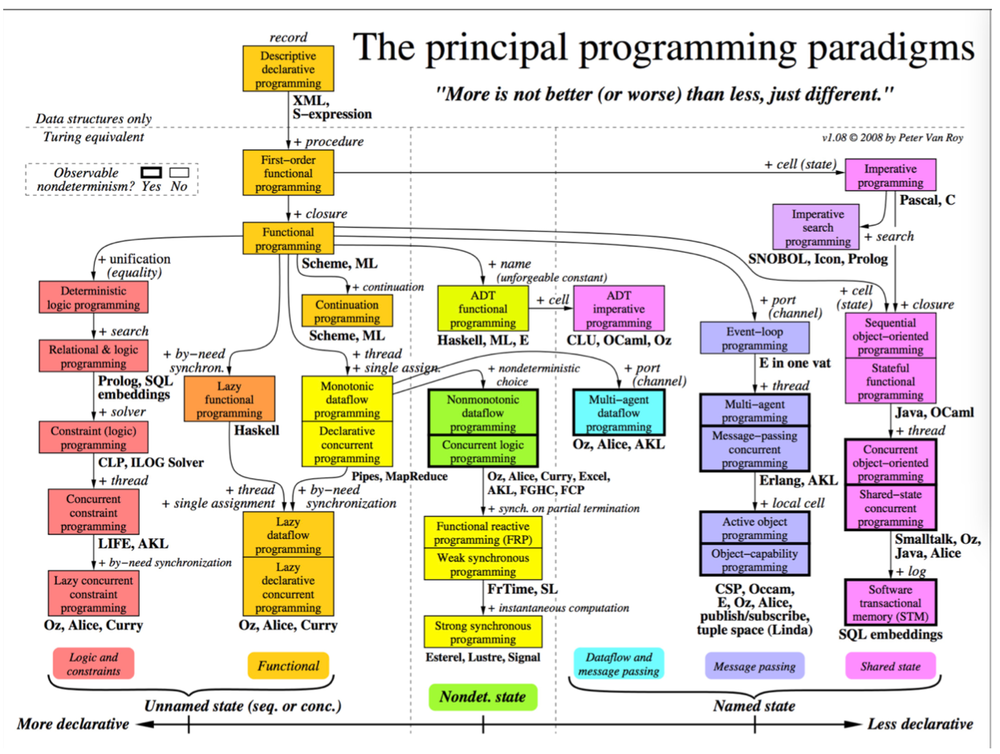
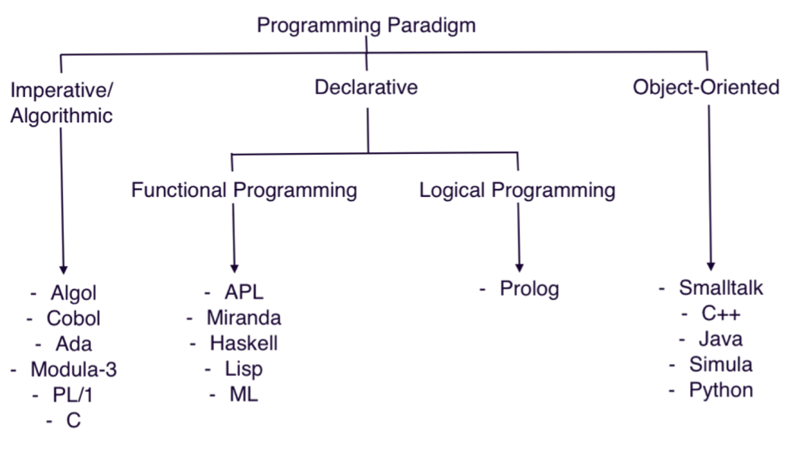
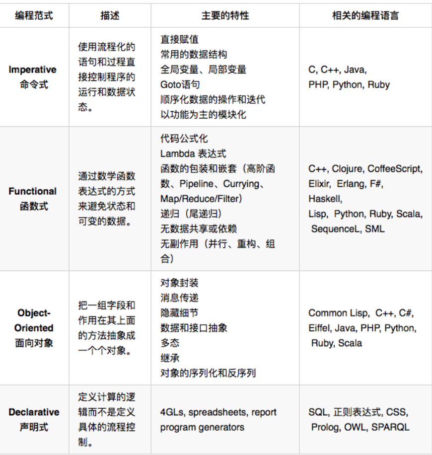

<!--ts-->

<!--te-->

# 前言

所有的编程语言的核心概念总共就那么几个，是摆脱不了冯诺依曼的制约的。

- 首先是基本语法，包括变量的类型（为了区分不同类型的变量占用的空间不同）；判断；循环；函数等。
- 面向对象。封装，继承，多态；Prototype，Mixin，Traits，Duck Typing等。
- 函数式编程。高阶函数，闭包，惰性求值，递归，不可变状态，无副作用等。（如jvm的Lisp）
- 元编程。比如java的动态代理，CGLIB可以在运行时创建新的类。Python的更为强大些，最牛逼的是Lisp的宏。
- 并发模型。Java的线程，Python的协程，Go的Go routine。需要考虑同步，互斥，锁，死锁。
- 虚拟机和垃圾回收。
- 静态类型，动态类型和类型推导。
- 抽象语法树（AST）。
- 指针

# 1. 编程范式programming paradigm

## 1.1 泛型编程

### 1.1.1 起源

C语言特性：

- C  语言是一个静态弱类型语言，在使用变量时需要声明变量类型，但是类型间可以有隐式转换；

- 不同的变量类型可以用结构体（struct）组合在一起，以此来声明新的数据类型；
- C 语言可以用 typedef 关键字来定义类型的别名，以此来达到变量类型的抽象；
- C  语言是一个有结构化程序设计、具有变量作用域以及递归功能的过程式语言；
- C 语言传递参数一般是以值传递，也可以传递指针；
- 通过指针，C  语言可以容易地对内存进行低级控制，然而这加大了编程复杂度；
- 编译预处理让 C 语言的编译更具有弹性，比如跨平台。

在泛型编程上存在很大的问题。

### 1.1.2 泛型编程

c++干了下面的事情：

- 用引用来解决指针的问题。
- 用 namespace  来解决名字空间冲突的问题。
- 通过 try-catch 来解决检查返回值编程的问题。
- 用 class  来解决对象的创建、复制、销毁的问题，从而可以达到在结构体嵌套时可以深度复制的内存安全问题。
- 通过重载操作符来达到操作上的泛型。
- 通过模板  template 和虚函数的多态以及运行时识别来达到更高层次的泛型和多态。
- 用 RAII、智能指针的方式，解决了 C  语言中因为需要释放资源而出现的那些非常 ugly 也很容易出错的代码的问题。
- 用 STL 解决了 C 语言中算法和数据结构的 N 多种坑。

### 1.1.3 类型系统和泛型的本质

在计算机科学中，类型系统用于定义如何将编程语言中的数值和表达式归类为许多不同的类型，以及如何操作这些类型，还有这些类型如何互相作用。类型可以确认一个值或者一组值，具有特定的意义和目的。

一般来说，编程语言会有两种类型，一种是内建类型，如 int、float 和 char 等，一种是抽象类型，如 struct、class 和 function  等。抽象类型在程序运行中，可能不表示为值。类型系统在各种语言之间有非常大的不同，也许，最主要的差异存在于编译时期的语法，以及运行时期的操作实现方式。

编译器可能使用值的静态类型以最优化所需的存储区，并选取对数值运算时的最佳算法。例如，在许多 C 编译器中，“浮点数”数据类型是以 32 比特表示，与 IEEE 754 规格一致的单精度浮点数。因此，在数值运算上，C  应用了浮点数规范（浮点数加法、乘法等）。

类型的约束程度以及评估方法，影响了语言的类型。更进一步讲，编程语言可能就类型多态性部分，对每一个类型都对应了一个针对于这个类型的算法运算。类型理论研究类型系统，尽管实际的编程语言类型系统，起源于计算机架构的实际问题、编译器实现，以及语言设计。

- 程序语言的安全性。使用类型可以让编译器侦测一些代码的错误，例如：可以识别出一个错误无效的表达式，如“Hello, World” + 3这样的不同数据类型间操作的问题。强类型语言提供更多的安全性，但是并不能保证绝对的安全。
- 利于编译器的优化。  静态类型语言的类型声明，可以让编译器明确地知道程序员的意图。因此，编译器就可以利用这一信息做很多代码优化工作。例如：如果我们指定一个类型是  int ，那么编译就知道，这个类型会以 4  个字节的倍数进行对齐，编译器就可以非常有效地利用更有效率的机器指令。
- 代码的可读性。有类型的编程语言，可以让代码更易读和更易维护，代码的语义也更清楚，代码模块的接口（如函数）也更丰富和清楚。
- 抽象化。类型允许程序设计者对程序以较高层次的方式思考，而不是烦人的低层次实现。例如，我们使用整型或是浮点型来取代底层的字节实现，我们可以将字符串设计成一个值，而不是底层字节的数组。从高层上来说，类型可以用来定义不同模块间的交互协议，比如函数的入参类型和返回类型，从而可以让接口更有语义，而且不同的模块数据交换更为直观和易懂。

**类型带来的问题就是我们作用于不同类型的代码，虽然长得非常相似，但是由于类型的问题需要根据不同版本写出不同的算法，如果要做到泛型，就需要涉及比较底层的玩法。**

要了解泛型的本质，就需要了解类型的本质。

- 类型是对内存的一种抽象。不同的类型，会有不同的内存布局和内存分配的策略。
- 不同的类型，有不同的操作。所以，对于特定的类型，也有特定的一组操作。

所以，要做到泛型，我们需要做下面的事情：

- 标准化掉类型的内存分配、释放和访问。标准化掉类型的操作。比如：比较操作，I/O  操作，复制操作……
- 标准化掉数据容器的操作。比如：查找算法、过滤算法、聚合算法……
- 标准化掉类型上特有的操作。需要有标准化的接口来回调不同类型的具体操作……

所以，C++  动用了非常繁多和复杂的技术来达到泛型编程的目标。

- 通过类中的构造、析构、拷贝构造，重载赋值操作符，标准化（隐藏）了类型的内存分配、释放和复制的操作。
- 通过重载操作符，可以标准化类型的比较等操作。
- 通过  iostream，标准化了类型的输入、输出控制。
- 通过模板技术（包括模板的特化），来为不同的类型生成类型专属的代码。
- 通过迭代器来标准化数据容器的遍历操作。
- 通过面向对象的接口依赖（虚函数技术），来标准化了特定类型在特定算法上的操作。
- 通过函数式（函数对象），来标准化对于不同类型的特定操作。

## 1.2 函数式编程

函数式编程（Functional Programming）做了更为抽象的泛型。函数式编程的基础模型来源于 λ 演算，引入的一套用于研究函数定义、函数应用和递归的形式系统。像 booleans、integers 或者其他的数据结构都可以被函数取代掉。

特征：

- stateless：函数不维护任何状态。函数式编程的核心精神是 stateless，简而言之就是它不能存在状态，打个比方，你给我数据我处理完扔出来。里面的数据是不变的。
- immutable：输入数据是不能动的，动了输入数据就有危险，所以要返回新的数据集。

优势：

- 没有状态就没有伤害。
- 并行执行无伤害。
- Copy-Paste 重构代码无伤害。
- 函数的执行没有顺序上的问题。

劣势：

- 数据复制比较严重。

函数式编程不同于过程式编程，过程式编程是在把具体的流程描述出来，所以可以不假思索，而函数式编程的抽象度更大，在实现方式上，有函数套函数、函数返回函数、函数里定义函数……把人搞得很糊涂。

**函数式编程的核心技术**：

- first class  function（头等函数）  ：这个技术可以让你的函数就像变量一样来使用。也就是说，你的函数可以像变量一样被创建、修改，并当成变量一样传递、返回，或是在函数中嵌套函数。
- tail recursion optimization（尾递归优化） ： 我们知道递归的害处，那就是如果递归很深的话，stack  受不了，并会导致性能大幅度下降。因此，我们使用尾递归优化技术——每次递归时都会重用  stack，这样能够提升性能。当然，这需要语言或编译器的支持。Python 就不支持。
- map & reduce  ：这个技术不用多说了，函数式编程最常见的技术就是对一个集合做 Map 和 Reduce  操作。这比起过程式的语言来说，在代码上要更容易阅读。（传统过程式的语言需要使用 for/while  循环，然后在各种变量中把数据倒过来倒过去的）这个很像 C++ STL 中 foreach、find_if、count_if  等函数的玩法。
- pipeline（管道）：这个技术的意思是，将函数实例成一个一个的 action，然后将一组 action  放到一个数组或是列表中，再把数据传给这个 action list，数据就像一个 pipeline  一样顺序地被各个函数所操作，最终得到我们想要的结果。
- recursing（递归）  ：递归最大的好处就简化代码，它可以把一个复杂的问题用很简单的代码描述出来。注意：递归的精髓是描述问题，而这正是函数式编程的精髓。
- currying（柯里化） ：将一个函数的多个参数分解成多个函数， 然后将函数多层封装起来，每层函数都返回一个函数去接收下一个参数，这可以简化函数的多个参数。在 C++  中，这很像 STL 中的 bind1st 或是 bind2nd。
- higher order  function（高阶函数）：所谓高阶函数就是函数当参数，把传入的函数做一个封装，然后返回这个封装函数。现象上就是函数传进传出，就像面向对象对象满天飞一样。这个技术用来做 Decorator 很不错。

函数式编程的理念：

- 把函数当成变量来用，关注描述问题而不是怎么实现，这样可以让代码更易读。
- 因为函数返回里面的这个函数，所以函数关注的是表达式，关注的是描述这个问题，而不是怎么实现这个事情。

函数式编程关注的是：describe what  to do, rather than how to do it。于是，我们把以前的过程式编程范式叫做 Imperative  Programming – 指令式编程，而把函数式编程范式叫做 Declarative Programming – 声明式编程。

### 1.2.1 修饰器模式

## 1.3 面向对象编程

函数式编程总结起来就是把一些功能或逻辑代码通过函数拼装方式来组织的玩法。这其中涉及最多的是函数，也就是编程中的代码逻辑。但我们知道，代码中还是需要处理数据的，这些就是所谓的“状态”，函数式编程需要我们写出无状态的代码。而这天下并不存在没有状态没有数据的代码，如果函数式编程不处理状态这些东西，那么，状态会放在什么地方呢？总是需要一个地方放这些数据的。

### 1.3.1 基于原型（Prototype）的编程

基于原型（Prototype）的编程其实也是面向对象编程的一种方式。没有 class 化的，直接使用对象。又叫，基于实例的编程。其主流的语言就是 JavaScript，与传统的面对象编程的比较如下：

- 在基于类的编程当中，对象总共有两种类型。类定义了对象的基本布局和函数特性，而接口是“可以使用的”对象，它基于特定类的样式。在此模型中，类表现为行为和结构的集合，对所有接口来说这些类的行为和结构都是相同的。因而，区分规则首先是基于行为和结构，而后才是状态。
- 原型编程的主张者经常争论说，基于类的语言提倡使用一个关注分类和类之间关系的开发模型。与此相对，原型编程看起来提倡程序员关注一系列对象实例的行为，而之后才关心如何将这些对象划分到最近的使用方式相似的原型对象，而不是分成类。

在基于类的语言中，一个新的实例通过类构造器和构造器可选的参数来构造，结果实例由类选定的行为和布局创建模型。在基于原型的系统中构造对象有两种方法，通过复制已有的对象或者通过扩展空对象创建。很多基于原型的系统提倡运行时进行原型的修改，而基于类的面向对象系统只有动态语言允许类在运行时被修改（Common Lisp、Dylan、Objective-C、Perl、Python、Ruby 和 Smalltalk）。

### 1.3.2 Go语言的委托模式

## 1.4 编程本质&逻辑编程

### 1.4.1 编程本质

### 1.4.2 逻辑编程

