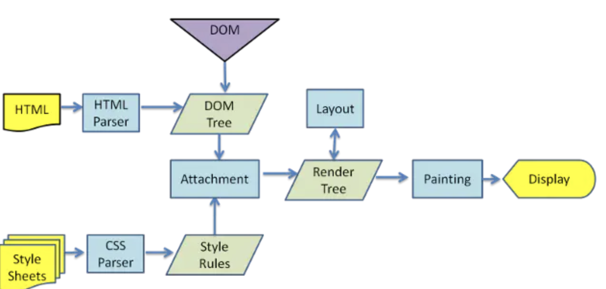

<!--ts-->

<!--te-->

# 前言

React是前端的一个热门MVC框架，孵化于Facebook。

# 浏览器的渲染原理

## 1 浏览器工作流程


1）浏览器会解析三个东西：

- 一个是HTML/SVG/XHTML，事实上，Webkit有三个C++的类对应这三类文档。解析这三种文件会产生一个DOM Tree。

- CSS，解析CSS会产生CSS规则树。

- Javascript，脚本，主要是通过DOM API和CSSOM API来操作DOM Tree和CSS Rule Tree.

2）解析完成后，浏览器引擎会通过DOM Tree 和 CSS Rule Tree 来构造 Rendering Tree。注意：

- Rendering Tree 渲染树并不等同于DOM树，因为一些像Header或display:none的东西就没必要放在渲染树中了。

- CSS 的 Rule Tree主要是为了完成匹配并把CSS Rule附加上Rendering Tree上的每个Element。也就是DOM结点。也就是所谓的Frame。

- 然后，计算每个Frame（也就是每个Element）的位置，这又叫layout和reflow过程。

3）最后通过调用操作系统Native GUI的API绘制。

## 2 DOM解析

HTML的DOM Tree解析如下：

```html
<html>
<html>
<head>
    <title>Web page parsing</title>
</head>
<body>
    <div>
        <h1>Web page parsing</h1>
        <p>This is an example Web page.</p>
    </div>
</body>
</html>
```


## 3 CSS解析

CSS的解析大概是下面这个样子，假设我们有下面的HTML文档：

```html
<doc>
<title>A few quotes</title>
<para>
  Franklin said that <quote>"A penny saved is a penny earned."</quote>
</para>
<para>
  FDR said <quote>"We have nothing to fear but <span>fear itself.</span>"</quote>
</para>
</doc>
```

于是DOM Tree是这个样子：


然后我们的CSS文档是这样的：

```css
  /* rule 1 */ doc { display: block; text-indent: 1em; }
/* rule 2 */ title { display: block; font-size: 3em; }
/* rule 3 */ para { display: block; }
/* rule 4 */ [class="emph"] { font-style: italic; }
```

于是我们的CSS Rule Tree会是这个样子：


通过这两个树，我们可以得到一个叫Style Context Tree，也就是下面这样（把CSS Rule结点Attach到DOM Tree上）：


## 4. 渲染

渲染的流程基本上如下（黄色的四个步骤）：

1. 计算CSS样式
2. 构建Render Tree
3. Layout – 定位坐标和大小，是否换行，各种position, overflow, z-index属性 ……
4. 正式开画


注意：上图流程中有很多连接线，这表示了Javascript动态修改了DOM属性或是CSS属会导致重新Layout，有些改变不会，就是那些指到天上的箭头，比如，修改后的CSS rule没有被匹配到，等。

这里重要要说两个概念，一个是Reflow，另一个是Repaint。这两个不是一回事。

- Repaint——屏幕的一部分要重画，比如某个CSS的背景色变了。但是元素的几何尺寸没有变。

- Reflow——意味着元件的几何尺寸变了，我们需要重新验证并计算Render Tree。是Render Tree的一部分或全部发生了变化。这就是Reflow，或是Layout。（**HTML使用的是flow based layout，也就是流式布局，所以，如果某元件的几何尺寸发生了变化，需要重新布局，也就叫reflow**）reflow 会从<html>这个root frame开始递归往下，依次计算所有的结点几何尺寸和位置，在reflow过程中，可能会增加一些frame，比如一个文本字符串必需被包装起来。

Reflow的成本比Repaint的成本高得多的多。DOM Tree里的每个结点都会有reflow方法，一个结点的reflow很有可能导致子结点，甚至父点以及同级结点的reflow。**在一些高性能的电脑上也许还没什么，但是如果reflow发生在手机上，那么这个过程是非常痛苦和耗电的**。

所以，下面这些动作有很大可能会是成本比较高的。

- 当你增加、删除、修改DOM结点时，会导致Reflow或Repaint
- 当你移动DOM的位置，或是搞个动画的时候。
- 当你修改CSS样式的时候。
- 当你Resize窗口的时候（移动端没有这个问题），或是滚动的时候。
- 当你修改网页的默认字体时。

多说两句关于滚屏的事，通常来说，如果在滚屏的时候，我们的页面上的所有的像素都会跟着滚动，那么性能上没什么问题，因为我们的显卡对于这种把全屏像素往上往下移的算法是很快。但是如果你有一个fixed的背景图，或是有些Element不跟着滚动，有些Elment是动画，那么这个滚动的动作对于浏览器来说会是相当相当痛苦的一个过程。你可以看到很多这样的网页在滚动的时候性能有多差。因为滚屏也有可能会造成reflow。

基本上来说，reflow有如下的几个原因：

- Initial。网页初始化的时候。
- Incremental。一些Javascript在操作DOM Tree时。
- Resize。其些元件的尺寸变了。
- StyleChange。如果CSS的属性发生变化了。
- Dirty。几个Incremental的reflow发生在同一个frame的子树上。

当然，我们的浏览器是聪明的，它不会像上面那样，你每改一次样式，它就reflow或repaint一次。**一般来说，浏览器会把这样的操作积攒一批，然后做一次reflow，这又叫异步reflow或增量异步reflow**。但是有些情况浏览器是不会这么做的，比如：resize窗口，改变了页面默认的字体，等。对于这些操作，浏览器会马上进行reflow。

# 前端的前世今生

html(Hyper Text Markup Language)+css(Cascading Style Sheets)+JavaScript来共同构成前端开发。

其中，js可以简单的说一下，js可以在不改变html源码的情况下，改变展示的效果（通过DOM模型来实现的）。

[html的渲染流程](http://taligarsiel.com/Projects/howbrowserswork1.htm)：




最开始前端都是由后端来生成的，比如java的jsp。随着AJAX(Asynchronous Javascript And XML)技术的出现，前后端进行了较好的分离，后端不再负责生成html，只需要传递xml或者json给前端就好了。

React和Vue是JavaScript的视图框架，可以简化我们的开发，但是需要框架解析后，才可以被浏览器识别。

- jQuery：简化 HTML 与 JavaScript 之间的操作。
- Angular：MVC框架。存在性能问题。
- React:虚拟DOM。
- Vue：专注于MVVM 模型的 ViewModel 层。

## 核心概念

- 虚拟DOM（Virtual DOM）
  - React将DOM抽象为虚拟DOM，虚拟DOM其实就是用一个对象来描述DOM，通过对比前后两个对象的差异，最终只把变化的部分重新渲染，提高渲染的效率
  - 1 用 JavaScript 对象结构表示 DOM 树的结构，然后用这个树构建一个真正的 DOM 树，插到文档当中
  - 2 当状态变更的时候，重新构造一棵新的对象树。然后用新的树和旧的树进行比较，记录两棵树差异
  - 3 把2所记录的差异应用到步骤1所构建的真正的DOM树上，视图就更新了。
  - [如何实现一个虚拟DOM算法](https://github.com/livoras/blog/issues/13)
  - [理解虚拟DOM](https://www.zhihu.com/question/31809713)

- Diff算法（虚拟DOM的加速器）