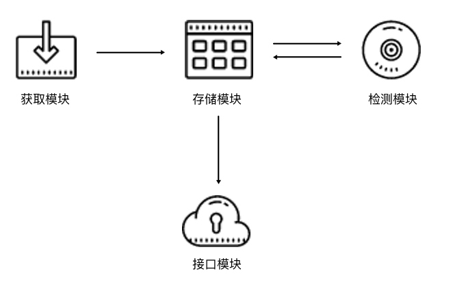

<!--ts-->

<!--te-->

# 前言

爬虫的核心知识点：

- 基础知识。HTTP、爬虫、代理的基本原理、网页基本结构。
- 请求库。urllib和requests，以及正则表达式。
- 解析库。

爬虫就是获取网页并提取和保存信息的自动化程序。

在掌握了基本知识后，我们主要从以下角度来学习。

首先我们可以借助于urllib和request库来帮助我们来访问http请求，这两个库很好的帮我们封装了http相关的操作，比如请求，响应，异常，cookie的处理。

获取到html之后，我们可以使用正则表达式来进行解析结果。html存在的问题是：较为繁琐，且容易出错。

事实上，我们知道，html是有规律可寻的，比如id，class，节点间的层次关系，我们可以使用lxml，Beautiful Soup，pyquery。我们使用这些后，就可以替代正则表达式了。

我们还可以把爬取到的数据分析后进行存储，可以选择文件存储，mysql或者非关系型数据库mongodb等。

截止到现在，我们分析的都是原始的html，事实上，现在的网页很少直接是原始的html，大多数是经过处理的，比如Ajax请求，js动态计算，参数进行加密。对于Ajax，我们可以使用chrome浏览器的开发者工具中Network选项卡，我们可以过滤xhr请求，即为Ajax请求了。对于动态渲染界面，我们可以直接模拟浏览器来运行，Python 提供了许多模拟浏览器运行的库，如 Selenium、Splash、PyV8、Ghost 等。

除此之外，我们还会遇到验证码的问题，验证码主要分为普通图形验证码、极验滑动验证码、点触验证码、微博宫格验证码等。对于图形验证码，我们可以使用OCR识别来解决，比较出名的库是tesserocr。对于我们的，我们可以借助打码平台来完成。

在下面的一个点是代理的使用。主要是用来一台电脑频繁访问被服务器给禁止掉，我们可以维护一个代理池。代理池分为四个模块，分别是：

- 存储模块。负责存储抓取下来的代理。首先要保证代理不重复，要标识代理的可用情况，还要动态实时处理每个代理，所以一种比较高效和方便的存储方式就是使用 Redis 的 Sorted Set，即有序集合。
- 获取模块：需要定时在各大代理网站抓取代理。代理可以是免费公开代理也可以是付费代理，代理的形式都是 IP 加端口，此模块尽量从不同来源获取，尽量抓取高匿代理，抓取成功之后将可用代理保存到数据库中。
- 检测模块：需要定时检测数据库中的代理。这里需要设置一个检测链接，最好是爬取哪个网站就检测哪个网站，这样更加有针对性，如果要做一个通用型的代理，那可以设置百度等链接来检测。另外，我们需要标识每一个代理的状态，如设置分数标识，100 分代表可用，分数越少代表越不可用。检测一次，如果代理可用，我们可以将分数标识立即设置为 100 满分，也可以在原基础上加 1 分；如果代理不可用，可以将分数标识减 1 分，当分数减到一定阈值后，代理就直接从数据库移除。通过这样的标识分数，我们就可以辨别代理的可用情况，选用的时候会更有针对性。
- 接口模块：需要用 API 来提供对外服务的接口。其实我们可以直接连接数据库来取对应的数据，但是这样就需要知道数据库的连接信息，并且要配置连接，而比较安全和方便的方式就是提供一个 Web API 接口，我们通过访问接口即可拿到可用代理。另外，由于可用代理可能有多个，那么我们可以设置一个随机返回某个可用代理的接口，这样就能保证每个可用代理都可以取到，实现负载均衡。

到现在，我们维护了一个代理池。然后现在很多网站需要我们登陆后才可以看到详细的信息，所以我们需要模拟登陆。我们可以使用 requests 的 Session 实现了模拟登录。

上面我们爬取的内容都是来源于网站，实际上现在很多内容只有APP，比如抖音等。我们可以借助抓包软件WireShark、Filddler、Charles、mitmproxy等。

我们可以利用Charles等进行抓包，进而进行分析，但是现在的请求响应往往会加密，我们需要借助于mitmdump结合Python脚本直接处理response。

Appium和Selenium很相似，可以帮助我们自动化控制APP。

这些东西坐起来还是比较复杂的，有人做了2个框架，pyspider和scrapy，我们只需要关注爬虫的核心逻辑，比如页面处理等，像是异常处理，任务调度可以由框架来完成。

pyspider为我们提供了方便易用的 WebUI 系统，爬取进度监控、爬取结果查看、爬虫项目管理等功能，支持多种后端数据库，如 MySQL、MongoDB、Redis、SQLite、Elasticsearch、PostgreSQL，支持多种消息队列，如 RabbitMQ、Beanstalk、Redis，提供优先级控制、失败重试、定时抓取等功能。

pyspider 的架构主要分为 Scheduler（调度器）、Fetcher（抓取器）、Processer（处理器）三个部分，整个爬取过程受到 Monitor（监控器）的监控，抓取的结果被 Result Worker（结果处理器）处理。

pyspider 的任务执行流程的逻辑很清晰，具体过程如下所示。

- 每个 pyspider 的项目对应一个 Python 脚本，该脚本中定义了一个 Handler 类，它有一个 on_start() 方法。爬取首先调用 on_start() 方法生成最初的抓取任务，然后发送给 Scheduler 进行调度。
- Scheduler 将抓取任务分发给 Fetcher 进行抓取，Fetcher 执行并得到响应，随后将响应发送给 Processer。
- Processer 处理响应并提取出新的 URL 生成新的抓取任务，然后通过消息队列的方式通知 Schduler 当前抓取任务执行情况，并将新生成的抓取任务发送给 Scheduler。如果生成了新的提取结果，则将其发送到结果队列等待 Result Worker 处理。
- Scheduler 接收到新的抓取任务，然后查询数据库，判断其如果是新的抓取任务或者是需要重试的任务就继续进行调度，然后将其发送回 Fetcher 进行抓取。
- 不断重复以上工作，直到所有的任务都执行完毕，抓取结束。
- 抓取结束后，程序会回调 on_finished() 方法，这里可以定义后处理过程。

除了pyspider之外，另外一个强大的爬虫框架是Scrapy。

Scrapy 是一个基于 Twisted 的异步处理框架，是纯 Python 实现的爬虫框架，其架构清晰，模块之间的耦合程度低，可扩展性极强，可以灵活完成各种需求。

它可以分为如下的几个部分。

- Engine，引擎，用来处理整个系统的数据流处理，触发事务，是整个框架的核心。
- Item，项目，它定义了爬取结果的数据结构，爬取的数据会被赋值成该对象。
- Scheduler， 调度器，用来接受引擎发过来的请求并加入队列中，并在引擎再次请求的时候提供给引擎。
- Downloader，下载器，用于下载网页内容，并将网页内容返回给蜘蛛。
- Spiders，蜘蛛，其内定义了爬取的逻辑和网页的解析规则，它主要负责解析响应并生成提取结果和新的请求。
- Item Pipeline，项目管道，负责处理由蜘蛛从网页中抽取的项目，它的主要任务是清洗、验证和存储数据。
- Downloader Middlewares，下载器中间件，位于引擎和下载器之间的钩子框架，主要是处理引擎与下载器之间的请求及响应。
- Spider Middlewares， 蜘蛛中间件，位于引擎和蜘蛛之间的钩子框架，主要工作是处理蜘蛛输入的响应和输出的结果及新的请求。

Scrapy 中的数据流由引擎控制，其过程如下:

- Engine 首先打开一个网站，找到处理该网站的 Spider 并向该 Spider 请求第一个要爬取的 URL。
- Engine 从 Spider 中获取到第一个要爬取的 URL 并通过 Scheduler 以 Request 的形式调度。
- Engine 向 Scheduler 请求下一个要爬取的 URL。
- Scheduler 返回下一个要爬取的 URL 给 Engine，Engine 将 URL 通过 Downloader Middlewares 转发给 Downloader 下载。
- 一旦页面下载完毕， Downloader 生成一个该页面的 Response，并将其通过 Downloader Middlewares 发送给 Engine。
- Engine 从下载器中接收到 Response 并通过 Spider Middlewares 发送给 Spider 处理。
- Spider 处理 Response 并返回爬取到的 Item 及新的 Request 给 Engine。
- Engine 将 Spider 返回的 Item 给 Item Pipeline，将新的 Request 给 Scheduler。
- 重复第二步到最后一步，直到 Scheduler 中没有更多的 Request，Engine 关闭该网站，爬取结束。

- pyspider 提供了 WebUI，爬虫的编写、调试都是在 WebUI 中进行的，而 Scrapy 原生是不具备这个功能的，采用的是代码和命令行操作，但可以通过对接 Portia 实现可视化配置。
- pyspider 调试非常方便，WebUI 操作便捷直观，在 Scrapy 中则是使用 parse 命令进行调试，论方便程度不及 pyspider。
- pyspider 支持 PhantomJS 来进行 JavaScript 渲染页面的采集，在 Scrapy 中可以对接 ScrapySplash 组件，需要额外配置。
- PySpider 中内置了 PyQuery 作为选择器，在 Scrapy 中对接了 XPath、CSS 选择器和正则匹配。
- pyspider 的可扩展程度不足，可配制化程度不高，在 Scrapy 中可以通过对接 Middleware、Pipeline、Extension 等组件实现非常强大的功能，模块之间的耦合程度低，可扩展程度极高。

如果要快速实现一个页面的抓取，推荐使用 pyspider，开发更加便捷，如快速抓取某个普通新闻网站的新闻内容。如果要应对反爬程度很强、超大规模的抓取，推荐使用 Scrapy，如抓取封 IP、封账号、高频验证的网站的大规模数据采集。

